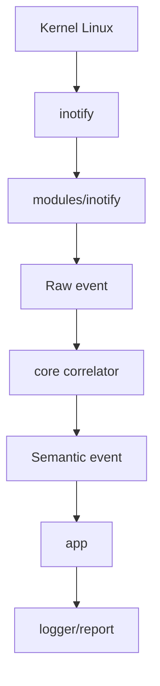

# Panoramica del progetto

Questo progetto realizza un programma di monitoraggio del filesystem.
L'obiettivo e' osservare file e directory, ricevere notifiche quando qualcosa
cambia e trasformare gli eventi bassi del sistema operativo in eventi piu'
comprensibili per l'applicazione.

Esempi di eventi che vogliamo riconoscere:

- un file viene creato
- un file viene cancellato
- una directory viene creata
- un file viene rinominato
- un file viene spostato da una directory a un'altra
- la coda degli eventi del kernel va in overflow

## Perche' non basta leggere direttamente inotify

Su Linux, `inotify` produce eventi molto vicini al kernel. Questi eventi sono
precisi, ma non sempre rappresentano direttamente cio' che un utente umano
direbbe.

Per esempio, uno spostamento puo' arrivare come due eventi:

```text
IN_MOVED_FROM  vecchio percorso
IN_MOVED_TO    nuovo percorso
```

Il programma deve quindi correlare i due eventi per capire che si tratta dello
stesso file spostato o rinominato.

## Obiettivo architetturale

La direzione del progetto e' separare tre responsabilita':

```text
backend filesystem  ->  eventi raw
core engine         ->  eventi semantici
applicazione        ->  configurazione, esecuzione, logging
```

In altre parole:

- il modulo `inotify` deve parlare con Linux
- il `core` deve capire il significato degli eventi
- `app` deve avviare il programma e collegare i pezzi

## Evento raw ed evento semantico

Un evento raw e' un fatto tecnico vicino al sistema operativo.

Esempio:

```text
IN_MOVED_FROM cookie=123 path=/tmp/a.txt
```

Un evento semantico e' un fatto gia' interpretato dal programma.

Esempio:

```text
FILE_RENAMED from=/tmp/a.txt to=/tmp/b.txt
```

La trasformazione da raw a semantico e' il compito piu' importante del core.

## Stato attuale del progetto

Il progetto e' in fase di integrazione. Attualmente:

- `app/` contiene il ciclo di vita del programma
- `modules/inotify/` contiene il backend inotify, cioe' lettura eventi,
  gestione watch e conversione verso eventi raw Alfred
- `core/` e' lo stream semantico ufficiale di default
- il vecchio dispatcher legacy `events.c` e la sua `move_cache` sono stati
  rimossi dal codice corrente

Il flusso runtime normale e':

```text
modules/inotify
    produce alfred_raw_event_t
        |
        v
core
    produce alfred_event_t
        |
        v
app/logger
```

La direzione futura non e' cambiare questo flusso, ma renderlo piu' esplicito:
usare Event Model v0, definire Backend API v0 e progettare output strutturato JSONL prima di
aggiungere backend piu' complessi.

## Diagramma generale



## Cosa studiare per contribuire

Per contribuire al progetto servono competenze progressive:

1. capire come si compila il progetto con `make`
2. capire `main.c`, `app.c` e `app.h`
3. capire cosa sono file descriptor, `read()`, `errno`
4. capire come funziona `inotify`
5. capire la differenza tra backend e core
6. capire come il core correla gli eventi

Non serve sapere tutto subito. La documentazione e' organizzata per accompagnare
lo studio un passo alla volta.

Per una lettura guidata del codice, dopo i capitoli su architettura, app,
inotify e core, leggi:

```text
docs/it/16-mappa-codice-e-strutture.md
```

Quel capitolo segue funzioni, strutture dati, campi modificati ed eventi trigger
come se fosse una visita guidata dentro la codebase.
