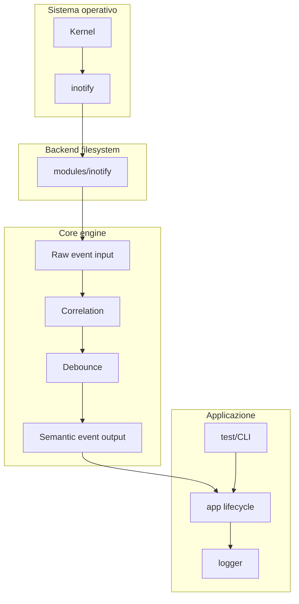
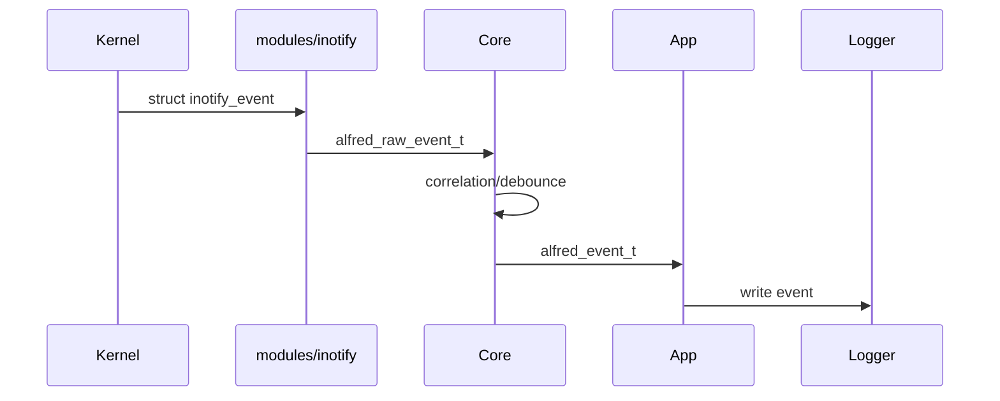
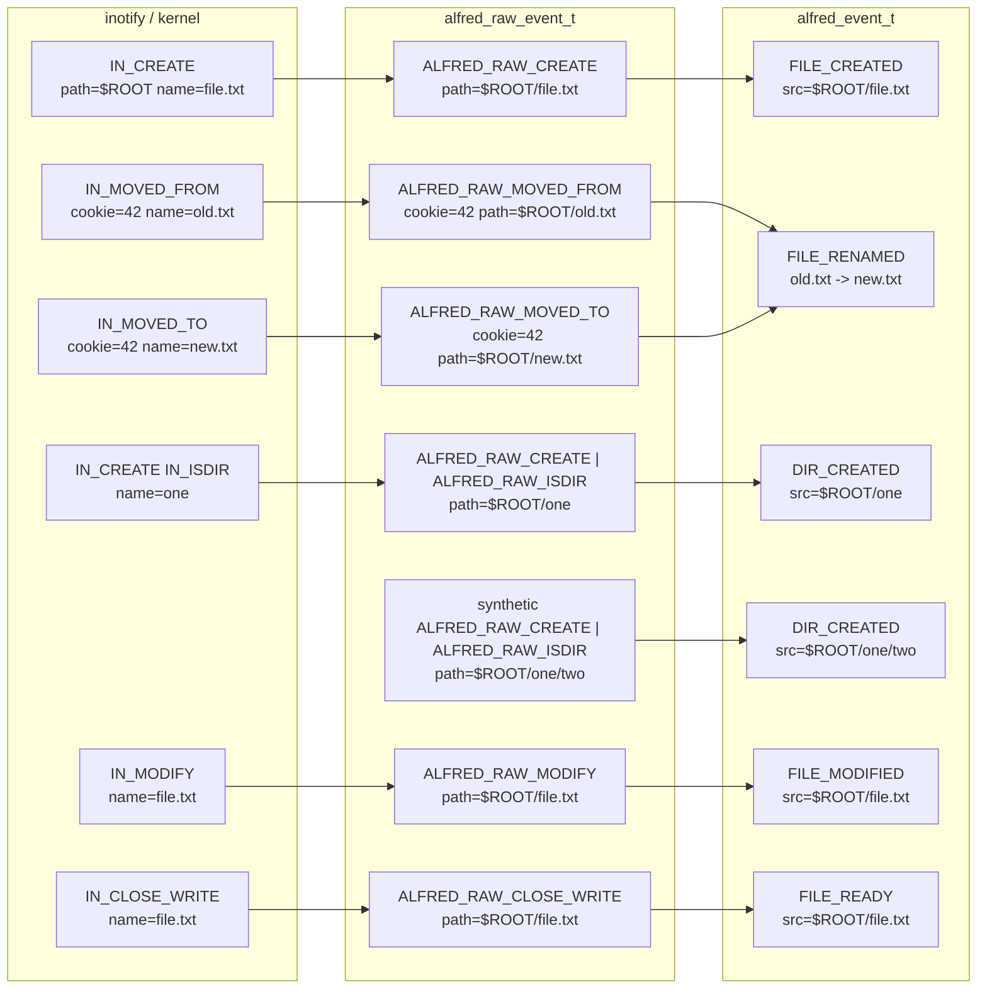

# Architettura generale

L'architettura del progetto e' divisa in livelli. Ogni livello deve avere una
responsabilita' chiara e non deve invadere il lavoro degli altri livelli.

## Vista a livelli



## Livello app

Il livello `app/` gestisce il programma come processo:

- inizializza la configurazione
- apre i log
- inizializza le strutture runtime
- installa i signal handler
- avvia il ciclo principale
- chiude le risorse in ordine

Non dovrebbe contenere logica profonda sugli eventi filesystem.

## Livello modules

La cartella `modules/` contiene backend specifici.

Oggi esiste:

```text
modules/inotify/
```

Questo modulo parla con Linux usando `inotify`.

Nel disegno finale, un modulo deve:

- aprire il backend del sistema operativo
- aggiungere o rimuovere watch
- leggere eventi dal sistema operativo
- convertire eventi specifici in eventi raw comuni

Un modulo non dovrebbe:

- decidere se un evento e' un rename o un move
- fare debounce
- produrre direttamente eventi semantici finali
- conoscere i dettagli interni del core

## Livello core

Il `core/` e' il motore semantico.

Il suo compito e':

- ricevere eventi raw
- correlare eventi collegati tra loro
- ridurre rumore e duplicati
- produrre eventi semantici

Esempio:

```text
RAW_MOVED_FROM + RAW_MOVED_TO
        |
        v
FILE_RENAMED oppure FILE_MOVED
```

Il core deve essere il piu' indipendente possibile dal sistema operativo.
Questo permette in futuro di aggiungere backend diversi, per esempio:

```text
modules/fanotify/
modules/replay/
modules/macos/
```

## Perche' questa separazione e' importante

Senza separazione, il codice diventa difficile da mantenere:

```text
inotify + logica semantica + logging + configurazione
```

tutto mescolato nello stesso punto.

Con la separazione:

```text
inotify        sa parlare con Linux
core           sa interpretare eventi
app            sa avviare il programma
logger         sa scrivere output
```

Ogni parte diventa piu' facile da testare e modificare.

## Flusso futuro desiderato



## Tre livelli di evento

Durante l'integrazione e' utile distinguere tre tipi di eventi.



Il primo livello e' specifico del backend. Oggi e' Linux `inotify`, quindi gli
eventi sono `IN_CREATE`, `IN_DELETE`, `IN_MOVED_FROM`, `IN_MOVED_TO` e cosi'
via.

Il secondo livello e' il raw event comune di Alfred. Qui il modulo inotify
traduce i dettagli del kernel in `alfred_raw_event_t`, preservando informazioni
come path, mask e cookie.

Il terzo livello e' l'evento semantico prodotto dal core. Qui piu' raw event
possono diventare un solo evento applicativo. Per esempio:

```text
ALFRED_RAW_MOVED_FROM + ALFRED_RAW_MOVED_TO -> FILE_RENAMED
```

Altri raw event rappresentano fasi della vita di un file e restano eventi
semantici distinti:

```text
ALFRED_RAW_CREATE      -> FILE_CREATED
ALFRED_RAW_MODIFY      -> FILE_MODIFIED
ALFRED_RAW_CLOSE_WRITE -> FILE_READY
```

Nel caso di `mkdir -p`, alcune directory possono essere scoperte dallo scan
ricorsivo senza avere un evento `IN_CREATE` reale. Per recuperare lo stream
semantico, il backend puo' generare un raw event sintetico. Anche in quel caso
la semantica finale resta responsabilita' del core:

```text
directory scoperta dallo scan -> synthetic ALFRED_RAW_CREATE -> DIR_CREATED
```

## Flusso attuale

Attualmente il progetto non e' ancora arrivato al disegno finale.

Oggi `app/src/app.c` legge direttamente dal file descriptor `inotify` e chiama:

```c
app_dispatch_raw_event(app, ev);
```

Questa funzione e' implementata nel modulo inotify, ma produce gia' eventi
semantici. Questo e' temporaneo.

La prossima grande integrazione sara' spostare la semantica nel core.

## Regola pratica per decidere dove mettere il codice

Usa questa domanda:

> Questa logica servirebbe anche se domani usassimo un backend diverso da
> inotify?

Se la risposta e' si', probabilmente appartiene al `core`.

Se la risposta e' no, probabilmente appartiene a `modules/inotify`.

Esempi:

| Logica | Dove dovrebbe stare |
| --- | --- |
| `inotify_add_watch()` | `modules/inotify` |
| watch descriptor -> path | `modules/inotify` |
| MOVED_FROM + MOVED_TO | `core` |
| debounce MODIFY | `core` |
| parsing argomenti CLI | `app` |
| apertura file log | `app` o logger |
