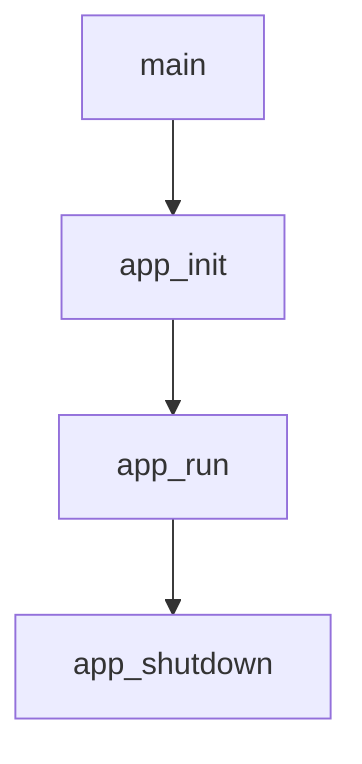
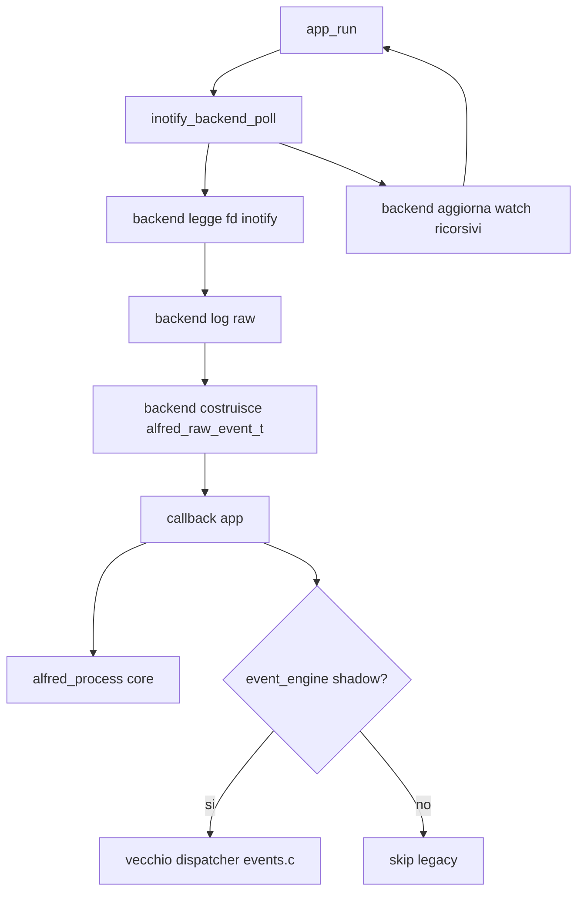

# Livello applicazione

Questo capitolo spiega il livello `app/`, cioe' la parte del progetto che
gestisce il programma come processo: avvio, configurazione, logging, ciclo
principale e chiusura delle risorse.

## File principali

```text
app/include/app.h
app/include/config.h
app/include/errors.h
app/include/logger.h
app/include/utils.h

app/src/main.c
app/src/app.c
app/src/config.c
app/src/logger.c
app/src/utils.c
```

## Responsabilita' del livello app

Il livello applicazione:

- inizializza il programma
- carica o prepara la configurazione
- apre i log
- inizializza le strutture runtime
- installa i signal handler
- legge eventi dal backend attuale
- chiude le risorse in ordine

Non dovrebbe contenere logica semantica profonda sugli eventi filesystem.
Quella responsabilita' appartiene al `core`.

## Flusso generale



`main()` resta piccolo apposta. Il vero lavoro e' delegato alle funzioni del
livello applicazione.

## app/include/app.h

`app.h` definisce `app_t`, cioe' il contesto principale del programma.

```c
typedef struct app {
    int running;

    config_t config;
    inotify_backend_t inotify;
    logger_t logger;
    alfred_config_t core_config;
    alfred_engine_t *core;
} app_t;
```

Questa struct e' il "contenitore" dello stato runtime.

Campi importanti:

- `running`: indica se il ciclo principale deve continuare
- `config`: configurazione runtime
- `inotify`: stato del backend inotify, cioe' file descriptor e tabella watch
  descriptor -> path
- `logger`: gestore dei file di log
- `core_config`: configurazione del core semantico
- `core`: istanza del motore semantico Alfred

Nota architetturale: `inotify_fd` e `watchers` non sono piu' campi diretti di
`app_t`; sono incapsulati in `inotify_backend_t`. Il backend riceve ancora
`app_t *` per usare configurazione e logger, quindi non e' ancora del tutto
autonomo. La cache move del legacy non e' piu' dentro `app_t`: appartiene a
`events.c` e viene inizializzata solo in shadow mode.

Il core e' stato aggiunto ad `app_t` perche' deve vivere quanto l'applicazione.
Oggi e' lo stream semantico ufficiale di default. Lo shadow mode puo' ancora
attivare il vecchio dispatcher per confronto, ma non e' il percorso ordinario.

## app/src/main.c

`main.c` e' il punto di ingresso del programma.

Il flusso e':

```c
app_t app;

rc = app_init(&app, argc, argv);
rc = app_run(&app);
app_shutdown(&app);
```

Questo stile e' utile perche':

- `main()` resta leggibile
- la gestione delle risorse e' centralizzata
- gli errori di startup passano dallo stesso percorso di cleanup

## app/src/app.c

`app.c` gestisce il ciclo di vita.

### app_init()

`app_init()` inizializza i sottosistemi in ordine:

1. reset della struct `app_t`
2. configurazione di default
3. logger
4. core nella modalita' scelta da `event_engine`
5. eventuale dispatcher legacy in shadow mode
6. backend inotify
8. signal handler
9. watch sui percorsi passati da riga di comando

L'ordine e' importante. Per esempio, il logger viene inizializzato presto
perche' gli altri sottosistemi possono usarlo per scrivere errori.

Il core viene inizializzato dopo il logger perche' la callback del core scrive
gli eventi semantici attraverso `logger_event()`.

### app_run()

`app_run()` contiene il ciclo principale:



Il file descriptor e' non bloccante, ma `app.c` non chiama piu' direttamente
`read()`. La lettura e il parsing di `struct inotify_event` sono stati spostati
nel backend inotify. `app.c` resta il coordinatore: chiama il backend, riceve
eventi raw tramite callback e li inoltra al core.

### Shadow mode

Quando si abilita esplicitamente lo shadow mode, lo stesso evento inotify viene
osservato da due percorsi:

```text
struct inotify_event
    -> inotify_backend_poll()
    -> inotify_adapter_build_raw()
    -> callback app
    -> alfred_process()
    -> core_logger_on_event()
    -> logger_event()

struct inotify_event
    -> inotify_backend_poll()
    -> legacy_events_dispatch()
    -> vecchio logger eventi
```

Il runtime normale usa il core. In shadow mode, invece, il vecchio dispatcher
produce lo stream legacy e il core produce righe con prefisso `core`, utili per
confrontare il nuovo motore con il comportamento storico.

Questo approccio riduce il rischio quando si modificano regole semantiche:
possiamo osservare differenze tra core e legacy senza confondere il percorso
ufficiale `event_engine=core`.

### Aggiornamento watch backend

Il backend inotify gestisce anche un dettaglio importante: quando arriva un
evento `IN_CREATE | IN_ISDIR`, Alfred deve aggiungere watch ricorsivi alla nuova
directory.

Questa operazione non deve dipendere da `events.c`, perche' `events.c` viene
saltato in `event_engine=core`. Per questo il backend esegue sempre:

```text
IN_CREATE | IN_ISDIR
    -> watch_manager_add_recursive_with_discovery()
    -> WATCH_ADDED
    -> eventuali raw event sintetici verso il core
```

In questo modo sia shadow mode sia core mode continuano a monitorare le nuove
directory e il core puo' recuperare i `DIR_CREATED` mancanti negli scenari tipo
`mkdir -p`.

### Raw event sintetici

Durante la gestione ricorsiva delle directory, il backend puo' scoprire
sottodirectory gia' presenti ma mai notificate da inotify. Questo accade, per
esempio, con:

```text
mkdir -p one/two/three
```

Per recuperare questi eventi, il backend costruisce un `alfred_raw_event_t`
sintetico:

```text
ALFRED_RAW_CREATE | ALFRED_RAW_ISDIR
```

e lo consegna alla stessa callback usata per gli eventi reali. La callback in
`app.c` lo inoltra al core. Questo e' un miglioramento rispetto alla fase
precedente: lo scan ricorsivo non nasce piu' in `app.c`, ma nel backend
inotify. Anche fd e watcher table sono campi del backend; rimane ancora
temporaneo il fatto che il backend usi `app_t` per raggiungere configurazione e
logger.

### app_shutdown()

`app_shutdown()` chiude le risorse:

1. file descriptor inotify
2. tabella watcher
3. eventuale dispatcher legacy
4. core
5. logger

Il logger viene chiuso per ultimo cosi' puo' registrare anche le fasi di
shutdown.

Il core viene distrutto prima del logger. In futuro, se il core fara' flush di
eventi pendenti durante lo shutdown, il logger sara' ancora disponibile.

## app/src/config.c

`config.c` gestisce la configurazione.

La configurazione e' una struct semplice:

```c
config_t config;
```

Non usa memoria dinamica. I path dei log sono array fissi:

```c
char raw_log[PATH_MAX];
char event_log[PATH_MAX];
char error_log[PATH_MAX];
```

Questo semplifica cleanup e ownership.

`config_defaults()` imposta valori sicuri:

- watch ricorsivo attivo
- capacita' iniziali delle tabelle
- mask inotify di default
- motore eventi in `core`
- nomi standard dei log

`config_load()` legge righe semplici:

```text
chiave=valore
```

Esempio:

```text
recursive=true
move_cache_size=256
event_engine=core
raw_log=myraw.log
```

La funzione restituisce codici `error_t`: `ERR_OK` quando il caricamento riesce,
`ERR_INVALID_ARG` per argomenti non validi e `ERR_CONFIG` per file non leggibile
o valori di configurazione non validi.

I valori numerici come `move_cache_size` e `watcher_capacity` vengono letti come
interi senza segno. Se il valore non e' valido, Alfred mantiene il default gia'
presente nella configurazione invece di convertire stringhe negative o malformate
in capacita' non sensate.

Il motivo e' pratico: questi campi sono `size_t`, quindi non possono
rappresentare numeri negativi. La vecchia conversione con `atoi()` restituiva un
`int`; assegnare quel valore a `size_t` genera warning con `-Wsign-conversion` e
puo' trasformare valori come `-1` in capacita' enormi. Inoltre `atoi()` non
distingue bene tra `0`, `abc` e stringhe parzialmente valide come `12abc`.

Il parser dedicato usa `strtoul()` e accetta solo stringhe numeriche intere
senza segno. Se trova `NULL`, un valore negativo, caratteri non numerici,
overflow o una conversione fallita, restituisce il valore precedente della
configurazione. In pratica:

```text
watcher_capacity=256   -> 256
watcher_capacity=abc   -> resta il default
watcher_capacity=12abc -> resta il default
watcher_capacity=-1    -> resta il default
```

La chiave `event_engine` accetta:

```text
shadow
core
```

`core` e' il default. In questa modalita' Alfred produce lo stream ufficiale
plain dal core e non chiama il dispatcher legacy. Per riattivare il confronto si
usa `ALFRED_EVENT_ENGINE=shadow`.

In shadow mode:

```text
legacy dispatcher -> evento ufficiale storico
core              -> evento shadow con prefisso core
```

In core mode:

```text
core -> evento ufficiale plain
```

In `core` mode il vecchio dispatcher `events.c` non viene chiamato dal loop
principale, quindi non produce eventi semantici legacy. Il modulo inotify
continua comunque a produrre diagnostica backend come `WATCH_ADDED`, perche'
quella diagnostica nasce dal watch manager, non dal dispatcher semantico legacy.

Nota temporanea dell'integrazione: `config_load()` sa gia' leggere
`event_engine`, ma l'avvio del programma non espone ancora un'opzione CLI per
indicare un file di configurazione. Per forzare esplicitamente la modalita'
core si usa l'override d'ambiente:

```bash
ALFRED_EVENT_ENGINE=core ./alfred /path/da/osservare
```

Senza override, Alfred usa `core`. Per riattivare il confronto si usa
`ALFRED_EVENT_ENGINE=shadow`.

## app/src/logger.c

Il logger gestisce tre stream:

```text
raw.log     eventi grezzi
events.log  eventi semantici e info
errors.log  errori e diagnostica
```

Ogni messaggio viene scritto con timestamp e livello:

```text
[2026-05-19T10:00:00.123+0000] [INFO] logger initialized
```

Il logger usa funzioni variadic, cioe' funzioni con un numero variabile di
argomenti:

```c
void logger_info(logger_t *lg, const char *fmt, ...);
```

Questo permette chiamate simili a `printf()`:

```c
logger_error(&app->logger, "read failed errno=%d", errno);
```

## app/src/utils.c

`utils.c` contiene funzioni piccole riusabili:

- formattazione timestamp
- join di path
- copia sicura di stringhe
- conversione di valori in testo
- renderizzazione temporanea di mask inotify

Una regola importante: `utils.c` non dovrebbe diventare un contenitore generico
di logica business. Se una funzione riguarda solo inotify, in futuro dovrebbe
stare in `modules/inotify`.

## Error handling

Il livello app usa codici di ritorno:

```c
ERR_OK
ERR_ALLOC
ERR_IO
ERR_INOTIFY
ERR_INVALID_ARG
```

Questo e' uno stile comune in C: invece di eccezioni, le funzioni restituiscono
un valore che il chiamante deve controllare.

## Punti da ricordare

- `main()` coordina, ma non contiene logica complessa.
- `app_t` e' il contesto runtime principale.
- `app_init()` costruisce le risorse.
- `app_run()` legge e dispatcha eventi.
- `app_shutdown()` libera le risorse.
- Il core e' lo stream semantico ufficiale di default.
- Lo shadow mode resta disponibile solo come confronto esplicito con il legacy.
- La configurazione non possiede memoria dinamica.
- Il logger possiede i suoi `FILE *`.
- Alcune responsabilita' sono temporanee e verranno spostate nel core o nel
  modulo inotify durante l'integrazione.
