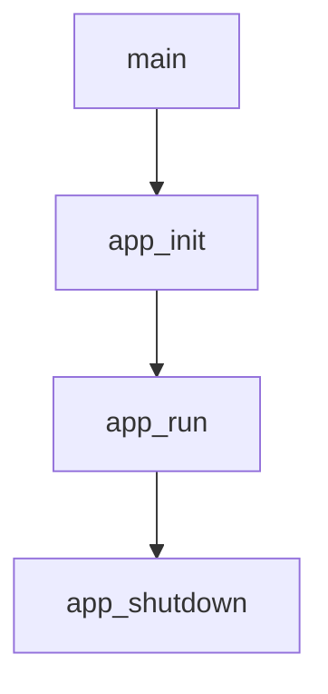

# Livello applicazione

Questo capitolo spiega il livello `app/`.

Stato: parziale.

## File principali

- `app/include/app.h`
- `app/src/main.c`
- `app/src/app.c`

## Responsabilita'

Il livello applicazione:

- inizializza il programma
- gestisce configurazione e logger
- avvia il ciclo principale
- installa i signal handler
- chiude le risorse in ordine

## Flusso generale

Questo capitolo verra' esteso con una spiegazione riga per riga dei file gia'
commentati.
