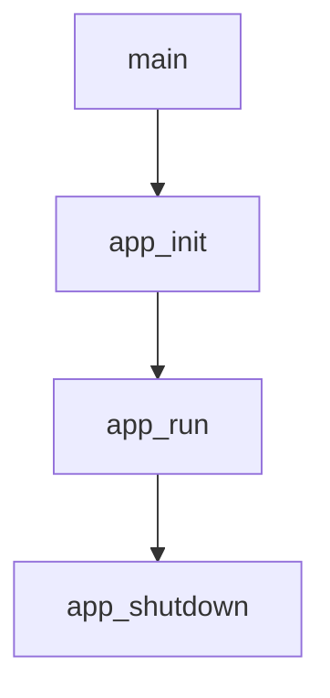
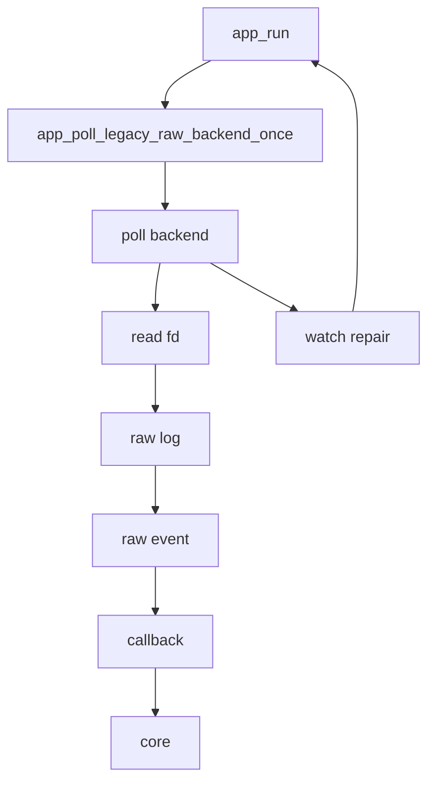

# Livello applicazione

Questo capitolo spiega il livello `app/`, cioe' la parte del progetto che
gestisce il programma come processo: avvio, configurazione, logging, ciclo
principale e chiusura delle risorse.

## File principali

```text
app/include/app.h
app/include/config.h
app/include/errors.h
app/include/logger.h
app/include/utils.h

app/src/main.c
app/src/app.c
app/src/config.c
app/src/logger.c
app/src/utils.c
```

## Responsabilita' del livello app

Il livello applicazione:

- inizializza il programma
- carica o prepara la configurazione
- apre i log
- inizializza le strutture runtime
- installa i signal handler
- legge eventi dal backend attuale
- chiude le risorse in ordine

Non dovrebbe contenere logica semantica profonda sugli eventi filesystem.
Quella responsabilita' appartiene al `core`.

## Flusso generale



`main()` resta piccolo apposta. Il vero lavoro e' delegato alle funzioni del
livello applicazione.

## app/include/app.h

`app.h` definisce `app_t`, cioe' il contesto principale del programma.

```c
typedef struct app {
    volatile sig_atomic_t running;

    config_t config;
    app_workspace_session_context_t workspace_session;
    const alfred_backend_ops_t *backend_ops;
    inotify_backend_ops_runtime_t inotify_backend;
    inotify_backend_ops_config_t inotify_backend_config;
    alfred_backend_emit_t backend_emit;
    logger_t logger;
    alfred_record_output_pipeline_t output_pipeline;
    FILE *output_stream;
    char *output_format_buffer;
    char *output_buffer;
    int output_failed;
    alfred_config_t core_config;
    core_logger_context_t core_logger_context;
    alfred_engine_t *core;
} app_t;
```

Questa struct e' il "contenitore" dello stato runtime.

Campi importanti:

- `running`: flag di shutdown cooperativo. Vale `1` mentre il ciclo principale
  deve continuare e viene portata a `0` dal signal handler quando Alfred riceve
  segnali come `SIGINT` o `SIGTERM`
- `config`: configurazione runtime
- `workspace_session`: contesto runtime app-owned per `workspace_root`,
  `workspace_id` e `ledger_session_id`. Viene copiato dalla configurazione
  durante `app_init()` e resta immutabile per la run; non viene passato al
  backend inotify e non viene copiato dentro `alfred_record_t`
- `backend_ops`: tabella statica Backend API v0 usata da `app.c` per chiamare
  lifecycle e target management del backend attivo. Per ora punta sempre a
  `inotify_backend_ops()`
- `inotify_backend`: runtime concreto dello staged adapter inotify. Contiene il
  vecchio runtime inotify (`fd`, watch table e stato target) piu' lo stato
  necessario alla tabella ops
- `inotify_backend_config`: piccolo oggetto di configurazione passato a
  `backend_ops->init()`. Contiene puntatori borrowed alla configurazione
  inotify e al logger
- `backend_emit`: callback comune che il backend ops puo' usare per consegnare
  record strutturati alla pipeline applicativa. La callback usa `app_t` solo
  come `userdata` opaco
- `logger`: gestore dei file di log
- `output_pipeline`: pipeline strutturata opzionale usata per `output.jsonl`
  quando `output_enabled=true`
- `output_stream`, `output_format_buffer`, `output_buffer`: risorse possedute
  dall'applicazione e prestate alla pipeline/writer per evitare ownership
  ambigua
- `output_failed`: flag fail-closed dell'output strutturato. Se enqueue,
  drain/write o flush finale falliscono, Alfred non continua come se il ledger
  JSONL fosse completo
- `core_config`: configurazione del core semantico
- `core_logger_context`: contesto della callback che porta gli eventi semantici
  dal core verso logger e output pipeline
- `core`: istanza del motore semantico Alfred

`running` usa `volatile sig_atomic_t` perche' viene scritto in un signal handler
e letto dal codice normale. In C un signal handler puo' interrompere il programma
in un punto qualunque: per questo deve fare pochissimo lavoro. Alfred non scrive
log, non alloca memoria, non chiude file descriptor e non prende lock dentro il
handler; si limita a cambiare una flag che il ciclo principale controlla in modo
cooperativo.

Nota architetturale: `inotify_fd` e `watchers` non sono piu' campi diretti di
`app_t`; vivono dentro il runtime inotify posseduto da
`inotify_backend_ops_runtime_t`. `app.c` usa ora la tabella
`alfred_backend_ops_t` per `init`, `add_target`, `start`, `stop` e `destroy`.
Prima di usare la tabella, `app.c` la valida con
`alfred_backend_ops_is_minimally_valid()`: se un backend statico non espone il
contratto minimo, Alfred fallisce durante startup invece di dereferenziare
callback mancanti. Il ciclo `app_run()` usa ancora il ponte raw storico per
`poll`, ma la chiamata diretta a `inotify_backend_poll()` e' ora confinata in
`app_poll_legacy_raw_backend_once()`. `app_run()` costruisce un
`inotify_backend_context_t` stretto a partire dal runtime ops e lo passa a quel
helper. Questa forma e' voluta: il lifecycle e' gia' passato dalla Backend API
v0, mentre la migrazione del poll runtime verra' fatta in un micro-step separato
con test dedicati.

Il core e' stato aggiunto ad `app_t` perche' deve vivere quanto l'applicazione.
Oggi e' lo stream semantico ufficiale di default. Lo shadow mode non e' piu'
una modalita' supportata: se viene richiesto, Alfred fallisce con un errore
esplicito.

## app/src/main.c

`main.c` e' il punto di ingresso del programma.

Il flusso e':

```c
app_t app;

rc = app_init(&app, argc, argv);
rc = app_run(&app);
app_shutdown(&app);
```

Questo stile e' utile perche':

- `main()` resta leggibile
- la gestione delle risorse e' centralizzata
- gli errori di startup passano dallo stesso percorso di cleanup

## app/src/app.c

`app.c` gestisce il ciclo di vita.

### app_init()

`app_init()` inizializza i sottosistemi in ordine:

1. reset della struct `app_t`
2. configurazione di default
3. logger
4. core come unico engine semantico supportato
5. backend inotify
6. signal handler
7. watch sui percorsi passati da riga di comando

L'ordine e' importante. Per esempio, il logger viene inizializzato presto
perche' gli altri sottosistemi possono usarlo per scrivere errori.

Il core viene inizializzato dopo il logger perche' la callback del core scrive
gli eventi semantici attraverso `logger_event()`.

### app_run()

`app_run()` contiene il ciclo principale:



Il ciclo reale e' controllato da `while (app->running)`. Quando l'utente preme
`Ctrl-C` o il processo riceve `SIGTERM`, il signal handler imposta
`app->running = 0`; il ciclo finisce alla prossima iterazione utile e Alfred
arriva a `app_shutdown()`, dove puo' flushare i writer e rilasciare le risorse in
un contesto normale e sicuro.

Il file descriptor e' non bloccante, ma `app.c` non chiama piu' direttamente
`read()`. La lettura e il parsing di `struct inotify_event` sono stati spostati
nel backend inotify. `app.c` resta il coordinatore: chiama il backend, riceve
eventi raw tramite callback e li inoltra al core.

Legenda del diagramma:

- `app_poll_legacy_raw_backend_once`: helper applicativo che contiene l'unica
  chiamata diretta rimasta al ponte raw storico
- `poll backend`: `inotify_backend_poll()`
- `read fd`: lettura del file descriptor inotify non bloccante
- `raw log`: scrittura del log grezzo del backend
- `raw event`: costruzione di `alfred_raw_event_t`
- `callback`: ritorno verso `app.c`
- `core`: chiamata a `alfred_process()`
- `watch repair`: aggiornamento dei watch ricorsivi dopo directory create

### Shadow mode storico

Durante la migrazione, quando si abilitava esplicitamente lo shadow mode, lo
stesso evento inotify veniva osservato da due percorsi:

```text
struct inotify_event
    -> inotify_backend_poll()
    -> inotify_adapter_build_raw()
    -> callback app
    -> alfred_process()
    -> core_logger_on_event()
    -> logger_event()

struct inotify_event
    -> inotify_backend_poll()
    -> legacy_events_dispatch()
    -> vecchio logger eventi
```

Il runtime normale usa il core. In shadow mode, invece, il vecchio dispatcher
produceva lo stream legacy e il core produceva righe con prefisso `core`, utili
per confrontare il nuovo motore con il comportamento storico.

Quel percorso e' stato rimosso. Oggi `ALFRED_EVENT_ENGINE=shadow` fallisce con
un errore esplicito invece di fingere un confronto.

Questo approccio ha ridotto il rischio durante la migrazione. Oggi il confronto
non e' piu' un runtime supportato: il contratto ufficiale e' solo
`event_engine=core`.

### Aggiornamento watch backend

Il backend inotify gestisce anche un dettaglio importante: quando arriva un
evento `IN_CREATE | IN_ISDIR`, Alfred deve aggiungere watch ricorsivi alla nuova
directory.

Questa operazione non deve dipendere da semantica legacy. Per questo il backend
esegue sempre:

```text
IN_CREATE | IN_ISDIR
    -> watch_manager_add() sulla directory creata
    -> fs_scan_tree(..., emit_root = 0)
    -> watch_manager_add() sulle directory annidate
    -> eventuali raw create sintetici verso il core
```

In questo modo core mode continua a monitorare le nuove directory e puo'
recuperare i `DIR_CREATED` mancanti negli scenari tipo `mkdir -p`.

### Raw event sintetici

Durante la gestione ricorsiva delle directory, il backend puo' scoprire
sottodirectory gia' presenti ma mai notificate da inotify. Questo accade, per
esempio, con:

```text
mkdir -p one/two/three
```

Per recuperare questi eventi, il backend costruisce un `alfred_raw_event_t`
sintetico:

```text
ALFRED_RAW_CREATE | ALFRED_RAW_ISDIR
```

e lo consegna alla stessa callback usata per gli eventi reali. La callback in
`app.c` lo inoltra al core. Questo e' un miglioramento rispetto alla fase
precedente: lo scan ricorsivo non nasce piu' in `app.c`, ma nel backend
inotify. Anche fd e watcher table sono campi del backend. Il backend non riceve
piu' l'intero `app_t`: lavora tramite `inotify_backend_context_t`, che contiene
solo i riferimenti necessari a runtime inotify, configurazione e logger.

### app_shutdown()

`app_shutdown()` chiude le risorse:

1. file descriptor inotify
2. tabella watcher
3. core
4. logger

Il logger viene chiuso per ultimo cosi' puo' registrare anche le fasi di
shutdown.

Il core viene distrutto prima del logger. In futuro, se il core fara' flush di
eventi pendenti durante lo shutdown, il logger sara' ancora disponibile.

## app/src/config.c

`config.c` gestisce la configurazione.

La configurazione e' una struct semplice:

```c
config_t config;
```

Non usa memoria dinamica. I path dei log sono array fissi:

```c
char raw_log[PATH_MAX];
char event_log[PATH_MAX];
char error_log[PATH_MAX];
```

Questo semplifica cleanup e ownership.

`config_defaults()` imposta valori sicuri:

- watch ricorsivo attivo
- capacita' iniziali delle tabelle
- mask inotify di default
- motore eventi in `core`
- nomi standard dei log

I valori specifici del backend inotify non sono piu' campi sparsi direttamente
in `config_t`: sono raccolti in `config_t.inotify`, una sottostruttura di tipo
`inotify_config_t`. Questo rende piu' chiaro il confine:

```text
config_t                 -> configurazione applicativa generale
config_t.inotify         -> configurazione specifica del backend inotify
alfred_config_t          -> configurazione del core semantico
```

Il backend inotify riceve solo `inotify_config_t` tramite
`inotify_backend_context_t`. In questo modo non puo' leggere accidentalmente
opzioni applicative o future opzioni di altri backend.

`config_load()` legge righe semplici:

```text
chiave=valore
```

Esempio:

```text
recursive=true
inotify_recursive=true
watcher_capacity=256
inotify_watcher_capacity=256
inotify_watch_mask=default,-IN_ATTRIB
inotify_audit_events=off
output_enabled=false
output_format=jsonl
output_buffer_size=65536
event_engine=core
raw_log=myraw.log
```

Le chiavi storiche `recursive` e `watcher_capacity` restano accettate. Le nuove
chiavi `inotify_recursive` e `inotify_watcher_capacity` descrivono meglio il
proprietario reale di quelle opzioni e sono la forma preferita per i nuovi file
di configurazione.

La chiave `inotify_watch_mask` configura la maschera passata a
`inotify_add_watch()` per scegliere quali eventi filesystem chiedere al kernel.
Il valore puo' essere:

```text
default
default,-IN_ATTRIB
default,+IN_Q_OVERFLOW
IN_CREATE,IN_DELETE,IN_MODIFY,IN_CLOSE_WRITE
```

`default` significa "parti dalla maschera standard scelta da Alfred". I token
con `+` aggiungono flag a quella maschera; i token con `-` li rimuovono. Una
lista senza `default` parte invece da maschera vuota e contiene solo i flag
indicati.

Un token sconosciuto e' un errore di configurazione. Per esempio
`IN_ATRIB`, scritto con una sola `T`, fa fallire l'avvio. Questa scelta e'
intenzionale: ignorare i typo sarebbe pericoloso, perche' l'utente penserebbe
di aver modificato la maschera mentre Alfred starebbe continuando con un valore
diverso.

La configurazione accetta solo i flag che Alfred sa gia' rendere nei raw log e
gestire in modo esplicito: conversione in raw mask del core oppure diagnostica
di stato backend. `IN_MOVE_SELF`, per esempio, e' supportato come diagnostica:
marca il watch `STALE` e produce `WATCH_STALE`, ma non diventa un evento core.
Flag inotify reali ma non ancora supportati da Alfred, per esempio `IN_OPEN` o
`IN_ACCESS`, vengono rifiutati finche' non decidiamo esplicitamente come
osservarli e documentarli.

`inotify_watch_mask` non e' il posto giusto per flag di installazione come
`IN_ONLYDIR`, `IN_MASK_CREATE`, `IN_DONT_FOLLOW` o `IN_EXCL_UNLINK`.
`IN_ONLYDIR` e' applicato internamente dal watch manager per garantire che
Alfred installi watch solo su directory. `IN_MASK_CREATE`, se verra'
introdotto, dovra' essere governato da una policy separata del backend, per
esempio `inotify_watch_create_policy=strict|compat`. `IN_DONT_FOLLOW`, se
verra' introdotto, dovra' essere una policy sui symlink, per esempio
`inotify_symlink_policy=follow|no-follow`. `IN_EXCL_UNLINK`, se verra'
introdotto, dovra' essere una policy rumore/visibilita', per esempio
`inotify_unlinked_child_policy=observe|suppress`. Questa distinzione evita di
confondere due decisioni diverse: quali eventi osservare e con quale disciplina
installare i watch.

La chiave `inotify_audit_events` e' separata da `inotify_watch_mask` per lo
stesso motivo. Valori come `open`, `access` e `close-nowrite` abilitano fatti
audit rumorosi e non mutazioni filesystem. Oggi questi eventi restano nel raw
log inotify e non diventano ancora raw Alfred o eventi core.

Valori supportati:

```text
inotify_audit_events=off
inotify_audit_events=open
inotify_audit_events=access
inotify_audit_events=close-nowrite
inotify_audit_events=open,access,close-nowrite
```

Significato dei campi:

| Valore | Bit inotify richiesto | Significato | Effetto Alfred corrente |
| --- | --- | --- | --- |
| `off` | nessuno | disabilita lo stream audit inotify | comportamento predefinito |
| `open` | `IN_OPEN` | un file o una directory e' stato aperto | visibile solo in `raw.log` |
| `access` | `IN_ACCESS` | un file e' stato letto o eseguito | visibile solo in `raw.log` |
| `close-nowrite` | `IN_CLOSE_NOWRITE` | un file o directory e' stato chiuso senza scrittura | visibile solo in `raw.log`; non e' `FILE_READY` |

La sintassi usa nomi di policy in minuscolo, non token raw `IN_*`. Per esempio
`inotify_audit_events=open` e' valido, mentre
`inotify_audit_events=IN_OPEN` e' un errore di configurazione. Questa scelta
obbliga chi configura Alfred a distinguere gli eventi audit dalla maschera
filesystem principale.

Esempio operativo:

```text
inotify_watch_mask=default
inotify_audit_events=open,access,close-nowrite
```

Con questa configurazione una lettura read-only puo' produrre righe come
`IN_OPEN`, `IN_ACCESS` e `IN_CLOSE_NOWRITE` nel `raw.log`. Non deve pero'
produrre `FILE_MODIFIED` o `FILE_READY` nell'`events.log`, perche' non c'e'
stata scrittura.

### Configurazione workspace/sessione

La configurazione contiene anche il primo contesto workspace/sessione:

```c
typedef struct {
    int has_workspace_root;
    int has_workspace_id;
    int has_ledger_session_id;

    char workspace_root[PATH_MAX];
    char workspace_id[WORKSPACE_SESSION_ID_MAX];
    char ledger_session_id[WORKSPACE_SESSION_ID_MAX];
} workspace_session_config_t;
```

Questi campi vivono in `config_t.workspace_session` e vengono copiati in
`app_t.workspace_session` da `app_init_workspace_session_context()`. Sono
contesto dichiarato della run, non evidenza osservata dal backend. Per questo:

- il backend inotify non li riceve;
- il core filesystem non li usa per decidere create/delete/rename/move;
- la queue non clona questi valori per ogni record filesystem;
- quando `output_enabled=true` e almeno un campo e' configurato, app.c emette
  un solo record `diagnostic + lifecycle + SESSION_CONTEXT` tramite
  `app_emit_session_context_record()`;
- quel record passa dalla output pipeline (`queue -> dispatcher -> sink`) e non
  viene scritto direttamente come JSONL da `app.c`;
- un valore presente ma vuoto viene rifiutato da `config_load()`.

Il percorso concreto e':

```text
app_init_workspace_session_context()
-> app_init_output_pipeline()
-> app_emit_session_context_record()
   -> app_build_session_context_record()
   -> app_emit_output_record()
   -> app_enqueue_output_record()
   -> alfred_record_output_pipeline_enqueue()
-> app_run()
   -> app_drain_output_pipeline()
   -> alfred_record_dispatcher_dispatch_one()
   -> alfred_record_jsonl_writer_emit()
```

Il record costruito da `app_build_session_context_record()` e' borrowed verso
`app_t.workspace_session` solo fino all'enqueue. La queue crea la copia owned
con `alfred_record_clone_owned()`, quindi nessun puntatore verso `app_t`
sopravvive nel buffer accodato.

Per i dettagli leggere
[Workspace/session runtime context v0](45-workspace-session-runtime-context-v0.md)
e
[Metadata/session record JSONL v0](46-metadata-session-record-jsonl-v0.md).

### Configurazione output runtime

La configurazione contiene anche una sezione per il primo output runtime
strutturato:

```c
typedef struct {
    int enabled;
    output_format_t format;
    size_t buffer_size;
} output_config_t;
```

Questi campi vivono in `config_t.output`, non in `config_t.inotify`. Il motivo
e' architetturale: il backend inotify osserva eventi del kernel, ma non deve
decidere formato di output, buffering, writer o destinazioni di log.

Campi minimi:

| Campo | Default | Significato |
| --- | --- | --- |
| `output.enabled` | `false` | abilita il percorso opt-in `record -> queue -> dispatcher -> writer` |
| `output.format` | `jsonl` | formato richiesto; in v0 `jsonl` e' il solo formato attivabile |
| `output.buffer_size` | `65536` | dimensione in bytes del buffer per writer buffered come JSONL |
| `output_log` | `output.jsonl` | file JSONL append-only usato quando `output_enabled=true` |

Con:

```text
output_enabled=false
```

Alfred usa il percorso compatibile corrente:

```text
evento OS
-> backend inotify
-> raw event Alfred
-> core
-> logger attuale
-> raw.log / events.log / errors.log
```

In questo modo il nuovo writer runtime non cambia il comportamento pubblico:
non usa la queue runtime, non usa il dispatcher runtime configurabile, non usa
il JSONL buffered writer e non modifica i log esistenti.

Con:

```text
output_enabled=true
```

la configurazione attiva il primo percorso JSONL runtime:

```text
record
-> queue
-> runtime drain sincrono
-> dispatcher
-> JSONL buffered writer
-> output_log
```

Il collegamento corrente e' ancora conservativo: `app_run()` continua a produrre
i log storici e aggiunge il file JSONL per i raw record normalizzati gia'
migrati al record sink, per gli eventi semantici emessi dal core e per la
diagnostica watch base `WATCH_ADDED`/`WATCH_REMOVED`/`WATCH_STALE`/
`WATCH_STALE_EVENT_DROPPED`. Non ci sono ancora worker thread, socket, code per
sink o backpressure reale. I callback applicativi costruiscono il record una
sola volta o ricevono un record borrowed dal backend/core, poi usano lo stesso
`alfred_record_t` per il log compatibile e per la pipeline JSONL.

Se la pipeline JSONL e' abilitata e l'emissione di un record fallisce, Alfred
marca `app.output_failed`. Il percorso e' diviso in due fasi:
`app_emit_output_record()` resta sul lato producer e chiama solo
`app_enqueue_output_record()`, che accoda il record owned nella coda bounded. Il
ciclo applicativo `app_run()` chiama poi `app_drain_output_pipeline()` dopo ogni
`app_poll_legacy_raw_backend_once()`: quella fase consuma la coda e chiama
dispatcher e writer.

La v0 e' ancora single-threaded. Un singolo `inotify_backend_poll()` puo'
consegnare una burst di eventi piu' grande della coda prima che il controllo
torni al ciclo applicativo. Per questo `app_enqueue_output_record()` contiene
una valvola di backpressure temporanea: se la coda e' gia' piena, esegue un
drain esplicito e ritenta una sola volta l'enqueue. Il percorso normale resta
enqueue-only; il drain nel producer e' solo il caso di pressione della coda e
dovra' essere sostituito dal worker runtime futuro.

Per rendere visibile questo comportamento, `app_t` mantiene anche contatori
locali in `output_stats`. Questi contatori non sono record JSONL e non sono
ancora una API pubblica: descrivono il wiring applicativo corrente. A shutdown,
quando `output_enabled=true`, Alfred scrive in `events.log` una riga
`output runtime stats ...` con:

- tentativi di enqueue;
- enqueue riusciti e falliti;
- drain di pressione causati da coda piena;
- drain falliti;
- drain call totali;
- record drenati;
- massimo numero di record pending osservato nella coda.

Questi valori servono per benchmark e review della milestone Writer Runtime v0:
se `pressure_drains` cresce, significa che il producer ha incontrato una coda
piena e ha dovuto aiutare il consumer. Il runtime finale con worker dovra'
ridurre o eliminare questo caso dal percorso del producer.

Un errore puo' quindi emergere sia sul lato producer, per esempio se la coda
rifiuta il record anche dopo il drain di pressione, sia sul lato consumer, per
esempio se il writer JSONL fallisce in scrittura. In entrambi i casi `app_run()`
termina invece di continuare con un ledger JSONL parziale. Questa e' una scelta
"fail closed": per debug sarebbe possibile immaginare un output best-effort, ma
per un futuro log usato da test golden, audit e replay e' piu' sicuro fermarsi e
rendere evidente il problema.

La stessa regola vale anche alla fine del processo. Il writer JSONL e'
bufferizzato: un record puo' essere gia' stato accettato dalla pipeline ma non
ancora scritto sul file perche' il buffer non e' pieno. In quel caso l'errore di
I/O puo' emergere solo durante il flush finale nello shutdown. Per questo
`app_shutdown()` restituisce uno stato: se il flush finale fallisce, `main()`
non deve restituire successo anche se `app_run()` era terminato normalmente.
Senza questa propagazione Alfred potrebbe produrre un `output.jsonl` incompleto
e uscire con codice `0`, cioe' con un segnale falso di riuscita.

Questa regola vale anche quando il record nasce dentro il backend inotify come
diagnostica watch. Il backend non decide di chiudere Alfred e non conosce JSONL:
chiama solo il callback `emit_record` ricevuto nel `inotify_backend_context_t`.
Se il callback fallisce, il backend propaga l'errore al chiamante; l'applicazione
vede `app.output_failed` e applica la policy fail-closed. In questo modo la
responsabilita' resta separata: il backend produce e propaga fatti, l'app decide
la policy dell'output configurato.

Il caso `WATCH_STALE` e' particolarmente importante per capire il confine fra
backend e applicazione. Quando arriva `IN_MOVE_SELF`, `IN_DELETE_SELF` o
`IN_UNMOUNT`, il backend marca il watch come stale per dire che il vecchio path
non e' piu' affidabile. Quel record diagnostico passa prima dal log compatibile
e poi dal callback `emit_record`. Se il callback fallisce, il backend non
continua il poll in silenzio: restituisce errore I/O al livello applicativo, che
ferma Alfred quando l'output strutturato e' stato richiesto dall'utente.

`output_format` accetta per ora:

```text
output_format=jsonl
output_format=text
```

`jsonl` e' il default perche' il nuovo percorso di output nasce per record
strutturati e per futuri golden test, ledger e integrazioni. `text` resta utile
per compatibilita', debug e didattica, ma non e' ancora attivabile con
`output_enabled=true` dentro `app_run()`. Valori non implementati come
`protobuf`, `messagepack` o `socket` sono rifiutati finche' non esiste un writer
con contratto documentato.

`output_buffer_size` deve essere almeno `8192`. Il default e' `65536`, cioe'
64 KiB. Il minimo evita configurazioni inutilizzabili: il writer JSONL usa uno
scratch buffer da 8192 bytes per formattare un singolo oggetto; il buffer output
deve poter contenere almeno qualunque oggetto che entra in quello scratch buffer,
piu' il newline finale della riga JSONL. Se fosse piu' piccolo, una configurazione
formalmente valida potrebbe fallire al primo record lungo ma corretto.

Esempio:

```text
output_enabled=false
output_format=jsonl
output_buffer_size=65536
output_log=output.jsonl
```

Questa configurazione e' valida e descrive il default corrente: il nuovo output
runtime e' spento. Se l'utente cambia `output_enabled=true`, Alfred usa JSONL
con buffer da 64 KiB e scrive sul file `output_log`.

La funzione restituisce codici `error_t`: `ERR_OK` quando il caricamento riesce,
`ERR_INVALID_ARG` per argomenti non validi e `ERR_CONFIG` per file non leggibile
o valori di configurazione non validi.

I valori numerici come `watcher_capacity` vengono letti come interi senza segno.
Se il valore non e' valido, Alfred mantiene il default gia' presente nella
configurazione invece di convertire stringhe negative o malformate in capacita'
non sensate.

Il motivo e' pratico: questi campi sono `size_t`, quindi non possono
rappresentare numeri negativi. La vecchia conversione con `atoi()` restituiva un
`int`; assegnare quel valore a `size_t` genera warning con `-Wsign-conversion` e
puo' trasformare valori come `-1` in capacita' enormi. Inoltre `atoi()` non
distingue bene tra `0`, `abc` e stringhe parzialmente valide come `12abc`.

Il parser dedicato usa `strtoul()` e accetta solo stringhe numeriche intere
senza segno. Se trova `NULL`, un valore negativo, caratteri non numerici,
overflow o una conversione fallita, restituisce il valore precedente della
configurazione. In pratica:

```text
watcher_capacity=256   -> 256
watcher_capacity=abc   -> resta il default
watcher_capacity=12abc -> resta il default
watcher_capacity=-1    -> resta il default
```

La chiave `event_engine` accetta oggi un solo valore:

```text
core
```

`core` e' il default. In questa modalita' Alfred produce lo stream ufficiale
plain dal core e non chiama il dispatcher legacy. Il confronto shadow non e'
piu' riattivabile nella build corrente.

Il flusso corrente e':

```text
core -> evento ufficiale plain
```

Se il file di configurazione contiene `event_engine=shadow`, oppure se
l'ambiente contiene `ALFRED_EVENT_ENGINE=shadow`, Alfred fallisce con
`ERR_CONFIG`. Questo e' voluto: il vecchio dispatcher `events.c` e' stato
rimosso dal codice corrente. Il modulo inotify continua comunque a produrre
diagnostica backend come `WATCH_ADDED`, perche' quella diagnostica nasce dal
watch manager, non da un dispatcher semantico legacy.

Nota temporanea dell'integrazione: `config_load()` sa gia' leggere
`event_engine` e le opzioni inotify. L'avvio del programma non espone ancora
un'opzione CLI per indicare un file di configurazione, ma accetta il percorso
tramite variabile d'ambiente:

```bash
ALFRED_CONFIG=./alfred.conf ./alfred /path/da/osservare
```

Per forzare esplicitamente la modalita' core si usa l'override d'ambiente:

```bash
ALFRED_EVENT_ENGINE=core ./alfred /path/da/osservare
```

Senza override, Alfred usa `core`. Se si prova a usare
`ALFRED_EVENT_ENGINE=shadow`, Alfred fallisce per valore di configurazione non
valido.

## app/src/logger.c

Il logger gestisce tre stream:

```text
raw.log     eventi grezzi
events.log  eventi semantici e info
errors.log  errori e diagnostica
```

Ogni messaggio viene scritto con timestamp e livello:

```text
[2026-05-19T10:00:00.123+0000] [INFO] logger initialized
```

Il logger usa funzioni variadic, cioe' funzioni con un numero variabile di
argomenti:

```c
void logger_info(logger_t *lg, const char *fmt, ...);
```

Questo permette chiamate simili a `printf()`:

```c
logger_error(&app->logger, "read failed errno=%d", errno);
```

## app/src/utils.c

`utils.c` contiene funzioni piccole riusabili:

- formattazione timestamp
- join di path
- copia sicura di stringhe
- conversione di valori in testo

Una regola importante: `utils.c` non dovrebbe diventare un contenitore generico
di logica business. Se una funzione riguarda solo inotify, deve stare in
`modules/inotify`. Per questo la renderizzazione testuale delle mask inotify e'
stata spostata nel backend come helper locale: `utils.c` deve restare generico,
mentre il backend puo' conoscere nomi Linux come `IN_CREATE` e
`IN_CLOSE_WRITE`.

## Error handling

Il livello app usa codici di ritorno:

```c
ERR_OK
ERR_ALLOC
ERR_IO
ERR_INOTIFY
ERR_INVALID_ARG
```

Questo e' uno stile comune in C: invece di eccezioni, le funzioni restituiscono
un valore che il chiamante deve controllare.

## Punti da ricordare

- `main()` coordina, ma non contiene logica complessa.
- `app_t` e' il contesto runtime principale.
- `app_init()` costruisce le risorse.
- `app_run()` legge e dispatcha eventi.
- `app_shutdown()` libera le risorse.
- Il core e' lo stream semantico ufficiale di default.
- Lo shadow mode e' storico: se richiesto, Alfred fallisce con un errore
  esplicito.
- La configurazione non possiede memoria dinamica.
- Il logger possiede i suoi `FILE *`.
- Alcune responsabilita' sono temporanee e verranno spostate nel core o nel
  modulo inotify durante l'integrazione.
