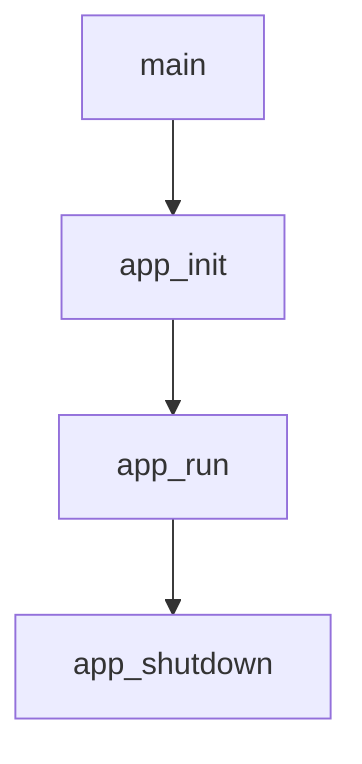
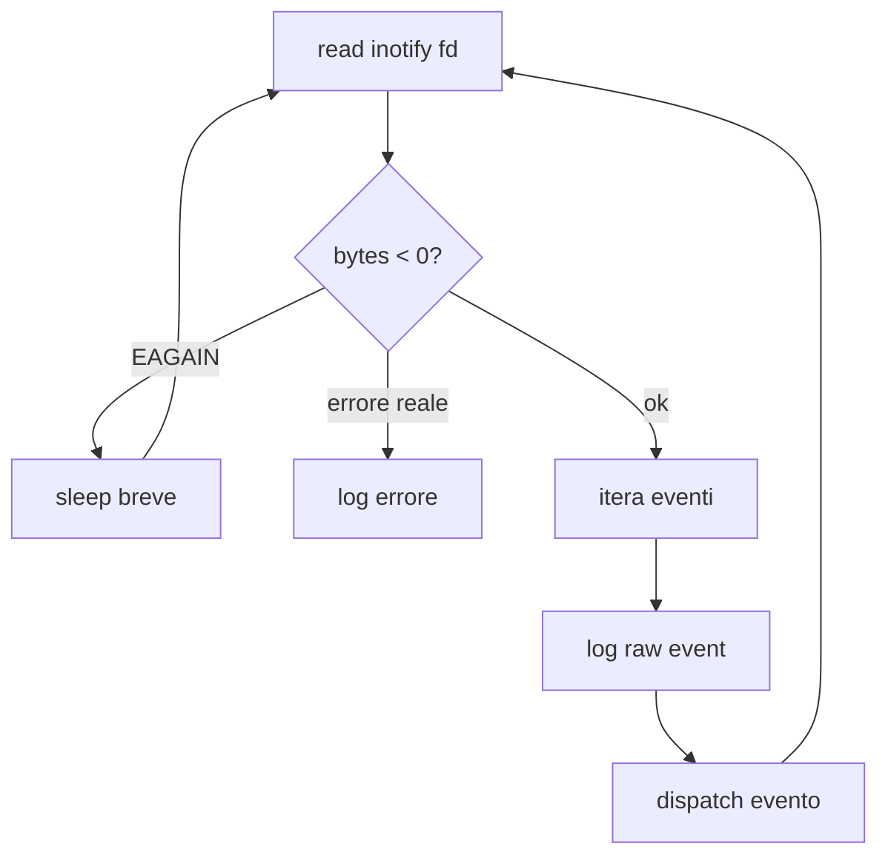

# Livello applicazione

Questo capitolo spiega il livello `app/`, cioe' la parte del progetto che
gestisce il programma come processo: avvio, configurazione, logging, ciclo
principale e chiusura delle risorse.

## File principali

```text
app/include/app.h
app/include/config.h
app/include/errors.h
app/include/logger.h
app/include/utils.h

app/src/main.c
app/src/app.c
app/src/config.c
app/src/logger.c
app/src/utils.c
```

## Responsabilita' del livello app

Il livello applicazione:

- inizializza il programma
- carica o prepara la configurazione
- apre i log
- inizializza le strutture runtime
- installa i signal handler
- legge eventi dal backend attuale
- chiude le risorse in ordine

Non dovrebbe contenere logica semantica profonda sugli eventi filesystem.
Quella responsabilita' appartiene al `core`.

## Flusso generale



`main()` resta piccolo apposta. Il vero lavoro e' delegato alle funzioni del
livello applicazione.

## app/include/app.h

`app.h` definisce `app_t`, cioe' il contesto principale del programma.

```c
typedef struct app {
    int running;
    int inotify_fd;

    config_t config;
    watcher_table_t watchers;
    logger_t logger;
    move_cache_t moves;
} app_t;
```

Questa struct e' il "contenitore" dello stato runtime.

Campi importanti:

- `running`: indica se il ciclo principale deve continuare
- `inotify_fd`: file descriptor di inotify
- `config`: configurazione runtime
- `watchers`: tabella watch descriptor -> path
- `logger`: gestore dei file di log
- `moves`: cache temporanea per correlare eventi move

Nota architetturale: oggi `app_t` contiene ancora stato specifico di inotify.
In futuro una parte di questo stato dovrebbe spostarsi dentro il backend
`modules/inotify`.

## app/src/main.c

`main.c` e' il punto di ingresso del programma.

Il flusso e':

```c
app_t app;

rc = app_init(&app, argc, argv);
rc = app_run(&app);
app_shutdown(&app);
```

Questo stile e' utile perche':

- `main()` resta leggibile
- la gestione delle risorse e' centralizzata
- gli errori di startup passano dallo stesso percorso di cleanup

## app/src/app.c

`app.c` gestisce il ciclo di vita.

### app_init()

`app_init()` inizializza i sottosistemi in ordine:

1. reset della struct `app_t`
2. configurazione di default
3. logger
4. tabella watcher
5. move cache
6. inotify
7. signal handler
8. watch sui percorsi passati da riga di comando

L'ordine e' importante. Per esempio, il logger viene inizializzato presto
perche' gli altri sottosistemi possono usarlo per scrivere errori.

### app_run()

`app_run()` contiene il ciclo principale:



Il file descriptor e' non bloccante. Questo significa che `read()` puo'
restituire `EAGAIN` quando non ci sono eventi. Non e' un errore: il programma
aspetta pochi millisecondi e riprova.

### app_shutdown()

`app_shutdown()` chiude le risorse:

1. file descriptor inotify
2. tabella watcher
3. move cache
4. logger

Il logger viene chiuso per ultimo cosi' puo' registrare anche le fasi di
shutdown.

## app/src/config.c

`config.c` gestisce la configurazione.

La configurazione e' una struct semplice:

```c
config_t config;
```

Non usa memoria dinamica. I path dei log sono array fissi:

```c
char raw_log[PATH_MAX];
char event_log[PATH_MAX];
char error_log[PATH_MAX];
```

Questo semplifica cleanup e ownership.

`config_defaults()` imposta valori sicuri:

- watch ricorsivo attivo
- capacita' iniziali delle tabelle
- mask inotify di default
- nomi standard dei log

`config_load()` legge righe semplici:

```text
chiave=valore
```

Esempio:

```text
recursive=true
move_cache_size=256
raw_log=myraw.log
```

## app/src/logger.c

Il logger gestisce tre stream:

```text
raw.log     eventi grezzi
events.log  eventi semantici e info
errors.log  errori e diagnostica
```

Ogni messaggio viene scritto con timestamp e livello:

```text
[2026-05-19T10:00:00.123+0000] [INFO] logger initialized
```

Il logger usa funzioni variadic, cioe' funzioni con un numero variabile di
argomenti:

```c
void logger_info(logger_t *lg, const char *fmt, ...);
```

Questo permette chiamate simili a `printf()`:

```c
logger_error(&app->logger, "read failed errno=%d", errno);
```

## app/src/utils.c

`utils.c` contiene funzioni piccole riusabili:

- formattazione timestamp
- join di path
- copia sicura di stringhe
- conversione di valori in testo
- renderizzazione temporanea di mask inotify

Una regola importante: `utils.c` non dovrebbe diventare un contenitore generico
di logica business. Se una funzione riguarda solo inotify, in futuro dovrebbe
stare in `modules/inotify`.

## Error handling

Il livello app usa codici di ritorno:

```c
ERR_OK
ERR_ALLOC
ERR_IO
ERR_INOTIFY
ERR_INVALID_ARG
```

Questo e' uno stile comune in C: invece di eccezioni, le funzioni restituiscono
un valore che il chiamante deve controllare.

## Punti da ricordare

- `main()` coordina, ma non contiene logica complessa.
- `app_t` e' il contesto runtime principale.
- `app_init()` costruisce le risorse.
- `app_run()` legge e dispatcha eventi.
- `app_shutdown()` libera le risorse.
- La configurazione non possiede memoria dinamica.
- Il logger possiede i suoi `FILE *`.
- Alcune responsabilita' sono temporanee e verranno spostate nel core o nel
  modulo inotify durante l'integrazione.
