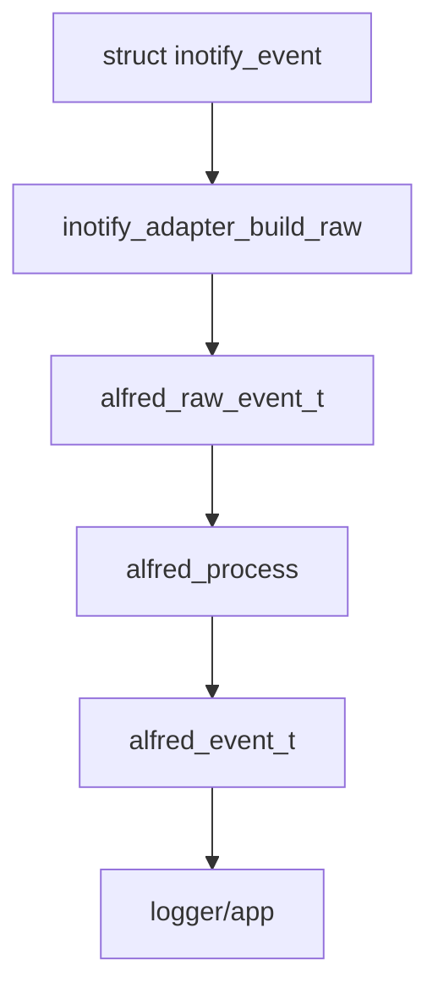

# Modulo inotify

Questo capitolo spiega il modulo `modules/inotify/`, cioe' la parte del
progetto che parla con Linux tramite `inotify`.

## Cos'e' inotify

`inotify` e' un'interfaccia del kernel Linux che permette a un programma di
ricevere notifiche quando file o directory cambiano.

Esempi di eventi Linux:

- `IN_CREATE`
- `IN_DELETE`
- `IN_MODIFY`
- `IN_ATTRIB`
- `IN_CLOSE_WRITE`
- `IN_MOVED_FROM`
- `IN_MOVED_TO`
- `IN_ISDIR`
- `IN_Q_OVERFLOW`

Questi eventi sono molto vicini al kernel. Per questo non sempre corrispondono
direttamente a un evento semantico finale.

## Responsabilita' del modulo

Nel disegno finale, `modules/inotify/` deve:

- aprire e gestire il file descriptor inotify
- aggiungere e rimuovere watch
- mantenere la tabella watch descriptor -> path
- leggere `struct inotify_event`
- convertire eventi inotify in `alfred_raw_event_t`

Non dovrebbe:

- decidere se un evento e' un rename o un move
- fare debounce
- produrre direttamente eventi semantici
- scrivere direttamente log semantici finali

Queste responsabilita' appartengono al `core` o al livello `app`.

## Stato attuale

Il modulo e' ancora in transizione, ma il vecchio dispatcher semantico legacy e
la sua `move_cache` sono stati rimossi. Il modulo inotify corrente deve fermarsi
ai fatti raw e alla diagnostica backend.

Il nuovo adapter:

```text
modules/inotify/include/inotify_adapter.h
modules/inotify/src/inotify_adapter.c
```

prepara il passaggio verso il design corretto.

Il primo confine backend esplicito e' ora:

```text
modules/inotify/include/inotify_backend.h
modules/inotify/src/inotify_backend.c
```

Questo backend iniziale:

- inizializza il file descriptor inotify
- aggiunge i watch iniziali, ricorsivi o non ricorsivi
- legge il buffer di `struct inotify_event`
- scrive il raw log diagnostico
- usa `inotify_adapter.c` per costruire `alfred_raw_event_t`
- consegna eventi reali e sintetici all'app tramite callback
- mantiene i watch ricorsivi quando viene creata una nuova directory

E' ancora un backend di transizione, ma ora possiede una struttura dedicata:

```c
typedef struct inotify_backend {
    int fd;
    watcher_table_t watchers;
} inotify_backend_t;
```

Questa struttura e' contenuta in `app_t` come campo `inotify`. Il backend usa
ancora `app_t` per accedere a configurazione e logger, ma `fd` e tabella dei
watch non sono piu' campi diretti dell'applicazione.

## Maschera di watch attuale

Il backend non riceve automaticamente tutti gli eventi che inotify potrebbe
produrre. Quando Alfred aggiunge un watch, passa al kernel una maschera, cioe'
l'elenco dei tipi di evento che vuole osservare.

La maschera predefinita oggi e' definita in:

```text
modules/inotify/src/watch_manager.c
```

e include:

```text
IN_CREATE
IN_DELETE
IN_MODIFY
IN_ATTRIB
IN_CLOSE_WRITE
IN_MOVED_FROM
IN_MOVED_TO
IN_DELETE_SELF
IN_IGNORED
IN_Q_OVERFLOW
```

Questa maschera passa attraverso `config_t.watch_mask`:

```text
config_defaults()
    -> cfg->watch_mask = watch_manager_default_mask()
watch_manager_add()
    -> inotify_add_watch(..., app->config.watch_mask)
```

Quindi `config_t` contiene davvero la maschera usata dal runtime. In questa fase
la maschera non e' ancora configurabile da file: `config_load()` legge molte
opzioni, ma non espone una chiave `watch_mask`.

`IN_MODIFY` e `IN_CLOSE_WRITE` rendono visibili al core gli eventi necessari per
produrre `FILE_MODIFIED` e `FILE_READY`. `IN_ATTRIB` rende visibili cambiamenti
di metadati. Secondo `inotify(7)`, questo include permessi, timestamp, attributi
estesi, numero di hard link, proprietario e gruppo.

Aumenta pero' anche il volume degli eventi raw: una semplice scrittura su file
puo' generare `IN_CREATE`, `IN_MODIFY` e `IN_CLOSE_WRITE`, mentre un `chmod` puo'
generare `IN_ATTRIB`. Un singolo nome raw, quindi, copre casi tecnicamente
diversi. Questa e' una delle ragioni per cui Alfred lo espone per ora solo come
fatto grezzo di backend.

Stato semantico importante: `IN_ATTRIB` viene tradotto in `ALFRED_RAW_ATTRIB`,
ma per ora il core non emette un evento semantico ufficiale come
`FILE_METADATA_CHANGED`. La scelta del nome e del significato semantico dei
cambiamenti attributo resta da discutere.

## Watch descriptor

Quando si aggiunge un watch con inotify, il kernel restituisce un intero:

```text
watch descriptor
```

Nel codice spesso si chiama `wd`.

Il problema e' che un evento inotify contiene il `wd`, non direttamente il path
completo della directory osservata. Per ricostruire il path bisogna mantenere
una tabella:

```text
wd -> path osservato
```

Questa e' la responsabilita' di `watcher_table_t`.

`watcher_table_t` vive dentro `inotify_backend_t`. Questo chiarisce il confine:
la tabella dei watch appartiene al backend, non al core e non alla semantica
degli eventi.

## Mask

La mask e' un campo bitmask. Significa che piu' informazioni possono essere
presenti nello stesso intero.

Esempio:

```text
IN_CREATE | IN_ISDIR
```

Vuol dire:

```text
e' stata creata una directory
```

Nel core esiste una mask indipendente da inotify:

```c
ALFRED_RAW_CREATE
ALFRED_RAW_ISDIR
```

L'adapter traduce da `IN_*` a `ALFRED_RAW_*`.

## Cookie

Per move e rename, inotify usa un `cookie`.

Esempio:

```text
IN_MOVED_FROM cookie=10 path=/tmp/a.txt
IN_MOVED_TO   cookie=10 path=/tmp/b.txt
```

Il cookie permette di capire che i due eventi appartengono alla stessa
operazione.

Il modulo inotify deve preservare il cookie nel raw event. Il core usera' quel
cookie per fare correlazione.

## Nuovo adapter

L'adapter espone tre funzioni principali.

### inotify_adapter_mask_to_alfred()

Converte la mask Linux:

```c
IN_CREATE | IN_ISDIR
```

in mask core:

```c
ALFRED_RAW_CREATE | ALFRED_RAW_ISDIR
```

### inotify_adapter_build_path()

Costruisce il path completo dell'evento.

Esempio:

```text
parent = /tmp/prova
name   = file.txt
```

Risultato:

```text
/tmp/prova/file.txt
```

Se `name` e' vuoto, viene usato solo il path parent. Questo serve per eventi che
riguardano direttamente la directory osservata.

### inotify_adapter_build_raw()

Converte:

```c
struct inotify_event
```

in:

```c
alfred_raw_event_t
```

Campi importanti:

- `source = ALFRED_SRC_INOTIFY`
- `mask = ALFRED_RAW_*`
- `cookie = ev->cookie`
- `path = full_path`
- `pid = 0`

`pid` e' zero perche' inotify normalmente non fornisce il PID del processo che
ha causato l'evento.

## Flusso desiderato



## Scan ricorsivo e discovery

Quando Alfred monitora in modalita' ricorsiva, una nuova directory deve ricevere
un watch. Il caso semplice e':

```text
IN_CREATE IN_ISDIR name=dir
    -> watch_manager_add_recursive(dir)
    -> WATCH_ADDED dir
```

Il caso difficile e':

```text
mkdir -p one/two/three
```

`inotify` puo' notificare solo `one`, perche' `two` e `three` vengono create
prima che Alfred riesca ad aggiungere il watch su `one`.

Per mitigare il problema, il watch manager attraversa ricorsivamente la nuova
directory e aggiunge watch alle sottodirectory gia' presenti. Ora esiste anche
una variante con callback di discovery:

```c
watch_manager_add_recursive_with_discovery(...)
```

Questa funzione continua ad aggiungere i watch, ma quando scopre una
sottodirectory gia' esistente chiama una callback. Oggi la callback e' gestita
dal backend inotify in:

```text
modules/inotify/src/inotify_backend.c
```

Il backend genera un raw event sintetico verso lo stesso percorso usato dagli
eventi reali, cosi' il core puo' emettere il `DIR_CREATED` che inotify non ha
potuto consegnare.

Il watch manager non decide direttamente la semantica. Si limita a segnalare:

```text
ho scoperto questa directory durante lo scan
```

La trasformazione in `DIR_CREATED` resta responsabilita' del core.

## Funzioni principali del backend

La prima passata pesante sui commenti ha documentato il contratto delle funzioni
principali del backend inotify.

`inotify_backend_init()` inizializza la tabella dei watch e apre il file
descriptor inotify non bloccante. Non inizializza piu' un dispatcher legacy:
il backend corrente produce raw event Alfred e li consegna all'app, mentre la
semantica finale e' responsabilita' del core.

`inotify_backend_poll()` e' il punto centrale del flusso runtime. L'ordine e':

1. leggere dal file descriptor inotify
2. scrivere il raw log diagnostico
3. convertire `struct inotify_event` in `alfred_raw_event_t`
4. consegnare il raw event alla callback dell'app, che lo inoltra al core
5. aggiornare i watch ricorsivi e generare raw event sintetici se lo scan scopre
   directory create prima dell'aggiunta del watch

Questa sequenza fissa un confine importante: il backend puo' scoprire fatti e
mantenere lo stato dei watch, ma non deve decidere la semantica finale degli
eventi.

## Perche' l'adapter non fa semantica

L'adapter deve essere un traduttore, non un interprete.

Fa questo:

```text
IN_MOVED_FROM -> ALFRED_RAW_MOVED_FROM
```

Non fa questo:

```text
IN_MOVED_FROM + IN_MOVED_TO -> FILE_RENAMED
```

La seconda operazione richiede memoria, correlazione e regole semantiche. Deve
stare nel core.

## Prossimo passo tecnico

Il core e' ormai il runtime di default. Il prossimo passo tecnico non e' piu'
"collegare" il core, ma rendere piu' pulito il confine:

1. mantenere aggiornata la lettura guidata di backend, core e app
2. mantenere nel backend solo lettura inotify, watch e raw event
3. lasciare al core tutta la semantica finale
4. archiviare o aggiornare i test storici che dipendevano dallo shadow
5. progettare overflow/resync come passo separato
