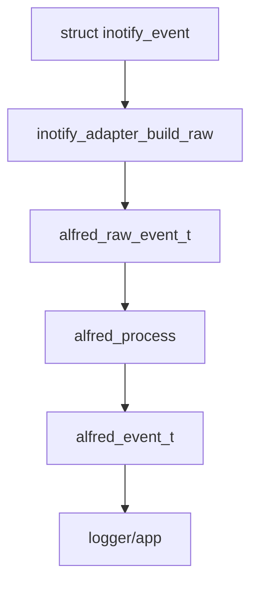

# Modulo inotify

Questo capitolo spiega il modulo `modules/inotify/`, cioe' la parte del
progetto che parla con Linux tramite `inotify`.

## Cos'e' inotify

`inotify` e' un'interfaccia del kernel Linux che permette a un programma di
ricevere notifiche quando file o directory cambiano.

Esempi di eventi Linux:

- `IN_CREATE`
- `IN_DELETE`
- `IN_MODIFY`
- `IN_MOVED_FROM`
- `IN_MOVED_TO`
- `IN_ISDIR`
- `IN_Q_OVERFLOW`

Questi eventi sono molto vicini al kernel. Per questo non sempre corrispondono
direttamente a un evento semantico finale.

## Responsabilita' del modulo

Nel disegno finale, `modules/inotify/` deve:

- aprire e gestire il file descriptor inotify
- aggiungere e rimuovere watch
- mantenere la tabella watch descriptor -> path
- leggere `struct inotify_event`
- convertire eventi inotify in `alfred_raw_event_t`

Non dovrebbe:

- decidere se un evento e' un rename o un move
- fare debounce
- produrre direttamente eventi semantici
- scrivere direttamente log semantici finali

Queste responsabilita' appartengono al `core` o al livello `app`.

## Stato attuale

Il modulo e' ancora in transizione.

Oggi contiene ancora file come:

```text
modules/inotify/src/events.c
modules/inotify/src/move_cache.c
```

che fanno logica semantica. Questa e' una responsabilita' temporanea.

Il nuovo adapter:

```text
modules/inotify/include/inotify_adapter.h
modules/inotify/src/inotify_adapter.c
```

prepara il passaggio verso il design corretto.

## Watch descriptor

Quando si aggiunge un watch con inotify, il kernel restituisce un intero:

```text
watch descriptor
```

Nel codice spesso si chiama `wd`.

Il problema e' che un evento inotify contiene il `wd`, non direttamente il path
completo della directory osservata. Per ricostruire il path bisogna mantenere
una tabella:

```text
wd -> path osservato
```

Questa e' la responsabilita' di `watcher_table_t`.

## Mask

La mask e' un campo bitmask. Significa che piu' informazioni possono essere
presenti nello stesso intero.

Esempio:

```text
IN_CREATE | IN_ISDIR
```

Vuol dire:

```text
e' stata creata una directory
```

Nel core esiste una mask indipendente da inotify:

```c
ALFRED_RAW_CREATE
ALFRED_RAW_ISDIR
```

L'adapter traduce da `IN_*` a `ALFRED_RAW_*`.

## Cookie

Per move e rename, inotify usa un `cookie`.

Esempio:

```text
IN_MOVED_FROM cookie=10 path=/tmp/a.txt
IN_MOVED_TO   cookie=10 path=/tmp/b.txt
```

Il cookie permette di capire che i due eventi appartengono alla stessa
operazione.

Il modulo inotify deve preservare il cookie nel raw event. Il core usera' quel
cookie per fare correlazione.

## Nuovo adapter

L'adapter espone tre funzioni principali.

### inotify_adapter_mask_to_alfred()

Converte la mask Linux:

```c
IN_CREATE | IN_ISDIR
```

in mask core:

```c
ALFRED_RAW_CREATE | ALFRED_RAW_ISDIR
```

### inotify_adapter_build_path()

Costruisce il path completo dell'evento.

Esempio:

```text
parent = /tmp/prova
name   = file.txt
```

Risultato:

```text
/tmp/prova/file.txt
```

Se `name` e' vuoto, viene usato solo il path parent. Questo serve per eventi che
riguardano direttamente la directory osservata.

### inotify_adapter_build_raw()

Converte:

```c
struct inotify_event
```

in:

```c
alfred_raw_event_t
```

Campi importanti:

- `source = ALFRED_SRC_INOTIFY`
- `mask = ALFRED_RAW_*`
- `cookie = ev->cookie`
- `path = full_path`
- `pid = 0`

`pid` e' zero perche' inotify normalmente non fornisce il PID del processo che
ha causato l'evento.

## Flusso desiderato



## Perche' l'adapter non fa semantica

L'adapter deve essere un traduttore, non un interprete.

Fa questo:

```text
IN_MOVED_FROM -> ALFRED_RAW_MOVED_FROM
```

Non fa questo:

```text
IN_MOVED_FROM + IN_MOVED_TO -> FILE_RENAMED
```

La seconda operazione richiede memoria, correlazione e regole semantiche. Deve
stare nel core.

## Prossimo passo tecnico

Ora che l'adapter esiste e compila, il prossimo passo sara':

1. inizializzare un `alfred_engine_t` dentro l'applicazione
2. aggiungere una callback core -> logger
3. usare `inotify_adapter_build_raw()` nel punto in cui oggi arriva
   `struct inotify_event`
4. chiamare `alfred_process()`
5. rimuovere gradualmente la vecchia logica semantica da `events.c`
