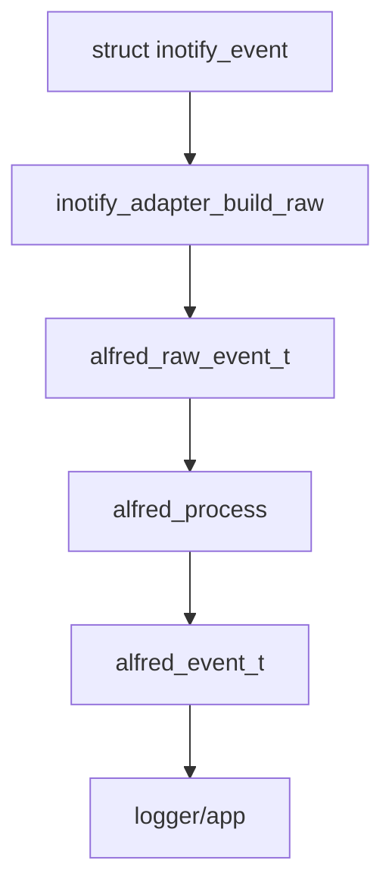

# Modulo inotify

Questo capitolo spiega il modulo `modules/inotify/`, cioe' la parte del
progetto che parla con Linux tramite `inotify`.

## Cos'e' inotify

`inotify` e' un'interfaccia del kernel Linux che permette a un programma di
ricevere notifiche quando file o directory cambiano.

Esempi di eventi Linux:

- `IN_CREATE`
- `IN_DELETE`
- `IN_MODIFY`
- `IN_ATTRIB`
- `IN_CLOSE_WRITE`
- `IN_MOVED_FROM`
- `IN_MOVED_TO`
- `IN_ISDIR`
- `IN_Q_OVERFLOW`

Questi eventi sono molto vicini al kernel. Per questo non sempre corrispondono
direttamente a un evento semantico finale.

## Responsabilita' del modulo

Nel disegno finale, `modules/inotify/` deve:

- aprire e gestire il file descriptor inotify
- aggiungere e rimuovere watch
- mantenere la tabella watch descriptor -> path
- leggere `struct inotify_event`
- convertire eventi inotify in `alfred_raw_event_t`

Non dovrebbe:

- decidere se un evento e' un rename o un move
- fare debounce
- produrre direttamente eventi semantici
- scrivere direttamente log semantici finali

Queste responsabilita' appartengono al `core` o al livello `app`.

## Stato attuale

Il modulo e' ancora in transizione, ma il vecchio dispatcher semantico legacy e
la sua `move_cache` sono stati rimossi. Il modulo inotify corrente deve fermarsi
ai fatti raw e alla diagnostica backend.

Il nuovo adapter:

```text
modules/inotify/include/inotify_adapter.h
modules/inotify/src/inotify_adapter.c
```

prepara il passaggio verso il design corretto.

Il primo confine backend esplicito e' ora:

```text
modules/inotify/include/inotify_backend.h
modules/inotify/src/inotify_backend.c
```

Questo backend iniziale:

- inizializza il file descriptor inotify
- aggiunge i watch iniziali, ricorsivi o non ricorsivi
- legge il buffer di `struct inotify_event`
- scrive il raw log diagnostico
- usa `inotify_adapter.c` per costruire `alfred_raw_event_t`
- consegna eventi reali e sintetici all'app tramite callback
- mantiene i watch ricorsivi quando viene creata una nuova directory

E' ancora un backend di transizione, ma ora possiede una struttura dedicata:

```c
typedef struct inotify_backend {
    int fd;
    watcher_table_t watchers;
} inotify_backend_t;
```

Questa struttura e' contenuta in `app_t` come campo `inotify`. Il backend usa
ancora `app_t` per accedere a configurazione e logger, ma `fd` e tabella dei
watch non sono piu' campi diretti dell'applicazione.

## Maschera di watch attuale

Il backend non riceve automaticamente tutti gli eventi che inotify potrebbe
produrre. Quando Alfred aggiunge un watch, passa al kernel una maschera, cioe'
l'elenco dei tipi di evento che vuole osservare.

La maschera predefinita oggi e' definita in:

```text
modules/inotify/src/watch_manager.c
```

e include:

```text
IN_CREATE
IN_DELETE
IN_MODIFY
IN_ATTRIB
IN_CLOSE_WRITE
IN_MOVED_FROM
IN_MOVED_TO
IN_DELETE_SELF
IN_MOVE_SELF
IN_UNMOUNT
IN_IGNORED
IN_Q_OVERFLOW
```

Questa maschera passa attraverso `config_t.inotify.watch_mask`:

```text
config_defaults()
    -> inotify_config_defaults(&cfg->inotify)
    -> cfg->inotify.watch_mask = watch_manager_default_mask()
app_build_inotify_backend_context()
    -> ctx.config = &app->config.inotify
watch_manager_add()
    -> inotify_add_watch(..., ctx->config->watch_mask | IN_ONLYDIR)
```

Quindi la configurazione applicativa contiene davvero la maschera usata dal
runtime, ma dentro una sottostruttura dedicata al backend inotify.
`IN_ONLYDIR` non e' configurazione di eventi: e' un flag di installazione del
watch. Alfred lo aggiunge sempre nel watch manager perche' il backend inotify
osserva directory root e subdirectory ricorsive, non file singoli.

La maschera e' configurabile da file con:

```text
inotify_watch_mask=default
inotify_watch_mask=default,-IN_ATTRIB
inotify_watch_mask=default,+IN_Q_OVERFLOW
inotify_watch_mask=IN_CREATE,IN_DELETE,IN_MODIFY,IN_CLOSE_WRITE
```

Il parser vive nella configurazione del modulo inotify, non nel core. Questo e'
importante perche' i nomi `IN_*` sono concetti Linux/inotify, mentre il core
deve rimanere backend-neutral. Se un token non e' riconosciuto, `config_load()`
ritorna `ERR_CONFIG` e Alfred non parte: un errore come `IN_ATRIB` non deve
essere ignorato silenziosamente.

Il parser non accetta tutti i flag esistenti di inotify. Accetta solo quelli che
Alfred sa gia' mostrare nel raw log e che sa gestire in uno dei due livelli
interni: conversione verso la raw mask del core oppure diagnostica/stato
backend. `IN_MOVE_SELF`, per esempio, non diventa un raw Alfred semantico, ma
marca il watch come `STALE` e produce il log diagnostico `WATCH_STALE`.
Questa scelta evita configurazioni apparentemente valide ma non osservabili in
modo chiaro da Alfred.

`IN_UNMOUNT` segue la stessa logica di diagnostica backend: Alfred lo richiede
nella maschera predefinita, lo accetta nel parser della configurazione e lo
nomina nel raw log. Quando il kernel lo emette, il backend marca il watch come
`STALE` con `reason=IN_UNMOUNT` e aspetta il successivo `IN_IGNORED` per
rimuovere la voce dalla watcher table. Non viene prodotto un raw Alfred e non
viene prodotto un evento core: uno smontaggio non e' una cancellazione
semantica del path, ma una perdita di accessibilita' del filesystem osservato.

`IN_MODIFY` e `IN_CLOSE_WRITE` rendono visibili al core gli eventi necessari per
produrre `FILE_MODIFIED` e `FILE_READY`. `IN_ATTRIB` rende visibili cambiamenti
di metadati. Secondo `inotify(7)`, questo include permessi, timestamp, attributi
estesi, numero di hard link, proprietario e gruppo.

Aumenta pero' anche il volume degli eventi raw: una semplice scrittura su file
puo' generare `IN_CREATE`, `IN_MODIFY` e `IN_CLOSE_WRITE`, mentre un `chmod` puo'
generare `IN_ATTRIB`. Un singolo nome raw, quindi, copre casi tecnicamente
diversi. Questa e' una delle ragioni per cui Alfred lo espone per ora solo come
fatto grezzo di backend.

Stato semantico importante: `IN_ATTRIB` viene tradotto in `ALFRED_RAW_ATTRIB`,
ma per ora il core non emette un evento semantico ufficiale come
`FILE_METADATA_CHANGED`. La scelta del nome e del significato semantico dei
cambiamenti attributo resta da discutere.

Per la mappa completa di tutti gli eventi e flag `IN_*`, inclusi quelli che
Alfred non gestisce ancora, vedi
[Matrice eventi inotify](20-matrice-eventi-inotify.md). Quel capitolo distingue
eventi richiedibili, bit restituiti dal kernel, flag di configurazione del
watch, raw event Alfred e semantica core.

La scelta corrente sui flag non gestiti e' conservativa: `IN_ACCESS`,
`IN_OPEN` e `IN_CLOSE_NOWRITE` restano fuori dal core filesystem perche'
descrivono audit/lettura, non mutazioni. Tra i flag di installazione del watch,
`IN_ONLYDIR` e' ora usato come hardening interno, mentre `IN_MASK_CREATE` resta
il candidato piu' utile da studiare per evitare sostituzioni accidentali di
watch. `IN_DONT_FOLLOW` e `IN_EXCL_UNLINK` sono invece piu' legati a profili
configurabili di hardening e riduzione rumore.

`IN_MASK_CREATE` non dovrebbe entrare direttamente nella sintassi di
`inotify_watch_mask`. Se Alfred lo usera', la scelta dovrebbe essere espressa
come policy del backend, non come bit raw scelto dall'utente. Il motivo e'
pratico: il flag non cambia gli eventi ricevuti, ma il comportamento di
`inotify_add_watch()` quando un watch esiste gia'. In modalita' futura
`strict`, un errore `EEXIST` indicherebbe una duplicazione reale da gestire o
diagnosticare; non sarebbe corretto fare fallback silenzioso. Un fallback ha
senso solo per compatibilita' con kernel che non supportano il flag, dopo aver
distinto quel caso da una maschera davvero invalida.

Lo stesso ragionamento vale per `IN_DONT_FOLLOW`. Il flag non aggiunge un
evento e non cambia la semantica core; decide se il backend deve seguire un
symlink quando installa un watch. Per questo una futura configurazione dovrebbe
essere una policy leggibile, per esempio `inotify_symlink_policy=follow` oppure
`inotify_symlink_policy=no-follow`, non un token dentro `inotify_watch_mask`.
La modalita' `no-follow` e' utile per hardening perche' evita di monitorare
un target diverso dal path visibile all'utente, ma va testata insieme allo
scanner ricorsivo: i symlink dentro l'albero osservato non devono diventare
nuove radici ricorsive senza una scelta esplicita.

`IN_EXCL_UNLINK` e' un'altra policy backend, ma orientata a rumore e
prestazioni. Puo' ridurre eventi in directory come `/tmp`, dove file temporanei
vengono spesso creati, rimossi dalla directory e usati ancora tramite file
descriptor aperto. Non deve diventare default globale finche' Alfred ha anche
obiettivi audit/security: un file gia' unlinkato ma ancora usato puo' essere un
segnale importante. Una futura opzione dovrebbe rendere esplicita la perdita di
visibilita', per esempio `inotify_unlinked_child_policy=observe|suppress`.

`IN_MASK_ADD` e `IN_ONESHOT` non sono candidati per il runtime corrente.
`IN_MASK_ADD` avrebbe senso solo con aggiornamenti dinamici parziali della mask:
oggi Alfred preferisce calcolare e possedere sempre la maschera completa di un
watch. `IN_ONESHOT` e' ancora meno adatto: Alfred deve osservare in modo
continuo, mentre quel flag rimuove il watch dopo il primo evento e renderebbe
piu' fragile la copertura ricorsiva.

## Watch descriptor

Quando si aggiunge un watch con inotify, il kernel restituisce un intero:

```text
watch descriptor
```

Nel codice spesso si chiama `wd`.

Il problema e' che un evento inotify contiene il `wd`, non direttamente il path
completo della directory osservata. Per ricostruire il path bisogna mantenere
una tabella:

```text
wd -> path osservato
```

Questa e' la responsabilita' di `watcher_table_t`.

`watcher_table_t` vive dentro `inotify_backend_t`. Questo chiarisce il confine:
la tabella dei watch appartiene al backend, non al core e non alla semantica
degli eventi.

## Mask

La mask e' un campo bitmask. Significa che piu' informazioni possono essere
presenti nello stesso intero.

Esempio:

```text
IN_CREATE | IN_ISDIR
```

Vuol dire:

```text
e' stata creata una directory
```

Nel core esiste una mask indipendente da inotify:

```c
ALFRED_RAW_CREATE
ALFRED_RAW_ISDIR
```

L'adapter traduce da `IN_*` a `ALFRED_RAW_*`.

## Cookie

Per move e rename, inotify usa un `cookie`.

Esempio:

```text
IN_MOVED_FROM cookie=10 path=/tmp/a.txt
IN_MOVED_TO   cookie=10 path=/tmp/b.txt
```

Il cookie permette di capire che i due eventi appartengono alla stessa
operazione.

Il modulo inotify deve preservare il cookie nel raw event. Il core usera' quel
cookie per fare correlazione.

## Nuovo adapter

L'adapter espone tre funzioni principali.

### inotify_adapter_mask_to_alfred()

Converte la mask Linux:

```c
IN_CREATE | IN_ISDIR
```

in mask core:

```c
ALFRED_RAW_CREATE | ALFRED_RAW_ISDIR
```

### inotify_adapter_build_path()

Costruisce il path completo dell'evento.

Esempio:

```text
parent = /tmp/prova
name   = file.txt
```

Risultato:

```text
/tmp/prova/file.txt
```

Se `name` e' vuoto, viene usato solo il path parent. Questo serve per eventi che
riguardano direttamente la directory osservata.

### inotify_adapter_build_raw()

Converte:

```c
struct inotify_event
```

in:

```c
alfred_raw_event_t
```

Campi importanti:

- `source = ALFRED_SRC_INOTIFY`
- `mask = ALFRED_RAW_*`
- `cookie = ev->cookie`
- `path = full_path`
- `pid = 0`

`pid` e' zero perche' inotify normalmente non fornisce il PID del processo che
ha causato l'evento.

## Flusso desiderato



## Scan ricorsivo e discovery

Quando Alfred monitora in modalita' ricorsiva, una nuova directory deve ricevere
un watch. Il caso semplice e':

```text
IN_CREATE IN_ISDIR name=dir
    -> watch_manager_add_recursive(dir)
    -> WATCH_ADDED dir
```

Il caso difficile e':

```text
mkdir -p one/two/three
```

`inotify` puo' notificare solo `one`, perche' `two` e `three` vengono create
prima che Alfred riesca ad aggiungere il watch su `one`.

Per mitigare il problema, il watch manager attraversa ricorsivamente la nuova
directory e aggiunge watch alle sottodirectory gia' presenti. In passato questa
discovery runtime era una variante callback del watch manager; ora il codice
usa lo scanner filesystem generico anche per questo caso.

Per lo startup, `watch_manager_add_recursive()` usa lo scanner filesystem
generico:

```text
watch_manager_add_recursive()
    -> fs_scan_tree()
    -> watch_manager_add() per ogni FS_SCAN_DIR
```

Questo percorso non genera raw sintetici perche' le directory esistono gia'
prima dell'avvio del polling.

Il percorso runtime `IN_CREATE | IN_ISDIR` ora usa lo scanner direttamente nel
backend:

```text
backend_handle_dir_create()
    -> watch_manager_add() sulla root creata
    -> fs_scan_tree(..., emit_root = 0)
    -> watch_manager_add() sulle directory annidate
    -> backend_emit_synthetic_dir_create() sulle directory annidate
```

La vecchia API callback del watch manager e' stata rimossa. La logica dei raw
create sintetici vive nel backend, non nel watch manager.

Il backend inotify gestisce questa discovery in:

```text
modules/inotify/src/inotify_backend.c
```

Il backend genera un raw event sintetico verso lo stesso percorso usato dagli
eventi reali, cosi' il core puo' emettere il `DIR_CREATED` che inotify non ha
potuto consegnare.

Il watch manager non decide direttamente la semantica. Nel percorso runtime si
limita ad aggiungere il watch richiesto dal backend:

```text
aggiungi un watch su questa directory
```

La trasformazione in `DIR_CREATED` resta responsabilita' del core.

## Funzioni principali del backend

La prima passata pesante sui commenti ha documentato il contratto delle funzioni
principali del backend inotify.

`inotify_backend_init()` inizializza la tabella dei watch e apre il file
descriptor inotify non bloccante. Non inizializza piu' un dispatcher legacy:
il backend corrente produce raw event Alfred e li consegna all'app, mentre la
semantica finale e' responsabilita' del core.

`inotify_backend_poll()` e' il punto centrale del flusso runtime. L'ordine e':

1. leggere dal file descriptor inotify
2. scrivere il raw log diagnostico
3. convertire `struct inotify_event` in `alfred_raw_event_t`
4. consegnare il raw event alla callback dell'app, che lo inoltra al core
5. aggiornare i watch ricorsivi e generare raw event sintetici se lo scan scopre
   directory create prima dell'aggiunta del watch
6. processare un batch minimo di recovery lost-scope mature

Questa sequenza fissa un confine importante: il backend puo' scoprire fatti e
mantenere lo stato dei watch, ma non deve decidere la semantica finale degli
eventi.

Il punto 6 e' intenzionalmente piccolo. La recovery lost-scope puo' attraversare
una parte dell'albero monitorato per cercare una directory spostata o rinominata
di cui Alfred conosce ancora l'identita' `(st_dev, st_ino)`. Per non bloccare il
consumo degli eventi freschi, il poll processa per ora una sola entry matura per
giro. La chiamata avviene:

- quando `read(2)` sul file descriptor non bloccante restituisce `EAGAIN` o
  `EWOULDBLOCK`, cioe' quando non ci sono eventi kernel pronti
- dopo aver consumato un buffer di eventi inotify gia' letto

Questa scelta mantiene il modello single-threaded e rende il comportamento
facile da testare. Worker thread, debounce avanzato, configurazione pubblica del
batch e tuning del backoff sono rimandati a una fase successiva, quando avremo
misure reali sul costo degli scan.

## Perche' l'adapter non fa semantica

L'adapter deve essere un traduttore, non un interprete.

Fa questo:

```text
IN_MOVED_FROM -> ALFRED_RAW_MOVED_FROM
```

Non fa questo:

```text
IN_MOVED_FROM + IN_MOVED_TO -> FILE_RENAMED
```

La seconda operazione richiede memoria, correlazione e regole semantiche. Deve
stare nel core.

## Prossimo passo tecnico

Il core e' ormai il runtime di default. Il prossimo passo tecnico non e' piu'
"collegare" il core, ma rendere piu' pulito il confine:

1. mantenere aggiornata la lettura guidata di backend, core e app
2. mantenere nel backend solo lettura inotify, watch e raw event
3. lasciare al core tutta la semantica finale
4. archiviare o aggiornare i test storici che dipendevano dallo shadow
5. progettare overflow/resync come passo separato
