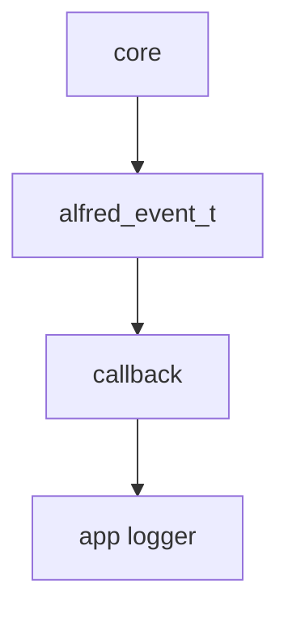
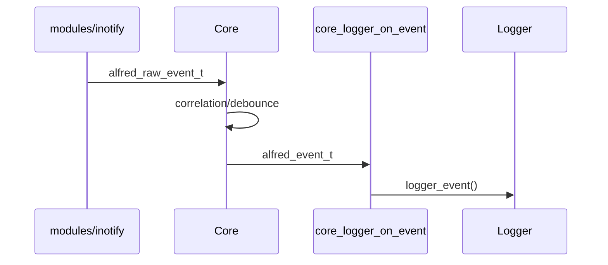

# Core engine

Questo capitolo spiega il ruolo del `core/`, cioe' il motore che trasforma
eventi raw in eventi semantici.

## Responsabilita' del core

Il core deve:

- ricevere `alfred_raw_event_t`
- correlare eventi collegati
- applicare debounce quando necessario
- produrre `alfred_event_t`
- chiamare una callback fornita dall'applicazione

Il core non dovrebbe:

- conoscere `struct inotify_event`
- aprire file descriptor
- aggiungere watch
- scrivere direttamente log applicativi

## Evento raw

Un evento raw rappresenta un fatto tecnico vicino al backend.

Tipo:

```c
alfred_raw_event_t
```

Campi importanti:

- `ts_ns`: timestamp monotonic in nanosecondi
- `source`: backend sorgente, per esempio `ALFRED_SRC_INOTIFY`
- `mask`: bitmask `ALFRED_RAW_*`
- `cookie`: id usato per correlare move/rename
- `pid`: processo sorgente, se noto
- `path`: path completo dell'evento

Esempio:

```text
source = ALFRED_SRC_INOTIFY
mask   = ALFRED_RAW_MOVED_FROM
cookie = 42
path   = /tmp/a.txt
```

## Evento semantico

Un evento semantico rappresenta un fatto gia' interpretato.

Tipo:

```c
alfred_event_t
```

Campi importanti:

- `seq`: numero progressivo dell'evento
- `type`: tipo semantico, per esempio `ALFRED_EV_FILE_RENAMED`
- `src_path`: path sorgente
- `dst_path`: path destinazione, quando esiste
- `pid`: processo sorgente, se noto

Esempio:

```text
type     = ALFRED_EV_FILE_RENAMED
src_path = /tmp/a.txt
dst_path = /tmp/b.txt
```

## Callback del core

Il core non scrive direttamente su file. Invece chiama una funzione fornita
dall'applicazione.

Tipo:

```c
typedef void (*alfred_emit_fn)(
    const alfred_event_t *ev,
    void *userdata
);
```

Questo significa:

- il core produce un evento
- chiama una funzione callback
- passa l'evento e un puntatore generico `userdata`

`userdata` serve a dare contesto alla callback. Nel nostro caso useremo un
puntatore a `logger_t`.

## core_logger

Per collegare core e logger abbiamo aggiunto:

```text
app/include/core_logger.h
app/src/core_logger.c
```

Questi file stanno in `app/` perche' non appartengono al core puro. Sono un
adattatore applicativo:

```text
alfred_event_t -> logger_event()
```

La funzione principale e':

```c
void core_logger_on_event(const alfred_event_t *ev, void *userdata);
```

Quando il core emette un evento, questa callback lo formatta e lo scrive nel log
degli eventi.

## Perche' il logger non sta nel core

Il core deve restare riusabile. Se il core chiamasse direttamente `logger_event`,
dipenderebbe dal livello applicazione.

Invece con una callback:



Il core conosce solo la callback, non il logger concreto.

## Flusso desiderato



## Stato attuale

Al momento:

- il core compila
- l'adapter inotify compila
- la callback `core_logger_on_event()` compila
- il runtime usa ancora la vecchia strada in `events.c`

Non abbiamo ancora inizializzato `alfred_engine_t` dentro `app_t`.

Il prossimo passo sara' decidere come aggiungere il core allo stato
applicativo senza rompere il comportamento esistente.
