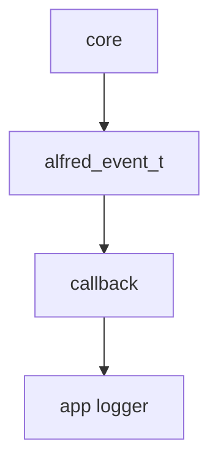
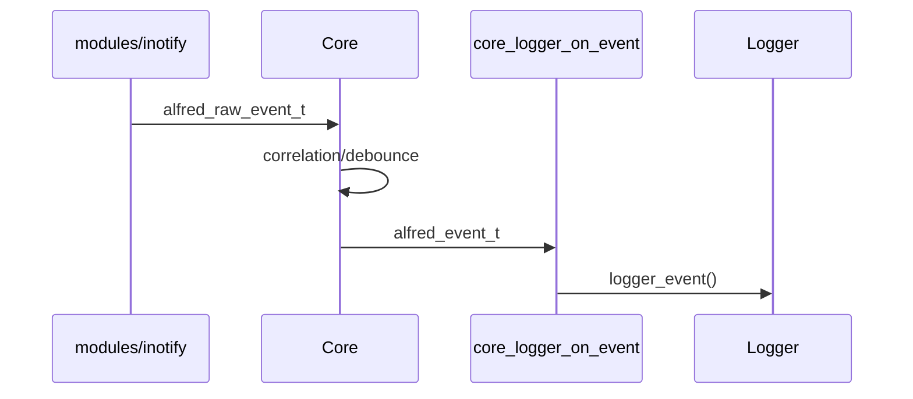

# Core engine

Questo capitolo spiega il ruolo del `core/`, cioe' il motore che trasforma
eventi raw in eventi semantici.

## Responsabilita' del core

Il core deve:

- ricevere `alfred_raw_event_t`
- correlare eventi collegati
- applicare debounce quando necessario
- produrre `alfred_event_t`
- chiamare una callback fornita dall'applicazione

Il core non dovrebbe:

- conoscere `struct inotify_event`
- aprire file descriptor
- aggiungere watch
- scrivere direttamente log applicativi

## Evento raw

Un evento raw rappresenta un fatto tecnico vicino al backend.

Tipo:

```c
alfred_raw_event_t
```

Campi importanti:

- `ts_ns`: timestamp monotonic in nanosecondi
- `source`: backend sorgente, per esempio `ALFRED_SRC_INOTIFY`
- `mask`: bitmask `ALFRED_RAW_*`
- `cookie`: id usato per correlare move/rename
- `pid`: processo sorgente, se noto
- `path`: path completo dell'evento

Esempio:

```text
source = ALFRED_SRC_INOTIFY
mask   = ALFRED_RAW_MOVED_FROM
cookie = 42
path   = /tmp/a.txt
```

## Evento semantico

Un evento semantico rappresenta un fatto gia' interpretato.

Tipo:

```c
alfred_event_t
```

Campi importanti:

- `seq`: numero progressivo dell'evento
- `type`: tipo semantico, per esempio `ALFRED_EV_FILE_RENAMED`
- `src_path`: path sorgente
- `dst_path`: path destinazione, quando esiste
- `pid`: processo sorgente, se noto

Esempio:

```text
type     = ALFRED_EV_FILE_RENAMED
src_path = /tmp/a.txt
dst_path = /tmp/b.txt
```

## Callback del core

Il core non scrive direttamente su file. Invece chiama una funzione fornita
dall'applicazione.

Questa funzione si chiama callback.

Una callback e' una funzione che viene passata a un componente per essere
chiamata piu' tardi. Nel nostro caso l'applicazione passa una funzione al core.
Il core la conserva e la chiama ogni volta che produce un evento semantico.

Tipo:

```c
typedef void (*alfred_emit_fn)(
    const alfred_event_t *ev,
    void *userdata
);
```

Questo significa:

- il core produce un evento
- chiama una funzione con quella firma
- passa l'evento come `const alfred_event_t *ev`
- passa un contesto generico come `void *userdata`

La parte piu' difficile e':

```c
typedef void (*alfred_emit_fn)(...);
```

Questa e' una `typedef` per un puntatore a funzione.

Vuol dire:

```text
alfred_emit_fn e' il nome di un tipo.
Quel tipo rappresenta un puntatore a funzione.
La funzione puntata riceve ev e userdata.
La funzione puntata restituisce void.
```

Quindi il core non riceve direttamente un logger. Riceve una funzione da
chiamare.

`userdata` serve a dare contesto alla callback. Nel nostro caso useremo un
puntatore a `logger_t`.

Il tipo di `userdata` e':

```c
void *userdata
```

`void *` e' un puntatore generico. Il core non sa cosa contiene. Sa solo che
deve ripassarlo alla callback.

Questo e' importante per mantenere separati i livelli:

```text
core conosce alfred_event_t
core non conosce logger_t
```

L'applicazione invece sa che, in questo caso, `userdata` contiene un
`logger_t *`.

Uso previsto:

```c
alfred_create(&cfg, core_logger_on_event, &app->logger);
```

Significato:

```text
quando il core emette un evento,
chiama core_logger_on_event(ev, &app->logger)
```

## core_logger

Per collegare core e logger abbiamo aggiunto:

```text
app/include/core_logger.h
app/src/core_logger.c
```

Questi file stanno in `app/` perche' non appartengono al core puro. Sono un
adattatore applicativo:

```text
alfred_event_t -> logger_event()
```

La funzione principale e':

```c
void core_logger_on_event(const alfred_event_t *ev, void *userdata);
```

Quando il core emette un evento, questa callback lo formatta e lo scrive nel log
degli eventi.

Dentro la callback succede questo:

```c
logger_t *logger = userdata;
```

Questa riga converte il puntatore generico `void *` nel tipo concreto
`logger_t *`.

Da quel momento la callback puo' usare:

```c
logger_event(logger, ...);
```

La conversione e' corretta solo se chi ha creato il core ha davvero passato un
`logger_t *` come `userdata`.

## Perche' il logger non sta nel core

Il core deve restare riusabile. Se il core chiamasse direttamente `logger_event`,
dipenderebbe dal livello applicazione.

Invece con una callback:



Il core conosce solo la callback, non il logger concreto.

Questo permette di cambiare destinazione in futuro.

Oggi:

```text
alfred_event_t -> core_logger_on_event -> events.log
```

Domani:

```text
alfred_event_t -> socket_callback -> rete
alfred_event_t -> sqlite_callback -> database
alfred_event_t -> ui_callback     -> interfaccia grafica
alfred_event_t -> test_callback   -> array in memoria
```

Il core non cambia. Cambia solo la callback passata a `alfred_create()`.

Questo e' uno dei motivi principali per usare callback e `void *userdata`.

## Flusso desiderato



## Stato attuale

Al momento:

- il core compila
- l'adapter inotify compila
- la callback `core_logger_on_event()` compila
- il core e' inizializzato dentro `app_t`
- il runtime invia eventi al core in shadow mode
- il vecchio dispatcher in `events.c` resta ancora attivo

Shadow mode significa che il core riceve gli eventi, produce output e lo scrive
nel log, ma non e' ancora l'unica fonte ufficiale di eventi semantici.

Il prossimo passo sara' confrontare il vecchio output con quello del core e poi
decidere quando rimuovere gradualmente la vecchia logica semantica da
`modules/inotify/src/events.c`.
