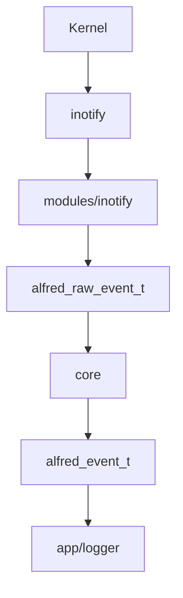
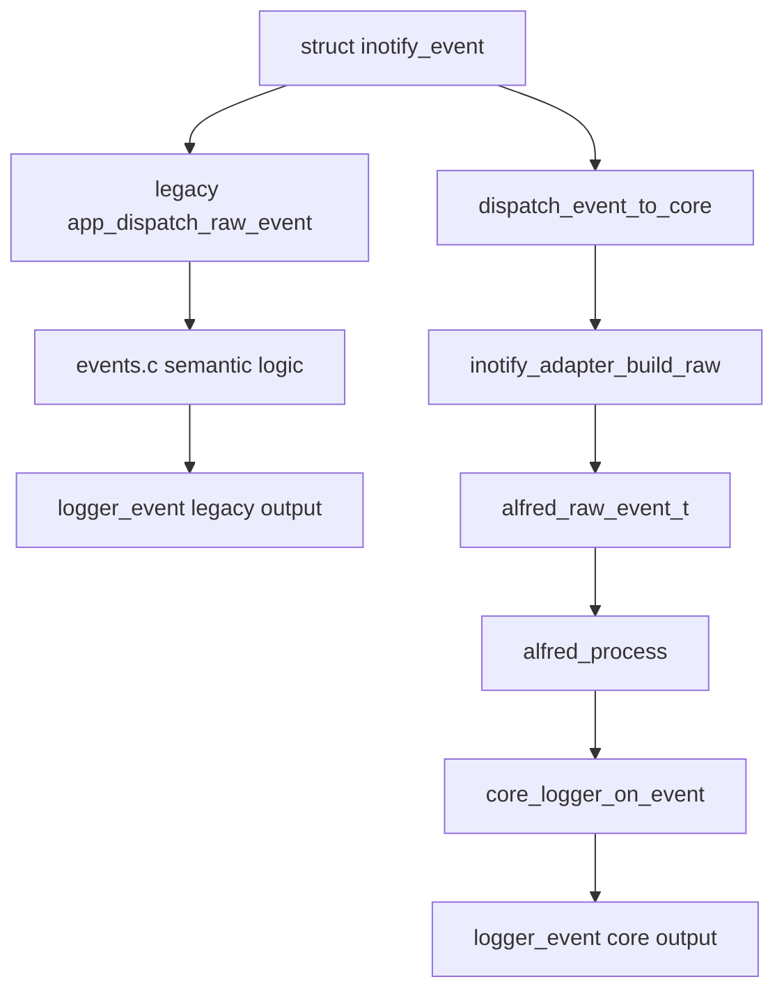

# Flusso eventi

Questo capitolo spiega il percorso completo di un evento nel progetto.

## Flusso finale desiderato

Nel disegno finale vogliamo questo:



Il modulo inotify produce eventi raw. Il core produce eventi semantici. Il
livello app decide cosa farne.

## Flusso attuale in shadow mode

Durante l'integrazione stiamo usando shadow mode.

Significa che lo stesso evento inotify percorre due strade:



Il vecchio percorso resta attivo per non rompere subito il comportamento
esistente.

Il nuovo percorso core produce output aggiuntivo con prefisso `core`.

## Perche' usare shadow mode

Shadow mode serve a confrontare due implementazioni:

```text
vecchio dispatcher inotify
nuovo core semantico
```

Vantaggi:

- riduce il rischio di regressioni
- permette di confrontare gli eventi prodotti
- evita di rompere subito i test
- rende visibili differenze tra vecchia e nuova logica
- consente di spegnere il vecchio dispatcher solo quando il core e' affidabile

## Esempio di output

Un evento di creazione potrebbe produrre temporaneamente due righe:

```text
[EVENT] FILE_CREATED path=/tmp/a.txt
[EVENT] core seq=1 type=FILE_CREATED path=/tmp/a.txt pid=0
```

La prima riga viene dal vecchio dispatcher.

La seconda riga viene dal core.

## Limiti attuali

Non tutti gli eventi sono ancora perfetti nel percorso core.

Esempi:

- `IN_Q_OVERFLOW` puo' non avere un path associato
- `IN_IGNORED` non ha ancora un raw flag dedicato nel core
- il vecchio `move_cache` esiste ancora nel modulo inotify

Per questo il vecchio dispatcher resta attivo.

## Prossimo obiettivo

Il prossimo obiettivo non e' rimuovere subito il vecchio codice. Prima bisogna:

1. confrontare output legacy e output core
2. capire quali eventi il core gestisce diversamente
3. aggiungere eventuali raw flag mancanti
4. spostare gradualmente la semantica da `events.c` al core
5. eliminare `move_cache` dal modulo inotify quando non serve piu'
