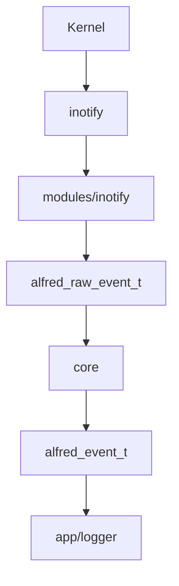

# Flusso eventi

Questo capitolo spieghera' il percorso completo di un evento.

Stato: da fare.

Flusso desiderato:

```mermaid
flowchart TD
    A[Kernel] --> B[inotify]
    B --> C[modules/inotify]
    C --> D[alfred_raw_event_t]
    D --> E[core]
    E --> F[alfred_event_t]
    F --> G[app/logger]
```
