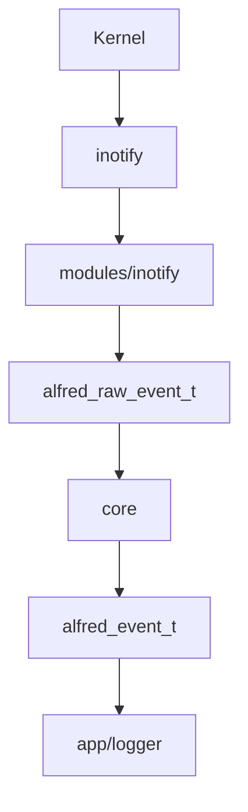
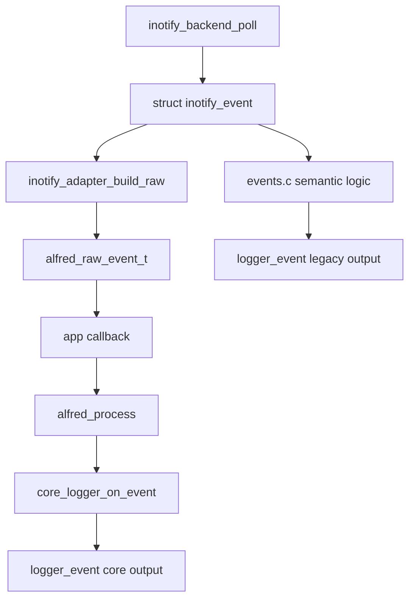
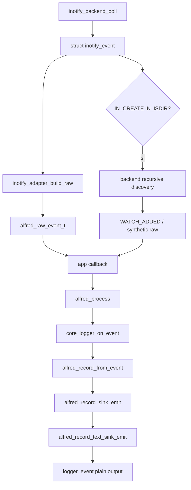

# Flusso eventi

Questo capitolo spiega il percorso completo di un evento nel progetto.

## Flusso runtime corrente

Il runtime corrente usa questo percorso:



Il modulo inotify produce eventi raw. Il core produce eventi semantici. Il
livello app decide cosa farne.

## Normalizzazione e semantica

Nel progetto Alfred bisogna distinguere tre livelli:

```text
backend_observed = cosa ha detto il kernel o il backend
normalized_raw   = cosa Alfred conserva in forma raw comune
semantic         = cosa Alfred espone come significato stabile
```

La normalizzazione e' responsabilita' del backend o dell'adapter vicino al
backend. Per inotify significa prendere un evento nativo come
`struct inotify_event` e costruire un fatto raw Alfred:

```text
struct inotify_event
-> inotify_adapter_build_raw()
-> alfred_raw_event_t
```

Esempio:

```text
IN_CREATE | IN_ISDIR, name="subdir", wd=7
```

diventa:

```text
ALFRED_RAW_CREATE + ALFRED_RAW_ISDIR
path=/root/subdir
```

La normalizzazione quindi:

- traduce maschere native come `IN_CREATE` in tipi raw Alfred;
- costruisce path completi partendo da `wd + name`;
- conserva dettagli sorgente utili come `mask`, `cookie`, `wd` e flag
  directory;
- evita che il core dipenda direttamente da `struct inotify_event`;
- non decide ancora la semantica finale.

La semantica e' responsabilita' del core. Il core riceve raw facts Alfred e
decide quali eventi stabili produrre. Per esempio:

```text
ALFRED_RAW_CREATE + ALFRED_RAW_ISDIR
-> DIR_CREATED
```

oppure:

```text
ALFRED_RAW_MOVED_FROM cookie=10 path=/root/a
ALFRED_RAW_MOVED_TO   cookie=10 path=/root/b
-> FILE_RENAMED oppure DIR_RENAMED / DIR_RELOCATED
```

La deduplica segue la stessa regola: la deduplica tecnica necessaria al backend
per non rompere l'osservazione puo' restare nel backend, per esempio evitare un
doppio watch identico. La deduplica semantica, cioe' decidere quanti eventi
finali mostrare all'utente per una sequenza rumorosa di raw facts, appartiene
al core.

## Percorso raw -> record -> sink

Durante la migrazione a Event Model v0, una parte dei raw log passa gia' da
record e sink compatibile:

```text
alfred_raw_event_t
-> alfred_record_from_raw()
-> alfred_record_sink_emit()
-> alfred_record_text_sink_emit()
-> raw.log compatibile
```

Significato dei passaggi:

| Passaggio | Responsabilita' |
| --- | --- |
| `alfred_raw_event_t` | fatto raw normalizzato ancora usato dal core |
| `alfred_record_from_raw()` | adapter che produce `alfred_record_t` con layer `normalized_raw` |
| `alfred_record_sink_emit()` | wrapper difensivo verso un sink generico `emit(record)` |
| `alfred_record_text_sink_emit()` | text sink che formatta il record e chiama una callback di scrittura |
| `raw.log` | output testuale compatibile usato da test e debug |

Questo percorso e' sincrono nel runtime corrente. La chiamata parte da
`handle_backend_event()`, attraversa il ponte record/sink/testo e arriva a
`logger_raw()` prima che il flusso prosegua. E' una scelta transitoria: serve a
migrare il comportamento senza cambiare il contratto visibile dei log.

Il percorso finale ad alte prestazioni dovra' invece essere:

```text
evento OS
-> backend/collector
-> normalizzazione minima
-> alfred_record_t
-> copia owned o lifetime garantito
-> enqueue su coda/ring buffer
```

Da quel punto in poi il lavoro deve uscire dal percorso caldo:

```text
dispatcher thread
-> writer text
-> writer JSONL
-> writer MessagePack/protobuf
-> writer socket
-> Alfred Lab / report / policy futura
```

La regola da ricordare e':

```text
Il backend non aspetta il writer.
```

## Flusso storico shadow mode

Durante l'integrazione lo shadow mode e' stato usato come modalita'
diagnostica esplicita. Oggi non e' piu' disponibile nel runtime corrente: resta
solo come storia della migrazione.

Significa che lo stesso evento inotify percorre due strade:



Il vecchio percorso non e' piu' attivo. Il diagramma serve a capire la fase di
migrazione in cui legacy e core venivano confrontati senza far dipendere il
runtime normale dal dispatcher storico.

In quella fase il percorso core produceva output aggiuntivo con prefisso
`core`.

## Flusso di default in core mode

Il default attuale usa il core come stream ufficiale. La stessa modalita' puo'
essere forzata esplicitamente con:

```bash
ALFRED_EVENT_ENGINE=core ./alfred /path/da/osservare
```

In questa modalita' lo stesso evento percorre solo il percorso semantico del
core:



Il vecchio dispatcher `legacy_events_dispatch()` non viene chiamato. Questo e'
il punto chiave: il runtime corrente non contiene piu' `events.c` e non ha un
secondo stream legacy.

L'aggiornamento dei watch resta invece attivo nel backend inotify. Non e'
semantica legacy: e' manutenzione dello stato del backend. Senza questo
passaggio, in core mode Alfred vedrebbe la creazione della directory nuova ma
perderebbe gli eventi successivi dentro quella directory.

Esempio di output in core mode:

```text
[EVENT] FILE_CREATED path=/tmp/a.txt
[EVENT] FILE_MODIFIED path=/tmp/a.txt
[EVENT] FILE_READY path=/tmp/a.txt
```

Non c'e' prefisso `core` perche' il core non e' piu' un secondo stream di
confronto: e' la sorgente ufficiale.

## Perche' abbiamo usato shadow mode

Shadow mode e' servito a confrontare due implementazioni:

```text
vecchio dispatcher inotify
nuovo core semantico
```

Vantaggi:

- riduce il rischio di regressioni
- permette di confrontare gli eventi prodotti
- ha permesso ai test funzionali storici di restare osservabili in legacy mode
- rende visibili differenze tra vecchia e nuova logica
- ha mantenuto disponibile il vecchio dispatcher finche' serviva come
  riferimento

## Esempio di output

Nella vecchia fase shadow, un evento di creazione poteva produrre due righe:

```text
[EVENT] FILE_CREATED path=/tmp/a.txt
[EVENT] core seq=1 type=FILE_CREATED path=/tmp/a.txt pid=0
```

La prima riga viene dal vecchio dispatcher.

La seconda riga viene dal core.

## Limiti attuali

Non tutte le politiche di recovery sono ancora definitive nel percorso core.

Esempi:

- `IN_Q_OVERFLOW` puo' non avere un path associato
- `IN_IGNORED` resta diagnostica/backend state, non semantica core
- il vecchio `move_cache` non esiste piu' nel runtime corrente

Per questo il vecchio dispatcher e' stato rimosso dal runtime corrente e non e'
piu' un percorso di confronto eseguibile.

## Obiettivo corrente

Lo switch al core e' chiuso. L'obiettivo corrente e' rendere il flusso piu'
adatto a una piattaforma multi-backend:

1. mantenere la suite core come contratto semantico ufficiale
2. mantenere la suite backend diagnostics per i log tecnici dei watch
3. usare Event Model v0 come riferimento per raw, normalized e semantic event
4. usare Backend API v0 per capabilities e refactor backend
5. aggiungere output strutturato JSONL e tracepoint logici
