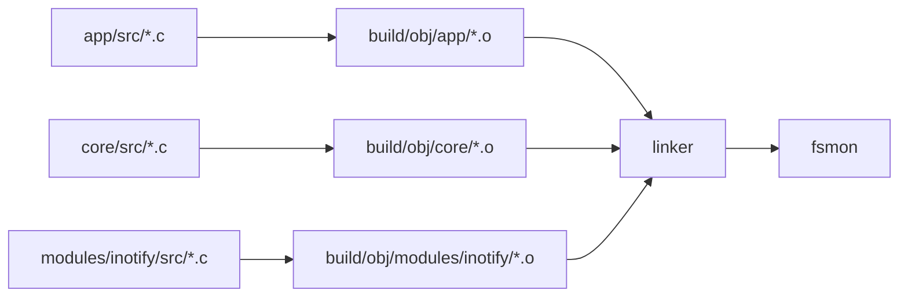

# Makefile e build system

Il Makefile e' il file che dice al computer come compilare il progetto.
In un progetto C non basta avere file `.c` e `.h`: bisogna trasformare i file
sorgente in file oggetto `.o` e poi collegarli in un eseguibile finale.

## Comando base

Per compilare:

```bash
make
```

Il risultato atteso e':

```text
fsmon
```

cioe' il binario eseguibile del progetto.

## Concetti fondamentali

### Sorgenti `.c`

I file `.c` contengono implementazioni:

```text
app/src/app.c
core/src/alfred_correlator.c
modules/inotify/src/watcher.c
```

### Header `.h`

I file `.h` contengono dichiarazioni, tipi e interfacce:

```text
app/include/app.h
core/include/alfred_correlator.h
modules/inotify/include/watcher.h
```

### Object file `.o`

Ogni file `.c` viene compilato in un file oggetto `.o`.

Esempio:

```text
app/src/app.c
    |
    v
build/obj/app/src/app.o
```

### Linking

Il linker prende tutti i `.o` e li unisce nel binario finale:

```text
app.o + core.o + inotify.o
        |
        v
      fsmon
```

## Diagramma della build



## Variabili principali

Nel Makefile una variabile si definisce cosi':

```make
TARGET := fsmon
```

e si usa cosi':

```make
$(TARGET)
```

### TARGET

```make
TARGET := fsmon
```

Nome del binario finale.

### MODULES

```make
MODULES ?= inotify
```

Lista dei moduli da compilare.

`?=` significa: usa questo valore solo se l'utente non ne ha passato uno da
riga di comando.

Esempio:

```bash
make MODULES=inotify
```

In futuro potremo avere:

```bash
make MODULES=fanotify
make MODULES="inotify replay"
```

### Directory

```make
APP_DIR     := app
CORE_DIR    := core
MODULE_DIR  := modules
BUILD_DIR   := build
OBJ_DIR     := $(BUILD_DIR)/obj
```

Queste variabili evitano di ripetere stringhe in tutto il Makefile.

## Compilatore

```make
CC := gcc
```

`gcc` e' il compilatore C usato dal progetto.

## Flag di compilazione

I flag modificano il comportamento del compilatore.

### Standard C

```make
C_STANDARD := -std=gnu99
```

Il progetto usa C99 con estensioni GNU.

### Warning

```make
WARNINGS := \
    -Wall \
    -Wextra \
    -Wpedantic \
    ...
```

I warning aiutano a trovare codice sospetto. Non sono sempre errori, ma spesso
indicano problemi reali.

Esempi:

- conversioni pericolose
- variabili inutilizzate
- formati `printf()` sbagliati
- codice non portabile

### Debug flags

```make
DEBUG_FLAGS := \
    -g3 \
    -O0 \
    -DDEBUG
```

Significato:

- `-g3`: include informazioni di debug per GDB
- `-O0`: disabilita ottimizzazioni, codice piu' facile da debuggare
- `-DDEBUG`: definisce la macro `DEBUG`

### Release flags

```make
RELEASE_FLAGS := \
    -O2 \
    -DNDEBUG
```

Significato:

- `-O2`: abilita ottimizzazioni
- `-DNDEBUG`: disabilita codice condizionato da debug, se presente

## Sanitizer

```make
SANITIZERS := \
    -fsanitize=address \
    -fsanitize=undefined
```

I sanitizer sono controlli runtime aggiunti dal compilatore.

### AddressSanitizer

`-fsanitize=address` aiuta a trovare errori di memoria:

- accesso fuori dai limiti di un array
- uso di memoria dopo `free()`
- doppia `free()`
- stack buffer overflow

### UndefinedBehaviorSanitizer

`-fsanitize=undefined` aiuta a trovare comportamenti indefiniti del C:

- overflow aritmetico signed
- shift illegali
- accessi non validi
- uso scorretto di certi tipi

## Include path

```make
INCLUDES := \
    -I$(APP_INC_DIR) \
    -I$(CORE_INC_DIR) \
    -I$(CORE_PRIVATE_INC_DIR)
```

`-I` dice al compilatore dove cercare gli header inclusi con:

```c
#include "app.h"
```

Quando abilitiamo il modulo `inotify`, il Makefile aggiunge anche:

```make
-Imodules/inotify/include
```

## CFLAGS e LDFLAGS

```make
CFLAGS = ...
LDFLAGS := ...
```

`CFLAGS` vengono usati durante la compilazione dei `.c` in `.o`.

`LDFLAGS` vengono usati durante il linking finale.

I sanitizer devono comparire sia in compilazione sia in linking.

## Liste dei sorgenti

Il Makefile separa i sorgenti per livello:

```make
APP_SRCS := ...
CORE_SRCS := ...
MODULE_SRCS := ...
```

Poi li unisce:

```make
SRCS := $(APP_SRCS) $(CORE_SRCS) $(MODULE_SRCS)
```

Questo rende visibile da dove arriva ogni parte del programma.

## Regola per gli object file

```make
OBJS := $(SRCS:%.c=$(OBJ_DIR)/%.o)
```

Questa trasformazione dice:

```text
per ogni file .c in SRCS,
crea il nome corrispondente .o dentro build/obj
```

Esempio:

```text
app/src/main.c
    -> build/obj/app/src/main.o
```

## Target principali

### all

```make
all: banner directories $(TARGET)
```

Target predefinito. Quando scrivi `make`, Make esegue `all`.

Dipende da:

- `banner`
- `directories`
- `fsmon`

### directories

Crea le directory di build necessarie:

```make
mkdir -p build
mkdir -p build/obj/...
```

### $(TARGET)

Collega tutti gli object file:

```make
$(CC) $(OBJS) -o $(TARGET) $(LDFLAGS)
```

### Regola generica di compilazione

```make
$(OBJ_DIR)/%.o: %.c
    $(CC) $(CFLAGS) -c $< -o $@
```

Significato delle variabili automatiche:

- `$<`: il primo prerequisito, cioe' il file `.c`
- `$@`: il target da produrre, cioe' il file `.o`

Esempio pratico:

```text
$< = app/src/main.c
$@ = build/obj/app/src/main.o
```

## Pulizia

### clean

```bash
make clean
```

Rimuove la directory `build/`.

### fclean

```bash
make fclean
```

Esegue `clean` e rimuove anche il binario `fsmon`.

### re

```bash
make re
```

Ricompila tutto da zero:

```text
fclean -> all
```

## Build release

```bash
make release
```

Compila con flag ottimizzati e senza sanitizer.

Serve quando vuoi un binario piu' vicino all'uso finale, non quando stai
sviluppando o cercando bug.

## Target di utilita'

### run

```bash
make run
```

Compila e poi esegue:

```bash
./fsmon
```

Nota: il programma richiede percorsi da monitorare, quindi `make run` potrebbe
non essere sufficiente per un'esecuzione reale.

### test

```bash
make test
```

Esegue gli script in:

```text
tests/functional/
```

### valgrind

```bash
make valgrind
```

Esegue il programma sotto Valgrind per cercare problemi di memoria.

### gdb

```bash
make gdb
```

Avvia il debugger GDB sul binario.

### format

```bash
make format
```

Formatta il codice con `clang-format`.

### scan

```bash
make scan
```

Esegue `cppcheck`, uno strumento di analisi statica.

### tidy

```bash
make tidy
```

Esegue `clang-tidy`, un altro strumento di analisi statica.

## Comandi piu' usati

| Obiettivo | Comando |
| --- | --- |
| Compilare | `make` |
| Pulire object file | `make clean` |
| Pulire tutto | `make fclean` |
| Ricompilare da zero | `make re` |
| Build ottimizzata | `make release` |
| Eseguire test | `make test` |
| Cercare problemi memoria | `make valgrind` |
| Debuggare | `make gdb` |
| Formattare codice | `make format` |
| Analisi statica base | `make scan` |
| Analisi statica avanzata | `make tidy` |

## Errori comuni

### Errore di compilazione

Succede mentre un `.c` viene trasformato in `.o`.

Cause comuni:

- header mancante
- tipo non dichiarato
- funzione chiamata con parametri sbagliati
- errore di sintassi C

### Errore di linking

Succede dopo la compilazione, quando il linker crea `fsmon`.

Cause comuni:

- funzione dichiarata ma non implementata
- file `.c` non aggiunto a `SRCS`
- libreria mancante

### Warning

Un warning non blocca sempre la build, ma non va ignorato. In C molti warning
segnalano bug reali o comportamenti pericolosi.
