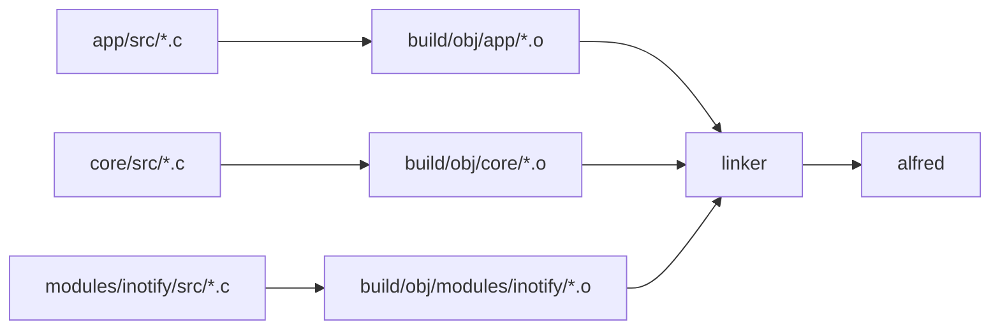

# Makefile e build system

Il Makefile e' il file che dice al computer come compilare il progetto.
In un progetto C non basta avere file `.c` e `.h`: bisogna trasformare i file
sorgente in file oggetto `.o` e poi collegarli in un eseguibile finale.

## Comando base

Per compilare:

```bash
make
```

Il risultato atteso e':

```text
alfred
```

cioe' il binario eseguibile del progetto.

## Concetti fondamentali

### Sorgenti `.c`

I file `.c` contengono implementazioni:

```text
app/src/app.c
core/src/alfred_correlator.c
modules/inotify/src/watcher.c
```

### Header `.h`

I file `.h` contengono dichiarazioni, tipi e interfacce:

```text
app/include/app.h
core/include/alfred_correlator.h
modules/inotify/include/watcher.h
```

### Object file `.o`

Ogni file `.c` viene compilato in un file oggetto `.o`.

Esempio:

```text
app/src/app.c
    |
    v
build/obj/app/src/app.o
```

### Linking

Il linker prende tutti i `.o` e li unisce nel binario finale:

```text
app.o + core.o + inotify.o
        |
        v
      alfred
```

## Diagramma della build



## Target futuri per la documentazione

Al momento il Makefile non genera ancora diagrammi o animazioni della
documentazione. Nei capitoli didattici si cita un possibile target futuro:

```bash
make docs-animations
```

Questo comando non e' ancora implementato. L'idea e' usarlo in futuro per
trasformare gli scenari animabili descritti in
`docs/it/16-mappa-codice-e-strutture.md` in file generati, per esempio SVG,
GIF, video o pagine HTML.

Una possibile struttura di output sara':

```text
docs/generated/animations/
```

Regola importante: il Markdown in `docs/it` deve restare la sorgente didattica
principale. I file in `docs/generated/` dovrebbero essere derivati e
rigenerabili, non scritti a mano come documentazione primaria.

## Variabili principali

Nel Makefile una variabile si definisce cosi':

```make
TARGET := alfred
```

e si usa cosi':

```make
$(TARGET)
```

### TARGET

```make
TARGET := alfred
```

Nome del binario finale.

### MODULES

```make
MODULES ?= inotify
```

Lista dei moduli da compilare.

`?=` significa: usa questo valore solo se l'utente non ne ha passato uno da
riga di comando.

Esempio:

```bash
make MODULES=inotify
```

In futuro potremo avere:

```bash
make MODULES=fanotify
make MODULES="inotify replay"
```

### Variante legacy-shadow rimossa

La build non espone piu' `ENABLE_LEGACY_SHADOW`. Il comando:

```bash
make
```

compila il binario normale core-only. I vecchi file legacy `events.c` e
`move_cache.c` sono stati rimossi dal codice corrente.

Se Alfred viene avviato con:

```bash
ALFRED_EVENT_ENGINE=shadow ./alfred /path
```

Alfred deve fallire in modo esplicito, perche' lo shadow mode e' stato rimosso
dal runtime. Non sarebbe corretto fare fallback silenzioso al core: chi chiede
shadow crederebbe di usare un confronto che non esiste piu'.

Il Makefile usa una directory oggetto dedicata al runtime core:

```text
build/obj/core/
```

La vecchia directory `build/obj/legacy-shadow/` non serve piu', perche' non
esistono piu' due varianti compilabili del runtime.

Le macro `-D...` sono raccolte nella variabile `DEFINES`, usata sia dalla build
di sviluppo sia dalla build `release`. Oggi contiene macro di modulo, per
esempio `ALFRED_ENABLE_INOTIFY`.

### Directory

```make
APP_DIR     := app
CORE_DIR    := core
MODULE_DIR  := modules
BUILD_DIR   := build
OBJ_DIR     := $(BUILD_DIR)/obj
```

Queste variabili evitano di ripetere stringhe in tutto il Makefile.

## Compilatore

```make
CC := gcc
```

`gcc` e' il compilatore C usato dal progetto.

## Flag di compilazione

I flag modificano il comportamento del compilatore.

Nel Makefile i flag sono separati per responsabilita':

```make
C_STANDARD
WARNINGS
DEBUG_FLAGS
RELEASE_FLAGS
SANITIZERS
DEPFLAGS
INCLUDES
CFLAGS
LDFLAGS
```

Questa separazione rende piu' facile capire perche' un flag esiste e quando
viene usato.

### Standard C

```make
C_STANDARD := -std=gnu99
```

Il progetto usa C99 con estensioni GNU.

### Warning

```make
WARNINGS := \
    -Wall \
    -Wextra \
    -Wpedantic \
    ...
```

I warning aiutano a trovare codice sospetto. Non sono sempre errori, ma spesso
indicano problemi reali.

Esempi:

- conversioni pericolose
- variabili inutilizzate
- formati `printf()` sbagliati
- codice non portabile

### Debug flags

```make
DEBUG_FLAGS := \
    -g3 \
    -O0 \
    -DDEBUG
```

Significato:

- `-g3`: include informazioni di debug per GDB
- `-O0`: disabilita ottimizzazioni, codice piu' facile da debuggare
- `-DDEBUG`: definisce la macro `DEBUG`

### Release flags

```make
RELEASE_FLAGS := \
    -O2 \
    -DNDEBUG
```

Significato:

- `-O2`: abilita ottimizzazioni
- `-DNDEBUG`: disabilita codice condizionato da debug, se presente

## Sanitizer

```make
SANITIZERS := \
    -fsanitize=address \
    -fsanitize=undefined
```

I sanitizer sono controlli runtime aggiunti dal compilatore.

### AddressSanitizer

`-fsanitize=address` aiuta a trovare errori di memoria:

- accesso fuori dai limiti di un array
- uso di memoria dopo `free()`
- doppia `free()`
- stack buffer overflow

### UndefinedBehaviorSanitizer

`-fsanitize=undefined` aiuta a trovare comportamenti indefiniti del C:

- overflow aritmetico signed
- shift illegali
- accessi non validi
- uso scorretto di certi tipi

## Include path

```make
INCLUDES := \
    -I$(APP_INC_DIR) \
    -I$(CORE_INC_DIR) \
    -I$(CORE_PRIVATE_INC_DIR)
```

`-I` dice al compilatore dove cercare gli header inclusi con:

```c
#include "app.h"
```

Quando abilitiamo il modulo `inotify`, il Makefile aggiunge anche:

```make
-Imodules/inotify/include
```

## CFLAGS e LDFLAGS

```make
CFLAGS = ...
LDFLAGS := ...
```

`CFLAGS` vengono usati durante la compilazione dei `.c` in `.o`.

`LDFLAGS` vengono usati durante il linking finale.

I sanitizer devono comparire sia in compilazione sia in linking.

### CFLAGS

`CFLAGS` contiene flag usati quando il compilatore trasforma un `.c` in un
file `.o`.

Esempio:

```text
app/src/main.c -> build/obj/app/src/main.o
```

In questa fase servono:

- standard C
- warning
- flag di debug o release
- sanitizer
- dependency tracking
- include path

Nel Makefile:

```make
CFLAGS = \
    $(C_STANDARD) \
    $(WARNINGS) \
    $(DEBUG_FLAGS) \
    $(SANITIZERS) \
    $(DEPFLAGS) \
    $(INCLUDES)
```

### LDFLAGS

`LDFLAGS` contiene flag usati durante il linking, cioe' quando tutti i `.o`
vengono uniti nel binario finale.

Esempio:

```text
main.o + app.o + core.o -> alfred
```

Nel Makefile:

```make
LDFLAGS := \
    -fsanitize=address \
    -fsanitize=undefined
```

I sanitizer devono comparire anche in `LDFLAGS`, perche' il linker deve
collegare il runtime dei sanitizer al binario finale.

### Perche' `CFLAGS =` e non sempre `CFLAGS :=`

Nel Makefile `CFLAGS` usa `=`:

```make
CFLAGS = ...
```

Questo permette di aggiungere include o macro dopo la definizione iniziale.

Esempio:

```make
INCLUDES += -I$(MODULE_DIR)/inotify/include
CFLAGS += -DALFRED_ENABLE_INOTIFY
```

Se `CFLAGS` fosse espanso troppo presto, alcune aggiunte successive potrebbero
non essere incluse nel comando finale.

## Dipendenze dagli header

Quando un file `.c` include un header `.h`, una modifica all'header deve far
ricompilare anche il `.c`.

Esempio:

```text
app/src/main.c include app/include/app.h
```

Se cambia `app.h`, anche `main.c` deve essere ricompilato.

Per questo il Makefile usa:

```make
DEPFLAGS := -MMD -MP
```

Questi flag chiedono a `gcc` di generare file `.d` accanto agli object file.

Esempio:

```text
build/obj/app/src/main.o
build/obj/app/src/main.d
```

Il file `.d` contiene dipendenze come:

```make
build/obj/app/src/main.o: app/src/main.c app/include/app.h ...
```

Poi il Makefile include questi file:

```make
-include $(DEPS)
```

Il trattino davanti a `include` significa: non fallire se i file `.d` non
esistono ancora. Alla prima build infatti non esistono; vengono creati durante
la compilazione.

Questa parte e' importante. Senza dependency tracking, potresti modificare una
struct in un header e lasciare compilati vecchi `.o` non aggiornati. In C questo
puo' causare bug difficili da capire.

### Cosa significa `-MMD`

`-MMD` dice a `gcc`:

```text
mentre compili il file .c, genera anche un file .d con le dipendenze dagli
header del progetto.
```

Gli header di sistema, come `<stdio.h>`, normalmente non vengono inclusi nel
file `.d`. Questo mantiene i file di dipendenza piu' piccoli e leggibili.

### Cosa significa `-MP`

`-MP` aggiunge regole vuote per gli header.

Serve a evitare errori se un header viene rimosso o rinominato. Senza `-MP`,
Make potrebbe leggere un vecchio `.d` che nomina un header non piu' esistente e
fermarsi con un errore.

### Cosa contiene un file `.d`

Un file `.d` e' un file Make generato automaticamente.

Esempio semplificato:

```make
build/obj/app/src/app.o: app/src/app.c app/include/app.h \
 app/include/config.h app/include/logger.h

app/include/app.h:
app/include/config.h:
app/include/logger.h:
```

La prima riga dice:

```text
app.o dipende da app.c e dagli header elencati.
```

Le righe vuote sugli header sono generate da `-MP`.

### Perche' usiamo `-include $(DEPS)`

Alla prima build i file `.d` non esistono ancora. Se scrivessimo:

```make
include $(DEPS)
```

Make fallirebbe perche' non trova quei file.

Scrivendo:

```make
-include $(DEPS)
```

Make prova a includerli, ma non fallisce se mancano.

Dopo la prima compilazione, i file `.d` esistono e Make li usa per capire cosa
ricompilare.

### Perche' questo e' importante per gli studenti

Se modifichi una struct in un header:

```c
typedef struct app {
    ...
} app_t;
```

tutti i `.c` che usano quella struct devono essere ricompilati.

Se non succede, puoi ottenere bug strani: il codice nuovo e il codice vecchio
possono avere idee diverse sulla dimensione della struct.

Durante lo sviluppo abbiamo visto proprio un caso di questo tipo: dopo aver
modificato `app_t`, un object file non ricompilato poteva usare una dimensione
vecchia della struct. I file `.d` evitano questo problema.

### `.o` e `.d` insieme

Per ogni sorgente:

```text
app/src/app.c
```

la build produce:

```text
build/obj/app/src/app.o
build/obj/app/src/app.d
```

Il `.o` serve al linker.

Il `.d` serve a Make.

## Liste dei sorgenti

Il Makefile separa i sorgenti per livello:

```make
APP_SRCS := ...
CORE_SRCS := ...
MODULE_SRCS := ...
```

Poi li unisce:

```make
SRCS := $(APP_SRCS) $(CORE_SRCS) $(MODULE_SRCS)
```

Questo rende visibile da dove arriva ogni parte del programma.

## Aggiungere una nuova coppia `.h` e `.c`

Quando aggiungi una nuova funzionalita' in C, spesso crei due file:

```text
nome_modulo.h
nome_modulo.c
```

Il file `.h` contiene l'interfaccia pubblica del modulo: tipi, costanti e
prototipi delle funzioni che altri file possono chiamare.

Il file `.c` contiene l'implementazione.

### Passo 1: scegliere il livello giusto

Prima domanda:

> Questa funzionalita' appartiene ad `app`, `core` o `modules/inotify`?

Esempi:

| Funzionalita' | Posizione corretta |
| --- | --- |
| logging applicativo | `app/` |
| correlazione eventi raw | `core/` |
| conversione `struct inotify_event` | `modules/inotify/` |
| parsing configurazione | `app/` |

### Passo 2: creare l'header

Esempio:

```text
modules/inotify/include/inotify_adapter.h
```

L'header deve avere:

- commento iniziale del file
- include guard
- include necessari
- prototipi documentati

Schema:

```c
#ifndef INOTIFY_ADAPTER_H
#define INOTIFY_ADAPTER_H

int funzione_pubblica(void);

#endif /* INOTIFY_ADAPTER_H */
```

### Passo 3: creare il file `.c`

Esempio:

```text
modules/inotify/src/inotify_adapter.c
```

Il file `.c` deve includere il suo header:

```c
#include "inotify_adapter.h"
```

Questo e' importante: se la dichiarazione nell'header e l'implementazione nel
`.c` non coincidono, il compilatore puo' segnalarlo.

### Passo 4: aggiungere il `.c` al Makefile

Creare il file non basta. Il Makefile deve sapere che quel `.c` va compilato.

Se il file appartiene ad `app/`, aggiungilo a:

```make
APP_SRCS := \
    ...
    $(APP_DIR)/src/nuovo_file.c
```

Se appartiene al core:

```make
CORE_SRCS := \
    ...
    $(CORE_DIR)/src/nuovo_file.c
```

Esempio reale:

```make
CORE_SRCS := \
    $(CORE_DIR)/src/alfred_correlator.c \
    $(CORE_DIR)/src/alfred_record_adapter.c \
    $(CORE_DIR)/src/alfred_record_diagnostic.c \
    $(CORE_DIR)/src/alfred_record_text.c \
    $(CORE_DIR)/src/alfred_tables.c \
    $(CORE_DIR)/src/alfred_utils.c
```

In questo esempio `alfred_record_adapter.c` e
`alfred_record_diagnostic.c` traducono tipi core correnti e diagnostica Alfred
nel record comune `alfred_record_t`. `alfred_record_text.c` formatta il payload
testuale partendo dallo stesso record. Nessuno di questi file appartiene al
modulo inotify: devono restare disponibili anche quando in futuro arriveranno
altri backend.

Se appartiene al modulo inotify:

```make
MODULE_SRCS += \
    $(MODULE_DIR)/inotify/src/nuovo_file.c
```

Esempio reale:

```make
MODULE_SRCS += \
    $(MODULE_DIR)/inotify/src/inotify_adapter.c \
    $(MODULE_DIR)/inotify/src/inotify_backend.c \
    ...
```

Nota: `events.c` e `move_cache.c` non vanno reintrodotti nel percorso normale.
La semantica finale appartiene al core, non al modulo inotify.

### Passo 5: controllare gli include path

Il Makefile deve anche sapere dove cercare gli header.

Per `app/include`:

```make
-I$(APP_INC_DIR)
```

Per `core/include`:

```make
-I$(CORE_INC_DIR)
```

Per `modules/inotify/include`:

```make
-I$(MODULE_DIR)/inotify/include
```

Se metti l'header in una directory gia' inclusa, non devi modificare gli include
path.

### Passo 6: compilare subito

Dopo aver aggiunto i file:

```bash
make
```

Se il Makefile e' corretto, dovresti vedere una riga simile:

```text
[CC] modules/inotify/src/inotify_adapter.c
```

Se non la vedi, probabilmente hai dimenticato di aggiungere il `.c` alla lista
giusta nel Makefile.

### Passo 7: aggiornare la documentazione

Ogni nuova coppia `.h/.c` deve aggiornare:

```text
docs/commenting-progress.md
```

Se il file introduce un concetto importante per gli studenti, aggiorna anche la
documentazione italiana in:

```text
docs/it/
```

Nel caso dell'adapter inotify abbiamo aggiornato:

```text
docs/it/05-modulo-inotify.md
```

### Checklist rapida

Quando aggiungi una coppia `.h/.c`, controlla:

- il file `.h` ha include guard?
- il file `.c` include il proprio `.h`?
- le funzioni pubbliche sono dichiarate nell'header?
- le funzioni private sono `static` nel `.c`?
- il `.c` e' stato aggiunto al Makefile?
- `make` compila il nuovo file?
- hai aggiornato `docs/commenting-progress.md`?
- serve aggiornare anche `docs/it/`?

## Quando bisogna aggiornare il Makefile

Un errore frequente nei progetti C e' pensare che il Makefile si aggiorni da
solo. Non e' cosi': il Makefile descrive esplicitamente quali file compilare,
quali directory usare per gli header, quali test eseguire e quali strumenti
rendere disponibili con comandi come `make test` o `make format`.

La regola pratica e':

```text
se la modifica cambia come il progetto si compila, si testa o si automatizza,
allora bisogna controllare il Makefile.
```

### Caso 1: aggiungi un nuovo file `.c`

Questo e' il caso piu' comune. Se crei solo un header `.h`, spesso non serve
modificare il Makefile, perche' gli header vengono inclusi da altri `.c`. Se
crei un nuovo file `.c`, invece, il compilatore non lo vede automaticamente.

Esempio:

```text
core/src/alfred_new_rule.c
```

Devi aggiungerlo alla lista giusta:

```make
CORE_SRCS := \
    $(CORE_DIR)/src/alfred_correlator.c \
    $(CORE_DIR)/src/alfred_record_adapter.c \
    $(CORE_DIR)/src/alfred_record_diagnostic.c \
    $(CORE_DIR)/src/alfred_record_text.c \
    $(CORE_DIR)/src/alfred_tables.c \
    $(CORE_DIR)/src/alfred_utils.c \
    $(CORE_DIR)/src/alfred_new_rule.c
```

Se dimentichi questo passo, il file esiste nel repository ma non entra nel
binario finale. Il risultato puo' essere:

- funzioni non trovate in fase di link, se altri file le chiamano
- codice mai eseguito, se nessuno lo collega direttamente
- test che non coprono davvero la modifica che pensavi di aver compilato

### Caso 2: sposti un file `.c`

Se sposti un file da una directory a un'altra, il vecchio percorso nel Makefile
non e' piu' valido.

Esempio:

```text
modules/inotify/src/foo.c
```

spostato in:

```text
core/src/foo.c
```

Non basta muovere il file con `git mv`: bisogna togliere il vecchio percorso da
`MODULE_SRCS` e aggiungere il nuovo percorso a `CORE_SRCS`. Questo e' anche un
segnale architetturale: stai dicendo che quella logica non appartiene piu' al
backend inotify, ma al core.

### Caso 3: rimuovi un file `.c`

Se elimini un file sorgente, devi rimuoverlo anche dalla lista sorgenti.

Se non lo fai, `make` provera' ancora a compilare un file che non esiste e
fallira' con un errore simile a:

```text
No rule to make target 'modules/inotify/src/old_file.c'
```

Nel nostro percorso di switch al core, questo e' gia' successo con `events.c` e
`move_cache.c`: dopo la rimozione fisica non devono comparire in nessuna lista
sorgenti del Makefile.

### Caso 4: aggiungi una nuova directory di header

Se metti un header in una directory gia' nota, per esempio:

```text
core/include/
modules/inotify/include/
app/include/
```

di solito non devi cambiare `INCLUDES`.

Se invece crei una nuova directory pubblica o privata, per esempio:

```text
modules/fanotify/include/
```

devi aggiungere il relativo `-I`:

```make
INCLUDES += -I$(MODULE_DIR)/fanotify/include
```

Senza questo percorso, una riga come:

```c
#include "fanotify_backend.h"
```

potrebbe fallire perche' il compilatore non sa dove cercare il file.

### Caso 5: aggiungi un modulo

Il progetto usa la variabile `MODULES` per decidere quali backend compilare.
Oggi il modulo supportato e':

```make
MODULES ?= inotify
```

Se un giorno aggiungiamo `fanotify`, non basta creare la cartella
`modules/fanotify/`. Bisogna aggiungere un blocco simile a quello di inotify:

```make
ifneq ($(filter fanotify,$(MODULES)),)
INCLUDES += -I$(MODULE_DIR)/fanotify/include
DEFINES += -DALFRED_ENABLE_FANOTIFY
MODULE_SRCS += \
    $(MODULE_DIR)/fanotify/src/fanotify_backend.c
endif
```

Questo blocco dice tre cose:

- dove cercare gli header del modulo
- quale macro di compilazione definire
- quali file `.c` del modulo compilare

### Caso 6: aggiungi un nuovo test ufficiale

Se aggiungi un nuovo script dentro una suite gia' esistente, prima controlla il
runner della suite. Alcuni runner enumerano i file, altri usano un pattern.

Esempio con runner esplicito:

```text
tests/core/test_new_scenario.sh
```

se `tests/core/run_all.sh` non include automaticamente il nuovo file, aggiorna:

```text
tests/core/run_all.sh
```

Esempio con runner automatico:

```text
tests/backend/test_new_diagnostic.sh
```

`tests/backend/run_all.sh` esegue tutti gli script `test_*.sh`, quindi un nuovo
file backend con quel nome entra automaticamente in
`make test-backend-diagnostics`.

In entrambi i casi il Makefile non cambia, perche' il target entra gia' nella
directory della suite ed esegue `run_all.sh`.

Esempio corrente:

```text
tests/backend/test_record_raw_adapter.sh
```

entra automaticamente in `make test-backend-diagnostics`, perche'
`tests/backend/run_all.sh` esegue tutti gli script `test_*.sh`. Il Makefile non
deve elencarlo uno per uno.

Se invece aggiungi una nuova categoria di test, per esempio:

```text
tests/performance/
```

allora ha senso aggiungere un nuovo target:

```make
test-performance:
    $(MAKE) all
    cd tests/performance && bash run_all.sh
```

e aggiungerlo anche a `.PHONY`.

### Caso 7: aggiungi un nuovo comando di automazione

Se aggiungi un nuovo file sorgente in una directory gia' gestita, controlla
anche i target di manutenzione:

```make
format
scan
tidy
```

Questi target non costruiscono il binario per gli utenti, ma aiutano i
contributori a mantenere stile e qualita'. Se `make` compila `core/src/*.c` ma
`make format`, `make scan` o `make tidy` guardano solo `app/src` e
`modules/inotify/src`, allora una parte del codice resta fuori dai controlli.
Per questo i target di manutenzione devono includere anche:

```make
$(CORE_DIR)/src/*.c
$(CORE_DIR)/include/*.h
```

Se vuoi rendere riproducibile un'operazione manuale, puoi aggiungere un target.
Esempi possibili:

```make
docs-graphs:
    ./tools/docs/render_graphs.sh
```

oppure:

```make
check:
    $(MAKE) test
    $(MAKE) test-backend-diagnostics
```

Un target di questo tipo va documentato e aggiunto a `.PHONY`, perche' e' un
comando da eseguire, non un file da produrre.

### Caso 8: cambi flag di compilazione o linking

Se una modifica richiede un flag del compilatore, devi capire in quale variabile
metterlo:

- `CFLAGS`: flag usati quando si compilano i `.c`
- `LDFLAGS`: flag usati quando si collega il binario finale
- `DEFINES`: macro `-D...`
- `INCLUDES`: directory `-I...`

Esempio: se aggiungi una macro usata dal preprocessore:

```make
DEFINES += -DALFRED_ENABLE_FEATURE_X
```

Se invece devi collegare una libreria esterna, il flag di solito appartiene a
`LDFLAGS`.

### Caso 9: cambi la build supportata

Quando una variante di build nasce o viene rimossa, il Makefile deve essere
aggiornato insieme alla documentazione. In questo progetto e' successo con la
vecchia variante `ENABLE_LEGACY_SHADOW`: durante la migrazione serviva per
confrontare legacy e core, ma ora e' stata rimossa perche' lo switch deve essere
totale.

Questo tipo di modifica richiede sempre tre controlli:

- il Makefile non deve piu' accettare comandi obsoleti come se fossero validi
- la documentazione non deve suggerire al contributore di usarli
- i test ufficiali devono riflettere la build realmente supportata

### Checklist: devo toccare il Makefile?

Prima di chiudere una modifica, chiediti:

- ho aggiunto, spostato o rimosso un file `.c`?
- ho creato una nuova directory di header?
- ho aggiunto un modulo o una macro di modulo?
- ho aggiunto una nuova categoria di test?
- ho creato un comando che gli altri dovranno eseguire con `make ...`?
- ho cambiato flag del compilatore, del linker o macro `-D...`?
- ho rimosso una variante di build o un vecchio target?

Se la risposta e' si', il Makefile va almeno letto e quasi sempre aggiornato.

## Regola per gli object file

```make
OBJS := $(SRCS:%.c=$(OBJ_DIR)/%.o)
```

Questa trasformazione dice:

```text
per ogni file .c in SRCS,
crea il nome corrispondente .o dentro build/obj
```

Esempio:

```text
app/src/main.c
    -> build/obj/app/src/main.o
```

## Target principali

### all

```make
all: banner directories $(TARGET)
```

Target predefinito. Quando scrivi `make`, Make esegue `all`.

Dipende da:

- `banner`
- `directories`
- `alfred`

### directories

Crea le directory di build necessarie:

```make
mkdir -p build
mkdir -p build/obj/...
```

### $(TARGET)

Collega tutti gli object file:

```make
$(CC) $(OBJS) -o $(TARGET) $(LDFLAGS)
```

### Regola generica di compilazione

```make
$(OBJ_DIR)/%.o: %.c
    $(CC) $(CFLAGS) -c $< -o $@
```

Significato delle variabili automatiche:

- `$<`: il primo prerequisito, cioe' il file `.c`
- `$@`: il target da produrre, cioe' il file `.o`

Esempio pratico:

```text
$< = app/src/main.c
$@ = build/obj/app/src/main.o
```

## Pulizia

### clean

```bash
make clean
```

Rimuove la directory `build/`.

### fclean

```bash
make fclean
```

Esegue `clean` e rimuove anche il binario `alfred`.

### re

```bash
make re
```

Ricompila tutto da zero:

```text
fclean -> all
```

## Build release

```bash
make release
```

Compila con flag ottimizzati e senza sanitizer.

Serve quando vuoi un binario piu' vicino all'uso finale, non quando stai
sviluppando o cercando bug.

## Target di utilita'

### run

```bash
make run
```

Compila e poi esegue:

```bash
./alfred
```

Nota: il programma richiede percorsi da monitorare, quindi `make run` potrebbe
non essere sufficiente per un'esecuzione reale.

### test-core

```bash
make test-core
```

Il target `make test-core` ricostruisce esplicitamente il binario nella variante
core-only prima di lanciare:

```text
tests/core/
```

In questo modo il test ricostruisce sempre il binario ufficiale prima di
partire.

Nonostante il nome, `test-core` non salta il backend: gli script creano file e
directory reali, Alfred riceve eventi inotify reali e il core produce
`events.log`. Questa e' la suite end-to-end ufficiale del percorso core.

### test-cli

```bash
make test-cli
```

Il target ricostruisce il binario e lancia:

```text
tests/cli/
```

Questa suite controlla il contratto utente della CLI. Per ora copre i comandi
informativi `--help` e `--version`: devono uscire con codice `0`, scrivere su
`stdout`, non scrivere su `stderr` e non creare log runtime. Il punto
importante e' che questi comandi terminano prima di `app_init()`, quindi non
devono inizializzare configurazione, logger, backend, core, output pipeline o
watch.

### test-backend-diagnostics

```bash
make test-backend-diagnostics
```

Il target ricostruisce il binario core-only e lancia:

```text
tests/backend/
```

Questa suite non controlla la semantica utente finale. Controlla log e stato
diagnostico del backend inotify, per esempio `WATCH_ADDED` e `WATCH_REMOVED`.
Sono righe utili per capire se la tabella dei watch viene aggiornata
correttamente, ma non devono essere confuse con eventi semantici del core.

### test-jsonl

```bash
make test-jsonl
```

Il target ricostruisce il binario core-only e lancia:

```text
tests/jsonl/
```

Questa suite controlla il contratto esterno strutturato di `output.jsonl`.
Non sostituisce `test-core` e non sostituisce `test-backend-diagnostics`: vive
in parallelo ai test testuali. Il suo scopo e' verificare che i comportamenti
pubblici importanti siano rappresentati come record JSONL parseabili e stabili,
mentre i log compatibili continuano a essere prodotti per debug e didattica.

### test

```bash
make test
```

`make test` e' ora l'alias ufficiale di `make test-core`. Il nome storico del
target punta quindi al contratto end-to-end del percorso core.

### .PHONY

Alla fine del Makefile c'e' una sezione:

```make
.PHONY: \
    all \
    clean \
    test \
    ...
```

`.PHONY` dice a `make` che quei nomi sono comandi, non file da produrre. Senza
questa dichiarazione, se nella cartella esistesse per errore un file chiamato
`clean`, `make clean` potrebbe pensare che il target sia gia' aggiornato e non
eseguire la ricetta. Con `.PHONY`, invece, `make clean` resta sempre un comando.

Nel progetto sono phony target come:

- `all`
- `clean`
- `fclean`
- `test`
- `test-core`
- `test-cli`
- `test-backend-diagnostics`
- `test-jsonl`
- `test-scanner`
- `test-watcher`
- `format`
- `scan`
- `tidy`

Anche `FORCE` e' phony: serve a forzare il relink del binario quando lanciamo
`make`, cosi' il target `alfred` esegue sempre la fase di link dopo aver
controllato gli object file.

### valgrind

```bash
make valgrind
```

Esegue il programma sotto Valgrind per cercare problemi di memoria.

### gdb

```bash
make gdb
```

Avvia il debugger GDB sul binario.

### format

```bash
make format
```

Formatta il codice con `clang-format`.

### scan

```bash
make scan
```

Esegue `cppcheck`, uno strumento di analisi statica.

### test-scanner

```bash
make test-scanner
```

Esegue i test del componente `fs_scanner`. Questa suite non controlla lo stream
semantico del core e non controlla la diagnostica inotify: verifica solo che lo
scanner filesystem attraversi l'albero secondo il contratto scelto.

Nel primo passo lo scanner visita directory, non segue symlink e usa una
callback con `userdata`. Il test compila un piccolo helper C in
`tests/scanner/` e lo esegue su un albero temporaneo.

### test-watcher

```bash
make test-watcher
```

Esegue i test diretti della watcher table:

```text
tests/watcher/
```

Questa suite non avvia Alfred e non legge eventi reali dal kernel. Compila un
piccolo test C contro `modules/inotify/src/watcher.c` e verifica il contratto
della struttura dati `watcher_table_t`.

Il primo scenario controlla lo stato di affidabilita' dei watch:

- `watcher_store()` crea uno slot `VALID`
- `watcher_store_identity()` crea uno slot `VALID` con identita' `st_dev/st_ino`
- `watcher_set_state()` puo' marcare uno slot `STALE` o `RESYNCING`
- `watcher_remove()` riporta lo slot a `REMOVED`
- uno slot rimosso non viene considerato stale

Questo target serve alla futura gestione `IN_MOVE_SELF` e resync. Lo teniamo
separato dai test backend perche' qui non vogliamo testare timing o dettagli
del kernel: vogliamo fissare il contratto interno della tabella.

### tidy

```bash
make tidy
```

Esegue `clang-tidy`, un altro strumento di analisi statica.

## Comandi piu' usati

| Obiettivo | Comando |
| --- | --- |
| Compilare | `make` |
| Pulire object file | `make clean` |
| Pulire tutto | `make fclean` |
| Ricompilare da zero | `make re` |
| Build ottimizzata | `make release` |
| Eseguire test ufficiali core | `make test` |
| Eseguire test end-to-end core espliciti | `make test-core` |
| Eseguire diagnostica backend inotify | `make test-backend-diagnostics` |
| Eseguire test scanner filesystem | `make test-scanner` |
| Eseguire test watcher table | `make test-watcher` |
| Cercare problemi memoria | `make valgrind` |
| Debuggare | `make gdb` |
| Formattare codice | `make format` |
| Analisi statica base | `make scan` |
| Analisi statica avanzata | `make tidy` |

## Errori comuni

### Errore di compilazione

Succede mentre un `.c` viene trasformato in `.o`.

Cause comuni:

- header mancante
- tipo non dichiarato
- funzione chiamata con parametri sbagliati
- errore di sintassi C

### Errore di linking

Succede dopo la compilazione, quando il linker crea `alfred`.

Cause comuni:

- funzione dichiarata ma non implementata
- file `.c` non aggiunto a `SRCS`
- libreria mancante

### Warning

Un warning non blocca sempre la build, ma non va ignorato. In C molti warning
segnalano bug reali o comportamenti pericolosi.
