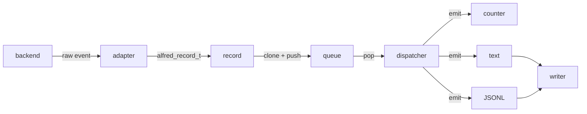

# Debugging, test e strumenti

Questo capitolo spiega gli strumenti usati per trovare bug, controllare la
qualita' del codice e verificare il comportamento del programma.

## Compilazione di sviluppo

Il comando principale e':

```bash
make
```

La build di sviluppo usa:

- simboli di debug
- ottimizzazioni disabilitate
- AddressSanitizer
- UndefinedBehaviorSanitizer
- warning severi

Questa configurazione e' pensata per trovare errori durante lo sviluppo.

## Sanitizer

I sanitizer sono controlli automatici inseriti dal compilatore nel programma.
Quando il programma gira, questi controlli intercettano errori che in C spesso
sono difficili da vedere.

### AddressSanitizer

Trova problemi di memoria.

Esempi:

```c
char buf[4];
buf[10] = 'x'; /* errore: fuori dai limiti */
```

Oppure:

```c
free(p);
printf("%s\n", p); /* errore: uso dopo free */
```

Quando AddressSanitizer trova un errore, stampa:

- tipo di errore
- file e riga
- stack trace
- indirizzo di memoria coinvolto

### UndefinedBehaviorSanitizer

Trova comportamenti indefiniti.

In C, "comportamento indefinito" significa che il linguaggio non garantisce
cosa succede. Il programma potrebbe sembrare funzionare oppure rompersi in modo
imprevedibile.

Esempi:

- overflow di interi signed
- shift con numero di bit non valido
- accesso a puntatori non validi

## Valgrind

Valgrind esegue il programma dentro un ambiente controllato e controlla come
usa la memoria.

Comando:

```bash
make valgrind
```

Il target usa opzioni severe:

```text
--leak-check=full
--show-leak-kinds=all
--track-origins=yes
```

### Differenza tra sanitizer e Valgrind

| Strumento | Punti forti | Limiti |
| --- | --- | --- |
| Sanitizer | veloce, ottimo durante sviluppo | richiede ricompilazione |
| Valgrind | molto dettagliato sui leak | molto piu' lento |

Di solito si usa prima la build con sanitizer. Valgrind si usa per controlli
piu' approfonditi.

## GDB

GDB e' il debugger.

Comando:

```bash
make gdb
```

Comandi GDB utili:

```text
run
break app_init
next
step
print app
backtrace
quit
```

Significato:

- `break`: mette un breakpoint
- `run`: avvia il programma
- `next`: esegue la prossima riga senza entrare nelle funzioni
- `step`: entra dentro una funzione
- `print`: stampa una variabile
- `backtrace`: mostra la catena di chiamate

## Browser del codice

Oltre a test e debugger, il progetto mantiene alcuni strumenti locali per
navigare il codice dal browser. Sono utili quando uno studente deve orientarsi
in una codebase non piccola: invece di aprire file a caso, puo' cercare una
funzione, una struttura dati o un evento e poi collegare i risultati alla
documentazione in `docs/it`.

Gli strumenti sono volutamente separati:

- Bootlin Elixir in `docs/code-browser/`
- Kythe in `docs/kythe-browser/`
- Sourcebot in `docs/sourcebot-browser/`

Esiste anche uno strato comune per studenti e contributori:

```text
tools/code-browsing/
```

Questa cartella contiene script aggregati che chiamano gli script specifici dei
singoli strumenti. L'obiettivo e' pratico: chi vuole solo preparare o avviare
tutti i browser del codice non deve ricordare tre percorsi diversi.

### Provisioning comune

Il progetto usa container Docker per Sourcebot, Elixir e Kythe. Questo riduce i
vincoli sulla distribuzione Linux usata dallo studente, ma non elimina il
prerequisito Docker: Docker Engine o Docker Desktop devono essere gia'
installati e funzionanti sull'host.

Il progetto non installa Docker automaticamente. La scelta e' intenzionale:
l'installazione del daemon dipende dalla distribuzione, dai permessi
dell'utente, dal gruppo `docker`, da systemd o dal runtime usato nella macchina.
Uno script del repository non dovrebbe modificare questi aspetti di sistema.

Per controllare il prerequisito:

```sh
tools/code-browsing/check-docker.sh
```

Per preparare tutti gli strumenti:

```sh
tools/code-browsing/setup-all.sh
```

`setup-all.sh` esegue:

1. controllo Docker
2. setup Sourcebot, cioe' pull dell'immagine e controllo del repository Git
3. setup Elixir, cioe' clone di Bootlin Elixir, build immagine e database
4. setup Kythe e indicizzazione, cioe' download release, build immagine,
   compilazione strumentata e generazione delle serving tables

E' un comando volutamente pesante. Va usato alla prima preparazione o quando si
vuole ricreare l'ambiente completo.

Per avviare, fermare, riavviare e controllare tutti i servizi:

```sh
tools/code-browsing/start-all.sh
tools/code-browsing/status-all.sh
tools/code-browsing/restart-all.sh
tools/code-browsing/stop-all.sh
```

URL predefiniti:

```text
Sourcebot: http://127.0.0.1:3000
Elixir:    http://127.0.0.1:8080/alfred/workspace/source
Kythe API: http://127.0.0.1:9898
```

Graphify non e' ancora incluso in questi script. Per ora resta una voce della
roadmap: prima bisogna fare uno spike tecnico e decidere se produce davvero
mappe utili del codice e della documentazione. Solo dopo avra' senso aggiungere
container, setup e comandi aggregati.

La cartella contiene anche `docker-compose.yml`. Compose e' utile per chi
preferisce descrivere i tre server come servizi Docker, ma e' opzionale:
richiede il plugin `docker compose` o il binario `docker-compose`. Gli script
restano il percorso consigliato nella guida didattica perche' distinguono meglio
setup, reindex, start, stop e diagnosi degli errori.

### Elixir

Elixir e' il browser leggero e specifico per codice C/Linux. La guida si trova
in:

```text
docs/code-browser/README.md
```

Uso tipico:

```bash
docs/code-browser/setup-elixir.sh
docs/code-browser/reindex-elixir.sh
docs/code-browser/start-elixir.sh
docs/code-browser/status-elixir.sh
```

Elixir e' utile per leggere il codice in modo tradizionale: file, simboli,
riferimenti e navigazione dal browser. E' una buona scelta quando serve uno
strumento stabile e abbastanza semplice.

### Kythe

Kythe e' documentato in:

```text
docs/kythe-browser/README.md
```

Nel nostro progetto e' soprattutto un esperimento di backend semantico: riesce
a indicizzare il codice C e a produrre dati interrogabili, ma la release binaria
non fornisce una GUI pronta. Per questo non e' lo strumento consigliato agli
studenti per leggere Alfred giorno per giorno.

Resta utile per capire concetti piu' avanzati:

- extractor
- unita' `.kzip`
- graphstore
- serving tables
- cross-reference semantiche

Dal punto di vista pratico, Kythe puo' servire se vogliamo costruire strumenti
automatici sopra il codice. Per esempio puo' aiutare a generare mappe
`funzione -> chiamanti -> chiamati`, controllare se la documentazione cita
funzioni ancora esistenti, produrre viste mirate sui simboli o ridurre il lavoro
di esplorazione iniziale di un agente. Un agente puo' usare Kythe per
interrogare definizioni e riferimenti prima di aprire molti file, risparmiando
contesto e concentrando la lettura sui punti davvero rilevanti.

Questo non sostituisce la revisione del codice sorgente: prima di modificare
Alfred bisogna comunque leggere i file reali e lanciare i test. Kythe e' quindi
uno strumento di orientamento e automazione, non una fonte unica di verita'.

### Sourcebot

Sourcebot e' documentato in:

```text
docs/sourcebot-browser/README.md
```

E' una alternativa moderna per leggere e cercare il codice via web. Si avvia
con Docker:

```bash
docs/sourcebot-browser/start-sourcebot.sh
```

Poi si apre:

```text
http://127.0.0.1:3000
```

Comandi principali:

```bash
docs/sourcebot-browser/setup-sourcebot.sh
docs/sourcebot-browser/status-sourcebot.sh
docker logs -f alfred-sourcebot
docs/sourcebot-browser/restart-sourcebot.sh
docs/sourcebot-browser/stop-sourcebot.sh
```

Sourcebot usa un Docker named volume chiamato `alfred-sourcebot-data` per i dati
interni. Il volume non viene cancellato dallo stop normale, cosi' il database e
l'indice possono essere riusati al riavvio. Per cancellare tutto:

```bash
docs/sourcebot-browser/stop-sourcebot.sh
docker volume rm alfred-sourcebot-data
```

Query utili da provare nella UI:

```text
app_run
lang:c app_run
sym:app_run
path:app/src app_run
recursive_create_nested_dir
FILE_RELOCATED
```

Sourcebot e' probabilmente lo strumento piu' comodo se l'obiettivo e' cercare
rapidamente nel codice e aprire file dal browser. La sua code navigation
completa, pero', richiede una licenza Enterprise; per il nostro uso didattico
restano comunque molto utili file explorer, ricerca indicizzata, syntax
highlighting e filtri.

### Quale scegliere

Per la lettura quotidiana del codice:

- usa Sourcebot se vuoi una UI moderna e una ricerca comoda
- usa Elixir se vuoi uno strumento piu' leggero e specifico per il codice C
- usa Kythe solo per esperimenti avanzati su dati semantici e cross-reference

Gli studenti non devono partire da Kythe. Prima devono imparare a seguire il
codice con Elixir o Sourcebot, poi possono usare la documentazione italiana per
capire responsabilita', strutture dati e flusso degli eventi.

La sequenza umana consigliata e':

```text
leggi la documentazione -> cerca nel codice con Sourcebot/Elixir/rg
-> apri i file reali -> fai la modifica -> esegui la procedura pre-commit
```

I browser del codice aiutano nella fase di comprensione, non nella validazione
finale. Dopo ogni modifica restano necessari build e test descritti nella
sezione successiva.

## Come sono strutturati i test shell

I test Bash non sono script isolati senza struttura. Sono organizzati a livelli,
in modo che ogni parte abbia una responsabilita' chiara:

```text
Makefile target
-> tests/<suite>/run_all.sh
-> tests/<suite>/test_*.sh
-> tests/core/test_lib.sh
-> alfred + filesystem reale + log
```

Il target Makefile e' il punto di ingresso usato da sviluppatori, studenti e CI.
Per esempio:

```make
test-core:
	$(MAKE) all
	cd tests/core && bash run_all.sh
```

Questo significa:

1. ricompila il progetto con `make all`
2. entra nella directory `tests/core`
3. esegue il runner `run_all.sh`

Il cambio directory e' importante. Gli script usano path relativi come
`../../alfred`, `./events.log` e `./raw.log`; questi path funzionano perche' il
runner viene lanciato dalla directory della suite.

### Il ruolo di `run_all.sh`

Ogni suite shell ha un runner:

```text
tests/core/run_all.sh
tests/backend/run_all.sh
tests/scanner/run_all.sh
```

Il runner stampa un'intestazione leggibile, poi esegue tutti gli script
`test_*.sh`:

```bash
for test_script in test_*.sh; do
    echo "Running $test_script"
    bash "$test_script"
    echo ""
done
```

Questo meccanismo rende semplice aggiungere un test: se il nuovo file si chiama
`test_qualcosa.sh` e si trova nella directory giusta, il runner lo esegue
automaticamente. La suite core contiene anche `test_lib.sh`, quindi il runner
core lo salta esplicitamente:

```bash
if [[ "$test_script" == "test_lib.sh" ]]; then
    continue
fi
```

`test_lib.sh` non e' uno scenario. E' una libreria di funzioni condivise; se
venisse eseguita come test, non avrebbe un caso concreto da verificare.

I runner usano:

```bash
set -euo pipefail
```

Significato:

- `-e`: se un comando fallisce, lo script termina
- `-u`: usare una variabile non definita e' errore
- `-o pipefail`: una pipeline fallisce se fallisce uno dei comandi interni

Queste opzioni rendono i test piu' severi. Senza di esse, un errore potrebbe
passare inosservato e il runner potrebbe stampare `PASSED` anche se un comando
intermedio e' fallito.

### Il ruolo di un singolo `test_*.sh`

Un test core tipico ha questa forma:

```bash
#!/usr/bin/env bash

source ./test_lib.sh
trap cleanup EXIT

start_alfred_core

printf "rename\n" > "$TEST_ROOT/old.txt"
sleep 1
mv "$TEST_ROOT/old.txt" "$TEST_ROOT/new.txt"
sleep 1

assert_contains "FILE_CREATED path=.*/old.txt"
assert_contains "FILE_RENAMED from=.*/old.txt to=.*/new.txt"
assert_order "FILE_CREATED path=.*/old.txt" \
             "FILE_RENAMED from=.*/old.txt to=.*/new.txt"
```

Le fasi sono:

1. caricare la libreria con `source ./test_lib.sh`
2. registrare `cleanup` con `trap cleanup EXIT`
3. avviare Alfred sulla directory temporanea
4. produrre azioni reali sul filesystem
5. aspettare brevemente che inotify consegni gli eventi
6. controllare i log con gli assert

`source` esegue il file indicato nella shell corrente. Questo e' diverso da
`bash ./test_lib.sh`: se eseguissimo la libreria in un nuovo processo, le
funzioni definite dentro non sarebbero disponibili nel test chiamante.

`trap cleanup EXIT` dice alla shell: "quando questo script termina, anche in
caso di errore, chiama `cleanup`". Questo evita di lasciare Alfred in esecuzione
o directory temporanee sporche.

### Variabili condivise della libreria

`tests/core/test_lib.sh` definisce alcune variabili comuni:

```bash
ALFRED_BIN="${ALFRED_BIN:-../../alfred}"
TEST_ROOT="${TEST_ROOT:-/tmp/alfred_core_test}"
LOG_FILE="${LOG_FILE:-./events.log}"
ALFRED_PID=""
```

`ALFRED_BIN` indica il binario da avviare. La sintassi:

```bash
${ALFRED_BIN:-../../alfred}
```

significa: se la variabile `ALFRED_BIN` e' gia' definita nell'ambiente, usa quel
valore; altrimenti usa `../../alfred`. Questo permette di sovrascrivere il
binario da testare senza modificare lo script.

`TEST_ROOT` e' la directory temporanea osservata da Alfred. I test creano,
modificano, spostano e cancellano file dentro questa directory.

`LOG_FILE` e' il log semantico principale, di solito `events.log`. Alcuni test
leggono anche `raw.log` ed `errors.log`, che vengono preparati dalla libreria.

`ALFRED_PID` conserva il process id del processo Alfred avviato dal test. Serve
per fermarlo in modo controllato alla fine.

### `reset_env()`

`reset_env()` prepara un ambiente pulito:

```bash
reset_env() {
    rm -rf "$TEST_ROOT"
    mkdir -p "$TEST_ROOT"
    : > "$LOG_FILE"
    : > ./raw.log
    : > ./errors.log
}
```

Passaggi:

- rimuove la vecchia directory temporanea
- la ricrea vuota
- svuota `events.log`
- svuota `raw.log`
- svuota `errors.log`

La sintassi:

```bash
: > "$LOG_FILE"
```

usa il comando shell `:`. `:` non fa nulla e termina con successo. La
redirezione `>` pero' tronca il file, cioe' lo crea vuoto o lo svuota se esiste
gia'. E' un modo compatto per dire: "prepara un file vuoto".

### `start_alfred_core()`

`start_alfred_core()` pulisce l'ambiente e avvia Alfred:

```bash
start_alfred_core() {
    reset_env

    ALFRED_EVENT_ENGINE=core "$ALFRED_BIN" "$TEST_ROOT" >/dev/null 2>&1 &
    ALFRED_PID=$!

    sleep 1
}
```

La variabile `ALFRED_EVENT_ENGINE=core` forza il percorso core ufficiale. Oggi
e' anche il default, ma nei test resta esplicita per rendere chiaro quale
contratto stiamo verificando.

Il simbolo `&` avvia Alfred in background. Il test deve continuare a eseguire
comandi sul filesystem mentre Alfred resta attivo e osserva la directory.

`$!` contiene il PID dell'ultimo processo avviato in background. Lo salviamo in
`ALFRED_PID` per poterlo fermare dopo.

`>/dev/null 2>&1` manda stdout e stderr di Alfred fuori dall'output del test. I
test non leggono lo stdout del processo: leggono i file di log prodotti da
Alfred.

`sleep 1` lascia ad Alfred il tempo di inizializzare inotify e installare i
watch. Senza questa attesa, il test potrebbe creare file prima che il backend
sia pronto.

### `stop_alfred()`

`stop_alfred()` ferma Alfred se e' ancora in esecuzione:

```bash
stop_alfred() {
    if [[ -n "$ALFRED_PID" ]] && kill -0 "$ALFRED_PID" 2>/dev/null; then
        kill -INT "$ALFRED_PID"
        wait "$ALFRED_PID" || true
    fi
}
```

`[[ -n "$ALFRED_PID" ]]` controlla che la variabile non sia vuota.

`kill -0 "$ALFRED_PID"` non invia un vero segnale di terminazione. Serve a
chiedere al sistema: "questo processo esiste ancora ed e' raggiungibile?".

`kill -INT "$ALFRED_PID"` invia `SIGINT`, lo stesso tipo di interruzione che si
ottiene con `Ctrl-C`. Alfred puo' cosi' uscire in modo controllato.

`wait "$ALFRED_PID"` aspetta la fine del processo. `|| true` evita che un codice
di uscita non zero durante lo shutdown faccia fallire la pulizia del test.

### `cleanup()`

`cleanup()` e' la funzione registrata con `trap`:

```bash
cleanup() {
    stop_alfred
    rm -rf "$TEST_ROOT"

    if [[ "${ALFRED_KEEP_TEST_LOGS:-0}" != "1" ]]; then
        rm -f "$LOG_FILE" ./raw.log ./errors.log
    fi
}
```

Prima ferma Alfred, poi rimuove la directory temporanea. Infine cancella i log,
a meno che l'utente abbia chiesto di conservarli:

```bash
ALFRED_KEEP_TEST_LOGS=1 make test
```

Questa variabile e' utile quando un test fallisce e si vuole leggere con calma
`events.log`, `raw.log` ed `errors.log`.

### `fail_with_log()`

`fail_with_log()` centralizza il messaggio di errore:

```bash
fail_with_log() {
    local message="$1"

    echo "FAIL: $message"
    echo "----- events.log -----"
    cat "$LOG_FILE" || true
    exit 1
}
```

Ogni assert lo usa per stampare il motivo del fallimento e il contenuto di
`events.log`. Questo rende il debug piu' rapido: lo studente vede subito quali
eventi sono stati prodotti davvero.

### `assert_contains()`

`assert_contains()` verifica che almeno una riga di `events.log` corrisponda a
una regex:

```bash
assert_contains() {
    local pattern="$1"

    if ! grep -Eq "$pattern" "$LOG_FILE"; then
        fail_with_log "missing pattern: $pattern"
    fi
}
```

Esempio:

```bash
assert_contains "FILE_CREATED path=.*/old.txt"
```

Il test passa se `events.log` contiene una riga compatibile con quel pattern.
Se non la trova, fallisce e stampa il log.

### `assert_not_contains()`

`assert_not_contains()` fa il controllo opposto:

```bash
assert_not_contains() {
    local pattern="$1"

    if grep -Eq "$pattern" "$LOG_FILE"; then
        fail_with_log "unexpected pattern: $pattern"
    fi
}
```

Serve quando un evento non deve essere prodotto. Per esempio, un test puo'
verificare che un move+rename core non emetta due eventi legacy separati:

```bash
assert_not_contains "FILE_MOVED from=.*/src/old.txt to=.*/dst/new.txt"
assert_not_contains "FILE_RENAMED from=.*/src/old.txt to=.*/dst/new.txt"
```

### `assert_count()`

`assert_count()` verifica quante righe corrispondono a una regex:

```bash
assert_count() {
    local pattern="$1"
    local expected="$2"
    local actual

    actual=$(grep -Ec "$pattern" "$LOG_FILE" || true)

    if [[ "$actual" != "$expected" ]]; then
        fail_with_log "wrong count for pattern: $pattern (expected $expected, got $actual)"
    fi
}
```

`grep -Ec` conta le righe che corrispondono. `|| true` e' necessario perche'
`grep` restituisce errore quando non trova match; per un conteggio, zero match
e' un risultato valido, non un errore di shell.

### `assert_order()`

`assert_order()` controlla che un evento compaia prima di un altro:

```bash
assert_order() {
    local first="$1"
    local second="$2"
    local first_line
    local second_line

    first_line=$(grep -En "$first" "$LOG_FILE" | head -n 1 | cut -d: -f1 || true)
    second_line=$(grep -En "$second" "$LOG_FILE" | head -n 1 | cut -d: -f1 || true)

    if [[ -z "$first_line" || -z "$second_line" ]]; then
        fail_with_log "cannot check order: $first before $second"
    fi

    if (( first_line >= second_line )); then
        fail_with_log "wrong order: $first must appear before $second"
    fi
}
```

`grep -En` stampa le righe nel formato:

```text
numero:riga
```

`head -n 1` prende il primo match. `cut -d: -f1` tiene solo il numero di riga.
Alla fine la funzione confronta i numeri:

```bash
if (( first_line >= second_line )); then
```

Questa sintassi e' aritmetica Bash. Il test fallisce se il primo evento appare
dopo il secondo o sulla stessa riga.

`assert_order` non richiede che le due righe siano consecutive. Richiede solo
che l'ordine relativo sia quello atteso.

### Differenza fra test core e test backend

I test core usano `events.log` come contratto semantico ufficiale. Sono quelli
che verificano eventi come:

```text
FILE_CREATED
FILE_READY
DIR_RELOCATED
WATCH_RESYNC_END
```

I test backend possono leggere anche `raw.log`, perche' controllano eventi
inotify grezzi o diagnostica interna del backend. Per esempio:

```bash
grep -Eq "IN_MOVE_SELF .*path=.*/alfred_backend_test_identity_match name=" \
    ./raw.log
```

Questa differenza e' importante: un test core deve proteggere cio' che
l'applicazione espone come semantica; un test backend puo' proteggere anche
dettagli tecnici necessari al resync, ai watch e alla diagnosi.

### Contratto interno, contratto esterno e log testuali

Con l'introduzione di `alfred_record_t`, queue, dispatcher, sink e JSONL,
Alfred ha piu' livelli di contratto. Non tutti devono essere verificati con lo
stesso tipo di test.

Il contratto interno riguarda le promesse fra moduli dentro il processo:

```text
backend -> alfred_record_t -> queue -> dispatcher -> sink -> writer
```

Esempi:

- `alfred_record_clone_owned()` deve fare copia profonda delle stringhe
  borrowed
- `alfred_record_queue_push()` deve accodare record owned e bounded
- `alfred_record_queue_pop()` deve trasferire ownership al chiamante
- il dispatcher deve chiamare i sink nell'ordine di registrazione
- un writer non deve decidere la semantica di un evento

Questi casi vanno coperti con test C unitari o di integrazione mirata, perche'
verificano API, ownership, precondizioni e strutture dati interne. Un test
end-to-end JSONL puo' dire che un record finale e' uscito, ma non basta a
dimostrare che la coda, la copia owned o il dispatcher rispettino il loro
contratto.

Il contratto esterno riguarda invece cio' che Alfred promette a chi lo usa:

```text
azioni reali sul filesystem -> record osservabili in output.jsonl
```

Esempi:

- creare un file produce un record `FILE_CREATED`
- rinominare un file produce un record `FILE_RENAMED` o `FILE_RELOCATED`
- una directory osservata diventata stale produce diagnostica `WATCH_STALE`
- un record JSONL contiene campi pubblici coerenti come `layer`, `category`,
  `type`, `path`, `watch`, `recovery` e `os_error`

Questi casi vanno coperti progressivamente con golden test JSONL end-to-end.
JSONL e' dati strutturati: permette di cambiare in futuro la forma dei log
umani senza rompere il contratto principale.

I log testuali restano comunque importanti:

- `raw.log` conserva la vista storica e didattica dei fatti raw/backend
- `events.log` conserva la vista umana degli eventi core e diagnostici
- `errors.log` conserva la compatibilita' per errori leggibili

Per questo, nella fase corrente, i test testuali e i test JSONL vivono in
parallelo. Non duplichiamo ogni scenario byte per byte: usiamo i test testuali
per compatibilita' e leggibilita', e i golden JSONL per fissare il contratto
strutturato esterno dei comportamenti importanti.

## Leggere le regex nei test shell

Molti test end-to-end di Alfred sono script Bash. Questi script non confrontano
quasi mai una riga di log completa carattere per carattere: cercano invece
pattern dentro `events.log` o `raw.log`. Il motivo e' pratico. Alcune parti del
log cambiano a ogni esecuzione:

- directory temporanee sotto `/tmp`
- watch descriptor, cioe' numeri `wd`
- cookie inotify
- ordine di alcuni eventi ravvicinati

Per questo i test usano espressioni regolari, spesso abbreviate in "regex". Una
regex descrive una famiglia di stringhe accettabili. Per esempio:

```text
DIR_CREATED path=.*/one$
```

non significa "cerca letteralmente i caratteri punto e asterisco". Significa:
"trova una riga che contenga `DIR_CREATED path=`, poi qualunque prefisso di
path, e che finisca con `/one`".

### Dove vengono usate

Nei test core gli helper principali sono in `tests/core/test_lib.sh`:

```bash
assert_contains "FILE_RENAMED from=.*/old.txt to=.*/new.txt"
assert_not_contains "core seq="
assert_order "FILE_CREATED path=.*/old.txt" "FILE_READY path=.*/old.txt"
```

Questi helper usano `grep -E`:

- `grep` cerca testo dentro un file
- `-E` abilita le regex estese, chiamate ERE
- `-q` rende la ricerca silenziosa e usa solo il codice di uscita
- `-n` stampa anche il numero di riga, utile per controllare l'ordine
- `-c` conta quante righe corrispondono al pattern

Esempi dal codice:

```bash
grep -Eq "$pattern" "$LOG_FILE"
grep -Ec "$pattern" "$LOG_FILE"
grep -En "$first" "$LOG_FILE"
```

`assert_contains` passa se almeno una riga di `events.log` corrisponde alla
regex. `assert_not_contains` passa se nessuna riga corrisponde. `assert_order`
trova la prima riga che corrisponde al primo pattern e la prima riga che
corrisponde al secondo pattern; poi verifica che la prima venga prima della
seconda.

Alcuni test backend controllano direttamente `raw.log`, perche' vogliono
verificare che il kernel abbia prodotto un evento inotify specifico:

```bash
grep -Eq "IN_MOVE_SELF .*path=.*/alfred_backend_test_identity_match name=" \
    ./raw.log
```

In questo caso non stiamo controllando un evento semantico utente. Stiamo
controllando la diagnostica grezza del backend.

### Regex e glob della shell non sono la stessa cosa

Un errore comune e' confondere regex e glob.

Il glob e' usato dalla shell per espandere nomi di file:

```bash
ls *.c
```

Qui `*.c` significa "tutti i file che finiscono con `.c`" nella directory
corrente.

La regex e' usata da `grep` per riconoscere testo:

```bash
grep -E "FILE_CREATED path=.*/a.txt" events.log
```

Qui `.*` significa "qualunque sequenza di caratteri" dentro una riga di log.
Nei test Alfred, quando parliamo di regex, parliamo dei pattern passati a
`grep`, non dei glob usati dalla shell per trovare file.

### Caratteri speciali usati nei test

| Simbolo | Significato in regex | Esempio dai test |
| --- | --- | --- |
| `.` | un qualunque singolo carattere | `FILE_CREATED path=.*/a.txt` |
| `*` | ripete il token precedente zero o piu' volte | `.*` |
| `.*` | qualunque sequenza di caratteri, anche vuota | `.*/one/two` |
| `[0-9]` | un carattere numerico da `0` a `9` | `wd=[0-9]+` |
| `+` | ripete il token precedente una o piu' volte | `[0-9]+` |
| `$` | fine della riga | `path=.*/one$` |
| `^` | inizio della riga | `^DIR_CREATED` |
| `|` | alternativa, cioe' "oppure" | `WATCH_REMOVED|DIR_DELETED` |
| `()` | raggruppa parti della regex | `(FILE|DIR)_CREATED` |
| `\` | rende letterale un carattere speciale | `app_t \*app` |

Il pattern piu' frequente e':

```text
.*
```

E' composto da:

- `.`: un carattere qualunque
- `*`: ripeti il carattere precedente zero o piu' volte

Quindi `.*` significa "qualunque testo". Nei test serve per ignorare parti
variabili, per esempio il prefisso assoluto della directory temporanea:

```bash
assert_contains "DIR_CREATED path=.*/one$"
```

Questa regex puo' riconoscere:

```text
DIR_CREATED path=/tmp/alfred_core_test/one
DIR_CREATED path=/tmp/qualunque-altro-root/one
```

Non riconosce invece:

```text
DIR_CREATED path=/tmp/alfred_core_test/one/two
```

perche' il `$` richiede che la riga finisca subito dopo `/one`.

### Perche' usare `$`

Il simbolo `$` e' importante quando un path puo' essere prefisso di un altro
path. Per esempio:

```bash
assert_contains "DIR_CREATED path=.*/one$"
assert_contains "DIR_CREATED path=.*/one/two$"
```

Senza `$`, il primo pattern potrebbe trovare anche:

```text
DIR_CREATED path=/tmp/alfred_core_test/one/two
```

Questo renderebbe il test piu' debole, perche' non dimostrerebbe davvero che
esiste un evento separato per `one`.

### Perche' usare `[0-9]+`

I watch descriptor inotify sono numeri assegnati dal kernel. Non possiamo
sapere in anticipo se un test vedra' `wd=1`, `wd=2` o un altro valore. Quindi i
test cercano:

```bash
assert_contains "WATCH_ADDED wd=[0-9]+ path=.*/a$"
```

`[0-9]` significa "una cifra". `+` significa "una o piu' ripetizioni". Quindi
`[0-9]+` riconosce:

```text
1
12
2048
```

Questa sintassi richiede `grep -E`. Con `grep` base, senza `-E`, il `+` non ha
lo stesso significato.

### Perche' quotare le regex

Nei test i pattern sono quasi sempre tra virgolette:

```bash
assert_contains "FILE_RELOCATED from=.*/src/old.txt to=.*/dst/new.txt"
```

Le virgolette servono a passare tutta la regex come un solo argomento alla
funzione Bash. Senza virgolette, gli spazi dividerebbero il pattern in piu'
argomenti e la shell potrebbe interpretare alcuni caratteri prima che arrivino
a `grep`.

Le virgolette doppie permettono anche l'espansione di variabili shell se
necessaria. Le virgolette singole sono piu' rigide: proteggono il testo senza
espandere variabili. Nei test Alfred usiamo spesso virgolette doppie per
coerenza con gli script esistenti.

### Come leggere alcuni pattern reali

```bash
assert_contains "FILE_RENAMED from=.*/old.txt to=.*/new.txt"
```

Lettura:

- cerca un evento `FILE_RENAMED`
- il vecchio path deve finire con `old.txt`
- il nuovo path deve finire con `new.txt`
- non importa quale sia la directory temporanea usata dal test

```bash
assert_contains "WATCH_RESYNC_FAILED wd=[0-9]+ path=.*/alfred_backend_test_identity_mismatch reason=IN_MOVE_SELF error=identity-mismatch"
```

Lettura:

- cerca una diagnostica backend `WATCH_RESYNC_FAILED`
- accetta qualunque numero di watch descriptor
- il path deve finire con `alfred_backend_test_identity_mismatch`
- il motivo deve essere `IN_MOVE_SELF`
- l'errore deve essere `identity-mismatch`

```bash
assert_order "WATCH_STALE wd=[0-9]+ path=.*/root reason=IN_MOVE_SELF" \
             "WATCH_RESYNC_BEGIN wd=[0-9]+ path=.*/root reason=IN_MOVE_SELF"
```

Lettura:

- entrambe le righe devono esistere in `events.log`
- la prima riga deve comparire prima della seconda
- il test non richiede che siano consecutive

### Regola pratica per scrivere nuove regex nei test

Quando scrivi un test shell:

- usa testo letterale per la parte semantica importante
- usa `.*` solo per parti davvero variabili
- usa `[0-9]+` per numeri assegnati dal kernel o dal runtime
- usa `$` quando vuoi fissare la fine del path
- non rendere il pattern troppo generico, altrimenti il test passa anche con
  eventi sbagliati
- non rendere il pattern troppo specifico su dettagli instabili, altrimenti il
  test diventa fragile

Un buon test non deve dimostrare che il log e' identico byte per byte. Deve
dimostrare che il contratto importante e' rispettato.

### Contratto atteso in testa ai test

Ogni test che verifica log o eventi deve dichiarare in testa al file il
contratto atteso. Usiamo un blocco commentato con questa forma:

```text
Expected log contract:

raw.log:
- IN_MOVE_SELF ... path=*/root name=

events.log:
- WATCH_STALE ... reason=IN_MOVE_SELF
- WATCH_RESYNC_FAILED ... error=identity-mismatch

Forbidden events:
- DIR_RELOCATED
- DIR_MOVED

Meaning:
Spiegazione breve dello scenario e del motivo per cui quelle righe devono
comparire o non comparire.
```

Questo blocco non sostituisce gli assert: serve al lettore. Prima ancora di
leggere `assert_contains`, `grep -Eq` o le funzioni fake di un test C, uno
studente deve capire quale contratto il test sta fissando. Nei test C che non
scrivono davvero `raw.log` o `events.log`, la sezione puo' nominare lo stream
equivalente, per esempio `events log stream` quando il test usa un `tmpfile()`
del logger.

## Esempio di ricognizione prima di un micro-refactor

Questa sezione mostra un esempio concreto del metodo da usare prima di
modificare codice. L'esempio riguarda il backend inotify, ma il metodo vale per
qualunque parte della codebase.

Obiettivo dell'esempio:

```text
capire quali dipendenze da app_t restano nel backend inotify
```

La sequenza e':

```text
Kythe -> rg -> sed/editor -> documentazione -> proposta di modifica
```

### 1. Controllare il perimetro con Kythe

Se Kythe e' gia' stato configurato e il server e' avviato, si puo' chiedere
quali file vede dentro il modulo inotify:

```bash
source docs/kythe-browser/.work/env.sh
kythe --api=http://127.0.0.1:9898 ls 'kythe://alfred?path=modules/inotify/src'
```

Spiegazione:

- `source docs/kythe-browser/.work/env.sh` carica nell'ambiente le variabili
  generate dal setup Kythe, per esempio `KYTHE_DIR` e `PATH`. Senza questo
  passaggio la shell potrebbe non trovare il comando `kythe`.
- `kythe` e' il client CLI di Kythe.
- `--api=http://127.0.0.1:9898` dice al client dove si trova il server HTTP/API
  Kythe locale.
- `ls` e' il sottocomando che lista directory o file conosciuti dall'indice.
- `'kythe://alfred?path=modules/inotify/src'` e' una URI Kythe:
  - `kythe://` e' lo schema
  - `alfred` e' il corpus, cioe' il nome logico del progetto indicizzato
  - `?path=modules/inotify/src` restringe la richiesta a quel path
- Le virgolette singole proteggono `?` dalla shell. Senza virgolette, alcuni
  caratteri possono essere interpretati dalla shell invece che passati a Kythe.

Output atteso:

```text
inotify_adapter.c
inotify_backend.c
watch_manager.c
watcher.c
```

Questo comando non decide cosa modificare. Serve solo a verificare che l'indice
veda il perimetro giusto. Se Kythe non e' aggiornato o non risponde, si puo'
continuare con `rg`, ma non bisogna basare decisioni su un indice vecchio.

### 2. Cercare pattern architetturali con `rg`

Durante i micro-refactor del backend, per trovare le dipendenze residue da
`app_t` si usava:

```bash
rg -n "app->|app_t \*app|config_set_event_engine|inotify_backend_context|inotify_backend_" \
  modules/inotify/src/inotify_backend.c \
  modules/inotify/include/inotify_backend.h \
  app/src/app.c
```

`rg` significa ripgrep. E' uno strumento di ricerca testuale molto veloce, piu'
adatto di `grep -R` su codebase grandi.

Opzioni usate:

- `-n`: mostra il numero di riga accanto a ogni match. Questo rende immediato
  aprire il file nel punto giusto.

La stringa tra virgolette e' una espressione regolare. Il carattere `|` significa
"oppure". Quindi questa ricerca trova qualunque riga che contenga uno dei
pattern indicati.

Pattern usati:

- `app->`
  - trova accessi diretti ai campi di `app_t`
  - esempio: `app->config`, `app->inotify`, `app->logger`
  - utile per capire dove un modulo vede ancora troppo stato applicativo

- `app_t \*app`
  - trova firme o dichiarazioni che ricevono ancora un puntatore ad `app_t`
  - `\*` significa asterisco letterale
  - in regex, `*` da solo ha un significato speciale: "ripeti il token
    precedente"; per cercare proprio il carattere `*` bisogna scrivere `\*`
  - esempio trovato: `int inotify_backend_poll(app_t *app, ...)`

- `config_set_event_engine`
  - trova il punto che valida `ALFRED_EVENT_ENGINE` e la chiave
    `event_engine=...` nei file di configurazione
  - oggi non salva piu' un modo runtime: accetta solo `core` e rifiuta valori
    storici come `shadow`
  - e' importante perche' l'accettazione o il rifiuto di un valore
    `ALFRED_EVENT_ENGINE` appartiene alla configurazione applicativa, non alla
    semantica del backend inotify

- `inotify_backend_context`
  - trova il context ristretto passato al backend
  - serve a verificare che il backend riceva solo runtime, configurazione e
    logger, non l'intero `app_t`

- `inotify_backend_`
  - trova funzioni e tipi pubblici del backend inotify
  - utile per vedere il confine API del modulo

I file passati dopo la regex restringono la ricerca:

```text
modules/inotify/src/inotify_backend.c
modules/inotify/include/inotify_backend.h
app/src/app.c
```

Questo evita rumore. Invece di cercare in tutto il repository, si cercano solo i
file coinvolti dal problema:

- implementazione del backend
- header pubblico del backend
- applicazione che chiama il backend

### 3. Leggere il codice reale con `sed`

Dopo `rg`, bisogna leggere il codice reale intorno ai match. Per esempio:

```bash
sed -n '250,390p' modules/inotify/src/inotify_backend.c
```

Spiegazione:

- `sed` e' uno stream editor. Qui lo usiamo solo per stampare un intervallo di
  righe.
- `-n` disabilita la stampa automatica di tutte le righe.
- `'250,390p'` significa:
  - parti dalla riga `250`
  - arriva alla riga `390`
  - `p` significa print, cioe' stampa
- Il path finale e' il file da leggere.

Questo comando non modifica il file. Serve a leggere una finestra precisa senza
aprire tutto il sorgente.

Esempio di uso:

```text
rg trova un match a riga 358
sed legge da 250 a 390
lo sviluppatore vede tutto il contesto della funzione
```

Per modifiche reali, dopo aver identificato il blocco, si puo' usare l'editor
abituale. `sed` qui e' solo uno strumento di lettura.

### 4. Leggere la documentazione collegata

Prima di proporre una modifica architetturale, bisogna confrontare il codice con
la documentazione esistente. Per il refactor backend/core:

```bash
sed -n '1,180p' docs/it/25-roadmap-unificata-dossier.md
```

Il significato del comando e' lo stesso visto sopra: stampa solo le righe da
`1` a `180`.

Questo passaggio evita un errore comune: modificare il codice dimenticando una
decisione gia' discussa. Nel nostro caso,
`25-roadmap-unificata-dossier.md` contiene l'ordine architetturale corrente:
Event Model v0, Backend API v0, refactor inotify, output strutturato JSONL e
solo dopo Alfred Lab, performance e backend complessi.

### 5. Formulare la proposta

Dopo questi passaggi, la proposta deve essere piccola e verificabile.

Esempio storico, non piu' presente nel codice corrente, ma valido per capire la
forma di un micro-refactor:

```text
Durante la migrazione, dentro `inotify_backend_poll()`, il passo era:
app->config.event_engine_mode
con:
ctx.config->event_engine_mode

```

Motivo:

- `event_engine_mode` era configurazione e poteva passare dal context
- il passo non cambiava API pubblica
- il passo non cambiava comportamento osservabile
- oggi quel debito e' stato chiuso: il poll path non legge piu'
  `event_engine_mode`, il campo e' stato rimosso da `config_t` e il backend non
  contiene piu' un ponte legacy

Questa e' la forma desiderata di una ricognizione tecnica: non basta trovare
righe con `rg`; bisogna interpretarle, leggere il contesto e collegarle alla
direzione architetturale documentata.

## Procedura manuale prima di un commit

Ogni modifica al codice deve essere verificata con una procedura riproducibile
anche senza strumenti di AI. L'obiettivo e' permettere a studenti e
contributori di fare gli stessi controlli manualmente, con gli stessi criteri
usati durante lo sviluppo assistito.

La sequenza standard e':

```bash
git diff --check
make
make test
make test-backend-diagnostics
make test-jsonl
make test-scanner
make test-watcher
```

Questi comandi non sono intercambiabili: l'ordine serve a controllare prima i
problemi piu' semplici, poi il comportamento core e infine la diagnostica
backend che non fa parte dello stream semantico. `make test-scanner` e'
separato perche' verifica il componente di attraversamento filesystem, non il
runtime inotify -> core. `make test-watcher` e' ancora piu' mirato: controlla la
tabella `wd -> path` e lo stato di affidabilita' dei watch senza avviare Alfred.
`make test-jsonl` e' separato perche' protegge il contratto esterno
strutturato di `output.jsonl`, non la compatibilita' testuale storica.

Nota importante: non lanciare in parallelo, dallo stesso checkout, suite che
avviano Alfred e scrivono `raw.log`, `events.log`, `errors.log` o
`output.jsonl`. Per esempio `make test` e `make test-backend-diagnostics`
devono essere eseguiti in sequenza. Se girano insieme nella stessa directory,
possono cancellare o sovrascrivere i log l'una dell'altra e produrre falsi
fallimenti. La CI li esegue infatti come step separati e sequenziali.

### 1. `git diff --check`

Questo comando controlla il diff prima ancora di compilare.

Serve a trovare problemi come:

- spazi finali a fine riga
- righe vuote con spazi
- whitespace problematico introdotto dalla patch

E' il controllo piu' economico. Se fallisce, correggi subito il diff e non
passare alla build: non ha senso spendere tempo sui test se la patch contiene
gia' difetti meccanici.

### 2. Primo `make`

Il primo `make` costruisce la build normale del progetto:

```bash
make
```

Questa build e' core-only: non compila `events.c` e `move_cache.c`, perche'
questi file appartengono al confronto legacy/shadow. E' la build da considerare
predefinita.

Questo passo risponde alla domanda:

```text
il progetto compila nella configurazione normale?
```

Se fallisce, fermati. Prima bisogna correggere errori di compilazione, warning
trattati come errori, include mancanti, firme incoerenti o problemi di linking.

### 3. `make test`

Il comando:

```bash
make test
```

ricostruisce il binario core-only ed esegue la suite in:

```text
tests/core/
```

Questa suite avvia Alfred reale, usa il backend inotify reale e controlla lo
stream semantico prodotto dal core. Non e' un test unitario isolato: e' il test
end-to-end del percorso core.

Questo passo risponde alla domanda:

```text
il percorso ufficiale inotify -> raw -> core -> events.log funziona ancora?
```

E' importante eseguirlo prima dei funzionali storici perche' il core e' il
runtime ufficiale di default.

`make test-core` resta disponibile come nome esplicito della stessa suite.

### 4. `make test-backend-diagnostics`

Il comando:

```bash
make test-backend-diagnostics
```

ricostruisce il binario core-only ed esegue la suite in:

```text
tests/backend/
```

Questa suite controlla diagnostica del backend inotify. Per esempio verifica
che la creazione di una directory aggiunga un watch (`WATCH_ADDED`) e che la
rimozione di una directory osservata pulisca il watch (`WATCH_REMOVED`). Queste
righe sono log diagnostici: aiutano a capire se il backend mantiene
correttamente la tabella dei watch, ma non sono eventi semantici del core.

Questo passo risponde alla domanda:

```text
il backend inotify mantiene correttamente il proprio stato interno?
```

### 5. `make test-jsonl`

Il comando:

```bash
make test-jsonl
```

ricostruisce il binario core-only ed esegue la suite in:

```text
tests/jsonl/
```

Questa suite e' il primo posto in cui fissiamo il contratto esterno strutturato
di Alfred. A differenza dei test testuali, che cercano righe in `raw.log` o
`events.log`, questi test leggono `output.jsonl` prodotto con:

```text
output_enabled=true
output_format=jsonl
```

Il primo scenario, `test_create_file_and_dir_jsonl.sh`, crea un file e una
directory dentro una root osservata. Il test verifica due cose in parallelo:

- i log compatibili restano presenti in `raw.log` ed `events.log`
- `output.jsonl` contiene record JSON validi con campi strutturati attesi

Lo script usa Python solo con la libreria standard `json`: non serve una
dipendenza esterna come `jq`. Ogni riga viene parsata come JSON, viene
controllato `schema_version=0` e poi vengono cercati record con:

```text
layer=normalized_raw category=filesystem type=RAW_CREATE
layer=semantic category=filesystem type=FILE_CREATED
layer=semantic category=filesystem type=DIR_CREATED
layer=diagnostic category=watch type=WATCH_ADDED
```

Il secondo scenario, `test_rename_file_jsonl.sh`, fissa invece il primo caso
correlato:

```text
layer=normalized_raw category=filesystem type=RAW_MOVED_FROM
layer=normalized_raw category=filesystem type=RAW_MOVED_TO
layer=semantic category=filesystem type=FILE_RENAMED
```

Il test controlla anche che i due raw move abbiano un cookie non nullo e uguale.
Questo e' importante perche' `RAW_MOVED_FROM` e `RAW_MOVED_TO` sono due mezzi
eventi raw: il core li correla tramite cookie e produce un solo
`FILE_RENAMED` semantico con `old_path` e `new_path`.

Questo e' diverso da un semplice `grep`: il test non sta cercando una frase
umana, ma campi dati. Per questo un futuro cambiamento del formato testuale non
dovrebbe rompere questa suite, finche' il contratto JSONL resta stabile.

La suite JSONL non deve duplicare tutti i test core e backend. Va ampliata per
scenari rappresentativi del contratto pubblico: rename/move, recovery, errori
strutturati e, in futuro, sessione agente o policy.

### 6. `make test-scanner`

Il comando:

```bash
make test-scanner
```

esegue i test del componente `fs_scanner`.

Nel primo step dello scanner, il test costruisce un piccolo albero:

```text
root/
    a/
        b/
        file.txt
    c/
    pipe.fifo
    volatile/
    link_to_a -> a/
```

Poi verifica che lo scanner:

- emetta la root
- emetta le directory `a`, `a/b` e `c`
- non emetta il file, perche' la configurazione iniziale e' directory-only
- non segua il symlink, perche' `follow_symlinks` e' disabilitato di default
- rispetti `emit_root=0`
- rispetti `max_depth=1`
- si fermi dopo `max_entries=2`
- emetta il file quando `include_files=1`
- emetta il symlink come entry `FS_SCAN_SYMLINK` quando `include_symlinks=1`
- emetta la FIFO come entry `FS_SCAN_OTHER` quando `include_other=1`
- continui se una directory figlia sparisce tra emissione e discesa ricorsiva

Questo target serve alla futura progettazione resync e indicizzazione. Non
sostituisce `make test` o `make test-backend-diagnostics`.

### 7. `make test-watcher`

Il comando:

```bash
make test-watcher
```

compila ed esegue un test C diretto in:

```text
tests/watcher/
```

Questa suite verifica la watcher table, cioe' la struttura che il backend usa
per tradurre un `wd` in path e, da ora, per ricordare se quel mapping e'
affidabile. Non usa inotify reale e non produce log semantici.

Il primo test controlla che:

- `watcher_store()` renda lo slot `WATCHER_STATE_VALID`
- `watcher_store_identity()` salvi anche identita' `st_dev/st_ino`
- `watcher_set_state()` possa passare a `WATCHER_STATE_STALE`
- `watcher_set_state()` possa passare a `WATCHER_STATE_RESYNCING`
- `watcher_remove()` riporti lo slot a `WATCHER_STATE_REMOVED`
- `WATCHER_STATE_REMOVED` non venga impostato su uno slot ancora attivo
- `watcher_count_state()` conti solo watch attivi nello stato richiesto
- `watcher_foreach_state()` visiti solo watch attivi nello stato richiesto e
  rispetti lo stop anticipato della callback

Questo serve alla futura gestione `IN_MOVE_SELF`: prima fissiamo il contratto
della struttura dati, poi colleghiamo gli eventi critici alla policy di resync.

### 7. `make perf`

Il comando:

```bash
make perf
```

non esegue benchmark. Stampa un indice in inglese dei benchmark manuali
disponibili e spiega in poche righe cosa misura ciascun target. Questa scelta e'
voluta: un target chiamato `perf` potrebbe sembrare un comando leggero, ma i
benchmark possono essere lenti, creare alberi temporanei o dipendere dal carico
della macchina. Per evitare lavoro pesante a sorpresa, `make perf` e' solo una
guida rapida.

Al momento l'output non contiene rimandi a pagine man, perche' le man page dei
benchmark non sono ancora state scritte. Quando avremo `alfred-benchmarks(7)` o
una pagina equivalente, potremo aggiungere riferimenti stabili direttamente
nell'output del Makefile.

### 8. `make perf-lost-scope`

Il comando:

```bash
make perf-lost-scope
```

compila ed esegue un benchmark manuale della recovery lost-scope. Non e' un
test di correttezza e non deve essere usato come gate di CI. Serve a misurare,
sulla stessa macchina, quanto costa cercare una directory persa dentro alberi di
dimensioni diverse.

Di default esegue:

```text
10 directory
100 directory
1000 directory
```

L'output e' CSV:

```text
dirs,result,elapsed_us,fake_adds,fake_removes,queue_after
10,found,123,10,0,0
```

Significato delle colonne:

- `dirs`: numero di directory create dentro la subtree spostata, esclusa la root
  della subtree
- `result`: risultato della recovery backend
- `elapsed_us`: tempo monotonic misurato intorno alla funzione di recovery
- `fake_adds`: numero di watch mancanti che la recovery avrebbe reinstallato
- `fake_removes`: rollback di watch finti rimossi
- `queue_after`: entry rimaste nella coda dopo il tentativo

E' possibile passare dimensioni diverse:

```bash
cd tests/perf
bash run_lost_scope_recovery.sh 100 1000 5000
```

Il benchmark usa fake watch operations per non misurare i limiti o la latenza
di `inotify_add_watch()`. Questo lo rende utile per confrontare cambiamenti
nello scanner, nella ricerca per identita', nell'aggiornamento dei path e nella
policy di recovery. Non misura ancora il costo completo del runtime reale.

In futuro Alfred avra' bisogno di una suite performance piu' solida, con
baseline versionate, ripetizioni, warmup, percentili e ambiente documentato. Per
ora questo comando e' solo un primo strumento operativo per non discutere le
prestazioni al buio.

### 9. `make perf-record-sinks`

Il comando:

```bash
make perf-record-sinks
```

compila ed esegue un micro-benchmark dei sink record e del primo confine di
coda. Non osserva eventi reali del filesystem e non usa inotify: genera record
sintetici in memoria e li invia a sink o passaggi isolati:

- `counter`: sink no-op/counter, senza formattazione e senza I/O;
- `text`: sink testuale compatibile;
- `jsonl`: sink JSONL v0;
- `queue-counter`: record borrowed, clone owned, push nella queue, pop dalla
  queue, emit al counter sink e destroy del record owned;
- `dispatcher-counter`: record borrowed, dispatcher e counter sink;
- `dispatcher-text`: record borrowed, dispatcher e text sink;
- `dispatcher-jsonl`: record borrowed, dispatcher e JSONL sink;
- `dispatcher-counter-text-jsonl`: record borrowed, dispatcher e fan-out
  sincrono verso counter, text e JSONL nello stesso passaggio;
- `queue-dispatcher-counter`: queue, drain del dispatcher e counter sink;
- `queue-dispatcher-text`: queue, drain del dispatcher e text sink;
- `queue-dispatcher-jsonl`: queue, drain del dispatcher e JSONL sink;
- `queue-dispatcher-counter-text-jsonl`: queue, drain del dispatcher e fan-out
  sincrono verso counter, text e JSONL;
- `output-pipeline-jsonl`: pipeline composta `record -> queue -> runtime drain
  -> dispatcher -> JSONL buffered writer -> flush finale`.

Questo benchmark serve a separare il costo del confine `record -> sink`, il
costo della formattazione e il costo del primo confine `record -> queue -> sink`.
Se `counter` e' veloce ma `jsonl` e' lento, il costo e' probabilmente nella
serializzazione JSONL o nel writer. Se `queue-counter` e' molto piu' lento di
`counter`, il costo e' nella deep copy owned, nella coda, nel pop o nella
distruzione del record owned. Se anche `counter` e' lento, il problema e' piu'
vicino a record, dispatcher, chiamata sink o macchina.

Vista completa del percorso target:



Funzioni principali nel percorso:

| Passaggio | Funzione interessata | Dato |
| --- | --- | --- |
| backend -> adapter | `alfred_record_from_raw()` | `alfred_raw_event_t` -> `alfred_record_t` |
| record -> sink | `alfred_record_sink_emit()` | record borrowed |
| record -> queue | `alfred_record_queue_push()` | clone owned del record |
| queue -> worker | `alfred_record_queue_pop()` | record owned trasferito |
| cleanup owned | `alfred_record_destroy_owned()` | libera stringhe owned |
| dispatcher -> sink | `alfred_record_dispatcher_dispatch_one()` | fan-out sincrono |
| text sink | `alfred_record_text_sink_emit()` | payload testuale |
| JSONL sink | `alfred_record_jsonl_sink_emit()` | payload JSONL |
| counter sink | `alfred_record_counter_sink_emit()` | contatori numerici |

Percorsi misurati:

| Riga CSV | Percorso reale misurato | Cosa aggiunge |
| --- | --- | --- |
| `counter` | `record -> sink_emit -> counter_emit` | solo chiamata sink e incremento contatori |
| `text` | `record -> sink_emit -> text formatter -> callback` | formattazione testuale e conteggio byte |
| `jsonl` | `record -> sink_emit -> JSONL formatter -> callback` | serializzazione JSONL, escaping e conteggio byte |
| `queue-counter` | `record borrowed -> queue_push -> clone owned -> queue_pop -> sink_emit -> counter_emit -> destroy owned` | deep copy delle stringhe, coda, trasferimento ownership e cleanup |
| `dispatcher-counter` | `record -> dispatch_one -> sink_emit -> counter_emit` | costo di routing dispatcher verso un sink leggero |
| `dispatcher-text` | `record -> dispatch_one -> sink_emit -> text formatter -> callback` | routing dispatcher piu' formattazione text |
| `dispatcher-jsonl` | `record -> dispatch_one -> sink_emit -> JSONL formatter -> callback` | routing dispatcher piu' serializzazione JSONL |
| `dispatcher-counter-text-jsonl` | `record -> dispatch_one -> counter + text + JSONL` | fan-out sincrono verso tre sink registrati |
| `queue-dispatcher-counter` | `record -> queue_push -> drain_queue -> pop -> dispatch_one -> counter -> destroy` | percorso quasi runtime senza writer costoso |
| `queue-dispatcher-text` | `record -> queue_push -> drain_queue -> pop -> dispatch_one -> text -> destroy` | queue piu' dispatcher piu' formattazione text |
| `queue-dispatcher-jsonl` | `record -> queue_push -> drain_queue -> pop -> dispatch_one -> JSONL -> destroy` | queue piu' dispatcher piu' serializzazione JSONL |
| `queue-dispatcher-counter-text-jsonl` | `record -> queue_push -> drain_queue -> pop -> dispatch_one -> counter + text + JSONL -> destroy` | percorso single-threaded piu' vicino al runtime target |
| `output-pipeline-jsonl` | `record -> output_pipeline_enqueue -> queue -> output_pipeline_drain_once -> runtime_drain_once -> dispatcher -> JSONL buffered writer -> output_pipeline_flush` | percorso composto della Writer Runtime v0 senza `app_run()`, file I/O o thread |

La riga `counter` e' la baseline piu' pura: dice quanto costa consegnare un
record a un sink che non fa lavoro costoso. La riga `queue-counter` parte dallo
stesso sink, ma aggiunge il confine di coda. Per questo e' la riga piu' utile
per capire il costo del futuro passaggio:

```text
percorso caldo
-> record owned in coda
-> percorso fuori hot path
```

Il benchmark inizializza la coda prima di iniziare a misurare. Quindi
`queue-counter` non misura l'allocazione iniziale del buffer della queue: misura
il costo per record di clone, push, pop, emit e destroy.

Di default esegue 100000 record sintetici e una run per sink:

```text
sink,records,runs,min_us,avg_us,max_us,records_per_sec_avg,bytes_last,counter_total_last
counter,100000,1,1200,1200.00,1200,83333333.33,0,100000
text,100000,1,9000,9000.00,9000,11111111.11,4100000,0
jsonl,100000,1,18000,18000.00,18000,5555555.55,12000000,0
queue-counter,100000,1,14000,14000.00,14000,7142857.14,0,100000
dispatcher-counter,100000,1,1500,1500.00,1500,66666666.67,0,100000
dispatcher-text,100000,1,9500,9500.00,9500,10526315.79,4100000,0
dispatcher-jsonl,100000,1,18500,18500.00,18500,5405405.41,12000000,0
dispatcher-counter-text-jsonl,100000,1,28000,28000.00,28000,3571428.57,16100000,100000
queue-dispatcher-counter,100000,1,15000,15000.00,15000,6666666.67,0,100000
queue-dispatcher-text,100000,1,24000,24000.00,24000,4166666.67,4100000,0
queue-dispatcher-jsonl,100000,1,33000,33000.00,33000,3030303.03,12000000,0
queue-dispatcher-counter-text-jsonl,100000,1,43000,43000.00,43000,2325581.40,16100000,100000
output-pipeline-jsonl,100000,1,34000,34000.00,34000,2941176.47,12100000,0
```

I numeri sopra sono solo un esempio. Il risultato reale dipende dalla macchina,
dal carico del sistema, dal compilatore e dalla configurazione.

Significato delle colonne:

- `sink`: sink o passaggio misurato. I valori attuali sono `counter`, `text`,
  `jsonl`, `queue-counter`, le righe `dispatcher-*` e le righe
  `queue-dispatcher-*`, piu' `output-pipeline-jsonl`. `counter` e' la baseline
  senza I/O; `text` usa il formatter compatibile con i log leggibili; `jsonl`
  usa il formatter strutturato JSONL; `queue-counter` misura il confine borrowed
  -> owned -> queue -> pop -> counter -> destroy; `dispatcher-*` misura il
  routing attraverso il dispatcher; `queue-dispatcher-*` misura queue e
  dispatcher insieme; `output-pipeline-jsonl` misura l'oggetto pipeline che
  compone queue, runtime drain, dispatcher e JSONL buffered writer.
- `records`: numero di record sintetici inviati a quel sink in ogni run. Se vale
  `100000`, ogni run invia 100000 `alfred_record_t`.
- `runs`: numero di misurazioni ripetute per quello stesso sink. Se `records` e'
  `100000` e `runs` e' `5`, allora il benchmark misura 5 volte `counter`, 5
  volte `text`, 5 volte `jsonl`, 5 volte `queue-counter`, 5 volte ogni riga
  `dispatcher-*` e 5 volte ogni riga `queue-dispatcher-*`, sempre con 100000
  record per run.
- `min_us`: tempo della run piu' veloce, in microsecondi. E' il miglior caso
  osservato su quella macchina.
- `avg_us`: media aritmetica dei tempi, in microsecondi. E' il valore piu' utile
  per confrontare i sink in questo micro-benchmark.
- `max_us`: tempo della run piu' lenta, in microsecondi. Se `max_us` e' molto
  lontano da `min_us`, il risultato e' rumoroso: la VM, lo scheduler o altri
  processi possono avere interferito.
- `records_per_sec_avg`: throughput medio calcolato da `records` e `avg_us`.
  La formula e':

```text
records_per_sec_avg = records * 1000000 / avg_us
```

  Per esempio, con `records=100000` e `avg_us=50000`, il throughput medio e':

```text
100000 * 1000000 / 50000 = 2000000 record/sec
```

- `bytes_last`: byte di payload osservati nell'ultima run. Per `text` e' la
  somma della lunghezza delle stringhe testuali prodotte. Per `jsonl` e' la
  somma della lunghezza degli oggetti JSON prodotti. Per
  `dispatcher-counter-text-jsonl` e' la somma dei payload prodotti dai sink
  testuali nello stesso fan-out. Per `counter`, `queue-counter` e
  `dispatcher-counter` vale `0` perche' il counter sink non produce payload.
  Per le righe `queue-dispatcher-*` vale la stessa regola del sink finale: zero
  se passa solo dal counter, maggiore di zero se passa da text o JSONL. Per
  `output-pipeline-jsonl` include anche il newline finale di ogni record, perche'
  il writer buffered produce vere righe JSONL, non solo oggetti JSON senza
  terminatore.
- `counter_total_last`: record contati dal counter sink nell'ultima run. Per la
  riga `counter`, `queue-counter`, `dispatcher-counter` e
  `dispatcher-counter-text-jsonl`, `queue-dispatcher-counter` e
  `queue-dispatcher-counter-text-jsonl` dovrebbe essere uguale a `records`. Per
  `text`, `jsonl`, `dispatcher-text`, `dispatcher-jsonl`,
  `queue-dispatcher-text`, `queue-dispatcher-jsonl` e `output-pipeline-jsonl`
  vale `0`, perche' quei sink o writer non aggiornano il counter.

E' possibile passare un numero diverso di record e piu' run:

```bash
cd tests/perf
bash run_record_sinks.sh --records 1000000 --runs 5
```

Per compatibilita' operativa resta valido anche il formato breve:

```bash
bash run_record_sinks.sh 1000000
```

che imposta solo il numero di record e usa `runs=1`.

Questo benchmark non e' ancora una suite performance ufficiale. Non ha warmup,
non calcola percentili e non misura I/O su file o socket. Le run multiple
riducono un po' il rumore, ma non sostituiscono una suite performance completa
con ambiente controllato, ripetizioni statistiche e baseline versionate.

Esempio di interpretazione:

```text
counter,100000,5,2800,3000.00,3400,33333333.33,0,100000
```

Questa riga significa:

- il sink misurato e' `counter`;
- ogni run invia 100000 record;
- sono state fatte 5 run;
- la run piu' veloce ha impiegato 2800 microsecondi;
- la media e' 3000 microsecondi;
- la run piu' lenta ha impiegato 3400 microsecondi;
- il throughput medio e' circa 33 milioni di record/sec;
- non sono stati prodotti byte di payload;
- il counter ha contato 100000 record nell'ultima run.

Altro esempio:

```text
jsonl,100000,5,350000,370000.00,410000,270270.27,18266602,0
```

Questa riga dice che JSONL e' molto piu' lento del counter: non per forza e' un
bug, perche' JSONL deve scrivere nomi dei campi, virgolette, escape, numeri,
oggetti annidati e molti piu' byte. Il campo `bytes_last` mostra proprio il
volume di testo prodotto nell'ultima run.

Esempio dedicato alla coda:

```text
queue-counter,100000,5,13000,14000.00,15500,7142857.14,0,100000
```

Questa riga e' piu' lenta di `counter` per un motivo atteso: ogni record
borrowed viene clonato in forma owned, inserito nella queue, estratto, inviato
al counter e poi distrutto. Non misura JSONL, text log o I/O: misura il costo
del primo confine che ci serve per spostare i writer fuori dal percorso caldo.
Se in futuro questo valore cresce molto dopo una modifica, bisogna guardare
queue, ownership, allocazioni e distruzione dei record prima di accusare JSONL o
il filesystem.

Confronto pratico:

```text
counter,100000,5,2800,3000.00,3400,33333333.33,0,100000
queue-counter,100000,5,13000,14000.00,15500,7142857.14,0,100000
```

In questo esempio `queue-counter` ha `avg_us=14000`, mentre `counter` ha
`avg_us=3000`. La differenza e':

```text
14000 - 3000 = 11000 microsecondi
```

Quegli 11000 microsecondi sono una stima molto grezza del costo aggiuntivo del
confine di coda su 100000 record. Dividendo per il numero di record:

```text
11000 / 100000 = 0.11 microsecondi per record
```

Questa non e' una misura scientifica definitiva, perche' manca warmup, mancano
percentili e la macchina puo' essere rumorosa. Pero' aiuta a ragionare: se
introduciamo una modifica alla queue e questa differenza raddoppia o triplica,
abbiamo probabilmente peggiorato ownership, allocazioni, push/pop o cleanup.

Esempio dedicato al dispatcher:

```text
dispatcher-counter,100000,5,3200,3500.00,3900,28571428.57,0,100000
dispatcher-counter-text-jsonl,100000,5,26000,28000.00,31000,3571428.57,16100000,100000
```

La prima riga misura solo:

```text
record
-> alfred_record_dispatcher_dispatch_one()
-> alfred_record_sink_emit()
-> alfred_record_counter_sink_emit()
```

Quindi serve a capire quanto costa attraversare il dispatcher verso un sink
molto leggero. La seconda riga misura il fan-out sincrono verso tre sink:
counter, text e JSONL. In questo caso `bytes_last` non e' zero perche' text e
JSONL producono payload, mentre `counter_total_last` e' uguale a `records`
perche' uno dei sink registrati e' il counter.

Il dispatcher v0 chiama i sink in ordine di registrazione e, se un sink fallisce,
si ferma e propaga errore. Il benchmark misura il caso positivo, senza errori:
serve a capire il costo del routing, non la futura policy di retry, drop,
requeue o backpressure.

Esempio dedicato al percorso quasi completo:

```text
queue-dispatcher-counter,100000,5,14500,15000.00,16000,6666666.67,0,100000
queue-dispatcher-counter-text-jsonl,100000,5,41000,43000.00,46000,2325581.40,16100000,100000
```

La prima riga misura:

```text
record borrowed
-> alfred_record_queue_push()
-> alfred_record_dispatcher_drain_queue()
-> alfred_record_queue_pop()
-> alfred_record_dispatcher_dispatch_one()
-> alfred_record_sink_emit()
-> alfred_record_counter_sink_emit()
-> alfred_record_destroy_owned()
```

Questa e' la misura piu' vicina al percorso runtime che vogliamo ottenere prima
di introdurre thread reali. La seconda riga usa lo stesso percorso, ma il
dispatcher consegna ogni record a tre sink. Se questa riga cresce molto rispetto
a `queue-dispatcher-counter`, il costo non e' solo nella queue o nel dispatcher:
sta soprattutto nei sink text/JSONL e nel volume di payload prodotto.

Esempio dedicato alla output pipeline:

```text
output-pipeline-jsonl,100000,5,33000,34000.00,36000,2941176.47,12100000,0
```

Questa riga misura:

```text
record borrowed
-> alfred_record_output_pipeline_enqueue()
-> alfred_record_queue_push()
-> alfred_record_output_pipeline_drain_once()
-> alfred_record_runtime_drain_once()
-> alfred_record_dispatcher_dispatch_one()
-> alfred_record_jsonl_writer_emit()
-> alfred_record_output_pipeline_flush()
-> callback in memoria
```

La differenza principale rispetto a `queue-dispatcher-jsonl` e' che qui non
misuriamo solo queue e dispatcher assemblati a mano nel benchmark: misuriamo
l'oggetto `alfred_record_output_pipeline_t`, cioe' lo stesso contenitore che ora
`app_run()` puo' usare dietro `output_enabled=true`.

La riga include il flush finale verso una callback in memoria, ma non include:

- scrittura su file;
- `fflush()`;
- socket;
- thread;
- lock;
- wakeup;
- backpressure reale;
- rotazione log.

Quindi se `output-pipeline-jsonl` e' vicino a `queue-dispatcher-jsonl`, la
composizione della pipeline aggiunge poco overhead rispetto ai pezzi gia'
misurati. Se invece cresce molto, bisogna guardare il wrapper pipeline,
inizializzazione dello stato per run, chiamate aggiuntive, flush finale e writer
buffered prima di collegarlo al runtime vero.

Lettura pratica dei risultati:

- se `counter` e' veloce ma `text` e `jsonl` sono lenti, il costo e'
  principalmente nella formattazione o nel volume di output;
- se `counter` e' lento, il problema e' piu' vicino al ciclo del benchmark, alla
  creazione dei record, alla chiamata `alfred_record_sink_emit()` o al carico
  della macchina;
- se `queue-counter` e' molto piu' lento di `counter`, il costo e' nel confine
  borrowed -> owned -> queue -> pop -> destroy, cioe' nella parte che prepara il
  futuro runtime asincrono dei writer;
- se `dispatcher-counter` e' vicino a `counter`, il routing dispatcher verso un
  sink leggero ha overhead contenuto;
- se `dispatcher-counter-text-jsonl` e' molto piu' lento di
  `dispatcher-counter`, il costo e' nel fan-out e soprattutto nei sink che
  formattano payload;
- se `queue-dispatcher-counter` e' vicino a `queue-counter`, aggiungere il
  dispatcher dopo la queue non costa molto per un sink leggero;
- se `queue-dispatcher-counter-text-jsonl` cresce molto rispetto a
  `queue-dispatcher-counter`, il costo e' nei sink e nella serializzazione a
  valle della queue, non nel solo confine queue/dispatcher;
- se `output-pipeline-jsonl` cresce molto rispetto a `queue-dispatcher-jsonl`,
  il costo e' nella composizione pipeline o nel writer buffered/flush finale,
  non in inotify o nel filesystem;
- se `jsonl` produce molti piu' byte di `text`, e' normale che sia piu' lento;
- se `min_us` e `max_us` sono molto distanti, conviene aumentare `runs` o
  ripetere il test su una macchina meno carica.

### 10. Nessun `test-legacy-shadow`

Il target `make test-legacy-shadow` e la variante
`ENABLE_LEGACY_SHADOW=1` sono stati rimossi dal Makefile. I test funzionali
storici in `tests/functional/` restano nel repository come memoria della fase
legacy/shadow, ma non sono piu' una verifica corrente.

Da questo punto della migrazione i controlli diagnostici utili sono stati
migrati in `tests/backend/` e il contratto semantico ufficiale vive in
`tests/core/`.

Per evitare uso accidentale, `tests/lib/test_lib.sh` fallisce subito con un
messaggio esplicito se qualcuno prova a lanciare la vecchia suite funzionale.

### Cosa fare se un comando fallisce

Non proseguire meccanicamente. La regola e':

```text
primo errore -> fermarsi -> capire -> correggere -> rilanciare la sequenza
```

Esempi:

- se fallisce `git diff --check`, correggi whitespace o patch
- se fallisce `make`, correggi compilazione o linking
- se fallisce `make test`, analizza il comportamento semantico del core
- se fallisce `make test-backend-diagnostics`, controlla log diagnostici,
  watch descriptor e manutenzione della tabella dei watch
- se fallisce `make test-scanner`, controlla attraversamento directory,
  symlink, limiti e callback dello scanner

Per modifiche solo documentali, questa sequenza completa puo' essere eccessiva:
in quel caso almeno `git diff --check` resta obbligatorio. Se pero' la
documentazione descrive codice, test, Makefile o comportamento runtime, conviene
comunque eseguire i comandi rilevanti per evitare di documentare qualcosa di non
piu' vero.

### Conservare i log dei test

Di default le suite in `tests/core/` e `tests/backend/` puliscono i log alla fine
di ogni test. Questo evita di sporcare la working tree durante lo sviluppo
normale.

Quando pero' devi analizzare un fallimento puo' essere utile conservare:

```text
raw.log
events.log
errors.log
```

Per farlo, esegui il test con:

```bash
ALFRED_KEEP_TEST_LOGS=1 make test
```

oppure:

```bash
ALFRED_KEEP_TEST_LOGS=1 make test-backend-diagnostics
```

La variabile `ALFRED_KEEP_TEST_LOGS=1` viene letta dagli script di supporto dei
test. Quando e' impostata a `1`, la funzione di cleanup ferma Alfred e rimuove
la directory temporanea del test, ma non cancella i file `.log` generati nella
directory della suite.

Dopo `make test`, i log possono trovarsi in:

```text
tests/core/raw.log
tests/core/events.log
tests/core/errors.log
```

Dopo `make test-backend-diagnostics`, i log possono trovarsi in:

```text
tests/backend/raw.log
tests/backend/events.log
tests/backend/errors.log
```

Significato dei file:

- `raw.log`: eventi grezzi letti dal backend inotify
- `events.log`: eventi semantici del core e diagnostica backend come
  `WATCH_ADDED` o `WATCH_REMOVED`
- `errors.log`: errori applicativi o diagnostica di fallimento

Questa modalita' e' pensata per debugging manuale e per GitHub Actions. Nel
workflow CI la variabile viene impostata automaticamente, cosi' se un test
fallisce lo step finale puo' caricare i log come artifact.

Dopo averli letti localmente, puoi cancellarli con:

```bash
rm -f tests/core/*.log tests/backend/*.log
```

I log sono ignorati da Git e non devono essere committati.

## Test funzionali

Il progetto contiene test in:

```text
tests/functional/
```

`make test` non esegue piu' questi test: ora punta alla suite core ufficiale.
Per studiarli durante un audit storico:

```bash
tests/functional/README.md
```

I test funzionali verificano il comportamento del programma dall'esterno.
Per esempio possono creare, spostare o cancellare file e poi controllare che il
programma abbia registrato gli eventi corretti.

Nota importante: i test funzionali storici sono nati quando lo stream legacy era
ancora il riferimento. Alcuni script possono quindi cercare eventi o diagnostica
che non rappresentano piu' il contratto semantico ufficiale. Il percorso
supportato per il prodotto finale e' la suite core.

La descrizione dettagliata degli scenari, con operazioni filesystem ed eventi
attesi nei log, e' raccolta in
[Scenari di test](14-scenari-test.md).

## Test core end-to-end

La suite core end-to-end si trova in:

```text
tests/core/
```

Si esegue con:

```bash
make test-core
```

Il comando storico `make test` e' ora un alias di questa suite.

Questi test avviano Alfred con:

```text
ALFRED_EVENT_ENGINE=core
```

Il target `make test-core` ricostruisce prima il binario core-only. Oggi questa
e' l'unica variante di build supportata dal Makefile.

e verificano lo stream semantico ufficiale plain prodotto dal core. Non cercano
righe `core seq=...`, perche' quelle appartenevano allo shadow mode storico.

Importante: `make test-core` non e' un test unitario isolato del solo core.
Esegue Alfred reale su una directory temporanea, usa il kernel inotify reale,
passa dal backend inotify e controlla l'`events.log` prodotto dal core. E'
quindi gia' il test end-to-end del percorso core; il nome serve solo a
distinguerlo dai funzionali storici legacy-shadow.

La copertura iniziale include scenari base e alcuni casi semantici critici:

- `test_create_dir.sh`: verifica `DIR_CREATED`
- `test_create_file.sh`: verifica `FILE_CREATED`, `FILE_MODIFIED` e
  `FILE_READY`
- `test_delete_dir.sh`: verifica `DIR_CREATED` e `DIR_DELETED`, senza
  promuovere `WATCH_REMOVED` a evento semantico
- `test_delete_file.sh`: verifica `FILE_CREATED`, `FILE_MODIFIED`,
  `FILE_READY` e `FILE_DELETED`
- `test_modify_file.sh`: verifica che una seconda scrittura produca una nuova
  coppia `FILE_MODIFIED` / `FILE_READY` senza un secondo `FILE_CREATED`
- `test_move_dir.sh`: verifica `DIR_MOVED` quando cambia il contenitore ma il
  nome della directory resta lo stesso
- `test_move_file.sh`: verifica `FILE_MOVED` quando cambia la directory ma il
  nome del file resta lo stesso
- `test_move_rename_dir.sh`: verifica `DIR_RELOCATED` invece di `DIR_MOVED` +
  `DIR_RENAMED`
- `test_move_rename_file.sh`: verifica `FILE_RELOCATED` invece di
  `FILE_MOVED` + `FILE_RENAMED`
- `test_recursive_create_nested_dir.sh`: verifica il recupero dei
  `DIR_CREATED` in una creazione rapida stile `mkdir -p`
- `test_rename_dir.sh`: verifica `DIR_RENAMED` quando cambia solo il nome della
  directory nello stesso contenitore
- `test_rename_file.sh`: verifica `FILE_RENAMED` dopo la fase
  `CREATED/MODIFIED/READY`

Questa suite fissa il comportamento end-to-end futuro del percorso core senza
cambiare subito i test funzionali storici.

## Test backend diagnostics

```text
tests/backend/
```

Si esegue con:

```bash
make test-backend-diagnostics
```

Questi test avviano Alfred in `ALFRED_EVENT_ENGINE=core`, ma non controllano il
contratto semantico utente. Controllano invece la diagnostica del backend
inotify che oggi viene ancora scritta in `events.log` tramite `logger_event()`.
La maggior parte degli script e' end-to-end e usa filesystem, kernel inotify e
processo Alfred reali. Alcuni script possono pero' compilare un piccolo test C
quando la cosa da verificare e' una policy interna che sarebbe fragile da
forzare con una race filesystem.

La copertura iniziale include:

- `test_watch_added_create_dir.sh`: crea una directory e verifica che il backend
  aggiunga un watch diagnostico con `WATCH_ADDED`
- `test_watch_removed_delete_dir.sh`: crea e rimuove una directory osservata e
  verifica che il backend registri `WATCH_REMOVED`
- `test_recursive_slow_watch_tree.sh`: crea lentamente `a`, `a/b` e `a/b/c` e
  verifica che ogni directory riceva il proprio `WATCH_ADDED`
- `test_resync_reinstall_policy.sh`: compila
  `test_resync_reinstall_policy.c`, che include il backend nello stesso
  translation unit per testare un helper statico senza esportarlo come API
  pubblica. Il test usa fake `add/remove` per simulare un fallimento dopo una
  reinstallazione riuscita, legge il `tmpfile()` usato dal logger e verifica il
  rollback all-or-stale con diagnostica `WATCH_RESYNC_ROLLBACK`
- `test_record_raw_adapter.sh`: compila `test_record_raw_adapter.c` e verifica
  il primo adapter verso Event Model v0. Il test controlla che
  `alfred_raw_event_t` diventi `alfred_record_t` con layer
  `normalized_raw`, category `filesystem` e tipi `RAW_*`, senza promuovere
  `MOVED_FROM` o `MOVED_TO` a eventi semantici `FILE_MOVED`,
  `FILE_RENAMED` o `FILE_RELOCATED`
- `test_record_semantic_adapter.sh`: compila
  `test_record_semantic_adapter.c` e verifica che `alfred_event_t` diventi un
  record `semantic + filesystem`, preservando i path borrowed e usando tipi
  semantici `FILE_*` / `DIR_*`
- `test_record_diagnostic_builder.sh`: compila
  `test_record_diagnostic_builder.c` e verifica il builder strutturato per
  diagnostica `WATCH_*`. Il test controlla che `WATCH_STALE` diventi
  `diagnostic + watch`, che `WATCH_RESYNC_FAILED` diventi
  `diagnostic + recovery`, che le stringhe restino borrowed e che tipi raw o
  semantici vengano rifiutati
- `test_record_text_writer.sh`: compila `test_record_text_writer.c` e verifica
  il formatter testuale da `alfred_record_t`. Il test controlla payload
  semantici (`FILE_CREATED path=...`, `FILE_RENAMED from=... to=...`),
  diagnostici (`WATCH_STALE`, `WATCH_RESYNC_FAILED`), raw normalizzati
  (`RAW_CREATE ... mask=...`) e gestione della truncation
- `test_record_owned.sh`: compila `test_record_owned.c` e verifica il primo
  contratto di ownership per `alfred_record_t`. Il test controlla che i record
  raw, semantici e diagnostici possano essere clonati con stringhe proprie,
  diverse dai puntatori borrowed di origine, e che
  `alfred_record_destroy_owned()` rilasci le stringhe e azzeri la struttura. E'
  un test preparatorio per code, dispatcher asincroni e writer futuri: non
  significa che il path caldo runtime usi gia' una copia profonda per evento.
- `test_record_queue.sh`: compila `test_record_queue.c` e verifica la prima coda
  bounded di record owned. Il test controlla che `push()` riceva un record
  borrowed e lo conservi come owned, che `pop()` rispetti l'ordine FIFO, che il
  wraparound del buffer circolare non cambi l'ordine, che l'overflow venga
  rifiutato e che `clear()`/`destroy()` rilascino i record ancora accodati. Anche
  questo e' un test unitario del componente: il collegamento runtime avviene
  tramite `alfred_record_output_pipeline_t`, non direttamente da questo test.
- `test_record_dispatcher.sh`: compila `test_record_dispatcher.c` e verifica il
  primo dispatcher bounded di record. In questo caso bounded significa massimo
  numero di sink registrabili, non massimo numero di record. Il test controlla
  registrazione dei sink, ordine di fan-out, propagazione del primo errore,
  rifiuto di input invalidi, overflow del numero sink e riuso dello storage dopo
  `clear()`. Anche questo e' un test unitario del componente: il runtime lo usa
  tramite la output pipeline, mentre thread, code per sink e policy di
  backpressure restano futuri.
- `test_record_dispatcher_drain.sh`: compila
  `test_record_dispatcher_drain.c` e verifica il primo ciclo queue -> dispatcher
  -> sink -> destroy. Il test controlla drain di queue vuota, drain FIFO di piu'
  record, limite `max_records`, zero-record drain, stop al primo errore sink e
  conteggio dei record consegnati con successo. Lo scenario spiega che "drain"
  significa consumare la coda, non solo leggerla.
- `test_record_runtime_drain.sh`: compila `test_record_runtime_drain.c` e
  verifica il worker/drain simulato single-threaded. Il test usa
  `alfred_record_runtime_drain_once()` sopra la queue e il dispatcher, poi
  controlla il riepilogo `max_records`, `dispatched`, `remaining` e `status` su
  coda vuota, batch limit, drain completo, errore sink e input invalidi. Non
  introduce thread: serve a fissare il confine del futuro worker.
- `test_record_jsonl_writer.sh`: compila `test_record_jsonl_writer.c` e
  verifica il primo writer JSONL buffered. Il test distingue formatter, sink e
  writer: il formatter produce un oggetto JSON, il writer aggiunge newline,
  accumula righe in un buffer caller-owned e chiama la callback di output solo
  con `flush()` esplicito o quando manca spazio per una nuova riga completa. La
  copertura controlla batching di piu' record, auto-flush, errore di flush con
  bytes preservati, rifiuto di una singola riga troppo grande, esposizione come
  sink generico e configurazione invalida.
- `test_output_config.sh`: compila `test_output_config.c` e verifica la
  configurazione del runtime output. Il test non avvia Alfred e non scrive
  JSONL: controlla default `output_enabled=false`, `output_format=jsonl`,
  `output_buffer_size=65536`, `output_log=output.jsonl`, accettazione di `text`
  e `jsonl`, rifiuto di formati non implementati e rifiuto di buffer troppo
  piccoli o non numerici.
- `test_record_output_pipeline.sh`: compila `test_record_output_pipeline.c` e
  verifica la prima pipeline composta `record -> queue -> dispatcher -> JSONL
  writer`. Il test non possiede file runtime: usa record sintetici per
  controllare che una pipeline disabilitata sia un no-op, che una pipeline JSONL
  abilitata accodi record owned, rispetti `drain_batch_size`, segnali queue
  full, consegni record al writer solo tramite drain e chiami la callback di
  output solo al flush.
- `test_output_pipeline_runtime.sh`: avvia Alfred con `ALFRED_CONFIG` e
  `output_enabled=true`, genera una creazione file e una creazione directory,
  poi crea e rimuove una directory osservata per generare `WATCH_ADDED` e
  `WATCH_STALE`/`WATCH_STALE_EVENT_DROPPED`/`WATCH_REMOVED`. Controlla
  `raw.log`, `events.log` e `output.jsonl`. Il test dimostra che il collegamento
  runtime e' aggiuntivo: i log compatibili restano presenti, mentre i raw record
  normalizzati, gli eventi semantici core e la diagnostica watch base vengono
  accodati nella pipeline JSONL.
  Lo stesso test contiene anche uno scenario con path semantico lungo. La
  directory profonda viene creata prima dello startup, cosi' i watch ricorsivi
  coprono tutto il percorso; il file viene creato dopo l'avvio. Questo produce un
  normale `FILE_CREATED` con una riga testuale piu' lunga del buffer compatibile
  usato dal text sink del core logger. Il contratto verificato e' che
  `output.jsonl` riceva comunque il record `FILE_CREATED`: il ledger strutturato
  non deve dipendere dal successo del formatter testuale legacy.
- `tests/jsonl/test_create_file_and_dir_jsonl.sh`: avvia Alfred reale con
  `output_enabled=true` e controlla il primo golden end-to-end del contratto
  JSONL. Lo scenario crea `file-jsonl.txt` e `dir-jsonl`, poi verifica che
  `raw.log` ed `events.log` continuino a contenere le righe compatibili e che
  `output.jsonl` contenga record JSON validi per `RAW_CREATE`, `FILE_CREATED`,
  `DIR_CREATED` e `WATCH_ADDED`. Questo test e' volutamente piccolo: non vuole
  duplicare tutta la suite testuale, ma fissare il formato dati pubblico su uno
  scenario rappresentativo.
- `tests/jsonl/test_rename_file_jsonl.sh`: avvia Alfred reale con
  `output_enabled=true`, crea `old-jsonl.txt` e poi lo rinomina in
  `new-jsonl.txt`. Il test verifica che i log compatibili continuino a mostrare
  `RAW_MOVED_FROM`, `RAW_MOVED_TO` e `FILE_RENAMED`, poi fa parsing di
  `output.jsonl` e controlla i record strutturati. La parte piu' importante e'
  il cookie: i due record raw devono avere lo stesso cookie non nullo, mentre il
  record semantico deve esporre `old_path` e `new_path`.
- `test_record_counter_sink.sh`: compila `test_record_counter_sink.c` e verifica
  il sink no-op/counter. Il test non confronta righe di log perche' questo sink
  non scrive nulla: riceve record e aggiorna solo contatori. Lo scenario invia
  un record semantico filesystem, un record raw normalizzato filesystem e un
  record diagnostico recovery, poi controlla `total_records`, i contatori per
  layer e quelli per category. Verifica anche che record con layer/category
  `UNKNOWN` aumentino solo il totale e che input invalidi vengano rifiutati.
  Questo test prepara i benchmark futuri: misura il confine `record -> sink`
  senza includere costo di text, JSONL, file, socket, flush o allocazioni.

Questi test sono separati dalla suite core per evitare un equivoco: una riga
`WATCH_ADDED` e' utile per il manutentore del backend, ma non e' un evento che
il core dovrebbe esporre come semantica filesystem.

La libreria `tests/core/test_lib.sh` include anche `assert_count`, usato quando
uno scenario deve fissare quante volte un evento puo' comparire. Per esempio,
nel test `modify_file` `FILE_CREATED` deve comparire una sola volta, mentre
`FILE_MODIFIED` e `FILE_READY` devono comparire due volte: una per la creazione
con scrittura iniziale e una per la modifica successiva.

### Perche' l'overflow resta fuori dalla suite iniziale

L'overflow della coda inotify non viene ancora trasformato in un test
end-to-end stabile della suite core. Non e' stato dimenticato: lo rimandiamo a
dopo lo switch completo al core perche' ha una natura diversa dagli scenari
base.

Gli scenari core attuali rispondono alla domanda:

```text
dato un evento filesystem normale, quale evento semantico produce Alfred?
```

L'overflow risponde invece a una domanda di recovery:

```text
se il backend perde affidabilita' perche' la coda kernel trabocca,
come ricostruiamo lo stato dell'albero osservato?
```

Renderlo riproducibile in modo affidabile in un test end-to-end e' difficile,
perche' dipende da timing, carico della macchina, velocita' del filesystem,
dimensione della coda kernel e capacita' del processo di drenare gli eventi.
Un test che prova solo a saturare inotify rischia quindi di essere fragile.

Quando il core sara' il percorso ufficiale, l'overflow dovra' essere progettato
come feature separata. Le opzioni da discutere sono:

- evento diagnostico backend
- evento semantico di tipo resync richiesto
- scan completo dell'albero con eventi sintetici
- combinazione di log diagnostico e procedura controllata di resync

Per questo, nella suite core iniziale l'overflow resta documentato come lavoro
futuro e non come test mancante.

## Test shadow storici

Durante l'integrazione del core e' esistito anche un tool diagnostico in:

```text
tests/shadow/compare_shadow_output.py
```

Questo tool non sostituisce i test ufficiali. Dopo la rimozione del dispatcher
legacy, la modalita' shadow non e' piu' una verifica ordinaria: il tool resta
utile solo come materiale storico e, dove possibile, come runner di scenari in
core mode. Durante la migrazione serviva a confrontare due percorsi interni:

```text
legacy dispatcher inotify -> events.log
core in shadow mode       -> events.log con prefisso core
```

Non usare questo comando come verifica corrente: oggi la forma storica senza
`--event-engine core` tenta di usare shadow mode e quindi fallisce.

Durante la fase storica di confronto, il tool stampava quattro sezioni:

- `Legacy`: eventi prodotti dal vecchio dispatcher
- `Core`: eventi prodotti dal core
- `Only in legacy`: eventi presenti solo nel vecchio percorso
- `Only in core`: eventi presenti solo nel nuovo percorso

Una differenza non era automaticamente un bug. Durante shadow mode poteva essere
una differenza attesa, per esempio quando il legacy emetteva `DIR_MOVED` piu'
`DIR_RENAMED` ma il core emetteva un solo `DIR_RELOCATED`.

`--strict` appartiene alla fase storica di confronto legacy/core:

```bash
python3 tests/shadow/compare_shadow_output.py create_file --strict
```

Per gli scenari correnti non bisogna piu' usare shadow come blocco di merge:
aggiungere o aggiornare invece test in `tests/core/` o `tests/backend/`.

Un esempio di scenario storico era:

```bash
python3 tests/shadow/compare_shadow_output.py recursive_create_nested_dir
```

Questo scenario riproduce una creazione rapida in stile `mkdir -p`. Serve a
studiare quali directory vengono notificate come `DIR_CREATED` e quali vengono
solo scoperte dopo, tramite aggiunta ricorsiva dei watch.

La vecchia opzione per conservare i log completi era:

```bash
python3 tests/shadow/compare_shadow_output.py recursive_create_nested_dir --keep-logs
```

I file vengono conservati in:

```text
tests/shadow/last-run/
```

In particolare:

- `events.log` contiene sia eventi semantici sia diagnostica backend come
  `WATCH_ADDED`
- `raw.log` contiene gli eventi grezzi arrivati davvero da inotify

Questa distinzione resta didatticamente utile per capire casi come `mkdir -p`,
ma la verifica corrente vive nella suite core e nella suite backend diagnostics.

La sola modalita' ancora utile per ispezione manuale e':

```bash
python3 tests/shadow/compare_shadow_output.py <scenario> --event-engine core
```

In questa forma il tool non confronta piu' legacy e core: avvia solo il runtime
ufficiale core e aiuta a ispezionare lo scenario. La verifica ufficiale resta
`make test` e `make test-backend-diagnostics`.

## Provare un file di configurazione

Alfred carica i default con `config_defaults()` e puo' poi applicare un file di
configurazione tramite la variabile d'ambiente `ALFRED_CONFIG`.

Esempio:

```bash
cat > /tmp/alfred.conf <<'EOF'
inotify_watch_mask=default,-IN_ATTRIB
output_enabled=false
output_format=jsonl
output_buffer_size=65536
output_log=output.jsonl
EOF

ALFRED_CONFIG=/tmp/alfred.conf ./alfred /tmp/cartella-da-osservare
```

Questa variabile e' il modo supportato oggi per provare opzioni runtime senza
aggiungere ancora un parser CLI. La precedenza pratica e':

```text
config_defaults()
    -> ALFRED_CONFIG, se presente
    -> ALFRED_EVENT_ENGINE, se presente
```

Quindi il file caricato da `ALFRED_CONFIG` puo' cambiare opzioni come
`inotify_watch_mask`, `inotify_recursive`, `inotify_watcher_capacity`,
`output_enabled`, `output_format`, `output_buffer_size`, `output_log` e i path
dei log.
`ALFRED_EVENT_ENGINE` resta un override separato e viene validato dopo il file
per rifiutare esplicitamente valori vecchi come `shadow`.

### Provare la configurazione output JSONL

Il gruppo `output_*` controlla il primo percorso writer runtime. Il default resta
spento, quindi Alfred continua a produrre solo `raw.log`, `events.log` ed
`errors.log`.

Default:

```text
output_enabled=false
output_format=jsonl
output_buffer_size=65536
output_log=output.jsonl
```

Significato:

| Chiave | Significato |
| --- | --- |
| `output_enabled` | se `false`, Alfred continua solo con `raw.log`, `events.log` ed `errors.log`; se `true`, abilita il percorso opt-in `record -> queue -> dispatcher -> JSONL writer` |
| `output_format` | formato del writer; in v0 `jsonl` e' il solo formato attivabile nel runtime |
| `output_buffer_size` | bytes del buffer per writer buffered; minimo accettato `8192` |
| `output_log` | file JSONL append-only prodotto quando `output_enabled=true` |

Esempio valido:

```bash
cat > /tmp/alfred-output.conf <<'EOF'
output_enabled=true
output_format=jsonl
output_buffer_size=65536
output_log=/tmp/alfred-output.jsonl
EOF

ALFRED_CONFIG=/tmp/alfred-output.conf ./alfred /tmp/cartella-da-osservare
```

Questa configurazione produce un file JSONL aggiuntivo. I log storici restano
attivi: `output_enabled=true` non sostituisce ancora `raw.log`, `events.log` o
`errors.log`. Il percorso e' ancora sincrono e copre i raw record normalizzati
gia' migrati al record sink, gli eventi semantici core e la diagnostica watch
base; thread, socket e backpressure reale restano futuri.

Il test `test_output_pipeline_runtime.sh` controlla anche la policy di errore
della pipeline. Usa `/dev/full` come device di output che fallisce in scrittura:
quando `output_enabled=true`, Alfred deve fermarsi con stato non-zero e scrivere
un errore in `errors.log`. Questo fissa il contratto didattico e pratico: JSONL
abilitato non e' un canale best-effort silenzioso, ma un ledger che deve essere
completo oppure fallire in modo visibile.

Esempi invalidi:

```text
output_format=protobuf
output_enabled=true
output_format=text
output_buffer_size=0
output_buffer_size=4096
output_buffer_size=8192kb
```

`protobuf` e i buffer invalidi falliscono durante il parsing della
configurazione. `output_enabled=true` con `output_format=text` fallisce invece
allo startup runtime: il parser conosce `text` come valore futuro, ma `app.c`
abilita per ora solo JSONL.

### Provare gli eventi audit inotify

Gli eventi audit inotify sono disabilitati di default. Per provarli manualmente
si usa la chiave `inotify_audit_events`, separata da `inotify_watch_mask`.

Esempio:

```bash
mkdir -p /tmp/alfred-audit-demo
printf "hello\n" > /tmp/alfred-audit-demo/read-only.txt

cat > /tmp/alfred-audit.conf <<'EOF'
inotify_audit_events=open,access,close-nowrite
EOF

ALFRED_CONFIG=/tmp/alfred-audit.conf ./alfred /tmp/alfred-audit-demo
```

In un altro terminale:

```bash
cat /tmp/alfred-audit-demo/read-only.txt
```

Cosa aspettarsi:

- `raw.log` puo' contenere `IN_OPEN`, `IN_ACCESS` e `IN_CLOSE_NOWRITE`
- `events.log` non deve contenere `FILE_READY` per quella lettura
- `events.log` non deve contenere `FILE_MODIFIED` per quella lettura

Il significato e' preciso: Alfred ha chiesto al kernel fatti audit read-only,
ma non li ha promossi a semantica filesystem. `IN_CLOSE_NOWRITE` significa
"chiusura senza scrittura"; `FILE_READY` invece resta legato a
`IN_CLOSE_WRITE`, cioe' chiusura dopo scrittura.

Valori ammessi:

```text
off
open
access
close-nowrite
open,access,close-nowrite
```

Valori non ammessi:

```text
IN_OPEN
IN_ACCESS
IN_CLOSE_NOWRITE
```

La configurazione audit usa nomi di policy in minuscolo. I token raw `IN_*`
restano fuori da questa chiave per evitare confusione con
`inotify_watch_mask`.

Per debug conviene usare anche:

```bash
ALFRED_KEEP_TEST_LOGS=1 make test-backend-diagnostics
```

cosi' si possono ispezionare `raw.log`, `events.log` ed `errors.log` dopo uno
scenario che usa una configurazione temporanea.

## Provare il core come stream ufficiale

Il core e' lo stream ufficiale di default. Per forzare esplicitamente la stessa
modalita', usare l'override d'ambiente:

```bash
ALFRED_EVENT_ENGINE=core ./alfred /tmp/cartella-da-osservare
```

Il confronto shadow legacy/core non e' piu' riattivabile a runtime. Il vecchio
flusso:

```bash
ALFRED_EVENT_ENGINE=shadow ./alfred /tmp/cartella-da-osservare
```

fallisce per valore non valido. Questo evita un confronto finto: il dispatch
live legacy/core e' stato spento, quindi il percorso supportato e'
`event_engine=core`.

## Strumenti futuri per la documentazione dinamica

La guida [Mappa del codice e strutture dati](16-mappa-codice-e-strutture.md)
contiene scenari scritti come frame testuali. Questi frame servono gia' come
lettura guidata, ma sono anche preparazione per strumenti futuri.

Possibile comando futuro:

```bash
make docs-animations
```

Questo comando non esiste ancora. Quando verra' aggiunto, dovrebbe leggere gli
scenari animabili, produrre frame intermedi e generare output didattici come:

- SVG per singoli frame
- GIF o video per lezioni
- pagine HTML interattive

Fino a quel momento, gli scenari nel Markdown sono lo strumento ufficiale: vanno
aggiornati ogni volta che cambiano funzioni, strutture dati o flussi eventi.

In questa modalita' `events.log` usa il formato plain:

```text
FILE_CREATED path=...
FILE_MODIFIED path=...
FILE_READY path=...
```

Il prefisso `core seq=...` non compare perche' non stiamo piu' scrivendo un
secondo stream shadow. Il vecchio dispatcher semantico e' stato rimosso, quindi
le differenze rispetto al legacy restano solo materiale storico documentato.

Il runner storico degli scenari puo' ancora avviare Alfred in core mode per
ispezione manuale:

```bash
python3 tests/shadow/compare_shadow_output.py create_file --event-engine core
```

In questo caso il tool stampa una sola sezione:

```text
Core official
```

perche' `events.log` contiene lo stream plain del core e non contiene lo stream
legacy da confrontare.

## Stress test

Gli stress test sono in:

```text
tests/stress/
```

Servono per produrre molti eventi rapidamente e verificare che il programma non
si rompa sotto carico.

Esempi:

```text
stress_create.py
stress_move.py
stress_recursive.py
stress_rename.py
```

## clang-format

`clang-format` formatta automaticamente il codice.

Comando:

```bash
make format
```

Serve a evitare discussioni inutili su spazi, indentazione e stile.

Prima di usarlo su grandi porzioni di codice conviene avere una configurazione
condivisa, per esempio un file `.clang-format`.

## cppcheck

`cppcheck` e' uno strumento di analisi statica.

Comando:

```bash
make scan
```

"Analisi statica" significa che lo strumento legge il codice senza eseguirlo e
cerca problemi probabili.

Puo' trovare:

- variabili non inizializzate
- codice morto
- errori di memoria potenziali
- controlli mancanti

## clang-tidy

`clang-tidy` e' un analizzatore piu' avanzato.

Comando:

```bash
make tidy
```

Puo' controllare:

- bug probabili
- modernizzazione del codice
- stile
- performance
- leggibilita'

Anche qui, in futuro conviene aggiungere una configurazione condivisa.

## Cosa fare quando qualcosa fallisce

### La compilazione fallisce

Guarda la prima riga di errore reale, non solo l'ultima.

Spesso Make stampa alla fine:

```text
make: *** [...] Error 1
```

Quella non e' la causa. La causa e' alcune righe prima.

### Il linker fallisce

Cerca messaggi come:

```text
undefined reference to `nome_funzione`
```

Significa che una funzione e' stata dichiarata o chiamata, ma il linker non ha
trovato la sua implementazione.

### Il programma fa segmentation fault

Usa:

```bash
make gdb
```

Poi dentro GDB:

```text
run
backtrace
```

### Sanitizer segnala un errore

Leggi:

- tipo di errore
- file e riga
- stack trace

Correggi prima il primo errore: molti errori successivi possono essere effetti
secondari.

### Un test fallisce

Controlla:

- quale test e' fallito
- quale output era atteso
- quale output e' stato prodotto
- se ci sono log in `raw.log`, `events.log`, `errors.log`

I log sono output di runtime. Non devono essere versionati: `raw.log`,
`events.log`, `errors.log` e le varianti dentro `tests/functional/` vengono
riscritti dai test o dalle run manuali e sono ignorati da `.gitignore`.

## Strategia consigliata per studenti

Quando modifichi il codice:

1. compila con `make`
2. correggi warning o errori
3. esegui `make test`
4. se tocchi memoria o puntatori, usa anche `make valgrind`
5. se non capisci un crash, usa `make gdb`

Non aspettare di aver scritto molto codice prima di compilare. In C conviene
fare piccoli passi e verificare spesso.
