# Mappa del codice e strutture dati

Questo capitolo e' una lettura guidata della codebase. Va letto come se una
persona esperta accompagnasse uno studente dentro Alfred, mostrando non solo
"quale funzione chiama quale", ma anche perche' quella chiamata esiste, quale
responsabilita' separa, quale struttura dati viene modificata e quale evento del
filesystem ha fatto partire il cambiamento.

Questo capitolo collega tre viste dello stesso sistema:

- quali funzioni chiamano quali altre funzioni
- quali strutture dati vengono lette o modificate
- quali eventi del filesystem fanno partire quei cambiamenti

L'obiettivo e' aiutare chi studia il progetto a vedere il programma come un
insieme di stati che cambiano nel tempo, non solo come una lista di funzioni.
Quando un passaggio richiede concetti teorici o tecnici gia' spiegati altrove,
questa guida deve rimandare agli altri capitoli, per esempio:

- [Guida C usato nel progetto](08-guida-c-usato-nel-progetto.md)
- [Architettura generale](02-architettura-generale.md)
- [Flusso eventi](07-flusso-eventi.md)
- [Semantica degli eventi](13-semantica-eventi.md)
- [Glossario](glossario.md)

## Vista generale runtime

Il flusso normale, con `event_engine=core`, e':

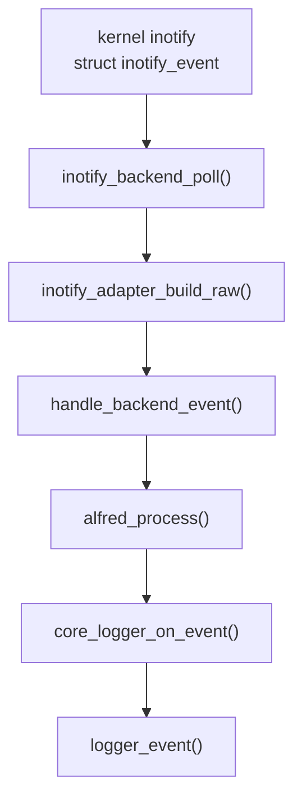

Il punto importante e' che `inotify_backend_poll()` non deve decidere la
semantica finale. Il backend produce fatti raw; `alfred_process()` produce
eventi semantici.

## Call graph guidato

Questa sezione serve a leggere il codice dall'esterno verso l'interno. Non e'
un elenco completo di tutte le funzioni, ma una mappa delle chiamate che
separano le responsabilita' principali.

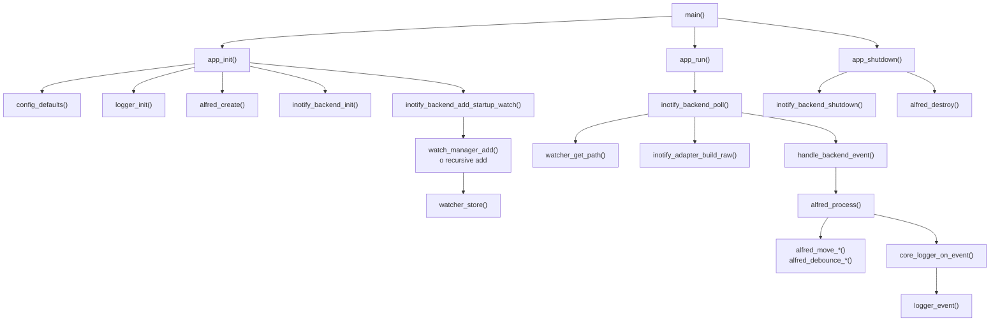

Lettura della mappa:

- `main()` non conosce inotify, core o watch table: avvia il ciclo di vita
  applicativo.
- `app_init()` costruisce i sottosistemi nell'ordine in cui servono:
  configurazione, logger, core, backend e watch iniziali.
- `app_run()` non interpreta eventi: chiama il backend e lascia che sia il
  backend a leggere dal file descriptor.
- `inotify_backend_poll()` e' il confine tecnico con Linux: legge
  `struct inotify_event`, recupera il path parent, costruisce un raw event
  Alfred e lo consegna all'app.
- `handle_backend_event()` e' volutamente piccolo: inoltra il raw event al core.
- `alfred_process()` e' il punto in cui inizia la semantica Alfred.

Questa distinzione aiuta a evitare un errore comune quando si legge una codebase
grande: cercare "la funzione che fa tutto". Alfred e' invece diviso in funzioni
che cambiano livello di astrazione. Il passaggio importante non e' solo
"chiama un'altra funzione", ma "da questo punto in poi il dato ha un significato
diverso".

## Ciclo backend inotify

Il ciclo backend e' tutto cio' che accade prima del core. Il suo compito e'
rispondere a questa domanda:

```text
che fatto tecnico e' appena arrivato dal filesystem?
```

Non deve invece rispondere alla domanda:

```text
che evento semantico deve vedere l'utente?
```

Passi principali del ciclo backend:

1. `inotify_backend_init()` inizializza `watcher_table_t` e apre il file
   descriptor inotify non bloccante.
2. `inotify_backend_add_startup_watch()` installa i watch sui path passati da
   riga di comando.
3. `watch_manager_add()` chiama `inotify_add_watch()` usando
   `config.watch_mask`.
4. `watcher_store()` salva la relazione `wd -> path`.
5. `inotify_backend_poll()` legge uno o piu' record dal file descriptor.
6. `watcher_get_path()` recupera la directory parent associata al `wd`.
7. `inotify_adapter_build_raw()` costruisce `alfred_raw_event_t`.
8. la callback `handle_backend_event()` porta il raw event verso il core.
9. `backend_handle_dir_create()` aggiorna i watch ricorsivi dopo una directory
   creata e genera raw event sintetici per directory scoperte troppo tardi.

Schema dati del ciclo backend:

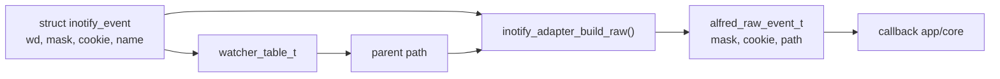

Il backend modifica stato solo quando quello stato appartiene al backend:

| Stato | Modificato da | Perche' appartiene al backend |
| --- | --- | --- |
| `inotify_backend_t.fd` | `inotify_backend_init()`, `inotify_backend_shutdown()` | e' il descrittore Linux letto dal backend |
| `watcher_table_t` | `watcher_store()`, `watcher_remove()` | serve a tradurre `wd` in path |
| watch ricorsivi | `watch_manager_add_recursive*()` | mantengono osservabile l'albero filesystem |
| raw sintetici per discovery | `backend_emit_synthetic_dir_create()` | riparano un limite di osservazione del backend |

`WATCH_ADDED` e `WATCH_REMOVED` restano log diagnostici del backend. Non sono
eventi semantici perche' non descrivono un cambiamento del file osservato, ma un
cambiamento dello stato interno del monitor.

## Ciclo core

Il ciclo core inizia quando esiste gia' un `alfred_raw_event_t`. La domanda del
core e':

```text
quale evento stabile deve vedere l'applicazione?
```

Passi principali del ciclo core:

1. `alfred_process()` riceve un raw event gia' normalizzato.
2. `alfred_move_sweep()` rimuove eventuali move pendenti scaduti.
3. un raw `CREATE` diventa `FILE_CREATED` o `DIR_CREATED`.
4. un raw `CLOSE_WRITE` diventa `FILE_READY`.
5. un raw `MODIFY` passa da `alfred_debounce_get()` e
   `alfred_debounce_should_emit()` prima di diventare `FILE_MODIFIED`.
6. un raw `DELETE` diventa `FILE_DELETED` o `DIR_DELETED`.
7. un raw `MOVED_FROM` viene salvato in `moves[1024]`.
8. un raw `MOVED_TO` cerca il `MOVED_FROM` con lo stesso cookie, poi
   `classify_move()` sceglie `RENAMED`, `MOVED` o `RELOCATED`.
9. `emit()` assegna `seq`, costruisce `alfred_event_t` e chiama la callback.

Schema dati del ciclo core:

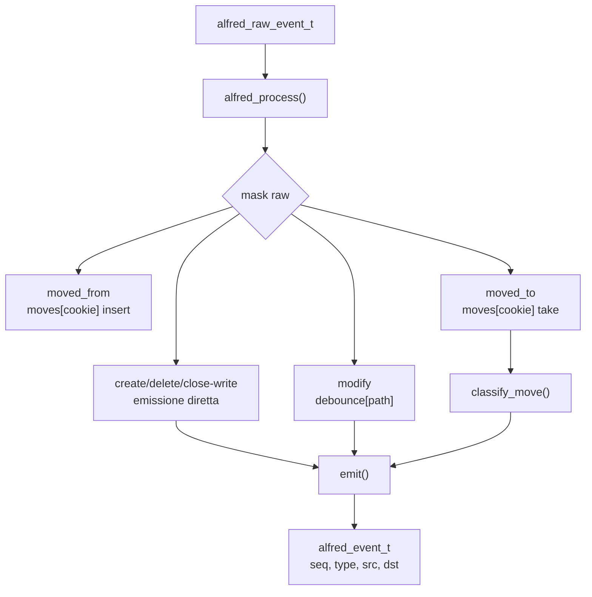

La differenza fra backend e core diventa evidente nei move:

- il backend vede due fatti tecnici: `MOVED_FROM` e `MOVED_TO`
- il core produce un solo risultato semantico: `RENAMED`, `MOVED` o
  `RELOCATED`

Questo e' il motivo per cui la cache move legacy non deve tornare nel percorso
runtime normale. La correlazione dei move e' semantica, quindi appartiene al
core.

## Strutture dati backend

Le strutture dati principali del backend inotify sono:

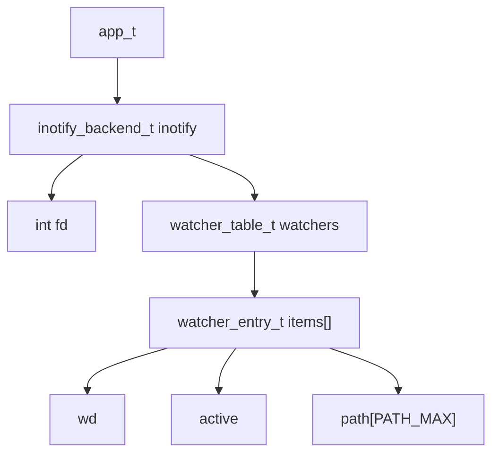

`app_t` contiene ancora il backend inotify perche' il progetto e' in fase di
integrazione. La direzione finale e' avere un backend sempre piu' autonomo, ma
oggi il campo `app_t.inotify` rende esplicito dove vivono `fd` e tabella dei
watch.

### Dipendenze backend da `app_t`

Il backend riceve ancora `app_t *` in molte funzioni. Questo non significa che
usi tutta l'applicazione. La lettura del codice mostra che le dipendenze reali
sono limitate e abbastanza regolari.

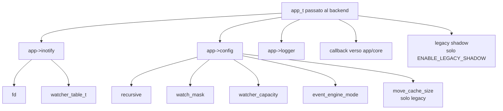

Tabella di lettura:

| Dipendenza | Dove serve | Perche' serve | Dovrebbe restare visibile al backend finale? |
| --- | --- | --- | --- |
| `app->inotify.fd` | `inotify_backend_poll()` tramite `ctx.runtime`, `watch_manager_add()`, `watch_manager_remove()` | leggere eventi e modificare watch kernel | si', come stato backend |
| `app->inotify.watchers` | poll tramite `ctx.runtime`, add/remove watch, discovery ricorsiva | tradurre `wd` in path e mantenere mapping | si', come stato backend |
| `app->config.recursive` | startup watch e `backend_handle_dir_create()` lo leggono tramite `ctx.config` | decidere se mantenere watch ricorsivi | si', come configurazione backend |
| `app->config.watch_mask` | `watch_manager_add()` | scegliere quali eventi inotify ascoltare | si', come configurazione backend |
| `app->config.watcher_capacity` | `inotify_backend_init()` tramite `ctx.config` | dimensione iniziale watcher table | si', come configurazione backend |
| `app->config.event_engine_mode` | init e poll tramite `ctx.config` | abilitare o rifiutare shadow mode | temporaneo, finche' shadow esiste |
| `app->config.move_cache_size` | `legacy_events_init()` tramite `ctx.config` | dimensione cache move legacy | no nel percorso core finale |
| `app->logger` | backend tramite `ctx.logger` e watch manager | raw log, errori, `WATCH_ADDED`, `WATCH_REMOVED` | si', ma come dipendenza esplicita |
| callback `on_event` | `inotify_backend_poll()` e raw sintetici | consegnare `alfred_raw_event_t` all'app/core | si', ma con contesto opaco piu' stretto |

Questa tabella e' utile per il prossimo refactor perche' separa due idee che
spesso vengono confuse:

- ownership: chi possiede davvero il dato
- accesso: chi ha bisogno di leggerlo o modificarlo durante una funzione

Oggi `app_t` risolve entrambi i problemi in modo pratico ma largo. Il backend
riceve tutto il contenitore, anche se usa solo una parte. Il refactor finale
dovrebbe rendere visibili solo le dipendenze necessarie.

Il micro-refactor su `inotify_backend_init()` segue esattamente questa
direzione senza cambiare la firma pubblica. La funzione riceve ancora `app_t`,
ma costruisce subito un `inotify_backend_context_t` locale e poi usa:

- `ctx.runtime->watchers` per inizializzare e distruggere la tabella dei watch
- `ctx.runtime->fd` per aprire, loggare e chiudere il file descriptor inotify
- `ctx.config->watcher_capacity` per dimensionare la watcher table
- `ctx.config->event_engine_mode` e `ctx.config->move_cache_size` per il ponte
  legacy/shadow
- `ctx.logger` per diagnostica ed errori

Questa e' una distinzione didattica importante: anche se l'API pubblica non e'
ancora cambiata, il corpo della funzione mostra gia' quali dati appartengono al
backend e quali sono solo dipendenze prese in prestito dall'applicazione.

Il micro-refactor su `inotify_backend_shutdown()` completa la simmetria con
`init()`. Anche qui la funzione riceve ancora `app_t`, ma costruisce un
`inotify_backend_context_t` locale e poi usa:

- `ctx.runtime->fd` per controllare, chiudere e invalidare il file descriptor
- `ctx.runtime->watchers` per distruggere la tabella dei watch

`legacy_events_shutdown()` resta fuori dal context per scelta esplicita: e' un
residuo del ponte legacy/shadow e non rappresenta stato del backend core
finale. Quando shadow mode verra' rimosso, anche quel cleanup sparira' o verra'
spostato in una struttura legacy dedicata.

### Context backend proposto

La proposta scelta e' introdurre un context separato. In questo modo
`inotify_backend_t` continua a rappresentare lo stato posseduto dal backend,
mentre il context rappresenta le dipendenze prese in prestito.

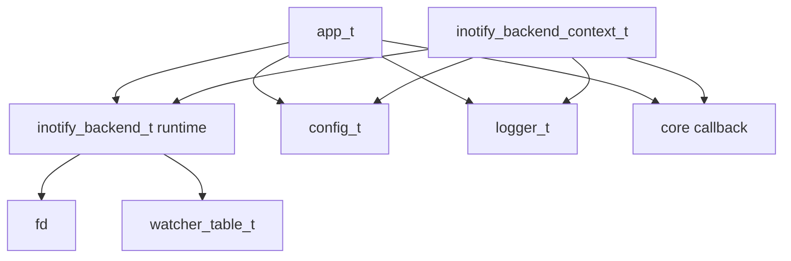

Forma concettuale:

```c
typedef struct inotify_backend_context {
    inotify_backend_t *runtime;
    const config_t *config;
    logger_t *logger;
    inotify_backend_event_fn on_event;
    void *userdata;
} inotify_backend_context_t;
```

Il context non deve possedere `config`, `logger` o callback. Li usa soltanto
mentre l'applicazione e' viva. Questa distinzione e' centrale:

```text
possedere un dato  -> doverlo inizializzare e liberare
prendere in prestito -> poterlo usare entro una lifetime garantita da altri
```

Con questa proposta, il backend finale dovrebbe leggere cosi':

```text
app_t
  possiede config, logger, core e inotify_backend_t

inotify_backend_t
  possiede fd e watcher_table_t

inotify_backend_context_t
  collega temporaneamente backend, config, logger e callback
  durante init, poll, watch management e discovery
```

Perche' non mettere direttamente `config` e `logger` dentro
`inotify_backend_t`? Perche' non sono davvero posseduti dal backend. Sono
servizi applicativi condivisi. Inserirli come puntatori permanenti nello stato
runtime sarebbe possibile, ma renderebbe meno chiaro agli studenti quali campi
devono essere liberati dal backend e quali invece sono solo riferimenti.

Il primo candidato alla migrazione e' il watch manager:

```text
prima:
  watch_manager_add(app, path)

dopo il primo micro-refactor:
  watch_manager_add(ctx, path)
```

Questo passo e' abbastanza piccolo perche' il watch manager usa solo:

- fd
- watcher table
- watch mask
- logger

Non usa il core e non dovrebbe conoscere l'app completa.

Lo stato attuale del codice segue questa direzione: `watch_manager.c` lavora con
`inotify_backend_context_t`, mentre `inotify_backend.c` costruisce un context
locale quando deve installare, rimuovere o scoprire watch. Questo non elimina
ancora `app_t` dal backend, ma riduce gia' l'area che lo vede.

Frame logico del nuovo passaggio:

```text
app_t app
  app.inotify  -> stato runtime
  app.config   -> configurazione
  app.logger   -> diagnostica

inotify_backend_add_startup_watch(app, path):
  backend_context_from_app(app, &ctx)
  backend_add_startup_watch(&ctx, path)

backend_add_startup_watch(ctx, path):
  legge ctx->config->recursive

watch_manager_add(&ctx, path):
  usa ctx.runtime->fd
  usa ctx.runtime->watchers
  usa ctx.config->watch_mask
  usa ctx.logger

inotify_backend_shutdown(app):
  backend_context_from_app(app, &ctx)
  backend_shutdown(&ctx)

backend_shutdown(ctx):
  chiude ctx->runtime->fd
  legacy_events_shutdown() se compilato
  watcher_destroy(&ctx->runtime->watchers)
```

Anche la discovery ricorsiva usa ora lo stesso context:

```text
backend_handle_dir_create(ctx, ev, on_event, userdata)
  legge ctx.config->recursive
  cerca il path padre in ctx.runtime->watchers
  backend_emit_context_t:
    ctx = ctx
    on_event = on_event
    userdata = userdata
  watch_manager_add_recursive_with_discovery(ctx, ...)
  backend_process_discovered_dir(ctx, path, userdata)
  backend_emit_synthetic_dir_create(ctx, path, on_event, userdata)
```

La callback pubblica ora e':

```c
typedef int (*inotify_backend_event_fn)(
    const alfred_raw_event_t *raw,
    void *userdata
);
```

Quindi il backend consegna solo il raw event e un puntatore opaco. Nel runtime
attuale `app_run()` passa `app` come `userdata`, e `handle_backend_event()` lo
ricostruisce:

```text
inotify_backend_poll(app, handle_backend_event, app)
handle_backend_event(raw, userdata)
  app = userdata
  alfred_process(app->core, raw)
```

Questo e' piu' pulito perche' il backend non deve conoscere il tipo del consumer
del raw event. Sa solo invocare una callback.

Anche il corpo di `inotify_backend_poll()` e' stato ristretto verso il context:

```text
inotify_backend_poll(app, on_event, userdata)
  backend_context_from_app(app, &ctx)
  read(ctx.runtime->fd, ...)
  watcher_get_path(&ctx.runtime->watchers, wd)
  logger_raw(ctx.logger, ...)
  on_event(raw, userdata)
  backend_handle_dir_create(&ctx, ev, on_event, userdata)
  backend_dispatch_legacy_shadow(app, &ctx, ev)
```

La scelta core/shadow viene letta dal context. La chiamata diretta al
dispatcher storico non e' piu' nel corpo principale del poll: passa da
`backend_dispatch_legacy_shadow()`. Questa funzione e' un bridge temporaneo:
riceve ancora `app_t` perche' `events.c` richiede l'app completa, ma rende
esplicito che quella dipendenza appartiene solo al percorso legacy/shadow e non
al percorso backend/raw/core.

## Struttura dati di configurazione

`config_t` guida molte decisioni prese durante l'inizializzazione. Non e' una
struttura dati del backend in senso stretto, ma il backend legge alcuni suoi
campi per sapere come comportarsi.

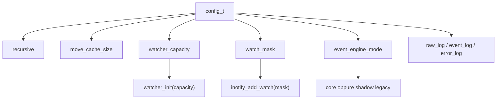

Campi rilevanti:

| Campo | Significato | Scritto da | Letto da |
| --- | --- | --- | --- |
| `recursive` | abilita watch ricorsivi | `config_defaults()`, `config_load()` | `inotify_backend_add_startup_watch()`, `backend_handle_dir_create()` |
| `move_cache_size` | capacita' della cache move legacy | `config_defaults()`, `config_load()` | `legacy_events_init()` |
| `watcher_capacity` | capacita' iniziale della tabella watch | `config_defaults()`, `config_load()` | `watcher_init()` |
| `watch_mask` | maschera inotify usata per aggiungere watch | `config_defaults()` | `watch_manager_add()` |
| `event_engine_mode` | sceglie core o shadow | `config_defaults()`, `config_load()`, `config_set_event_engine()` | `app_init()`, `inotify_backend_init()`, `inotify_backend_poll()`, `core_logger_on_event()` |

`watch_mask` e' un buon esempio di confine fra configurazione e backend:
`config_defaults()` prende il valore da `watch_manager_default_mask()`, poi
`watch_manager_add()` usa quel valore quando chiama `inotify_add_watch()`.

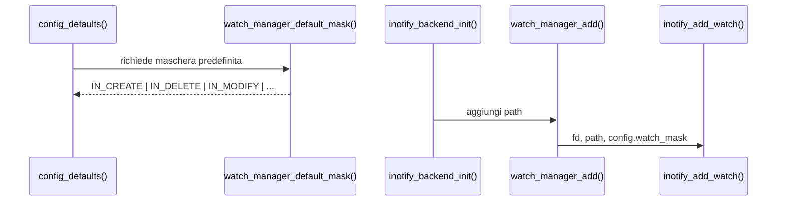

Il parsing delle capacita' usa una funzione dedicata invece di `atoi()`. Il
motivo e' che campi come `move_cache_size` e `watcher_capacity` sono `size_t`:
accettare per errore valori negativi o stringhe non numeriche potrebbe produrre
valori enormi o ambigui. La funzione di parsing mantiene il valore precedente
quando l'input non e' valido.

`event_engine_mode=shadow` ha anche un vincolo di build: funziona solo se il
binario e' stato compilato con `ENABLE_LEGACY_SHADOW=1`. Nella build normale
core-only, chiedere shadow e' un errore esplicito, perche' non esiste un
dispatcher legacy compilato con cui confrontare il core.

### `inotify_backend_t`

Definizione:

```c
typedef struct inotify_backend {
    int fd;
    watcher_table_t watchers;
} inotify_backend_t;
```

Campi:

| Campo | Significato | Scritto da | Letto da |
| --- | --- | --- | --- |
| `fd` | file descriptor inotify non bloccante | `inotify_backend_init()`, `inotify_backend_shutdown()` | `inotify_backend_poll()`, `watch_manager_add()`, `watch_manager_remove()` |
| `watchers` | tabella `wd -> path` | `watcher_init()`, `watcher_store()`, `watcher_remove()`, `watcher_destroy()` | `watcher_get_path()`, `watcher_exists()` |

### `watcher_table_t`

Definizione:

```c
typedef struct {
    watcher_entry_t *items;
    size_t count;
    size_t capacity;
} watcher_table_t;
```

Questa tabella e' indicizzata direttamente dal watch descriptor `wd`. Se il
kernel restituisce `wd=7`, il path associato si trova in `items[7]`, dopo aver
controllato che l'indice sia valido e che lo slot sia attivo.

Campi:

| Campo | Significato | Scritto da | Letto da |
| --- | --- | --- | --- |
| `items` | array dinamico di slot | `watcher_init()`, `watcher_expand()`, `watcher_destroy()` | tutte le funzioni `watcher_*` |
| `count` | numero di slot attivi | `watcher_init()`, `watcher_store()`, `watcher_remove()`, `watcher_destroy()` | `watcher_count()`, `watcher_dump()` |
| `capacity` | numero di slot allocati | `watcher_init()`, `watcher_expand()`, `watcher_destroy()` | `watcher_expand()`, `watcher_get_path()`, `watcher_exists()` |

### `watcher_entry_t`

Definizione:

```c
typedef struct {
    int wd;
    int active;
    char path[PATH_MAX];
} watcher_entry_t;
```

Campi:

| Campo | Significato | Scritto da | Letto da |
| --- | --- | --- | --- |
| `wd` | watch descriptor restituito dal kernel | `watcher_store()`, `watcher_remove()` | `watcher_dump()` |
| `active` | indica se lo slot contiene una mappatura valida | `watcher_store()`, `watcher_remove()`, `watcher_expand()` | `watcher_get_path()`, `watcher_exists()`, `watcher_dump()` |
| `path` | directory osservata associata al `wd` | `watcher_store()`, `watcher_remove()` | `watcher_get_path()`, `watcher_dump()` |

## Inserimento di un watch

Scenario:

```text
Alfred deve osservare /tmp/progetto
```

Sequenza:

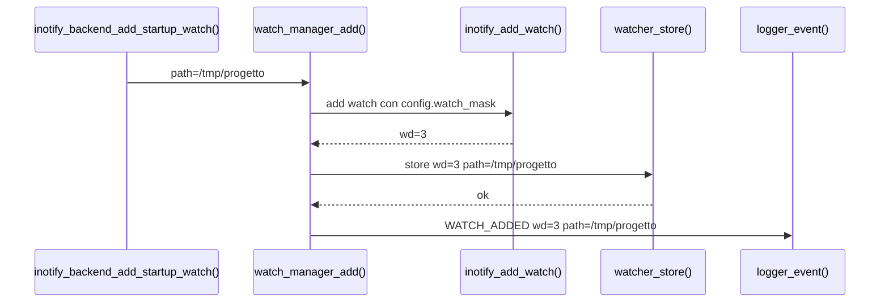

Effetto sulla struttura dati:

```text
prima:
items[3].active = 0

dopo watcher_store():
items[3].wd     = 3
items[3].active = 1
items[3].path   = "/tmp/progetto"
count           = count + 1
```

Il log `WATCH_ADDED` e' diagnostica backend. Non e' un evento semantico del
core.

## Lettura di un evento inotify

Scenario:

```text
kernel invia IN_CREATE name=file.txt wd=3
```

Sequenza:

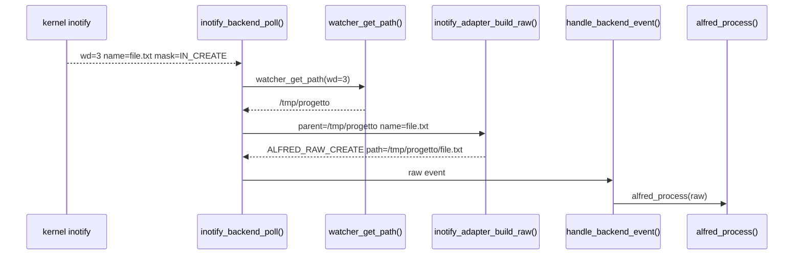

La tabella dei watch serve per ricostruire il path completo. Senza
`watcher_get_path()`, il backend conoscerebbe solo `file.txt`, non
`/tmp/progetto/file.txt`.

## Adapter inotify e raw event

`inotify_adapter.c` e' intenzionalmente stateless. Non possiede strutture dati
persistenti: riceve una `struct inotify_event`, il path parent recuperato dalla
watcher table e un buffer temporaneo per costruire il path completo.

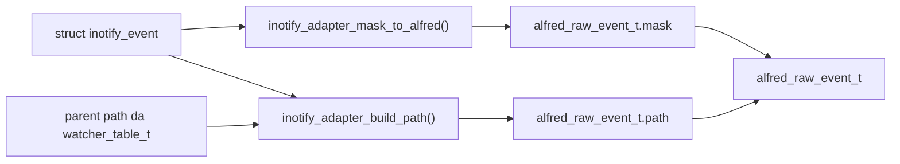

La funzione `inotify_adapter_build_raw()` non alloca memoria per il path. Il
campo `raw.path` punta al buffer `full_path` passato dal chiamante:

```text
inotify_backend_poll()
    char full_path[PATH_MAX]
    alfred_raw_event_t raw
    inotify_adapter_build_raw(..., full_path, ..., &raw)
    handle_backend_event(..., &raw, ...)
    alfred_process(core, &raw)
```

Questo significa che il core deve consumare il raw event subito. Se un livello
volesse conservare l'evento oltre la chiamata, dovrebbe copiare il path.

## Rimozione di un watch

Scenario:

```text
un watch non serve piu' oppure inotify segnala IN_IGNORED
```

Sequenza:

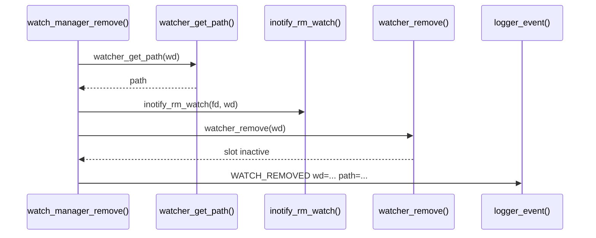

Effetto sulla struttura dati:

```text
prima:
items[wd].active = 1
items[wd].path   = "/tmp/progetto"

dopo watcher_remove():
items[wd].active = 0
items[wd].wd     = -1
items[wd].path   = ""
count            = count - 1
```

Anche `WATCH_REMOVED` e' diagnostica backend, non semantica core.

## Creazione ricorsiva veloce

Scenario delicato:

```bash
mkdir -p one/two/three
```

Problema: inotify puo' consegnare solo la creazione di `one`, perche' `two` e
`three` possono nascere prima che Alfred abbia installato i watch sui nuovi
genitori.

Sequenza semplificata:

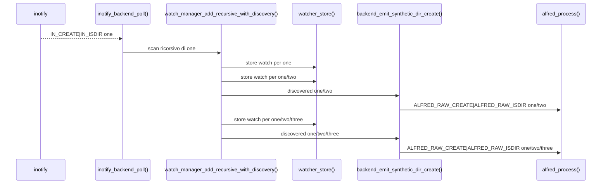

Qui il watch manager non dice "e' avvenuto un evento semantico". Dice solo:

```text
ho scoperto una directory che esiste gia' durante lo scan
```

Il backend trasforma questa scoperta in un raw event sintetico. Il core decide
la semantica e produce `DIR_CREATED`.

## Strutture dati del core

Arrivati a questo punto della lettura guidata, il backend ha gia' trasformato
gli eventi del kernel in `alfred_raw_event_t`. Ora entra in gioco il core, che
ha bisogno di memoria interna per trasformare eventi raw isolati in eventi
semantici coerenti.

Le due situazioni principali sono:

- `MOVED_FROM` e `MOVED_TO` arrivano come due raw event separati, ma devono
  diventare un solo evento semantico
- molti `MODIFY` ravvicinati sullo stesso file devono essere ridotti con debounce

Le strutture vivono in:

```text
core/src/alfred_tables.h
core/src/alfred_tables.c
```

Schema generale:

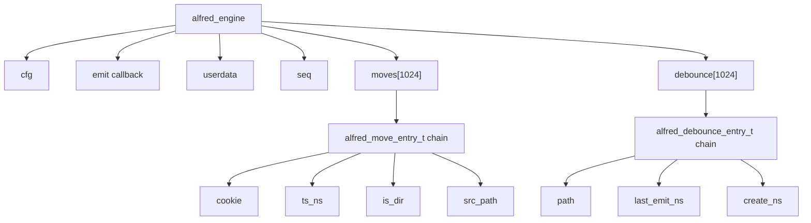

### `alfred_engine`

Campi principali:

| Campo | Significato | Scritto da | Letto da |
| --- | --- | --- | --- |
| `cfg` | configurazione interna del core | `alfred_create()` | correlatore, debounce, sweep move |
| `emit` | callback per emettere eventi semantici | `alfred_create()` | `emit()` |
| `userdata` | contesto passato alla callback | `alfred_create()` | `emit()` |
| `seq` | numero progressivo degli eventi semantici | `alfred_create()`, `emit()` | `core_logger_on_event()` tramite evento emesso |
| `moves[1024]` | tabella hash dei move pendenti | `alfred_move_insert()`, `alfred_move_take()`, `alfred_move_sweep()` | `alfred_process()` |
| `debounce[1024]` | tabella hash per debounce MODIFY | `alfred_debounce_get()`, `alfred_debounce_should_emit()` | `alfred_process()` |

Nota su `seq`: il numero progressivo e' utile per debug e log verbose, ma non
definisce la semantica. Due eventi con tipo e path uguali non cambiano
significato perche' hanno un numero di sequenza diverso; il numero aiuta solo a
ricostruire l'ordine di emissione.

### `alfred_move_entry_t`

Questa struttura salva un `MOVED_FROM` finche' arriva il `MOVED_TO` con lo
stesso cookie.

| Campo | Significato | Scritto da | Letto da |
| --- | --- | --- | --- |
| `cookie` | cookie raw che collega `MOVED_FROM` e `MOVED_TO` | `alfred_move_insert()` | `alfred_move_take()` |
| `ts_ns` | timestamp raw del `MOVED_FROM` | `alfred_move_insert()` | `alfred_move_sweep()` |
| `pid` | pid se noto | `alfred_move_insert()` | uso futuro |
| `is_dir` | indica se l'oggetto e' directory | `alfred_move_insert()` | `classify_move()` tramite `alfred_process()` |
| `src_path` | path sorgente copiato e posseduto dal core | `alfred_move_insert()` | `alfred_process()` |
| `next` | prossimo elemento nello stesso bucket hash | `alfred_move_insert()`, `alfred_move_take()` | funzioni tabella |

Perche' `src_path` viene copiato? Perche' il raw event ricevuto dal backend
punta spesso a un buffer locale valido solo durante la chiamata. Il core deve
conservare il path sorgente fino all'arrivo del `MOVED_TO`, quindi ne prende una
copia.

Sequenza move nel core:

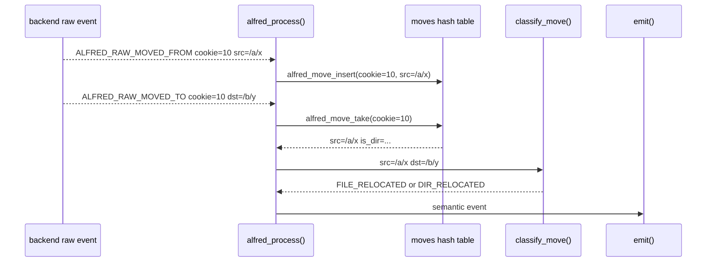

Frame logici per una futura animazione:

```text
frame 1:
  moves[bucket].head = NULL

frame 2:
  raw MOVED_FROM cookie=10 path=/a/x

frame 3:
  alfred_move_insert():
    entry.cookie = 10
    entry.src_path = copy("/a/x")
    entry.next = old bucket head
    moves[bucket] = entry

frame 4:
  raw MOVED_TO cookie=10 path=/b/y

frame 5:
  alfred_move_take():
    remove entry from bucket
    return src_path=/a/x

frame 6:
  classify_move(/a/x, /b/y)
  emit FILE_RELOCATED or DIR_RELOCATED
```

### `alfred_debounce_entry_t`

Questa struttura riduce i `MODIFY` ripetuti sullo stesso path.

| Campo | Significato | Scritto da | Letto da |
| --- | --- | --- | --- |
| `path` | path usato come chiave debounce | `alfred_debounce_get()` | `alfred_debounce_get()` |
| `last_emit_ns` | ultimo timestamp in cui e' stato emesso `FILE_MODIFIED` | `alfred_debounce_should_emit()` | `alfred_debounce_should_emit()` |
| `create_ns` | riservato per futura correlazione create-ready | non ancora usato in modo completo | uso futuro |
| `next` | prossimo elemento nello stesso bucket hash | `alfred_debounce_get()` | funzioni tabella |

Sequenza debounce:

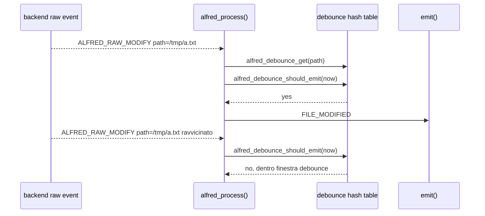

Qui il fatto raw non viene perso: il backend lo ha osservato. Il core decide
pero' che non tutti i `MODIFY` ravvicinati devono diventare eventi semantici,
perche' molti programmi salvano file generando raffiche di modifiche tecniche.

## Vista dinamica futura

Questa pagina e' pensata per essere trasformata in una vista dinamica in una
fase successiva.

Mermaid e' ottimo per diagrammi statici e sequence diagram, ma non produce GIF
animate vere. Per animare gli stati delle strutture dati conviene separare i
dati dalla resa grafica:

1. descrivere ogni scenario come una sequenza di frame
2. generare SVG o PNG per ogni frame
3. assemblare i frame in GIF o video con strumenti esterni

Esempio di frame per `watch_manager_add()`:

```text
frame 1:
  watcher_table.count = 0
  items[3].active = 0

frame 2:
  inotify_add_watch() restituisce wd=3

frame 3:
  watcher_store() scrive:
    items[3].wd = 3
    items[3].active = 1
    items[3].path = "/tmp/progetto"
    count = 1

frame 4:
  logger_event("WATCH_ADDED wd=3 path=/tmp/progetto")
```

Possibili tecniche future:

| Tecnica | Vantaggio | Svantaggio |
| --- | --- | --- |
| Mermaid | integrato nei Markdown, facile da leggere | statico, non adatto a GIF |
| Graphviz | ottimo per grafi e strutture dati | statico se usato da solo |
| SVG generato da script | controllabile e animabile | richiede codice dedicato |
| HTML/CSS/JavaScript | ideale per animazioni interattive | non sempre comodo da leggere offline |
| Manim | animazioni didattiche molto potenti | dipendenza pesante e piu' complessa |
| PNG + ffmpeg/ImageMagick | semplice per GIF/video | serve generare i frame |

La direzione consigliata e' partire da SVG generati da uno script, per esempio:

```bash
make docs-animations
```

Questo target non esiste ancora nel Makefile. Qui e' indicato come nome
probabile per una futura automazione.

con output in:

```text
docs/generated/animations/
```

Gli stessi dati potrebbero generare sia una GIF sia una pagina HTML
interattiva. Prima pero' conviene stabilizzare le tabelle e gli schemi statici,
perche' saranno la base dei frame animati.

### Formato consigliato per i frame

Per rendere generabile la documentazione dinamica, ogni scenario dovrebbe
seguire sempre questa struttura:

````text
### Scenario animabile: nome scenario

Trigger:

```text
comando o evento che fa partire lo scenario
```

Frame:

```text
frame N - titolo breve:
  evento:
    cosa e' appena successo
  funzioni:
    funzione_a()
    funzione_b()
  strutture:
    struttura.campo = valore
  output:
    log o evento semantico prodotto
```
````

Non tutti i frame devono avere tutte le sottosezioni. Pero' quando un frame
modifica una struttura dati, la modifica deve essere esplicita. Questo e' il
punto che rende lo scenario animabile: uno script futuro puo' evidenziare il
campo modificato, mentre uno studente puo' seguire manualmente l'evoluzione
dello stato.

### Convenzioni per scenari futuri

- Usare nomi di funzioni reali, non pseudonimi generici.
- Usare nomi di campi reali quando il codice li espone.
- Separare eventi raw, eventi diagnostici backend ed eventi semantici core.
- Specificare quando un path e' copiato e quando invece e' solo preso in
  prestito da un buffer temporaneo.
- Evidenziare sempre se un comportamento appartiene al runtime core o al
  percorso legacy shadow.
- Se una scelta dipende da una regola teorica, aggiungere un rimando ai capitoli
  pertinenti: guida C, flusso eventi, semantica eventi o glossario.

### Possibile pipeline futura

Una pipeline leggera potrebbe essere:

```text
docs/it/16-mappa-codice-e-strutture.md
    -> parser scenari
    -> frame JSON intermedi
    -> renderer SVG
    -> GIF/video/HTML
```

Output ipotetico:

```text
docs/generated/animations/watch-add/
├── frames.json
├── frame-001.svg
├── frame-002.svg
├── watch-add.gif
└── index.html
```

Il file Markdown deve restare la sorgente didattica principale. I file generati
devono essere considerati derivati: utili per le lezioni, ma non il posto dove
scrivere le spiegazioni.

## Scenari animabili

Questa sezione raccoglie scenari gia' scritti come sequenze di frame. Ogni frame
descrive:

- l'evento o la chiamata che fa avanzare il processo
- quali funzioni entrano in gioco
- quali campi delle strutture dati cambiano
- quale output diagnostico o semantico viene prodotto

Questi frame sono volutamente testuali. In una fase successiva potranno essere
letti da uno script o trasformati manualmente in SVG, GIF, video o pagine HTML
interattive.

### Scenario animabile: aggiunta watch iniziale

Trigger:

```text
./alfred /tmp/progetto
```

Frame:

```text
frame 1 - configurazione pronta:
  config.recursive = 1
  config.watch_mask = IN_CREATE | IN_DELETE | IN_MODIFY | ...
  config.watcher_capacity = 128

frame 2 - backend inizializzato:
  inotify_backend_init()
  app.inotify.fd = <fd inotify>
  watcher_init(&app.inotify.watchers, 128)
  watchers.count = 0

frame 3 - richiesta watch:
  inotify_backend_add_startup_watch(app, "/tmp/progetto")
  watch_manager_add_recursive() oppure watch_manager_add()

frame 4 - chiamata kernel:
  watch_manager_add()
  inotify_add_watch(fd, "/tmp/progetto", config.watch_mask)
  kernel restituisce wd=3

frame 5 - aggiornamento watcher table:
  watcher_store(wd=3, path="/tmp/progetto")
  watchers.items[3].wd = 3
  watchers.items[3].active = 1
  watchers.items[3].path = "/tmp/progetto"
  watchers.count = 1

frame 6 - output diagnostico:
  logger_event("WATCH_ADDED wd=3 path=/tmp/progetto")
```

Messaggio didattico: il watch e' stato aggiunto al backend, non al core. Il core
non conosce `wd=3`; ricevera' solo raw event con path gia' ricostruito.

### Scenario animabile: create file

Trigger:

```bash
touch /tmp/progetto/a.txt
```

Frame:

```text
frame 1 - evento kernel:
  struct inotify_event:
    wd = 3
    mask = IN_CREATE
    name = "a.txt"

frame 2 - lookup path parent:
  inotify_backend_poll()
  watcher_get_path(&watchers, 3) -> "/tmp/progetto"

frame 3 - conversione raw:
  inotify_adapter_build_path("/tmp/progetto", "a.txt")
  full_path = "/tmp/progetto/a.txt"
  inotify_adapter_mask_to_alfred(IN_CREATE)
  raw.mask = ALFRED_RAW_CREATE
  raw.path = full_path

frame 4 - ingresso nel core:
  handle_backend_event(&raw, app)
  alfred_process(app->core, &raw)

frame 5 - evento semantico:
  alfred_process()
  raw.mask contiene ALFRED_RAW_CREATE
  emit(ALFRED_EV_FILE_CREATED, "/tmp/progetto/a.txt", NULL)

frame 6 - log ufficiale:
  core_logger_on_event()
  logger_event("FILE_CREATED path=/tmp/progetto/a.txt")
```

Messaggio didattico: il backend ricostruisce il fatto tecnico, il core decide il
nome semantico `FILE_CREATED`.

### Scenario animabile: close-write / file ready

Trigger:

```bash
printf "hello" > /tmp/progetto/a.txt
```

Frame:

```text
frame 1 - evento tecnico:
  kernel invia IN_CLOSE_WRITE per a.txt

frame 2 - raw event:
  inotify_adapter_mask_to_alfred(IN_CLOSE_WRITE)
  raw.mask = ALFRED_RAW_CLOSE_WRITE
  raw.path = "/tmp/progetto/a.txt"

frame 3 - core:
  alfred_process()
  raw.mask contiene ALFRED_RAW_CLOSE_WRITE

frame 4 - semantica:
  emit(ALFRED_EV_FILE_READY, "/tmp/progetto/a.txt", NULL)

frame 5 - log:
  FILE_READY path=/tmp/progetto/a.txt
```

Messaggio didattico: `FILE_READY` non e' un duplicato di `FILE_CREATED`; indica
che una scrittura e' stata chiusa e il file e' pronto per lettura o indicizzazione.

### Scenario animabile: modify debounced

Trigger:

```bash
printf "x" >> /tmp/progetto/a.txt
printf "y" >> /tmp/progetto/a.txt
```

Frame:

```text
frame 1 - primo MODIFY:
  raw.mask = ALFRED_RAW_MODIFY
  raw.path = "/tmp/progetto/a.txt"

frame 2 - creazione stato debounce:
  alfred_debounce_get(path)
  bucket = path_index("/tmp/progetto/a.txt")
  nuova alfred_debounce_entry_t:
    path = copy("/tmp/progetto/a.txt")
    last_emit_ns = 0

frame 3 - prima emissione:
  alfred_debounce_should_emit(now)
  now - last_emit_ns >= modify_debounce_ms
  last_emit_ns = now
  emit(FILE_MODIFIED)

frame 4 - secondo MODIFY ravvicinato:
  alfred_debounce_get(path) trova la stessa entry
  alfred_debounce_should_emit(now2)

frame 5 - soppressione:
  now2 - last_emit_ns < modify_debounce_ms
  nessun evento semantico emesso
```

Messaggio didattico: il raw event arriva comunque al core. La soppressione
avviene solo nello stream semantico, per evitare rumore applicativo.

### Scenario animabile: move + rename nel core

Trigger:

```bash
mv /tmp/progetto/a.txt /tmp/altro/b.txt
```

Frame:

```text
frame 1 - prima meta':
  raw MOVED_FROM:
    cookie = 10
    path = "/tmp/progetto/a.txt"

frame 2 - salvataggio nel core:
  alfred_move_insert()
  bucket = move_index(10)
  entry.cookie = 10
  entry.src_path = copy("/tmp/progetto/a.txt")
  entry.next = moves[bucket]
  moves[bucket] = entry

frame 3 - seconda meta':
  raw MOVED_TO:
    cookie = 10
    path = "/tmp/altro/b.txt"

frame 4 - recupero:
  alfred_move_take(cookie=10)
  rimuove entry da moves[bucket]
  restituisce src_path="/tmp/progetto/a.txt"

frame 5 - classificazione:
  parent sorgente = "/tmp/progetto"
  parent destinazione = "/tmp/altro"
  basename sorgente = "a.txt"
  basename destinazione = "b.txt"
  parent diverso e nome diverso -> FILE_RELOCATED

frame 6 - output:
  emit(FILE_RELOCATED, src="/tmp/progetto/a.txt", dst="/tmp/altro/b.txt")
```

Messaggio didattico: il core produce un solo evento `RELOCATED`, mentre il
legacy storico puo' produrre due eventi (`MOVED` e `RENAMED`).

### Scenario animabile: recursive mkdir veloce

Trigger:

```bash
mkdir -p /tmp/progetto/one/two/three
```

Frame:

```text
frame 1 - evento osservabile:
  il kernel invia IN_CREATE|IN_ISDIR per "one"
  non invia create affidabili per "two" e "three" perche' i watch non esistono ancora

frame 2 - backend gestisce one:
  inotify_backend_poll()
  raw reale:
    ALFRED_RAW_CREATE | ALFRED_RAW_ISDIR
    path="/tmp/progetto/one"
  core emette DIR_CREATED one

frame 3 - discovery ricorsiva:
  backend_handle_dir_create()
  watch_manager_add_recursive_with_discovery("/tmp/progetto/one")

frame 4 - watch su one:
  watch_manager_add("/tmp/progetto/one")
  watcher_store(wd=4, path="/tmp/progetto/one")
  WATCH_ADDED wd=4 path=/tmp/progetto/one

frame 5 - scoperta two:
  recursive_walk() vede "/tmp/progetto/one/two"
  watch_manager_add()
  watcher_store(wd=5, path="/tmp/progetto/one/two")
  backend_process_discovered_dir(path="/tmp/progetto/one/two")

frame 6 - raw sintetico two:
  backend_emit_synthetic_dir_create()
  raw.mask = ALFRED_RAW_CREATE | ALFRED_RAW_ISDIR
  raw.path = "/tmp/progetto/one/two"
  core emette DIR_CREATED one/two

frame 7 - scoperta three:
  stesso schema:
    watcher_store(wd=6, path="/tmp/progetto/one/two/three")
    raw sintetico CREATE|ISDIR
    core emette DIR_CREATED one/two/three
```

Messaggio didattico: il raw sintetico non inventa una directory; rappresenta una
directory reale scoperta troppo tardi per ricevere l'evento kernel originale.

### Scenario animabile: rimozione watch

Trigger:

```text
il backend riceve IN_IGNORED oppure decide di rimuovere un watch
```

Frame:

```text
frame 1 - stato iniziale:
  watchers.items[3].active = 1
  watchers.items[3].path = "/tmp/progetto"

frame 2 - lookup per log:
  watch_manager_remove(app, wd=3)
  watcher_get_path(wd=3) -> "/tmp/progetto"

frame 3 - rimozione kernel:
  inotify_rm_watch(app.inotify.fd, 3)

frame 4 - rimozione tabella:
  watcher_remove(wd=3)
  watchers.items[3].active = 0
  watchers.items[3].wd = -1
  watchers.items[3].path = ""
  watchers.count = watchers.count - 1

frame 5 - output diagnostico:
  WATCH_REMOVED wd=3 path=/tmp/progetto
```

Messaggio didattico: `WATCH_REMOVED` descrive stato del backend. Non e' un
evento semantico del filesystem come `DIR_DELETED`.

## Strutture legacy shadow

Il percorso legacy e' ancora presente per confronto, ma non e' l'architettura
target. I file principali sono:

```text
modules/inotify/src/events.c
modules/inotify/src/move_cache.c
```

`events.c` riceve direttamente `struct inotify_event` e produce eventi
semantici legacy. Questo era il vecchio centro della semantica, ma oggi deve
essere letto come codice storico/shadow-only.

Questi file non fanno parte della build normale. Vengono compilati solo con:

```bash
make ENABLE_LEGACY_SHADOW=1
```

Senza quel flag, il binario contiene il backend inotify, l'adapter raw, il watch
manager e il core, ma non contiene il dispatcher legacy.

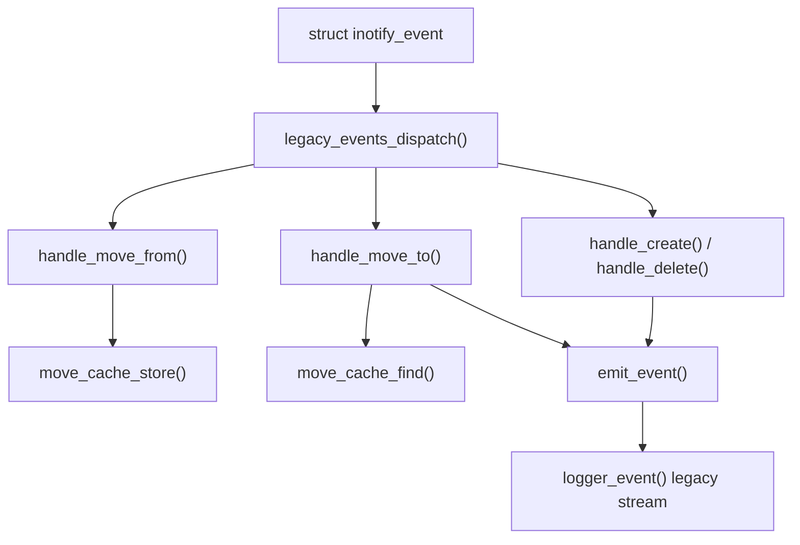

### `move_cache_t`

Definizione:

```c
typedef struct {
    move_slot_t *slots;
    size_t size;
} move_cache_t;
```

Campi:

| Campo | Significato | Scritto da | Letto da |
| --- | --- | --- | --- |
| `slots` | array dei `MOVED_FROM` legacy pendenti | `move_cache_init()`, `move_cache_destroy()` | `move_cache_store()`, `move_cache_find()`, `move_cache_clear()` |
| `size` | numero massimo di slot | `move_cache_init()`, `move_cache_destroy()` | helper interni di ricerca |

### `move_slot_t`

Definizione:

```c
typedef struct {
    uint32_t cookie;
    int src_wd;
    char src_name[NAME_MAX];
    int used;
} move_slot_t;
```

Campi:

| Campo | Significato | Scritto da | Letto da |
| --- | --- | --- | --- |
| `cookie` | cookie inotify della coppia move | `move_cache_store()`, `move_cache_clear()` | `move_cache_find()`, `handle_move_to()` |
| `src_wd` | watch descriptor sorgente | `move_cache_store()` | `handle_move_to()` |
| `src_name` | basename sorgente | `move_cache_store()` | `handle_move_to()` |
| `used` | slot occupato/libero | `move_cache_store()`, `move_cache_clear()` | helper interni e conteggi |

Sequenza legacy move:

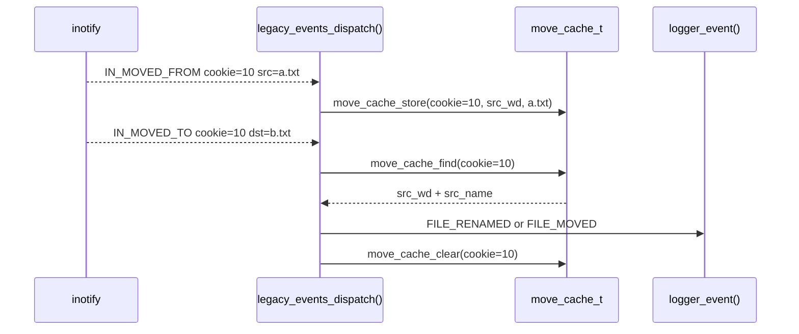

Differenza importante rispetto al core: se cambiano sia directory sia nome, il
legacy puo' emettere due eventi (`MOVED` e poi `RENAMED`). Il core invece emette
un solo evento `RELOCATED`. Per questo `move_cache_t` serve solo come confronto
storico e non deve guidare la semantica futura.
