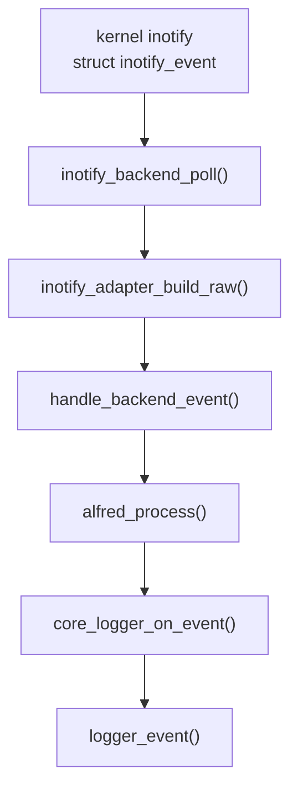
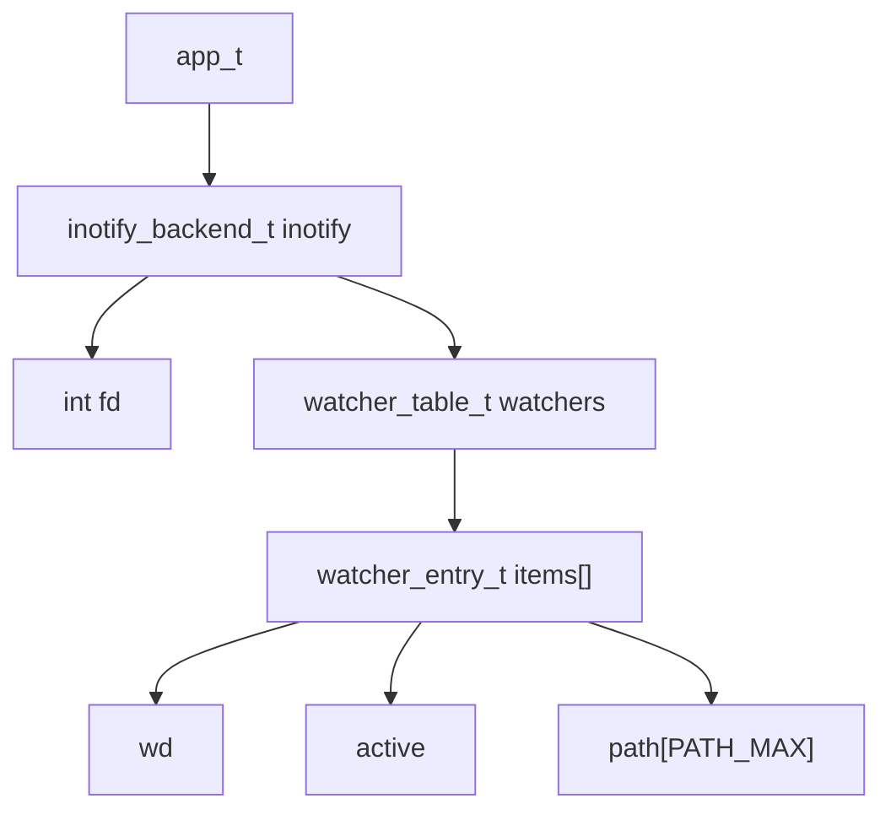
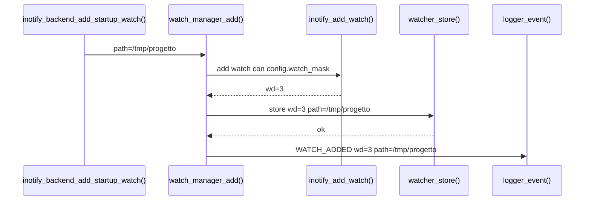
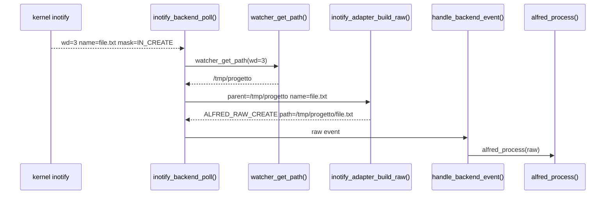
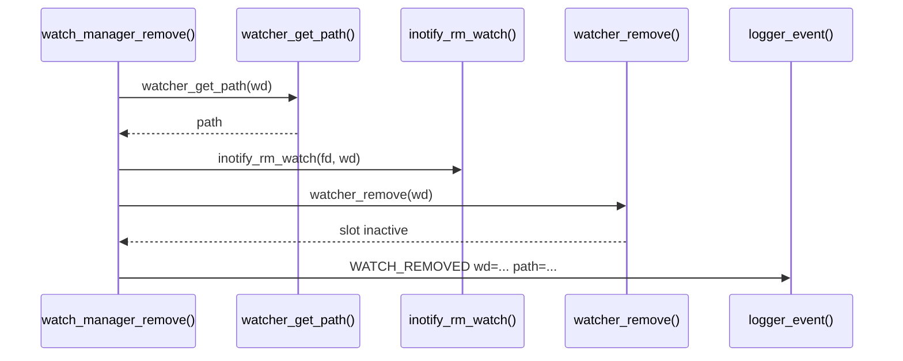
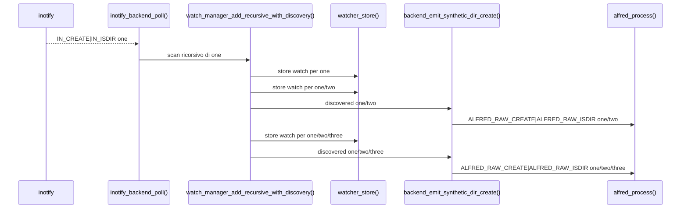

# Mappa del codice e strutture dati

Questo capitolo collega tre viste dello stesso sistema:

- quali funzioni chiamano quali altre funzioni
- quali strutture dati vengono lette o modificate
- quali eventi del filesystem fanno partire quei cambiamenti

L'obiettivo e' aiutare chi studia il progetto a vedere il programma come un
insieme di stati che cambiano nel tempo, non solo come una lista di funzioni.

## Vista generale runtime

Il flusso normale, con `event_engine=core`, e':



Il punto importante e' che `inotify_backend_poll()` non deve decidere la
semantica finale. Il backend produce fatti raw; `alfred_process()` produce
eventi semantici.

## Strutture dati backend

Le strutture dati principali del backend inotify sono:



`app_t` contiene ancora il backend inotify perche' il progetto e' in fase di
integrazione. La direzione finale e' avere un backend sempre piu' autonomo, ma
oggi il campo `app_t.inotify` rende esplicito dove vivono `fd` e tabella dei
watch.

### `inotify_backend_t`

Definizione:

```c
typedef struct inotify_backend {
    int fd;
    watcher_table_t watchers;
} inotify_backend_t;
```

Campi:

| Campo | Significato | Scritto da | Letto da |
| --- | --- | --- | --- |
| `fd` | file descriptor inotify non bloccante | `inotify_backend_init()`, `inotify_backend_shutdown()` | `inotify_backend_poll()`, `watch_manager_add()`, `watch_manager_remove()` |
| `watchers` | tabella `wd -> path` | `watcher_init()`, `watcher_store()`, `watcher_remove()`, `watcher_destroy()` | `watcher_get_path()`, `watcher_exists()` |

### `watcher_table_t`

Definizione:

```c
typedef struct {
    watcher_entry_t *items;
    size_t count;
    size_t capacity;
} watcher_table_t;
```

Questa tabella e' indicizzata direttamente dal watch descriptor `wd`. Se il
kernel restituisce `wd=7`, il path associato si trova in `items[7]`, dopo aver
controllato che l'indice sia valido e che lo slot sia attivo.

Campi:

| Campo | Significato | Scritto da | Letto da |
| --- | --- | --- | --- |
| `items` | array dinamico di slot | `watcher_init()`, `watcher_expand()`, `watcher_destroy()` | tutte le funzioni `watcher_*` |
| `count` | numero di slot attivi | `watcher_init()`, `watcher_store()`, `watcher_remove()`, `watcher_destroy()` | `watcher_count()`, `watcher_dump()` |
| `capacity` | numero di slot allocati | `watcher_init()`, `watcher_expand()`, `watcher_destroy()` | `watcher_expand()`, `watcher_get_path()`, `watcher_exists()` |

### `watcher_entry_t`

Definizione:

```c
typedef struct {
    int wd;
    int active;
    char path[PATH_MAX];
} watcher_entry_t;
```

Campi:

| Campo | Significato | Scritto da | Letto da |
| --- | --- | --- | --- |
| `wd` | watch descriptor restituito dal kernel | `watcher_store()`, `watcher_remove()` | `watcher_dump()` |
| `active` | indica se lo slot contiene una mappatura valida | `watcher_store()`, `watcher_remove()`, `watcher_expand()` | `watcher_get_path()`, `watcher_exists()`, `watcher_dump()` |
| `path` | directory osservata associata al `wd` | `watcher_store()`, `watcher_remove()` | `watcher_get_path()`, `watcher_dump()` |

## Inserimento di un watch

Scenario:

```text
Alfred deve osservare /tmp/progetto
```

Sequenza:



Effetto sulla struttura dati:

```text
prima:
items[3].active = 0

dopo watcher_store():
items[3].wd     = 3
items[3].active = 1
items[3].path   = "/tmp/progetto"
count           = count + 1
```

Il log `WATCH_ADDED` e' diagnostica backend. Non e' un evento semantico del
core.

## Lettura di un evento inotify

Scenario:

```text
kernel invia IN_CREATE name=file.txt wd=3
```

Sequenza:



La tabella dei watch serve per ricostruire il path completo. Senza
`watcher_get_path()`, il backend conoscerebbe solo `file.txt`, non
`/tmp/progetto/file.txt`.

## Rimozione di un watch

Scenario:

```text
un watch non serve piu' oppure inotify segnala IN_IGNORED
```

Sequenza:



Effetto sulla struttura dati:

```text
prima:
items[wd].active = 1
items[wd].path   = "/tmp/progetto"

dopo watcher_remove():
items[wd].active = 0
items[wd].wd     = -1
items[wd].path   = ""
count            = count - 1
```

Anche `WATCH_REMOVED` e' diagnostica backend, non semantica core.

## Creazione ricorsiva veloce

Scenario delicato:

```bash
mkdir -p one/two/three
```

Problema: inotify puo' consegnare solo la creazione di `one`, perche' `two` e
`three` possono nascere prima che Alfred abbia installato i watch sui nuovi
genitori.

Sequenza semplificata:



Qui il watch manager non dice "e' avvenuto un evento semantico". Dice solo:

```text
ho scoperto una directory che esiste gia' durante lo scan
```

Il backend trasforma questa scoperta in un raw event sintetico. Il core decide
la semantica e produce `DIR_CREATED`.

## Vista dinamica futura

Questa pagina e' pensata per essere trasformata in una vista dinamica in una
fase successiva.

Mermaid e' ottimo per diagrammi statici e sequence diagram, ma non produce GIF
animate vere. Per animare gli stati delle strutture dati conviene separare i
dati dalla resa grafica:

1. descrivere ogni scenario come una sequenza di frame
2. generare SVG o PNG per ogni frame
3. assemblare i frame in GIF o video con strumenti esterni

Esempio di frame per `watch_manager_add()`:

```text
frame 1:
  watcher_table.count = 0
  items[3].active = 0

frame 2:
  inotify_add_watch() restituisce wd=3

frame 3:
  watcher_store() scrive:
    items[3].wd = 3
    items[3].active = 1
    items[3].path = "/tmp/progetto"
    count = 1

frame 4:
  logger_event("WATCH_ADDED wd=3 path=/tmp/progetto")
```

Possibili tecniche future:

| Tecnica | Vantaggio | Svantaggio |
| --- | --- | --- |
| Mermaid | integrato nei Markdown, facile da leggere | statico, non adatto a GIF |
| Graphviz | ottimo per grafi e strutture dati | statico se usato da solo |
| SVG generato da script | controllabile e animabile | richiede codice dedicato |
| HTML/CSS/JavaScript | ideale per animazioni interattive | non sempre comodo da leggere offline |
| Manim | animazioni didattiche molto potenti | dipendenza pesante e piu' complessa |
| PNG + ffmpeg/ImageMagick | semplice per GIF/video | serve generare i frame |

La direzione consigliata e' partire da SVG generati da uno script, per esempio:

```bash
make docs-animations
```

con output in:

```text
docs/generated/animations/
```

Gli stessi dati potrebbero generare sia una GIF sia una pagina HTML
interattiva. Prima pero' conviene stabilizzare le tabelle e gli schemi statici,
perche' saranno la base dei frame animati.
