# Mappa del codice e strutture dati

Questo capitolo e' una lettura guidata della codebase. Va letto come se una
persona esperta accompagnasse uno studente dentro Alfred, mostrando non solo
"quale funzione chiama quale", ma anche perche' quella chiamata esiste, quale
responsabilita' separa, quale struttura dati viene modificata e quale evento del
filesystem ha fatto partire il cambiamento.

Questo capitolo collega tre viste dello stesso sistema:

- quali funzioni chiamano quali altre funzioni
- quali strutture dati vengono lette o modificate
- quali eventi del filesystem fanno partire quei cambiamenti

L'obiettivo e' aiutare chi studia il progetto a vedere il programma come un
insieme di stati che cambiano nel tempo, non solo come una lista di funzioni.
Quando un passaggio richiede concetti teorici o tecnici gia' spiegati altrove,
questa guida deve rimandare agli altri capitoli, per esempio:

- [Guida C usato nel progetto](08-guida-c-usato-nel-progetto.md)
- [Architettura generale](02-architettura-generale.md)
- [Flusso eventi](07-flusso-eventi.md)
- [Semantica degli eventi](13-semantica-eventi.md)
- [Glossario](glossario.md)

## Vista generale runtime

Il flusso normale, con `event_engine=core`, e':

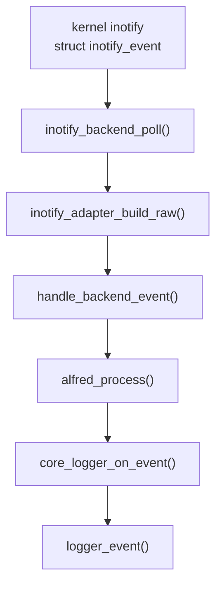

Il punto importante e' che `inotify_backend_poll()` non deve decidere la
semantica finale. Il backend produce fatti raw; `alfred_process()` produce
eventi semantici.

## Strutture dati backend

Le strutture dati principali del backend inotify sono:

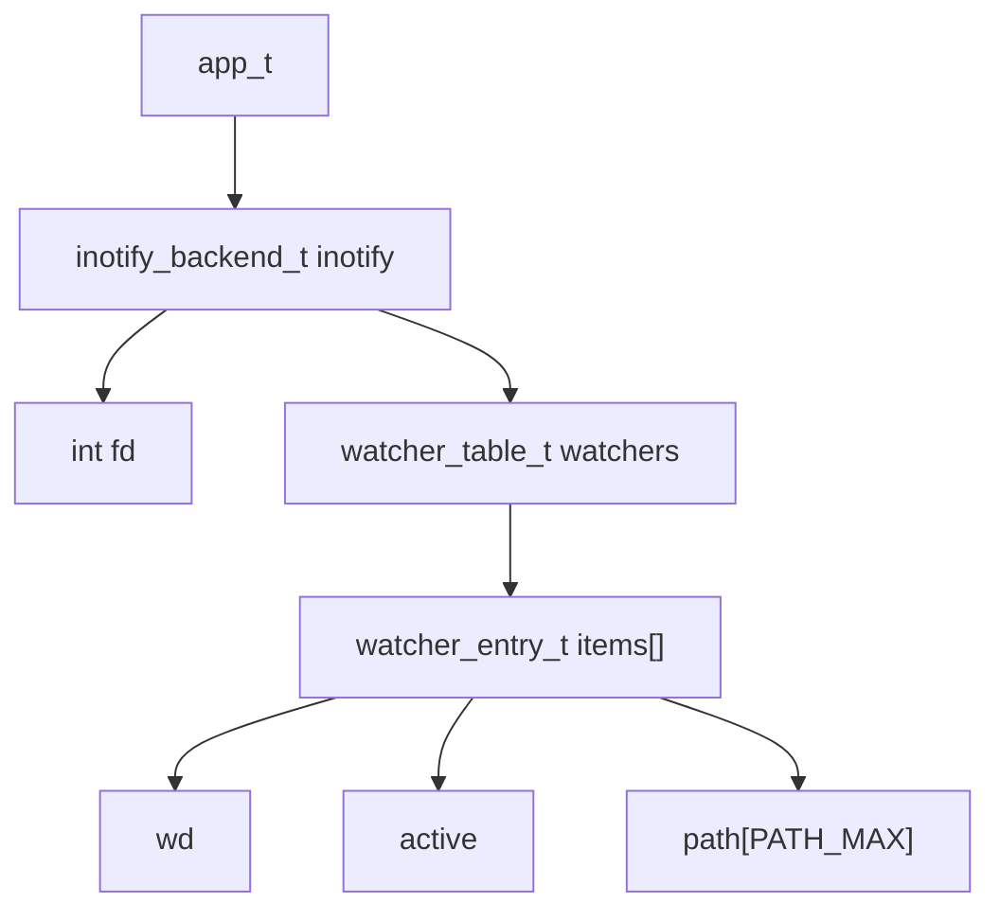

`app_t` contiene ancora il backend inotify perche' il progetto e' in fase di
integrazione. La direzione finale e' avere un backend sempre piu' autonomo, ma
oggi il campo `app_t.inotify` rende esplicito dove vivono `fd` e tabella dei
watch.

## Struttura dati di configurazione

`config_t` guida molte decisioni prese durante l'inizializzazione. Non e' una
struttura dati del backend in senso stretto, ma il backend legge alcuni suoi
campi per sapere come comportarsi.

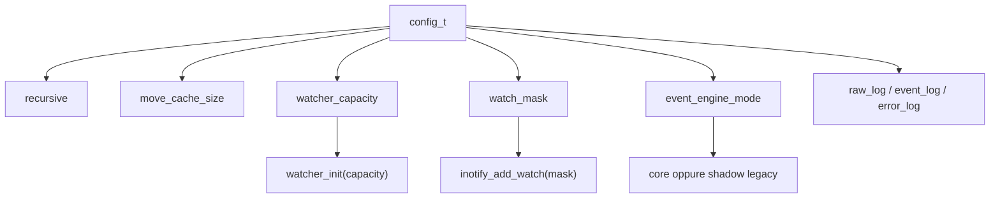

Campi rilevanti:

| Campo | Significato | Scritto da | Letto da |
| --- | --- | --- | --- |
| `recursive` | abilita watch ricorsivi | `config_defaults()`, `config_load()` | `inotify_backend_add_startup_watch()`, `backend_handle_dir_create()` |
| `move_cache_size` | capacita' della cache move legacy | `config_defaults()`, `config_load()` | `legacy_events_init()` |
| `watcher_capacity` | capacita' iniziale della tabella watch | `config_defaults()`, `config_load()` | `watcher_init()` |
| `watch_mask` | maschera inotify usata per aggiungere watch | `config_defaults()` | `watch_manager_add()` |
| `event_engine_mode` | sceglie core o shadow | `config_defaults()`, `config_load()`, `config_set_event_engine()` | `app_init()`, `inotify_backend_init()`, `inotify_backend_poll()`, `core_logger_on_event()` |

`watch_mask` e' un buon esempio di confine fra configurazione e backend:
`config_defaults()` prende il valore da `watch_manager_default_mask()`, poi
`watch_manager_add()` usa quel valore quando chiama `inotify_add_watch()`.

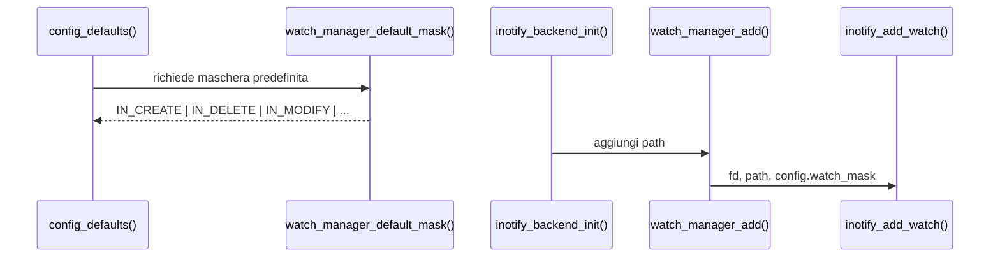

Il parsing delle capacita' usa una funzione dedicata invece di `atoi()`. Il
motivo e' che campi come `move_cache_size` e `watcher_capacity` sono `size_t`:
accettare per errore valori negativi o stringhe non numeriche potrebbe produrre
valori enormi o ambigui. La funzione di parsing mantiene il valore precedente
quando l'input non e' valido.

### `inotify_backend_t`

Definizione:

```c
typedef struct inotify_backend {
    int fd;
    watcher_table_t watchers;
} inotify_backend_t;
```

Campi:

| Campo | Significato | Scritto da | Letto da |
| --- | --- | --- | --- |
| `fd` | file descriptor inotify non bloccante | `inotify_backend_init()`, `inotify_backend_shutdown()` | `inotify_backend_poll()`, `watch_manager_add()`, `watch_manager_remove()` |
| `watchers` | tabella `wd -> path` | `watcher_init()`, `watcher_store()`, `watcher_remove()`, `watcher_destroy()` | `watcher_get_path()`, `watcher_exists()` |

### `watcher_table_t`

Definizione:

```c
typedef struct {
    watcher_entry_t *items;
    size_t count;
    size_t capacity;
} watcher_table_t;
```

Questa tabella e' indicizzata direttamente dal watch descriptor `wd`. Se il
kernel restituisce `wd=7`, il path associato si trova in `items[7]`, dopo aver
controllato che l'indice sia valido e che lo slot sia attivo.

Campi:

| Campo | Significato | Scritto da | Letto da |
| --- | --- | --- | --- |
| `items` | array dinamico di slot | `watcher_init()`, `watcher_expand()`, `watcher_destroy()` | tutte le funzioni `watcher_*` |
| `count` | numero di slot attivi | `watcher_init()`, `watcher_store()`, `watcher_remove()`, `watcher_destroy()` | `watcher_count()`, `watcher_dump()` |
| `capacity` | numero di slot allocati | `watcher_init()`, `watcher_expand()`, `watcher_destroy()` | `watcher_expand()`, `watcher_get_path()`, `watcher_exists()` |

### `watcher_entry_t`

Definizione:

```c
typedef struct {
    int wd;
    int active;
    char path[PATH_MAX];
} watcher_entry_t;
```

Campi:

| Campo | Significato | Scritto da | Letto da |
| --- | --- | --- | --- |
| `wd` | watch descriptor restituito dal kernel | `watcher_store()`, `watcher_remove()` | `watcher_dump()` |
| `active` | indica se lo slot contiene una mappatura valida | `watcher_store()`, `watcher_remove()`, `watcher_expand()` | `watcher_get_path()`, `watcher_exists()`, `watcher_dump()` |
| `path` | directory osservata associata al `wd` | `watcher_store()`, `watcher_remove()` | `watcher_get_path()`, `watcher_dump()` |

## Inserimento di un watch

Scenario:

```text
Alfred deve osservare /tmp/progetto
```

Sequenza:

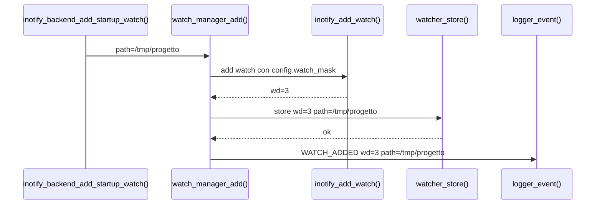

Effetto sulla struttura dati:

```text
prima:
items[3].active = 0

dopo watcher_store():
items[3].wd     = 3
items[3].active = 1
items[3].path   = "/tmp/progetto"
count           = count + 1
```

Il log `WATCH_ADDED` e' diagnostica backend. Non e' un evento semantico del
core.

## Lettura di un evento inotify

Scenario:

```text
kernel invia IN_CREATE name=file.txt wd=3
```

Sequenza:

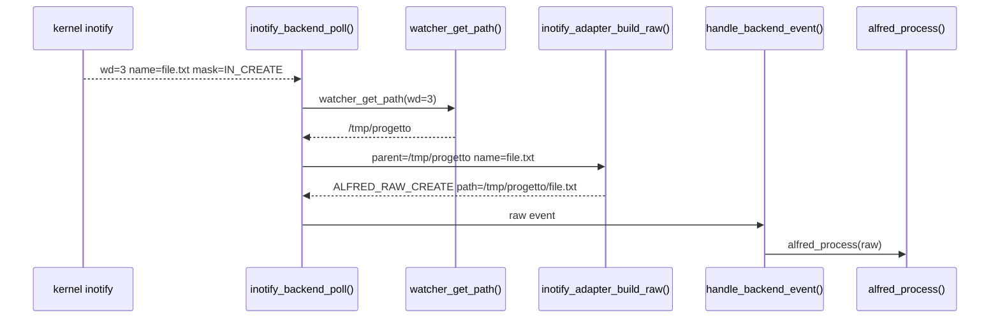

La tabella dei watch serve per ricostruire il path completo. Senza
`watcher_get_path()`, il backend conoscerebbe solo `file.txt`, non
`/tmp/progetto/file.txt`.

## Adapter inotify e raw event

`inotify_adapter.c` e' intenzionalmente stateless. Non possiede strutture dati
persistenti: riceve una `struct inotify_event`, il path parent recuperato dalla
watcher table e un buffer temporaneo per costruire il path completo.

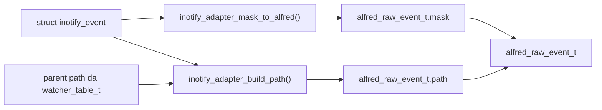

La funzione `inotify_adapter_build_raw()` non alloca memoria per il path. Il
campo `raw.path` punta al buffer `full_path` passato dal chiamante:

```text
inotify_backend_poll()
    char full_path[PATH_MAX]
    alfred_raw_event_t raw
    inotify_adapter_build_raw(..., full_path, ..., &raw)
    handle_backend_event(..., &raw, ...)
    alfred_process(core, &raw)
```

Questo significa che il core deve consumare il raw event subito. Se un livello
volesse conservare l'evento oltre la chiamata, dovrebbe copiare il path.

## Rimozione di un watch

Scenario:

```text
un watch non serve piu' oppure inotify segnala IN_IGNORED
```

Sequenza:

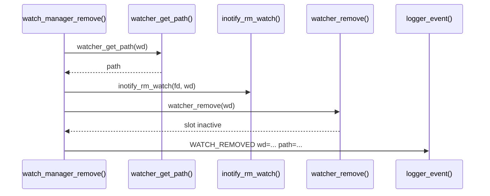

Effetto sulla struttura dati:

```text
prima:
items[wd].active = 1
items[wd].path   = "/tmp/progetto"

dopo watcher_remove():
items[wd].active = 0
items[wd].wd     = -1
items[wd].path   = ""
count            = count - 1
```

Anche `WATCH_REMOVED` e' diagnostica backend, non semantica core.

## Creazione ricorsiva veloce

Scenario delicato:

```bash
mkdir -p one/two/three
```

Problema: inotify puo' consegnare solo la creazione di `one`, perche' `two` e
`three` possono nascere prima che Alfred abbia installato i watch sui nuovi
genitori.

Sequenza semplificata:

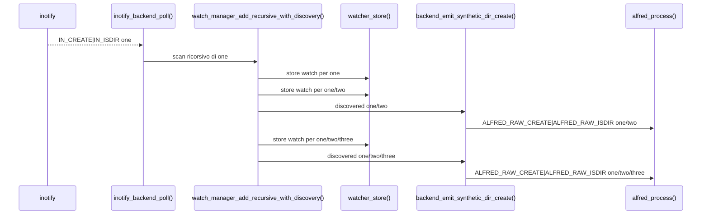

Qui il watch manager non dice "e' avvenuto un evento semantico". Dice solo:

```text
ho scoperto una directory che esiste gia' durante lo scan
```

Il backend trasforma questa scoperta in un raw event sintetico. Il core decide
la semantica e produce `DIR_CREATED`.

## Vista dinamica futura

Questa pagina e' pensata per essere trasformata in una vista dinamica in una
fase successiva.

Mermaid e' ottimo per diagrammi statici e sequence diagram, ma non produce GIF
animate vere. Per animare gli stati delle strutture dati conviene separare i
dati dalla resa grafica:

1. descrivere ogni scenario come una sequenza di frame
2. generare SVG o PNG per ogni frame
3. assemblare i frame in GIF o video con strumenti esterni

Esempio di frame per `watch_manager_add()`:

```text
frame 1:
  watcher_table.count = 0
  items[3].active = 0

frame 2:
  inotify_add_watch() restituisce wd=3

frame 3:
  watcher_store() scrive:
    items[3].wd = 3
    items[3].active = 1
    items[3].path = "/tmp/progetto"
    count = 1

frame 4:
  logger_event("WATCH_ADDED wd=3 path=/tmp/progetto")
```

Possibili tecniche future:

| Tecnica | Vantaggio | Svantaggio |
| --- | --- | --- |
| Mermaid | integrato nei Markdown, facile da leggere | statico, non adatto a GIF |
| Graphviz | ottimo per grafi e strutture dati | statico se usato da solo |
| SVG generato da script | controllabile e animabile | richiede codice dedicato |
| HTML/CSS/JavaScript | ideale per animazioni interattive | non sempre comodo da leggere offline |
| Manim | animazioni didattiche molto potenti | dipendenza pesante e piu' complessa |
| PNG + ffmpeg/ImageMagick | semplice per GIF/video | serve generare i frame |

La direzione consigliata e' partire da SVG generati da uno script, per esempio:

```bash
make docs-animations
```

con output in:

```text
docs/generated/animations/
```

Gli stessi dati potrebbero generare sia una GIF sia una pagina HTML
interattiva. Prima pero' conviene stabilizzare le tabelle e gli schemi statici,
perche' saranno la base dei frame animati.

## Strutture legacy shadow

Il percorso legacy e' ancora presente per confronto, ma non e' l'architettura
target. I file principali sono:

```text
modules/inotify/src/events.c
modules/inotify/src/move_cache.c
```

`events.c` riceve direttamente `struct inotify_event` e produce eventi
semantici legacy. Questo era il vecchio centro della semantica, ma oggi deve
essere letto come codice storico/shadow-only.

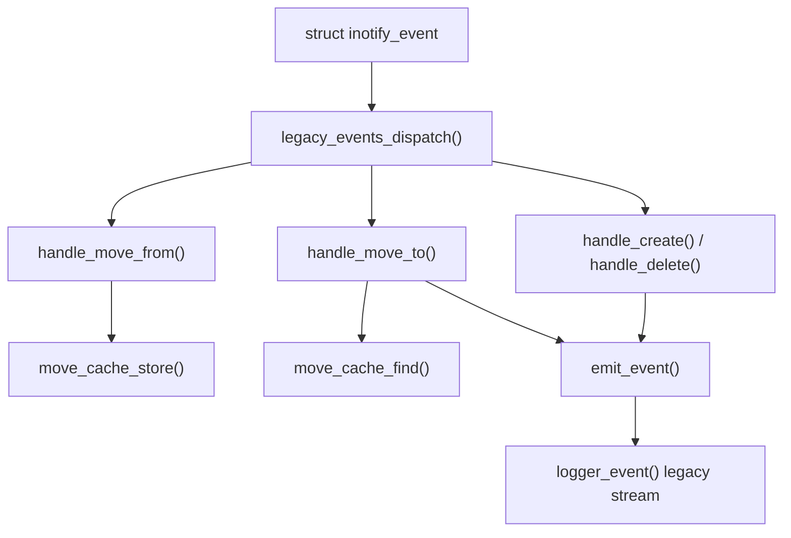

### `move_cache_t`

Definizione:

```c
typedef struct {
    move_slot_t *slots;
    size_t size;
} move_cache_t;
```

Campi:

| Campo | Significato | Scritto da | Letto da |
| --- | --- | --- | --- |
| `slots` | array dei `MOVED_FROM` legacy pendenti | `move_cache_init()`, `move_cache_destroy()` | `move_cache_store()`, `move_cache_find()`, `move_cache_clear()` |
| `size` | numero massimo di slot | `move_cache_init()`, `move_cache_destroy()` | helper interni di ricerca |

### `move_slot_t`

Definizione:

```c
typedef struct {
    uint32_t cookie;
    int src_wd;
    char src_name[NAME_MAX];
    int used;
} move_slot_t;
```

Campi:

| Campo | Significato | Scritto da | Letto da |
| --- | --- | --- | --- |
| `cookie` | cookie inotify della coppia move | `move_cache_store()`, `move_cache_clear()` | `move_cache_find()`, `handle_move_to()` |
| `src_wd` | watch descriptor sorgente | `move_cache_store()` | `handle_move_to()` |
| `src_name` | basename sorgente | `move_cache_store()` | `handle_move_to()` |
| `used` | slot occupato/libero | `move_cache_store()`, `move_cache_clear()` | helper interni e conteggi |

Sequenza legacy move:

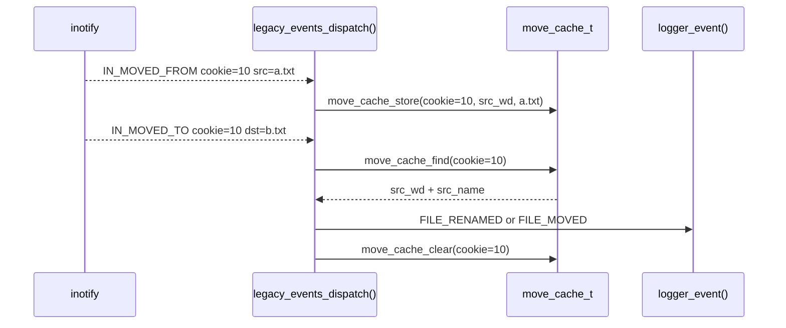

Differenza importante rispetto al core: se cambiano sia directory sia nome, il
legacy puo' emettere due eventi (`MOVED` e poi `RENAMED`). Il core invece emette
un solo evento `RELOCATED`. Per questo `move_cache_t` serve solo come confronto
storico e non deve guidare la semantica futura.
