# Mappa del codice e strutture dati

Questo capitolo e' una lettura guidata della codebase. Va letto come se una
persona esperta accompagnasse uno studente dentro Alfred, mostrando non solo
"quale funzione chiama quale", ma anche perche' quella chiamata esiste, quale
responsabilita' separa, quale struttura dati viene modificata e quale evento del
filesystem ha fatto partire il cambiamento.

Questo capitolo collega tre viste dello stesso sistema:

- quali funzioni chiamano quali altre funzioni
- quali strutture dati vengono lette o modificate
- quali eventi del filesystem fanno partire quei cambiamenti

L'obiettivo e' aiutare chi studia il progetto a vedere il programma come un
insieme di stati che cambiano nel tempo, non solo come una lista di funzioni.
Quando un passaggio richiede concetti teorici o tecnici gia' spiegati altrove,
questa guida deve rimandare agli altri capitoli, per esempio:

- [Guida C usato nel progetto](08-guida-c-usato-nel-progetto.md)
- [Architettura generale](02-architettura-generale.md)
- [Flusso eventi](07-flusso-eventi.md)
- [Semantica degli eventi](13-semantica-eventi.md)
- [Glossario](glossario.md)

## Vista generale runtime

Il flusso normale, con `event_engine=core`, e':

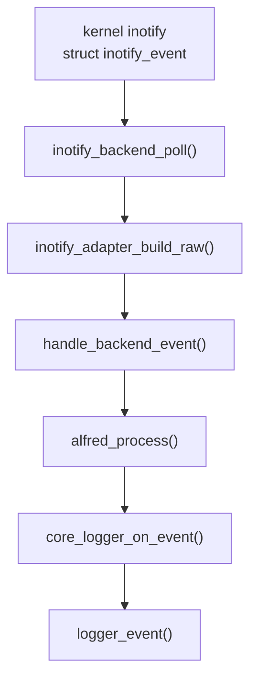

Il punto importante e' che `inotify_backend_poll()` non deve decidere la
semantica finale. Il backend produce fatti raw; `alfred_process()` produce
eventi semantici.

## Call graph guidato

Questa sezione serve a leggere il codice dall'esterno verso l'interno. Non e'
un elenco completo di tutte le funzioni, ma una mappa delle chiamate che
separano le responsabilita' principali.

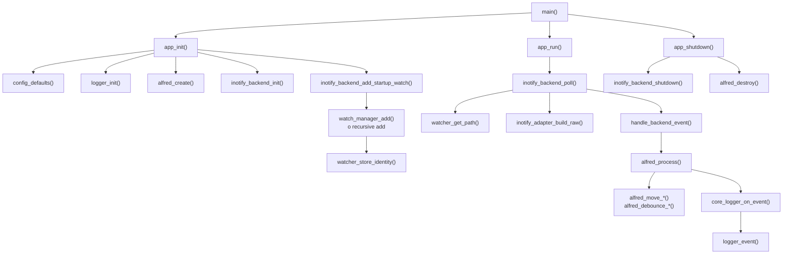

Lettura della mappa:

- `main()` non conosce inotify, core o watch table: avvia il ciclo di vita
  applicativo.
- `app_init()` costruisce i sottosistemi nell'ordine in cui servono:
  configurazione, logger, core, backend e watch iniziali.
- `app_run()` non interpreta eventi: chiama il backend e lascia che sia il
  backend a leggere dal file descriptor.
- `inotify_backend_poll()` e' il confine tecnico con Linux: legge
  `struct inotify_event`, recupera il path parent, costruisce un raw event
  Alfred e lo consegna all'app.
- `handle_backend_event()` e' volutamente piccolo: inoltra il raw event al core.
- `alfred_process()` e' il punto in cui inizia la semantica Alfred.

Questa distinzione aiuta a evitare un errore comune quando si legge una codebase
grande: cercare "la funzione che fa tutto". Alfred e' invece diviso in funzioni
che cambiano livello di astrazione. Il passaggio importante non e' solo
"chiama un'altra funzione", ma "da questo punto in poi il dato ha un significato
diverso".

## Ciclo backend inotify

Il ciclo backend e' tutto cio' che accade prima del core. Il suo compito e'
rispondere a questa domanda:

```text
che fatto tecnico e' appena arrivato dal filesystem?
```

Non deve invece rispondere alla domanda:

```text
che evento semantico deve vedere l'utente?
```

Passi principali del ciclo backend:

1. `inotify_backend_init()` inizializza `watcher_table_t` e apre il file
   descriptor inotify non bloccante.
2. `inotify_backend_add_startup_watch()` installa i watch sui path passati da
   riga di comando.
3. `watch_manager_add()` cattura l'identita' con `stat()`, chiama
   `inotify_add_watch()` usando `config.inotify.watch_mask`, poi ricontrolla
   l'identita' con una seconda `stat()`.
4. `watcher_store_identity()` salva `wd -> path` e l'identita' `st_dev/st_ino`.
5. `inotify_backend_poll()` legge uno o piu' record dal file descriptor.
6. `watcher_get_path()` recupera la directory parent associata al `wd`.
7. `inotify_adapter_build_raw()` costruisce `alfred_raw_event_t`.
8. la callback `handle_backend_event()` porta il raw event verso il core.
9. `backend_handle_dir_create()` aggiorna i watch ricorsivi dopo una directory
   creata e genera raw event sintetici per directory scoperte troppo tardi.

Schema dati del ciclo backend:

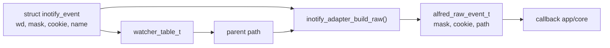

Il backend modifica stato solo quando quello stato appartiene al backend:

| Stato | Modificato da | Perche' appartiene al backend |
| --- | --- | --- |
| `inotify_backend_t.fd` | `inotify_backend_init()`, `inotify_backend_shutdown()` | e' il descrittore Linux letto dal backend |
| `watcher_table_t` | `watcher_store_identity()`, `watcher_remove()` | serve a tradurre `wd` in path e conservare identita' backend |
| watch ricorsivi startup | `watch_manager_add_recursive()` + `fs_scan_tree()` | installano watch sull'albero gia' esistente senza raw sintetici |
| watch ricorsivi runtime | `backend_handle_dir_create()` + `fs_scan_tree()` | riparano nuove directory annidate e mantengono la policy raw sintetica nel backend |
| raw sintetici per discovery | `backend_emit_synthetic_dir_create()` | riparano un limite di osservazione del backend |

`WATCH_ADDED` e `WATCH_REMOVED` restano log diagnostici del backend. Non sono
eventi semantici perche' non descrivono un cambiamento del file osservato, ma un
cambiamento dello stato interno del monitor.

## Ciclo core

Il ciclo core inizia quando esiste gia' un `alfred_raw_event_t`. La domanda del
core e':

```text
quale evento stabile deve vedere l'applicazione?
```

Passi principali del ciclo core:

1. `alfred_process()` riceve un raw event gia' normalizzato.
2. `alfred_move_sweep()` rimuove eventuali move pendenti scaduti.
3. un raw `CREATE` diventa `FILE_CREATED` o `DIR_CREATED`.
4. un raw `CLOSE_WRITE` diventa `FILE_READY`.
5. un raw `MODIFY` passa da `alfred_debounce_get()` e
   `alfred_debounce_should_emit()` prima di diventare `FILE_MODIFIED`.
6. un raw `DELETE` diventa `FILE_DELETED` o `DIR_DELETED`.
7. un raw `MOVED_FROM` viene salvato in `moves[1024]`.
8. un raw `MOVED_TO` cerca il `MOVED_FROM` con lo stesso cookie, poi
   `classify_move()` sceglie `RENAMED`, `MOVED` o `RELOCATED`.
9. `emit()` assegna `seq`, costruisce `alfred_event_t` e chiama la callback.

Schema dati del ciclo core:

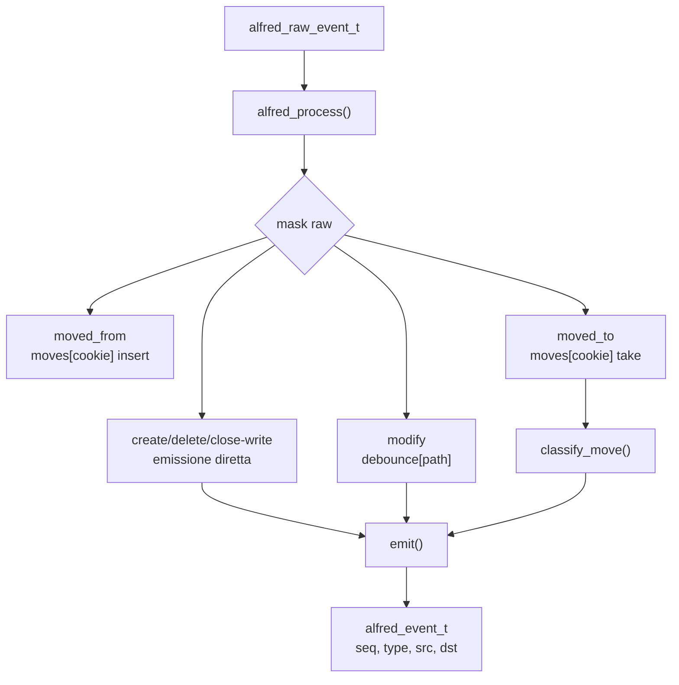

La differenza fra backend e core diventa evidente nei move:

- il backend vede due fatti tecnici: `MOVED_FROM` e `MOVED_TO`
- il core produce un solo risultato semantico: `RENAMED`, `MOVED` o
  `RELOCATED`

Questo e' il motivo per cui la cache move legacy non deve tornare nel percorso
runtime normale. La correlazione dei move e' semantica, quindi appartiene al
core.

## Strutture dati backend

Le strutture dati principali del backend inotify sono:

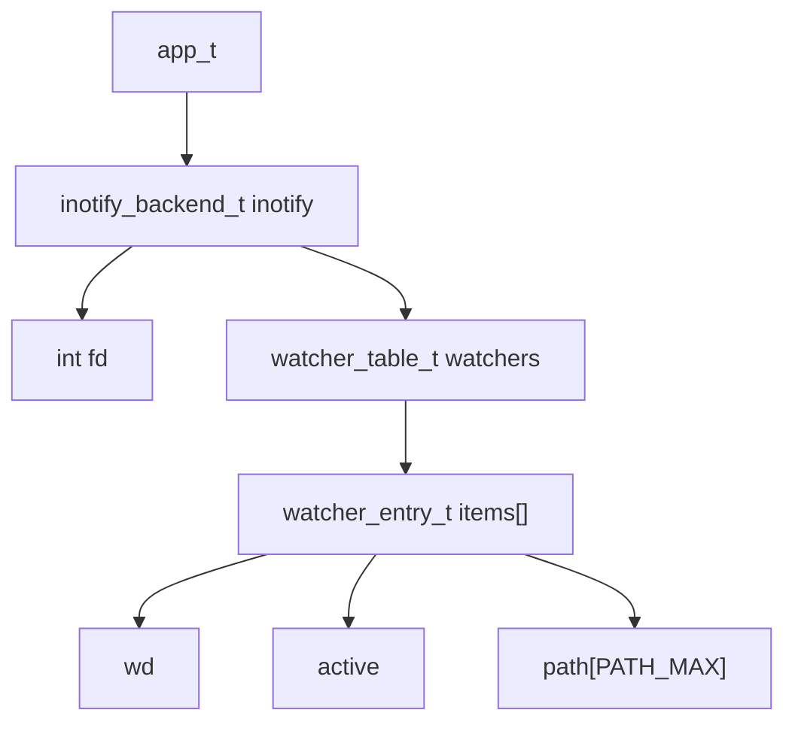

`app_t` contiene ancora il backend inotify perche' il progetto e' in fase di
integrazione. La direzione finale e' avere un backend sempre piu' autonomo, ma
oggi il campo `app_t.inotify` rende esplicito dove vivono `fd` e tabella dei
watch.

### Dipendenze backend da `app_t`

Storicamente il backend riceveva `app_t *` in molte funzioni. Dopo i
micro-refactor piu' recenti, le funzioni lifecycle pulite e il poll ricevono
direttamente `inotify_backend_context_t *`. Il poll path non contiene piu' il
bridge shadow e non chiama piu' il dispatcher legacy: produce raw event, aggiorna
watch e lascia la semantica al core.

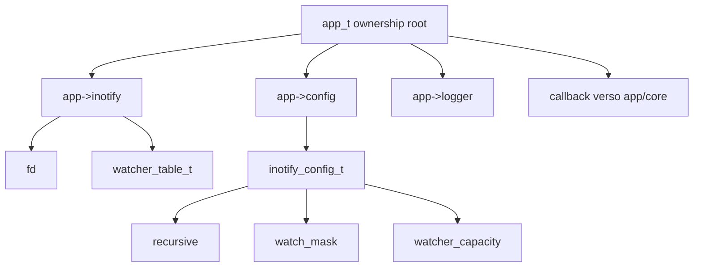

Tabella di lettura:

| Dipendenza | Dove serve | Perche' serve | Dovrebbe restare visibile al backend finale? |
| --- | --- | --- | --- |
| `app->inotify.fd` | `inotify_backend_poll()` tramite `ctx.runtime`, `watch_manager_add()`, `watch_manager_remove()` | leggere eventi e modificare watch kernel | si', come stato backend |
| `app->inotify.watchers` | poll tramite `ctx.runtime`, add/remove watch, discovery ricorsiva | tradurre `wd` in path e mantenere mapping | si', come stato backend |
| `app->config.inotify.recursive` | startup watch e `backend_handle_dir_create()` lo leggono tramite `ctx.config` | decidere se mantenere watch ricorsivi | si', come configurazione backend |
| `app->config.inotify.watch_mask` | `watch_manager_add()` | scegliere quali eventi inotify ascoltare | si', come configurazione backend |
| `app->config.inotify.watcher_capacity` | `inotify_backend_init()` tramite `ctx.config` | dimensione iniziale watcher table | si', come configurazione backend |
| `app->logger` | backend tramite `ctx.logger` e watch manager | raw log, errori, `WATCH_ADDED`, `WATCH_REMOVED` | si', ma come dipendenza esplicita |
| callback `on_event` | `inotify_backend_poll()` e raw sintetici | consegnare `alfred_raw_event_t` all'app/core | si', ma con contesto opaco piu' stretto |

Questa tabella e' utile per il prossimo refactor perche' separa due idee che
spesso vengono confuse:

- ownership: chi possiede davvero il dato
- accesso: chi ha bisogno di leggerlo o modificarlo durante una funzione

Storicamente `app_t` risolveva entrambi i problemi in modo pratico ma largo: il
backend riceveva tutto il contenitore, anche se usava solo una parte. Il
refactor recente ha gia' corretto questo confine per il backend: ora il codice
inotify riceve context esplicito e callback raw/core. Il bridge shadow non
esiste piu'.

Il micro-refactor iniziale su `inotify_backend_init()` ha seguito questa
direzione restringendo prima il corpo della funzione. Dopo il successivo cambio
di firma pubblica, `app.c` costruisce il `inotify_backend_context_t` e lo passa
direttamente al backend. La funzione ora usa:

- `ctx.runtime->watchers` per inizializzare e distruggere la tabella dei watch
- `ctx.runtime->fd` per aprire, loggare e chiudere il file descriptor inotify
- `ctx.config->watcher_capacity` per dimensionare la watcher table
- `ctx.logger` per diagnostica ed errori

Questa e' una distinzione didattica importante: prima il corpo della funzione ha
mostrato quali dati appartengono al backend e quali sono solo dipendenze prese
in prestito dall'applicazione; poi la firma pubblica e' stata resa coerente con
questa distinzione.

Il micro-refactor su `inotify_backend_shutdown()` completa la simmetria con
`init()`. Anche qui la forma finale pulita riceve direttamente
`inotify_backend_context_t *` e usa:

- `ctx.runtime->fd` per controllare, chiudere e invalidare il file descriptor
- `ctx.runtime->watchers` per distruggere la tabella dei watch

Il lifecycle legacy non appartiene piu' al backend e non appartiene piu' nemmeno
al runtime applicativo corrente. `app.c` rifiuta `event_engine=shadow` come
normale valore di configurazione non valido; i file legacy sono stati rimossi
dal codice corrente.

### Context backend proposto

La proposta scelta e' introdurre un context separato. In questo modo
`inotify_backend_t` continua a rappresentare lo stato posseduto dal backend,
mentre il context rappresenta le dipendenze prese in prestito.

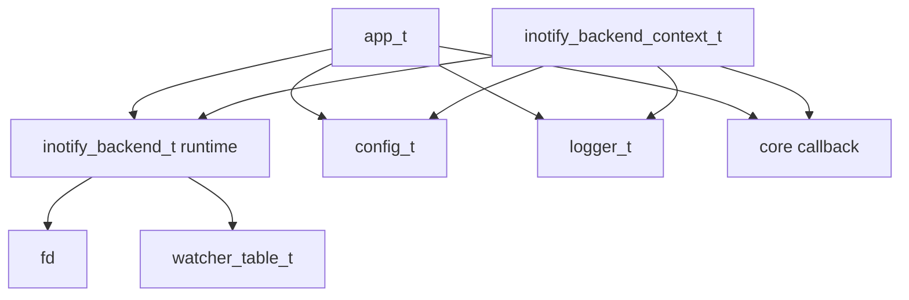

Forma concettuale:

```c
typedef struct inotify_backend_context {
    inotify_backend_t *runtime;
    const config_t *config;
    logger_t *logger;
    inotify_backend_event_fn on_event;
    void *userdata;
} inotify_backend_context_t;
```

Il context non deve possedere `config`, `logger` o callback. Li usa soltanto
mentre l'applicazione e' viva. Questa distinzione e' centrale:

```text
possedere un dato  -> doverlo inizializzare e liberare
prendere in prestito -> poterlo usare entro una lifetime garantita da altri
```

Con questa proposta, il backend finale dovrebbe leggere cosi':

```text
app_t
  possiede config, logger, core e inotify_backend_t

inotify_backend_t
  possiede fd e watcher_table_t

inotify_backend_context_t
  collega temporaneamente backend, config, logger e callback
  durante init, poll, watch management e discovery
```

Perche' non mettere direttamente `config` e `logger` dentro
`inotify_backend_t`? Perche' non sono davvero posseduti dal backend. Sono
servizi applicativi condivisi. Inserirli come puntatori permanenti nello stato
runtime sarebbe possibile, ma renderebbe meno chiaro agli studenti quali campi
devono essere liberati dal backend e quali invece sono solo riferimenti.

Il primo candidato alla migrazione era il watch manager:

```text
prima:
  watch_manager_add(app, path)

dopo il micro-refactor:
  watch_manager_add(ctx, path)
```

Questo passo e' stato abbastanza piccolo perche' il watch manager usa solo:

- fd
- watcher table
- watch mask
- logger

Non usa il core e non deve conoscere l'app completa.

Lo stato attuale del codice segue questa direzione: `watch_manager.c` lavora con
`inotify_backend_context_t`, mentre `inotify_backend.c` costruisce un context
locale quando deve installare, rimuovere o scoprire watch. Questo non elimina
ancora `app_t` dal backend, ma riduce gia' l'area che lo vede.

Frame logico del nuovo passaggio:

```text
app_t app
  app.inotify  -> stato runtime
  app.config   -> configurazione
  app.logger   -> diagnostica

app_build_inotify_backend_context(app, &ctx):
  ctx.runtime = &app->inotify
  ctx.config = &app->config.inotify
  ctx.logger = &app->logger

inotify_backend_init(&ctx):
  backend_init(ctx)

backend_init(ctx):
  ctx->runtime->fd = -1
  watcher_init(&ctx->runtime->watchers, ctx->config->watcher_capacity)
  inotify_init1(IN_NONBLOCK | IN_CLOEXEC)

app_init(app):
  se ALFRED_EVENT_ENGINE non e' "core":
    errore di configurazione

inotify_backend_add_startup_watch(&ctx, path):
  backend_add_startup_watch(ctx, path)

backend_add_startup_watch(ctx, path):
  legge ctx->config->recursive

watch_manager_add(&ctx, path):
  usa ctx.runtime->fd
  usa ctx.runtime->watchers
  usa ctx.config->watch_mask
  usa ctx.logger

inotify_backend_shutdown(&ctx):
  backend_shutdown(ctx)

backend_shutdown(ctx):
  chiude ctx->runtime->fd
  watcher_destroy(&ctx->runtime->watchers)

app_shutdown(app):
  distrugge core
  chiude logger
```

Anche la discovery ricorsiva usa ora lo stesso context:

```text
backend_handle_dir_create(ctx, ev, on_event, userdata)
  legge ctx.config->recursive
  cerca il path padre in ctx.runtime->watchers
  aggiunge il watch sulla root creata
  backend_emit_context_t:
    ctx = ctx
    on_event = on_event
    userdata = userdata
  fs_scan_tree(full, emit_root=0)
  backend_process_scanned_dir_create(entry, userdata)
  watch_manager_add(ctx, entry.path)
  backend_emit_synthetic_dir_create(ctx, entry.path, on_event, userdata)
```

La callback pubblica ora e':

```c
typedef int (*inotify_backend_event_fn)(
    const alfred_raw_event_t *raw,
    void *userdata
);
```

Quindi il backend consegna solo il raw event e un puntatore opaco. Nel runtime
attuale `app_run()` passa `app` come `userdata`, e `handle_backend_event()` lo
ricostruisce:

```text
inotify_backend_poll(&ctx, handle_backend_event, app)
handle_backend_event(raw, userdata)
  app = userdata
  alfred_process(app->core, raw)
```

Questo e' piu' pulito perche' il backend non deve conoscere il tipo del consumer
del raw event. Sa solo invocare una callback. Il confronto legacy live e' stato
spento: non esiste piu' un bridge shadow nel context backend.

Anche il corpo di `inotify_backend_poll()` e' stato ristretto verso il context:

```text
inotify_backend_poll(&ctx, on_event, userdata)
  backend_poll(ctx, on_event, userdata)

backend_poll(ctx, on_event, userdata)
  read(ctx->runtime->fd, ...)
  watcher_get_path(&ctx->runtime->watchers, wd)
  logger_raw(ctx->logger, ...)
  on_event(raw, userdata)
  backend_handle_ignored(ctx, ev)
  backend_handle_dir_create(ctx, ev, on_event, userdata)
```

Il backend non legge piu' la scelta core/shadow nel poll path. La scelta
`event_engine` resta temporaneamente nell'applicazione per rifiutare shadow
nelle build core-only e per scegliere il formato di log del core, ma non serve
piu' a invocare `legacy_events_dispatch()`.

Le funzioni lifecycle pubbliche (`init`, startup watch, poll, shutdown) ricevono
il context costruito da `app.c`. Il context contiene solo runtime, config e
logger: non contiene piu' callback legacy. Questa scelta rende il backend
didatticamente piu' chiaro perche' mostra un confine netto: backend uguale fatti
raw e manutenzione watch, core uguale semantica.

## Struttura dati di configurazione

`config_t` guida molte decisioni prese durante l'inizializzazione. Non e' una
struttura dati del backend in senso stretto: contiene anche sottostrutture di
configurazione specifiche dei backend. Il backend inotify non riceve piu' tutta
`config_t`, ma solo `config_t.inotify`, cioe' un `inotify_config_t`.

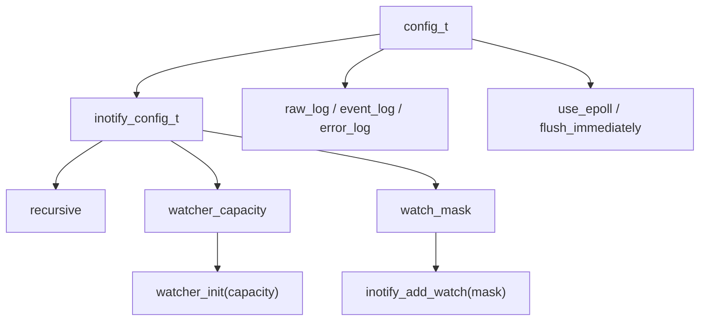

Campi rilevanti:

| Campo | Significato | Scritto da | Letto da |
| --- | --- | --- | --- |
| `inotify.recursive` | abilita watch ricorsivi | `inotify_config_defaults()`, `config_load()` | `inotify_backend_add_startup_watch()`, `backend_handle_dir_create()` |
| `inotify.watcher_capacity` | capacita' iniziale della tabella watch | `inotify_config_defaults()`, `config_load()` | `watcher_init()` |
| `inotify.watch_mask` | maschera inotify usata per aggiungere watch | `inotify_config_defaults()`, `config_load()` | `watch_manager_add()` |

`watch_mask` e' un buon esempio di confine fra configurazione e backend:
`config_defaults()` delega a `inotify_config_defaults()`, questa prende il
valore da `watch_manager_default_mask()`, poi `watch_manager_add()` usa quel
valore quando chiama `inotify_add_watch()`.

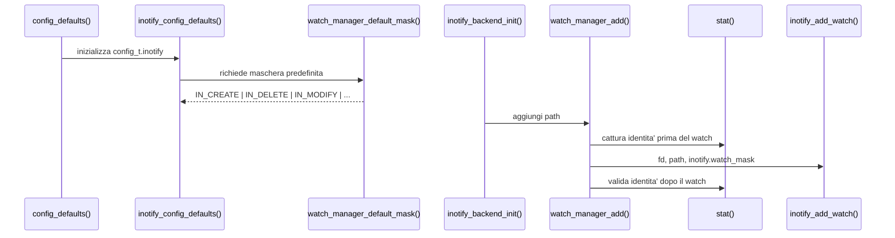

Il parsing delle capacita' usa una funzione dedicata invece di `atoi()`. Il
motivo e' che campi come `watcher_capacity` sono `size_t`: accettare per errore
valori negativi o stringhe non numeriche potrebbe produrre valori enormi o
ambigui. La funzione di parsing mantiene il valore precedente quando l'input
non e' valido.

`event_engine_mode` non esiste piu' in `config_t`: era diventato un campo con
un solo valore possibile. La configurazione mantiene solo
`config_set_event_engine()` come funzione di validazione, cosi' un vecchio file
di configurazione o `ALFRED_EVENT_ENGINE=shadow` fallisce invece di essere
ignorato in silenzio.

### `inotify_backend_t`

Definizione:

```c
typedef struct inotify_backend {
    int fd;
    watcher_table_t watchers;
    inotify_lost_scope_queue_t lost_scopes;
} inotify_backend_t;
```

Campi:

| Campo | Significato | Scritto da | Letto da |
| --- | --- | --- | --- |
| `fd` | file descriptor inotify non bloccante | `inotify_backend_init()`, `inotify_backend_shutdown()` | `inotify_backend_poll()`, `watch_manager_add()`, `watch_manager_remove()` |
| `watchers` | tabella `wd -> path`, identita' filesystem e stato di affidabilita' del mapping | `watcher_init()`, `watcher_store()`, `watcher_store_identity()`, `watcher_update_path()`, `watcher_update_path_prefix()`, `watcher_set_state_prefix()`, `watcher_remove()`, `watcher_destroy()`, `watcher_set_state()` | `watcher_get_path()`, `watcher_get_identity()`, `watcher_exists()`, `watcher_get_state()`, `watcher_is_stale()` |
| `lost_scopes` | coda FIFO degli scope stale che richiederanno una recovery ampia posticipata | `backend_lost_scope_queue_init()`, `backend_enqueue_lost_scope()`, `backend_lost_scope_queue_enqueue()`, `backend_lost_scope_queue_destroy()` | `backend_lost_scope_queue_count()`, futuro worker/resync scanner |

`lost_scopes` non contiene eventi Alfred. Contiene debito tecnico del backend:
"ho perso fiducia nel path di questo `wd`, ma ho ancora identita' filesystem
sufficiente per cercarlo piu' tardi negli scope monitorati". Per questo la coda
sta dentro `inotify_backend_t` e non nel core. Il core deve ricevere solo raw
fact affidabili e poi produrre semantica; non deve conoscere code di recovery,
retry o delay.

### `inotify_lost_scope_queue_t`

Definizione:

```c
typedef struct inotify_lost_scope_queue {
    inotify_lost_scope_entry_t *items;
    size_t count;
    size_t capacity;
    size_t head;
} inotify_lost_scope_queue_t;
```

Campi:

| Campo | Significato | Scritto da | Letto da |
| --- | --- | --- | --- |
| `items` | buffer circolare di entry da recuperare | `backend_lost_scope_queue_init()`, `backend_lost_scope_queue_expand()`, `backend_lost_scope_queue_destroy()` | `backend_lost_scope_queue_enqueue()`, `backend_lost_scope_queue_pop()` |
| `count` | numero di scope in attesa di recovery | `backend_lost_scope_queue_enqueue()`, `backend_lost_scope_queue_pop()`, `backend_lost_scope_queue_destroy()` | `backend_lost_scope_queue_count()`, log `WATCH_LOST_QUEUED`, futuro scheduler resync |
| `capacity` | numero di slot allocati nel buffer | `backend_lost_scope_queue_init()`, `backend_lost_scope_queue_expand()`, `backend_lost_scope_queue_destroy()` | `backend_lost_scope_queue_enqueue()` |
| `head` | indice del prossimo elemento FIFO da estrarre | `backend_lost_scope_queue_pop()`, `backend_lost_scope_queue_expand()`, `backend_lost_scope_queue_destroy()` | `backend_lost_scope_queue_enqueue()`, `backend_lost_scope_queue_pop()` |

La queue e' un buffer circolare per rendere economici enqueue e pop. Quando si
riempie, viene riallocata e linearizzata mantenendo l'ordine FIFO: la recovery
deve processare gli scope nello stesso ordine in cui Alfred ha perso fiducia nei
path.

### `inotify_lost_scope_entry_t`

Definizione:

```c
typedef struct inotify_lost_scope_entry {
    int wd;
    dev_t device_id;
    ino_t inode_id;
    uint64_t first_seen_ns;
    uint64_t retry_after_ns;
    unsigned retry_count;
    char old_path[PATH_MAX];
    char reason[INOTIFY_LOST_SCOPE_REASON_SIZE];
} inotify_lost_scope_entry_t;
```

Campi:

| Campo | Significato | Scritto da | Letto da |
| --- | --- | --- | --- |
| `wd` | watch descriptor che ha perso affidabilita' del path | `backend_lost_scope_queue_enqueue()` | `backend_lost_scope_queue_pop()`, futuro scanner/recovery |
| `device_id` | `st_dev` salvato quando il watch era affidabile | `backend_lost_scope_queue_enqueue()` | `backend_lost_scope_queue_pop()`, futuro match per identita' |
| `inode_id` | `st_ino` salvato quando il watch era affidabile | `backend_lost_scope_queue_enqueue()` | `backend_lost_scope_queue_pop()`, futuro match per identita' |
| `first_seen_ns` | timestamp monotono del primo enqueue | `backend_lost_scope_queue_enqueue()` | `backend_lost_scope_queue_pop()`, futuro debounce e diagnostica |
| `retry_after_ns` | momento minimo per il prossimo tentativo | `backend_lost_scope_queue_enqueue()` | futuro scheduler/backoff |
| `retry_count` | numero di tentativi gia' fatti | inizialmente `0` in `backend_lost_scope_queue_enqueue()` | futuro retry/backoff |
| `old_path` | copia del path non piu' affidabile | `backend_lost_scope_queue_enqueue()` | `backend_lost_scope_queue_pop()`, diagnostica e futuro aggiornamento prefissi |
| `reason` | causa backend, per esempio `IN_MOVE_SELF` | `backend_lost_scope_queue_enqueue()` | `backend_lost_scope_queue_pop()`, diagnostica e policy futura |

`old_path` e `reason` sono copiati nella entry. Questa scelta evita che la
recovery posticipata dipenda da puntatori presi dalla watcher table o da stringhe
temporanee sullo stack. Quando il worker futuro consumera' la queue, la entry
dovra' essere autonoma.

### `watcher_table_t`

Definizione:

```c
typedef struct {
    watcher_entry_t *items;
    size_t count;
    size_t capacity;
} watcher_table_t;
```

Questa tabella e' indicizzata direttamente dal watch descriptor `wd`. Se il
kernel restituisce `wd=7`, il path associato si trova in `items[7]`, dopo aver
controllato che l'indice sia valido e che lo slot sia attivo.

Campi:

| Campo | Significato | Scritto da | Letto da |
| --- | --- | --- | --- |
| `items` | array dinamico di slot | `watcher_init()`, `watcher_expand()`, `watcher_destroy()` | tutte le funzioni `watcher_*` |
| `count` | numero di slot attivi | `watcher_init()`, `watcher_store()`, `watcher_remove()`, `watcher_destroy()` | `watcher_count()`, `watcher_count_state()`, `watcher_dump()` |
| `capacity` | numero di slot allocati | `watcher_init()`, `watcher_expand()`, `watcher_destroy()` | `watcher_expand()`, `watcher_get_path()`, `watcher_exists()` |

### `watcher_entry_t`

Definizione:

```c
typedef struct {
    int wd;
    int active;
    watcher_state_t state;
    int has_identity;
    dev_t device_id;
    ino_t inode_id;
    char path[PATH_MAX];
} watcher_entry_t;
```

Campi:

| Campo | Significato | Scritto da | Letto da |
| --- | --- | --- | --- |
| `wd` | watch descriptor restituito dal kernel | `watcher_store()`, `watcher_remove()` | `watcher_dump()` |
| `active` | indica se lo slot contiene una mappatura valida | `watcher_store()`, `watcher_store_identity()`, `watcher_remove()`, `watcher_expand()` | `watcher_get_path()`, `watcher_exists()`, `watcher_dump()` |
| `state` | indica se il mapping e' affidabile, stale o in resync | `watcher_store()`, `watcher_store_identity()`, `watcher_remove()`, `watcher_set_state()`, `watcher_set_state_prefix()` | `watcher_get_state()`, `watcher_is_stale()`, `watcher_dump()` |
| `has_identity` | dice se `device_id` e `inode_id` sono stati catturati | `watcher_store()`, `watcher_store_identity()`, `watcher_remove()` | `watcher_get_identity()`, `watcher_dump()`, probe resync |
| `device_id` | valore `st_dev` del path osservato al momento dell'installazione watch | `watcher_store_identity()`, `watcher_remove()` | `watcher_get_identity()`, probe resync |
| `inode_id` | valore `st_ino` del path osservato al momento dell'installazione watch | `watcher_store_identity()`, `watcher_remove()` | `watcher_get_identity()`, probe resync |
| `path` | directory osservata associata al `wd` | `watcher_store()`, `watcher_store_identity()`, `watcher_update_path()`, `watcher_update_path_prefix()`, `watcher_remove()` | `watcher_get_path()`, `watcher_dump()` |

`device_id` e `inode_id` formano la prova di identita' Unix/Linux classica:
`st_dev` identifica il filesystem/device e `st_ino` identifica l'inode dentro
quel filesystem. Il path da solo non basta, perche' puo' essere cancellato e
ricreato. Durante il resync, Alfred puo' confrontare l'identita' salvata con
una nuova `stat()` sul path per capire se sta guardando lo stesso oggetto.

Il motivo pratico e' che `watcher_entry_t` contiene tutto cio' che Alfred sa di
un watch inotify. Il kernel non rimanda il path completo in ogni evento: manda
un `wd`. Alfred quindi usa la watcher table per rispondere a domande come:

```text
wd=4 a quale path corrisponde?
questo mapping e' ancora affidabile?
posso fidarmi del path salvato?
```

I campi sono separati perche' rappresentano concetti diversi:

- `wd` e' il numero restituito da `inotify_add_watch()` e ricevuto negli eventi
  kernel.
- `active` dice se lo slot contiene davvero un watch vivo.
- `state` dice quanto e' affidabile il mapping: `VALID`, `STALE`,
  `RESYNCING` o `REMOVED`.
- `path` e' il path che Alfred associa al `wd` per ricostruire gli eventi.
- `has_identity` dice se Alfred ha anche una prova di identita' filesystem.
- `device_id` e' `st_dev`, cioe' il device/filesystem su cui vive il path.
- `inode_id` e' `st_ino`, cioe' l'inode dell'oggetto osservato dentro quel
  filesystem.

Esempio del problema:

```text
1. Alfred osserva /tmp/root
2. /tmp/root ha identita' (st_dev=X, st_ino=100)
3. qualcuno sposta /tmp/root in /tmp/root_moved
4. qualcuno crea una nuova /tmp/root
5. la nuova /tmp/root ha identita' (st_dev=X, st_ino=200)
```

Se Alfred guardasse solo il path, vedrebbe che `/tmp/root` esiste ancora e
potrebbe concludere erroneamente che il watch e' tornato affidabile. Con
`device_id` e `inode_id`, invece, puo' confrontare:

```text
identita' salvata:  st_dev=X, st_ino=100
identita' attuale:  st_dev=X, st_ino=200
```

La conclusione corretta e': il path e' raggiungibile, ma non e' lo stesso
oggetto osservato prima. Per questo l'identita' sta dentro `watcher_entry_t`,
vicino al mapping `wd -> path` e allo stato `VALID/STALE/RESYNCING`: durante
il resync il backend puo' tornare a `VALID` solo se path e identita'
coincidono.

### `watcher_state_t`

Definizione:

```c
typedef enum {
    WATCHER_STATE_REMOVED = 0,
    WATCHER_STATE_VALID,
    WATCHER_STATE_STALE,
    WATCHER_STATE_RESYNCING
} watcher_state_t;
```

Questo enum descrive l'affidabilita' del mapping `wd -> path`. Non sostituisce
`active`: `active` dice se lo slot contiene un watch usabile, mentre `state`
dice se il path associato a quel watch puo' essere considerato affidabile.

Campi:

| Stato | Significato | Scritto da | Letto da |
| --- | --- | --- | --- |
| `WATCHER_STATE_REMOVED` | nessun watch attivo nello slot | `watcher_init()`, `watcher_expand()`, `watcher_remove()` | `watcher_get_state()` per slot assenti o rimossi |
| `WATCHER_STATE_VALID` | mapping `wd -> path` affidabile | `watcher_store()`, `watcher_set_state()` | futuro percorso normale di ricostruzione path |
| `WATCHER_STATE_STALE` | mapping presente ma non pienamente affidabile | `watcher_set_state()` | `watcher_is_stale()`, `watcher_count_state()`, `watcher_foreach_state()`, futura gestione resync |
| `WATCHER_STATE_RESYNCING` | recovery in corso sulla watch/subtree | `watcher_set_state()` | `watcher_count_state()`, `watcher_foreach_state()`, futura procedura di resync |

`watcher_count_state()` conta solo gli slot attivi in uno stato specifico. Per
questo `WATCHER_STATE_REMOVED` ritorna sempre 0: gli slot rimossi non sono watch
vivi, anche se internamente lo stato rimosso e' rappresentato dal valore zero.
Questa funzione prepara diagnostiche future del tipo "quanti watch sono stale?"
senza esporre l'array interno della watcher table.

`watcher_foreach_state()` e' il passo successivo: permette di visitare gli slot
attivi in uno stato specifico passando una `watcher_entry_t const *` a una
callback. La callback puo' leggere `wd`, `path` e `state`, ma non puo' mutare la
tabella attraverso quell'entry. Se la callback ritorna un valore non zero,
l'iterazione si ferma e quel valore viene propagato al chiamante. Questo prepara
il futuro resync: il backend potra' visitare tutti i watch `STALE` senza
conoscere `items`, `capacity` o il layout interno della watcher table.

`watcher_update_path()` serve invece al ramo di recovery in cui Alfred ha gia'
ritrovato lo stesso oggetto filesystem a un nuovo path. Non crea un nuovo watch,
non resetta lo stato a `VALID` e non modifica `device_id` / `inode_id`.
Aggiorna solo il testo del path dello slot esistente. Questa distinzione e'
importante: dopo `WATCH_LOST_FOUND`, Alfred puo' sapere il nuovo path del watch
principale, ma deve ancora aggiornare i prefissi dei figli, fare scan strict e
verificare la copertura prima di dichiarare la subtree di nuovo affidabile.

`watcher_update_path_prefix()` e' il building block immediatamente successivo:
riscrive il prefisso testuale di tutti gli slot attivi che corrispondono
esattamente al vecchio path o che stanno sotto quel path come discendenti.
Questo serve quando una directory osservata viene ritrovata con la stessa
identita' filesystem in un'altra posizione: il watch principale puo' passare da
`/tmp/old` a `/tmp/new`, ma i watch figli possono contenere ancora path come
`/tmp/old/a` e `/tmp/old/a/b`.

La funzione non usa un semplice "inizia con" perche' sarebbe sbagliato. Il path
`/tmp/oldish` inizia con gli stessi caratteri di `/tmp/old`, ma non e' figlio
di `/tmp/old`. Per questo il match e' valido solo in due casi:

```text
path == old_prefix
path == old_prefix + "/" + resto
```

L'aggiornamento e' fatto in due passaggi. Prima Alfred calcola tutti i path che
dovrebbero cambiare e verifica che i nuovi path entrino in `PATH_MAX`. Solo se
tutto e' valido modifica davvero la tabella. Questa scelta evita un errore
pericoloso: aggiornare meta' subtree e poi scoprire che un figlio non entra nel
buffer. Anche questa funzione preserva `wd`, `active`, `state`,
`has_identity`, `device_id` e `inode_id`; ripara stringhe di path, non decide
ancora che la subtree sia tornata semanticamente affidabile.

`watcher_set_state_prefix()` completa il lato watcher-table della recovery:
dopo identita' ritrovata, prefissi aggiornati, scan strict e reinstallazione
dei watch mancanti, il backend puo' marcare `VALID` tutti gli slot attivi sotto
il prefisso recuperato. Anche qui vale la regola del separatore `/`: il prefisso
`/tmp/root` non deve toccare `/tmp/root-backup`. La funzione cambia solo
`state`; non modifica path, identita' o watch descriptor.

La scelta architetturale e' mettere questo stato nella watcher table invece che
in una tabella separata. Il motivo e' pratico: quando arriva un evento inotify,
il backend ha gia' il `wd` e deve fare una sola lookup per ottenere sia il path
sia la sua affidabilita'. Una tabella separata richiederebbe sincronizzazione
doppia su add, remove ed espansione della capacita'.

Il diagramma completo delle transizioni tra `REMOVED`, `VALID`, `STALE` e
`RESYNCING` e' nella roadmap scanner/resync, nella sezione "Diagramma di stato
dei watch". Qui basta ricordare il confine di responsabilita': `watcher.c`
memorizza lo stato, mentre il backend decide quando cambiare stato. La
transizione `IN_MOVE_SELF -> STALE` e la transizione
`IN_DELETE_SELF -> STALE -> REMOVED` sono gia' collegate al runtime. Dopo
`IN_MOVE_SELF`, il backend usa anche il primo probe `backend_resync_watch()`:
porta temporaneamente il watch a `RESYNCING`, verifica il vecchio path,
confronta `st_dev/st_ino` con l'identita' salvata e torna a `VALID` solo se
l'identita' coincide. Questa e' ancora diagnostica backend, non semantica core.
Le policy per `IN_UNMOUNT`, `IN_Q_OVERFLOW` e resync completo restano da
progettare.

## Inserimento di un watch

Scenario:

```text
Alfred deve osservare /tmp/progetto
```

Sequenza:

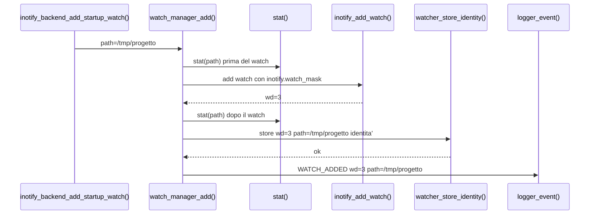

Effetto sulla struttura dati:

```text
prima:
items[3].active = 0

dopo watcher_store_identity():
items[3].wd           = 3
items[3].active       = 1
items[3].state        = WATCHER_STATE_VALID
items[3].has_identity = 1
items[3].device_id    = st.st_dev
items[3].inode_id     = st.st_ino
items[3].path         = "/tmp/progetto"
count                 = count + 1
```

Il log `WATCH_ADDED` e' diagnostica backend. Non e' un evento semantico del
core.

## Lettura di un evento inotify

Scenario:

```text
kernel invia IN_CREATE name=file.txt wd=3
```

Sequenza:

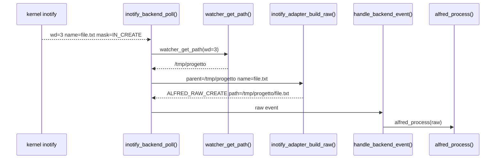

La tabella dei watch serve per ricostruire il path completo. Senza
`watcher_get_path()`, il backend conoscerebbe solo `file.txt`, non
`/tmp/progetto/file.txt`.

## Adapter inotify e raw event

`inotify_adapter.c` e' intenzionalmente stateless. Non possiede strutture dati
persistenti: riceve una `struct inotify_event`, il path parent recuperato dalla
watcher table e un buffer temporaneo per costruire il path completo.

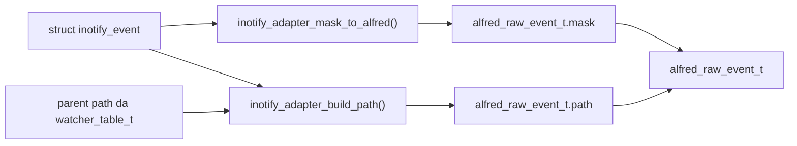

La funzione `inotify_adapter_build_raw()` non alloca memoria per il path. Il
campo `raw.path` punta al buffer `full_path` passato dal chiamante:

```text
inotify_backend_poll()
    char full_path[PATH_MAX]
    alfred_raw_event_t raw
    inotify_adapter_build_raw(..., full_path, ..., &raw)
    handle_backend_event(..., &raw, ...)
    alfred_process(core, &raw)
```

Questo significa che il core deve consumare il raw event subito. Se un livello
volesse conservare l'evento oltre la chiamata, dovrebbe copiare il path.

## Rimozione di un watch

Scenario:

```text
un watch non serve piu' oppure inotify segnala IN_IGNORED
```

Sequenza:

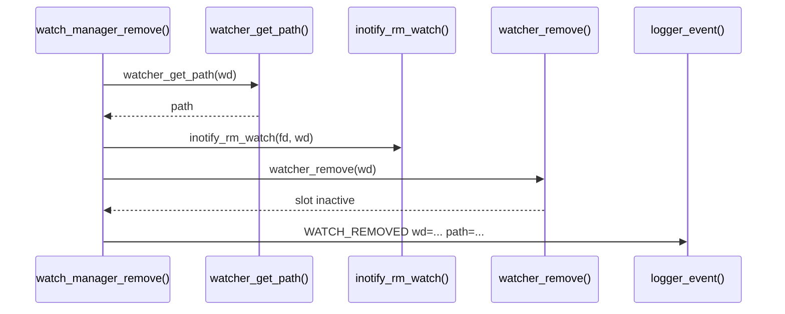

Effetto sulla struttura dati:

```text
prima:
items[wd].active = 1
items[wd].state  = WATCHER_STATE_STALE
items[wd].path   = "/tmp/progetto"

dopo watcher_remove():
items[wd].active = 0
items[wd].wd     = -1
items[wd].state  = WATCHER_STATE_REMOVED
items[wd].path   = ""
count            = count - 1
```

Anche `WATCH_REMOVED` e' diagnostica backend, non semantica core.

## Creazione ricorsiva veloce

Scenario delicato:

```bash
mkdir -p one/two/three
```

Problema: inotify puo' consegnare solo la creazione di `one`, perche' `two` e
`three` possono nascere prima che Alfred abbia installato i watch sui nuovi
genitori.

Sequenza semplificata:

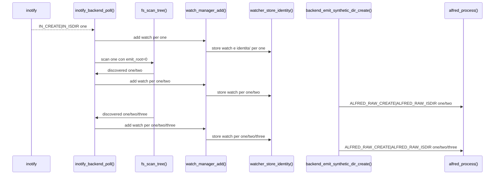

Qui il watch manager non dice "e' avvenuto un evento semantico". Dice solo:

```text
ho scoperto una directory che esiste gia' durante lo scan
```

Il backend trasforma questa scoperta in un raw event sintetico. Il core decide
la semantica e produce `DIR_CREATED`.

## Strutture dati del core

Arrivati a questo punto della lettura guidata, il backend ha gia' trasformato
gli eventi del kernel in `alfred_raw_event_t`. Ora entra in gioco il core, che
ha bisogno di memoria interna per trasformare eventi raw isolati in eventi
semantici coerenti.

Le due situazioni principali sono:

- `MOVED_FROM` e `MOVED_TO` arrivano come due raw event separati, ma devono
  diventare un solo evento semantico
- molti `MODIFY` ravvicinati sullo stesso file devono essere ridotti con debounce

Le strutture vivono in:

```text
core/src/alfred_tables.h
core/src/alfred_tables.c
```

Schema generale:

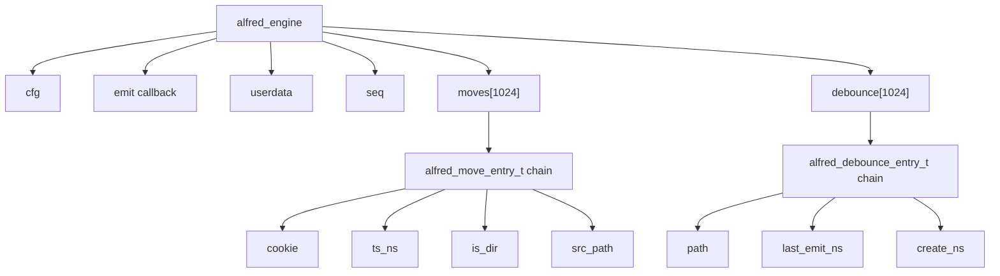

### `alfred_engine`

Campi principali:

| Campo | Significato | Scritto da | Letto da |
| --- | --- | --- | --- |
| `cfg` | configurazione interna del core | `alfred_create()` | correlatore, debounce, sweep move |
| `emit` | callback per emettere eventi semantici | `alfred_create()` | `emit()` |
| `userdata` | contesto passato alla callback | `alfred_create()` | `emit()` |
| `seq` | numero progressivo degli eventi semantici | `alfred_create()`, `emit()` | `core_logger_on_event()` tramite evento emesso |
| `moves[1024]` | tabella hash dei move pendenti | `alfred_move_insert()`, `alfred_move_take()`, `alfred_move_sweep()` | `alfred_process()` |
| `debounce[1024]` | tabella hash per debounce MODIFY | `alfred_debounce_get()`, `alfred_debounce_should_emit()` | `alfred_process()` |

Nota su `seq`: il numero progressivo e' utile per debug e log verbose, ma non
definisce la semantica. Due eventi con tipo e path uguali non cambiano
significato perche' hanno un numero di sequenza diverso; il numero aiuta solo a
ricostruire l'ordine di emissione.

### `alfred_move_entry_t`

Questa struttura salva un `MOVED_FROM` finche' arriva il `MOVED_TO` con lo
stesso cookie.

| Campo | Significato | Scritto da | Letto da |
| --- | --- | --- | --- |
| `cookie` | cookie raw che collega `MOVED_FROM` e `MOVED_TO` | `alfred_move_insert()` | `alfred_move_take()` |
| `ts_ns` | timestamp raw del `MOVED_FROM` | `alfred_move_insert()` | `alfred_move_sweep()` |
| `pid` | pid se noto | `alfred_move_insert()` | uso futuro |
| `is_dir` | indica se l'oggetto e' directory | `alfred_move_insert()` | `classify_move()` tramite `alfred_process()` |
| `src_path` | path sorgente copiato e posseduto dal core | `alfred_move_insert()` | `alfred_process()` |
| `next` | prossimo elemento nello stesso bucket hash | `alfred_move_insert()`, `alfred_move_take()` | funzioni tabella |

Perche' `src_path` viene copiato? Perche' il raw event ricevuto dal backend
punta spesso a un buffer locale valido solo durante la chiamata. Il core deve
conservare il path sorgente fino all'arrivo del `MOVED_TO`, quindi ne prende una
copia.

Sequenza move nel core:

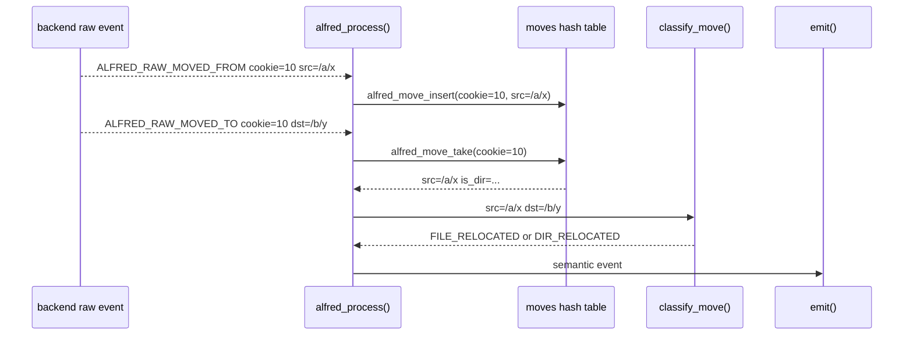

Frame logici per una futura animazione:

```text
frame 1:
  moves[bucket].head = NULL

frame 2:
  raw MOVED_FROM cookie=10 path=/a/x

frame 3:
  alfred_move_insert():
    entry.cookie = 10
    entry.src_path = copy("/a/x")
    entry.next = old bucket head
    moves[bucket] = entry

frame 4:
  raw MOVED_TO cookie=10 path=/b/y

frame 5:
  alfred_move_take():
    remove entry from bucket
    return src_path=/a/x

frame 6:
  classify_move(/a/x, /b/y)
  emit FILE_RELOCATED or DIR_RELOCATED
```

### `alfred_debounce_entry_t`

Questa struttura riduce i `MODIFY` ripetuti sullo stesso path.

| Campo | Significato | Scritto da | Letto da |
| --- | --- | --- | --- |
| `path` | path usato come chiave debounce | `alfred_debounce_get()` | `alfred_debounce_get()` |
| `last_emit_ns` | ultimo timestamp in cui e' stato emesso `FILE_MODIFIED` | `alfred_debounce_should_emit()` | `alfred_debounce_should_emit()` |
| `create_ns` | riservato per futura correlazione create-ready | non ancora usato in modo completo | uso futuro |
| `next` | prossimo elemento nello stesso bucket hash | `alfred_debounce_get()` | funzioni tabella |

Sequenza debounce:

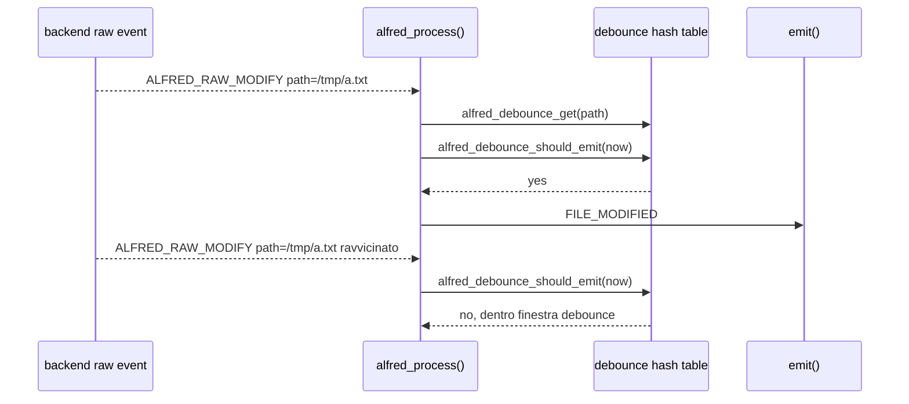

Qui il fatto raw non viene perso: il backend lo ha osservato. Il core decide
pero' che non tutti i `MODIFY` ravvicinati devono diventare eventi semantici,
perche' molti programmi salvano file generando raffiche di modifiche tecniche.

## Vista dinamica futura

Questa pagina e' pensata per essere trasformata in una vista dinamica in una
fase successiva.

Mermaid e' ottimo per diagrammi statici e sequence diagram, ma non produce GIF
animate vere. Per animare gli stati delle strutture dati conviene separare i
dati dalla resa grafica:

1. descrivere ogni scenario come una sequenza di frame
2. generare SVG o PNG per ogni frame
3. assemblare i frame in GIF o video con strumenti esterni

Esempio di frame per `watch_manager_add()`:

```text
frame 1:
  watcher_table.count = 0
  items[3].active = 0

frame 2:
  stat("/tmp/progetto") cattura identita' prima del watch
  inotify_add_watch() restituisce wd=3
  stat("/tmp/progetto") ricontrolla identita' dopo il watch

frame 3:
  watcher_store_identity() scrive:
    items[3].wd = 3
    items[3].active = 1
    items[3].has_identity = 1
    items[3].device_id = st.st_dev
    items[3].inode_id = st.st_ino
    items[3].path = "/tmp/progetto"
    count = 1

frame 4:
  logger_event("WATCH_ADDED wd=3 path=/tmp/progetto")
```

Possibili tecniche future:

| Tecnica | Vantaggio | Svantaggio |
| --- | --- | --- |
| Mermaid | integrato nei Markdown, facile da leggere | statico, non adatto a GIF |
| Graphviz | ottimo per grafi e strutture dati | statico se usato da solo |
| SVG generato da script | controllabile e animabile | richiede codice dedicato |
| HTML/CSS/JavaScript | ideale per animazioni interattive | non sempre comodo da leggere offline |
| Manim | animazioni didattiche molto potenti | dipendenza pesante e piu' complessa |
| PNG + ffmpeg/ImageMagick | semplice per GIF/video | serve generare i frame |

La direzione consigliata e' partire da SVG generati da uno script, per esempio:

```bash
make docs-animations
```

Questo target non esiste ancora nel Makefile. Qui e' indicato come nome
probabile per una futura automazione.

con output in:

```text
docs/generated/animations/
```

Gli stessi dati potrebbero generare sia una GIF sia una pagina HTML
interattiva. Prima pero' conviene stabilizzare le tabelle e gli schemi statici,
perche' saranno la base dei frame animati.

### Formato consigliato per i frame

Per rendere generabile la documentazione dinamica, ogni scenario dovrebbe
seguire sempre questa struttura:

````text
### Scenario animabile: nome scenario

Trigger:

```text
comando o evento che fa partire lo scenario
```

Frame:

```text
frame N - titolo breve:
  evento:
    cosa e' appena successo
  funzioni:
    funzione_a()
    funzione_b()
  strutture:
    struttura.campo = valore
  output:
    log o evento semantico prodotto
```
````

Non tutti i frame devono avere tutte le sottosezioni. Pero' quando un frame
modifica una struttura dati, la modifica deve essere esplicita. Questo e' il
punto che rende lo scenario animabile: uno script futuro puo' evidenziare il
campo modificato, mentre uno studente puo' seguire manualmente l'evoluzione
dello stato.

### Convenzioni per scenari futuri

- Usare nomi di funzioni reali, non pseudonimi generici.
- Usare nomi di campi reali quando il codice li espone.
- Separare eventi raw, eventi diagnostici backend ed eventi semantici core.
- Specificare quando un path e' copiato e quando invece e' solo preso in
  prestito da un buffer temporaneo.
- Evidenziare sempre se un comportamento appartiene al runtime core o al
  percorso legacy shadow.
- Se una scelta dipende da una regola teorica, aggiungere un rimando ai capitoli
  pertinenti: guida C, flusso eventi, semantica eventi o glossario.

### Possibile pipeline futura

Una pipeline leggera potrebbe essere:

```text
docs/it/16-mappa-codice-e-strutture.md
    -> parser scenari
    -> frame JSON intermedi
    -> renderer SVG
    -> GIF/video/HTML
```

Output ipotetico:

```text
docs/generated/animations/watch-add/
├── frames.json
├── frame-001.svg
├── frame-002.svg
├── watch-add.gif
└── index.html
```

Il file Markdown deve restare la sorgente didattica principale. I file generati
devono essere considerati derivati: utili per le lezioni, ma non il posto dove
scrivere le spiegazioni.

## Scenari animabili

Questa sezione raccoglie scenari gia' scritti come sequenze di frame. Ogni frame
descrive:

- l'evento o la chiamata che fa avanzare il processo
- quali funzioni entrano in gioco
- quali campi delle strutture dati cambiano
- quale output diagnostico o semantico viene prodotto

Questi frame sono volutamente testuali. In una fase successiva potranno essere
letti da uno script o trasformati manualmente in SVG, GIF, video o pagine HTML
interattive.

### Scenario animabile: aggiunta watch iniziale

Trigger:

```text
./alfred /tmp/progetto
```

Frame:

```text
frame 1 - configurazione pronta:
  config.inotify.recursive = 1
  config.inotify.watch_mask = IN_CREATE | IN_DELETE | IN_MODIFY | ...
  config.inotify.watcher_capacity = 128

frame 2 - backend inizializzato:
  app_build_inotify_backend_context(app, &ctx)
  inotify_backend_init(&ctx)
  ctx.runtime->fd = <fd inotify>
  watcher_init(&ctx.runtime->watchers, 128)
  watchers.count = 0

frame 3 - richiesta watch:
  inotify_backend_add_startup_watch(&ctx, "/tmp/progetto")
  watch_manager_add_recursive() oppure watch_manager_add()

frame 3b - startup ricorsivo:
  watch_manager_add_recursive(&ctx, "/tmp/progetto")
  fs_scan_tree("/tmp/progetto", directory-only)
  callback watch_manager_add_scanned_dir()

frame 4 - chiamata kernel:
  watch_manager_add()
  stat("/tmp/progetto") prima del watch
  inotify_add_watch(fd, "/tmp/progetto", config.inotify.watch_mask)
  kernel restituisce wd=3
  stat("/tmp/progetto") dopo il watch
  se l'identita' e' cambiata:
    inotify_rm_watch(fd, wd)
    fallimento controllato

frame 5 - aggiornamento watcher table:
  watcher_store_identity(wd=3, path="/tmp/progetto", st_dev, st_ino)
  watchers.items[3].wd = 3
  watchers.items[3].active = 1
  watchers.items[3].has_identity = 1
  watchers.items[3].device_id = st.st_dev
  watchers.items[3].inode_id = st.st_ino
  watchers.items[3].path = "/tmp/progetto"
  watchers.count = 1

frame 6 - output diagnostico:
  logger_event("WATCH_ADDED wd=3 path=/tmp/progetto")
```

Messaggio didattico: il watch e' stato aggiunto al backend, non al core. Il core
non conosce `wd=3`; ricevera' solo raw event con path gia' ricostruito.

### Scenario animabile: create file

Trigger:

```bash
touch /tmp/progetto/a.txt
```

Frame:

```text
frame 1 - evento kernel:
  struct inotify_event:
    wd = 3
    mask = IN_CREATE
    name = "a.txt"

frame 2 - lookup path parent:
  inotify_backend_poll()
  watcher_get_path(&watchers, 3) -> "/tmp/progetto"

frame 3 - conversione raw:
  inotify_adapter_build_path("/tmp/progetto", "a.txt")
  full_path = "/tmp/progetto/a.txt"
  inotify_adapter_mask_to_alfred(IN_CREATE)
  raw.mask = ALFRED_RAW_CREATE
  raw.path = full_path

frame 4 - ingresso nel core:
  handle_backend_event(&raw, app)
  alfred_process(app->core, &raw)

frame 5 - evento semantico:
  alfred_process()
  raw.mask contiene ALFRED_RAW_CREATE
  emit(ALFRED_EV_FILE_CREATED, "/tmp/progetto/a.txt", NULL)

frame 6 - log ufficiale:
  core_logger_on_event()
  logger_event("FILE_CREATED path=/tmp/progetto/a.txt")
```

Messaggio didattico: il backend ricostruisce il fatto tecnico, il core decide il
nome semantico `FILE_CREATED`.

### Scenario animabile: close-write / file ready

Trigger:

```bash
printf "hello" > /tmp/progetto/a.txt
```

Frame:

```text
frame 1 - evento tecnico:
  kernel invia IN_CLOSE_WRITE per a.txt

frame 2 - raw event:
  inotify_adapter_mask_to_alfred(IN_CLOSE_WRITE)
  raw.mask = ALFRED_RAW_CLOSE_WRITE
  raw.path = "/tmp/progetto/a.txt"

frame 3 - core:
  alfred_process()
  raw.mask contiene ALFRED_RAW_CLOSE_WRITE

frame 4 - semantica:
  emit(ALFRED_EV_FILE_READY, "/tmp/progetto/a.txt", NULL)

frame 5 - log:
  FILE_READY path=/tmp/progetto/a.txt
```

Messaggio didattico: `FILE_READY` non e' un duplicato di `FILE_CREATED`; indica
che una scrittura e' stata chiusa e il file e' pronto per lettura o indicizzazione.

### Scenario animabile: modify debounced

Trigger:

```bash
printf "x" >> /tmp/progetto/a.txt
printf "y" >> /tmp/progetto/a.txt
```

Frame:

```text
frame 1 - primo MODIFY:
  raw.mask = ALFRED_RAW_MODIFY
  raw.path = "/tmp/progetto/a.txt"

frame 2 - creazione stato debounce:
  alfred_debounce_get(path)
  bucket = path_index("/tmp/progetto/a.txt")
  nuova alfred_debounce_entry_t:
    path = copy("/tmp/progetto/a.txt")
    last_emit_ns = 0

frame 3 - prima emissione:
  alfred_debounce_should_emit(now)
  now - last_emit_ns >= modify_debounce_ms
  last_emit_ns = now
  emit(FILE_MODIFIED)

frame 4 - secondo MODIFY ravvicinato:
  alfred_debounce_get(path) trova la stessa entry
  alfred_debounce_should_emit(now2)

frame 5 - soppressione:
  now2 - last_emit_ns < modify_debounce_ms
  nessun evento semantico emesso
```

Messaggio didattico: il raw event arriva comunque al core. La soppressione
avviene solo nello stream semantico, per evitare rumore applicativo.

### Scenario animabile: move + rename nel core

Trigger:

```bash
mv /tmp/progetto/a.txt /tmp/altro/b.txt
```

Frame:

```text
frame 1 - prima meta':
  raw MOVED_FROM:
    cookie = 10
    path = "/tmp/progetto/a.txt"

frame 2 - salvataggio nel core:
  alfred_move_insert()
  bucket = move_index(10)
  entry.cookie = 10
  entry.src_path = copy("/tmp/progetto/a.txt")
  entry.next = moves[bucket]
  moves[bucket] = entry

frame 3 - seconda meta':
  raw MOVED_TO:
    cookie = 10
    path = "/tmp/altro/b.txt"

frame 4 - recupero:
  alfred_move_take(cookie=10)
  rimuove entry da moves[bucket]
  restituisce src_path="/tmp/progetto/a.txt"

frame 5 - classificazione:
  parent sorgente = "/tmp/progetto"
  parent destinazione = "/tmp/altro"
  basename sorgente = "a.txt"
  basename destinazione = "b.txt"
  parent diverso e nome diverso -> FILE_RELOCATED

frame 6 - output:
  emit(FILE_RELOCATED, src="/tmp/progetto/a.txt", dst="/tmp/altro/b.txt")
```

Messaggio didattico: il core produce un solo evento `RELOCATED`, mentre il
legacy storico puo' produrre due eventi (`MOVED` e `RENAMED`).

### Scenario animabile: recursive mkdir veloce

Trigger:

```bash
mkdir -p /tmp/progetto/one/two/three
```

Frame:

```text
frame 1 - evento osservabile:
  il kernel invia IN_CREATE|IN_ISDIR per "one"
  non invia create affidabili per "two" e "three" perche' i watch non esistono ancora

frame 2 - backend gestisce one:
  inotify_backend_poll()
  raw reale:
    ALFRED_RAW_CREATE | ALFRED_RAW_ISDIR
    path="/tmp/progetto/one"
  core emette DIR_CREATED one

frame 3 - discovery ricorsiva:
  backend_handle_dir_create()
  watch_manager_add("/tmp/progetto/one")
  fs_scan_tree("/tmp/progetto/one", emit_root=0)

frame 4 - watch su one:
  watcher_store_identity(wd=4, path="/tmp/progetto/one", st_dev, st_ino)
  WATCH_ADDED wd=4 path=/tmp/progetto/one

frame 5 - scoperta two:
  fs_scan_tree() vede "/tmp/progetto/one/two"
  watch_manager_add()
  watcher_store_identity(wd=5, path="/tmp/progetto/one/two", st_dev, st_ino)
  backend_process_scanned_dir_create(path="/tmp/progetto/one/two")

frame 6 - raw sintetico two:
  backend_emit_synthetic_dir_create()
  raw.mask = ALFRED_RAW_CREATE | ALFRED_RAW_ISDIR
  raw.path = "/tmp/progetto/one/two"
  core emette DIR_CREATED one/two

frame 7 - scoperta three:
  stesso schema:
    watcher_store_identity(wd=6, path="/tmp/progetto/one/two/three", st_dev, st_ino)
    raw sintetico CREATE|ISDIR
    core emette DIR_CREATED one/two/three
```

Messaggio didattico: il raw sintetico non inventa una directory; rappresenta una
directory reale scoperta troppo tardi per ricevere l'evento kernel originale.

### Scenario animabile: rimozione watch

Trigger:

```text
il backend riceve IN_IGNORED oppure decide di rimuovere un watch
```

Frame:

```text
frame 1 - stato iniziale:
  watchers.items[3].active = 1
  watchers.items[3].path = "/tmp/progetto"

frame 2 - lookup per log:
  watch_manager_remove(ctx, wd=3)
  watcher_get_path(wd=3) -> "/tmp/progetto"

frame 3 - rimozione kernel:
  inotify_rm_watch(ctx.runtime->fd, 3)

frame 4 - rimozione tabella:
  watcher_remove(wd=3)
  watchers.items[3].active = 0
  watchers.items[3].wd = -1
  watchers.items[3].path = ""
  watchers.count = watchers.count - 1

frame 5 - output diagnostico:
  WATCH_REMOVED wd=3 path=/tmp/progetto
```

Messaggio didattico: `WATCH_REMOVED` descrive stato del backend. Non e' un
evento semantico del filesystem come `DIR_DELETED`.

## Strutture legacy shadow

Il percorso legacy non e' piu' presente nel codice corrente. I file
`events.c`, `events.h`, `move_cache.c` e `move_cache.h` sono stati rimossi:
la semantica finale vive nel core e il backend inotify non emette piu' eventi
utente.

Questa sezione resta per fissare una differenza storica importante: quando
cambiavano sia directory sia nome, il legacy poteva emettere due eventi
(`MOVED` e poi `RENAMED`). Il core invece emette un solo evento `RELOCATED`.
Questa scelta non dipende piu' da una `move_cache_t` nel modulo inotify: la
correlazione dei move appartiene al core.
