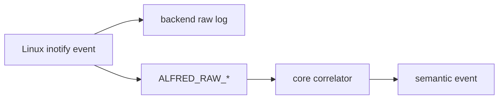

# Matrice eventi inotify

Questo capitolo raccoglie, in un unico punto, tutti gli eventi e i flag
principali esposti da `inotify(7)` e li confronta con i due livelli superiori
di Alfred:

- evento grezzo del backend inotify, cioe' quello che arriva dal kernel Linux
- evento raw Alfred, cioe' `ALFRED_RAW_*`
- evento semantico Alfred, cioe' `FILE_*`, `DIR_*`, `OVERFLOW`, ecc.

La fonte primaria per la lista e' la pagina manuale Linux
[`inotify(7)`](https://man7.org/linux/man-pages/man7/inotify.7.html). La
pagina distingue tre gruppi diversi:

- eventi che possono essere richiesti con `inotify_add_watch()` e poi ricevuti
  con `read()`
- bit che possono comparire solo nella `mask` restituita dal kernel
- flag che modificano il modo in cui viene aggiunto un watch

Questa distinzione e' importante. Non tutto cio' che inizia con `IN_` e' un
evento utente e non tutto deve diventare semantica del core.

## Legenda

Nelle tabelle sotto:

- `Si`: Alfred gestisce oggi quel livello
- `No`: Alfred non lo gestisce oggi
- `Parziale`: Alfred vede una parte del fenomeno, ma non ha ancora una
  semantica completa
- `Backend`: il fatto serve al modulo inotify, non al core semantico
- `Rimandato`: scelta intenzionalmente non ancora implementata

## Pipeline concettuale



Il backend deve fermarsi ai fatti tecnici: leggere `struct inotify_event`,
ricostruire il path, mantenere la tabella `wd -> path`, aggiornare i watch
ricorsivi e produrre `alfred_raw_event_t`. Il core decide invece se quel fatto
raw diventa un evento utente.

## Eventi richiedibili e ricevibili

Questi sono i bit che `inotify(7)` elenca come eventi che possono essere
specificati nella `mask` di `inotify_add_watch()` e possono essere restituiti
nella `mask` di `struct inotify_event`.

| Evento inotify | Quando nasce | Stato backend Alfred | Raw Alfred | Semantica core | Decisione |
| --- | --- | --- | --- | --- | --- |
| `IN_ACCESS` | File letto o eseguito | No | Nessuno | Nessuna | Non supportato per ora. E' molto rumoroso e non abbiamo ancora un caso utente chiaro. Se servira', andra' introdotto come raw dedicato, per esempio `ALFRED_RAW_ACCESS`, prima di discutere una semantica. |
| `IN_ATTRIB` | Metadati cambiati: permessi, timestamp, xattr, link count, owner, group | Si | `ALFRED_RAW_ATTRIB` | Nessuna | Supportato come osservabilita' raw/backend. La semantica `FILE_METADATA_CHANGED` / `DIR_METADATA_CHANGED` e' rimandata. |
| `IN_CLOSE_WRITE` | File aperto in scrittura e poi chiuso | Si | `ALFRED_RAW_CLOSE_WRITE` | `FILE_READY` | Supportato end-to-end. Non e' un duplicato di `FILE_MODIFIED`: indica che uno scrittore ha chiuso il file. |
| `IN_CLOSE_NOWRITE` | File o directory chiusi senza scrittura | No | Nessuno | Nessuna | Non supportato per ora. Utile forse per audit/debug, ma non per la semantica filesystem principale. |
| `IN_CREATE` | File, directory, link, symlink o socket creato dentro una directory osservata | Si | `ALFRED_RAW_CREATE` con eventuale `ALFRED_RAW_ISDIR` | `FILE_CREATED` o `DIR_CREATED` | Supportato end-to-end. In modalita' ricorsiva Alfred puo' emettere anche create sintetici per directory scoperte dopo l'aggiunta del watch. |
| `IN_DELETE` | File o directory cancellato da una directory osservata | Si | `ALFRED_RAW_DELETE` con eventuale `ALFRED_RAW_ISDIR` | `FILE_DELETED` o `DIR_DELETED` | Supportato end-to-end quando l'evento riguarda un figlio della directory osservata. |
| `IN_DELETE_SELF` | Il file o la directory osservata direttamente e' stata cancellata | Parziale | Nessuno | Nessuna | Alfred lo logga nel raw backend e lo usa insieme a `IN_IGNORED` per riparare lo stato dei watch. Non diventa ancora evento core. |
| `IN_MODIFY` | Contenuto modificato, per esempio `write()` o `truncate()` | Si | `ALFRED_RAW_MODIFY` | `FILE_MODIFIED` | Supportato end-to-end con debounce nel core. |
| `IN_MOVE_SELF` | Il file o la directory osservata direttamente e' stata spostata | No | Nessuno | Nessuna | Rimandato. E' diverso da `IN_MOVED_FROM` / `IN_MOVED_TO`: riguarda l'oggetto osservato, quindi puo' richiedere resync dei watch e aggiornamento dei path cache. |
| `IN_MOVED_FROM` | Vecchio nome di un rename/move dentro directory osservata | Si | `ALFRED_RAW_MOVED_FROM` | Nessuna immediata | Supportato come prima meta' di una correlazione. Il core lo conserva in tabella in attesa di `IN_MOVED_TO` con lo stesso cookie. |
| `IN_MOVED_TO` | Nuovo nome di un rename/move dentro directory osservata | Si | `ALFRED_RAW_MOVED_TO` | `FILE_RENAMED`, `FILE_MOVED`, `FILE_RELOCATED`, `DIR_RENAMED`, `DIR_MOVED`, `DIR_RELOCATED` oppure create fallback | Supportato. Se manca il `MOVED_FROM`, il core emette un create fallback perche' l'oggetto e' entrato nell'albero osservato. |
| `IN_OPEN` | File o directory aperto | No | Nessuno | Nessuna | Non supportato per ora. Puo' essere utile per audit, ma e' molto rumoroso e non descrive una modifica del filesystem. |

## Bit restituiti dal kernel

Questi bit possono comparire nella `mask` degli eventi letti dal file
descriptor inotify, ma non sono normali eventi da richiedere come comportamento
utente.

| Bit inotify | Quando nasce | Stato backend Alfred | Raw Alfred | Semantica core | Decisione |
| --- | --- | --- | --- | --- | --- |
| `IN_IGNORED` | Il watch e' stato rimosso esplicitamente o automaticamente | Backend | Nessuno | Nessuna | Gestito come stato backend: Alfred rimuove il watch dalla tabella. Deve restare diagnostica, non evento semantico. |
| `IN_ISDIR` | Il soggetto dell'evento e' una directory | Si | `ALFRED_RAW_ISDIR` | Modifica il tipo dell'evento semantico | Non e' un evento autonomo. Serve a scegliere tra `FILE_*` e `DIR_*`. |
| `IN_Q_OVERFLOW` | La coda inotify ha perso eventi | Si | `ALFRED_RAW_OVERFLOW` | `OVERFLOW` | Supportato come diagnostica semantica minima. La recovery completa e' rimandata: servira' una policy di resync. |
| `IN_UNMOUNT` | Il filesystem contenente l'oggetto osservato e' stato smontato | No | Nessuno | Nessuna | Rimandato. Dovrebbe probabilmente essere trattato come perdita di affidabilita' della subtree, vicino a overflow/resync. |

Nota tecnica importante: oggi il parser di `inotify_watch_mask` e la maschera
predefinita accettano anche alcuni bit restituiti dal kernel, come
`IN_IGNORED` e `IN_Q_OVERFLOW`, perche' Alfred li sa nominare o gestire quando
arrivano negli eventi. Dal punto di vista didattico, pero', conviene separare:

```text
subscription mask  = eventi che chiediamo al kernel
recognized output  = bit che sappiamo interpretare quando il kernel li emette
```

Un futuro refactor dovrebbe quindi distinguere meglio la lista dei token
configurabili nella watch mask dalla lista dei bit riconosciuti dal raw log e
dall'adapter.

Esempio concreto:

```text
IN_CREATE | IN_ISDIR
```

non significa che sono successi due eventi utente. Significa:

```text
evento principale = IN_CREATE
informazione aggiuntiva = il soggetto e' una directory
```

Il backend puo' quindi tradurlo in:

```text
ALFRED_RAW_CREATE | ALFRED_RAW_ISDIR
```

e il core sceglie `DIR_CREATED` invece di `FILE_CREATED`.

Altro esempio:

```text
IN_IGNORED
```

non significa "file cancellato" o "directory cancellata" in senso semantico.
Significa che il kernel non manterra' piu' quel watch. Il backend deve usare
questa informazione per aggiornare la tabella `wd -> path`; il core, invece,
non deve ricevere automaticamente un evento utente solo perche' un watch e'
stato rimosso.

La separazione futura serve quindi a rendere esplicite due responsabilita':

```text
watch mask parser
    accetta solo eventi che l'utente puo' scegliere di osservare

raw output recognizer
    riconosce anche bit tecnici che il kernel aggiunge agli eventi
```

Se non separiamo questi ruoli, il rischio didattico e architetturale e' far
pensare che ogni bit `IN_*` sia una richiesta configurabile e un possibile
evento semantico. Non e' cosi': alcuni bit sono solo metadati tecnici o segnali
di manutenzione del backend.

## Macro di comodita'

`inotify(7)` definisce anche macro che non sono eventi indipendenti.

| Macro | Significato | Decisione Alfred |
| --- | --- | --- |
| `IN_ALL_EVENTS` | Tutti gli eventi principali richiedibili | Non supportata nel parser. Alfred preferisce una maschera esplicita e documentata. |
| `IN_MOVE` | `IN_MOVED_FROM | IN_MOVED_TO` | Non supportata come token. La documentazione usa i due eventi reali per rendere chiara la correlazione. |
| `IN_CLOSE` | `IN_CLOSE_WRITE | IN_CLOSE_NOWRITE` | Non supportata come token. Alfred supporta solo `IN_CLOSE_WRITE` perche' produce `FILE_READY`. |

## Flag di configurazione del watch

Questi flag modificano il comportamento di `inotify_add_watch()`. Non sono
eventi filesystem e quindi non devono diventare `ALFRED_RAW_*`.

| Flag | Significato | Stato Alfred | Decisione |
| --- | --- | --- | --- |
| `IN_DONT_FOLLOW` | Non seguire symlink nel path del watch | No | Possibile opzione futura per hardening/configurazione. Non e' semantica core. |
| `IN_EXCL_UNLINK` | Evita eventi su figli gia' rimossi dalla directory | No | Potrebbe ridurre rumore in directory come `/tmp`. Da valutare come opzione backend. |
| `IN_MASK_ADD` | Aggiunge eventi a un watch esistente invece di sostituire la maschera | No | Riguarda la policy di gestione watch. Da valutare quando si rivede `watch_manager_add()`. |
| `IN_ONESHOT` | Rimuove il watch dopo un solo evento | No | Non adatto al monitoraggio continuo di Alfred. |
| `IN_ONLYDIR` | Aggiunge il watch solo se il path e' una directory | No | Potrebbe essere utile per rendere race-free i watch ricorsivi. Da valutare nel backend, non nel core. |
| `IN_MASK_CREATE` | Crea il watch solo se non esiste gia' | No | Potrebbe aiutare a evitare sostituzioni accidentali di watch su stesso inode. Da studiare insieme alla tabella watch. |

## Stato per livello Alfred

Questa vista compatta risponde alla domanda pratica: cosa gestiamo davvero oggi?

| Livello | Gestito oggi | Rimandato |
| --- | --- | --- |
| Inotify raw log | `IN_CREATE`, `IN_DELETE`, `IN_MODIFY`, `IN_ATTRIB`, `IN_CLOSE_WRITE`, `IN_MOVED_FROM`, `IN_MOVED_TO`, `IN_ISDIR`, `IN_DELETE_SELF`, `IN_IGNORED`, `IN_Q_OVERFLOW` | `IN_ACCESS`, `IN_CLOSE_NOWRITE`, `IN_MOVE_SELF`, `IN_OPEN`, `IN_UNMOUNT` |
| Alfred raw | `ALFRED_RAW_CREATE`, `ALFRED_RAW_DELETE`, `ALFRED_RAW_MODIFY`, `ALFRED_RAW_ATTRIB`, `ALFRED_RAW_CLOSE_WRITE`, `ALFRED_RAW_MOVED_FROM`, `ALFRED_RAW_MOVED_TO`, `ALFRED_RAW_OVERFLOW`, `ALFRED_RAW_ISDIR` | Access/open/close-nowrite/move-self/unmount raw dedicati |
| Core semantico | create, delete, modify, ready, move/rename/relocated, overflow | metadata changed, access/open audit, close-nowrite, watched-object moved/deleted-self policy, unmount/resync |
| Backend state | recursive watch add, synthetic directory create, ignored-watch cleanup | policy completa per root watched object moved/deleted, resync dopo unmount/overflow |

## Decisioni operative

Per mantenere Alfred comprensibile, aggiungiamo nuovi eventi in tre passaggi:

1. raw log backend: il backend deve saper nominare l'evento Linux
2. raw Alfred: l'adapter deve introdurre un `ALFRED_RAW_*` se il fatto serve al
   core o ai backend futuri
3. semantica core: il core deve emettere un evento utente solo se esiste un
   significato stabile e backend-neutral

Questa regola evita l'errore di copiare automaticamente tutta la superficie di
inotify dentro l'API semantica. `IN_OPEN`, per esempio, e' reale e utile per
alcuni strumenti di audit, ma non significa che un file sia stato creato,
modificato, cancellato o pronto.

## Prossimi punti da discutere

1. Separare nel codice la lista degli eventi richiedibili nella watch mask dai
   bit riconosciuti in output.
2. Decidere la semantica di `ALFRED_RAW_ATTRIB`: nessun evento, evento unico
   `METADATA_CHANGED`, oppure distinzione file/directory.
3. Decidere se `IN_DELETE_SELF` deve produrre un evento semantico quando il path
   osservato direttamente viene cancellato.
4. Decidere se `IN_MOVE_SELF` richiede solo resync backend o anche un evento
   semantico.
5. Rimandare `IN_UNMOUNT` e overflow completo alla progettazione della recovery
   da perdita di affidabilita'.
6. Lasciare `IN_ACCESS`, `IN_OPEN` e `IN_CLOSE_NOWRITE` fuori dal core finche'
   non nasce un requisito di audit esplicito.
