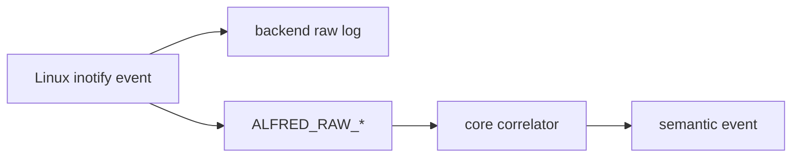
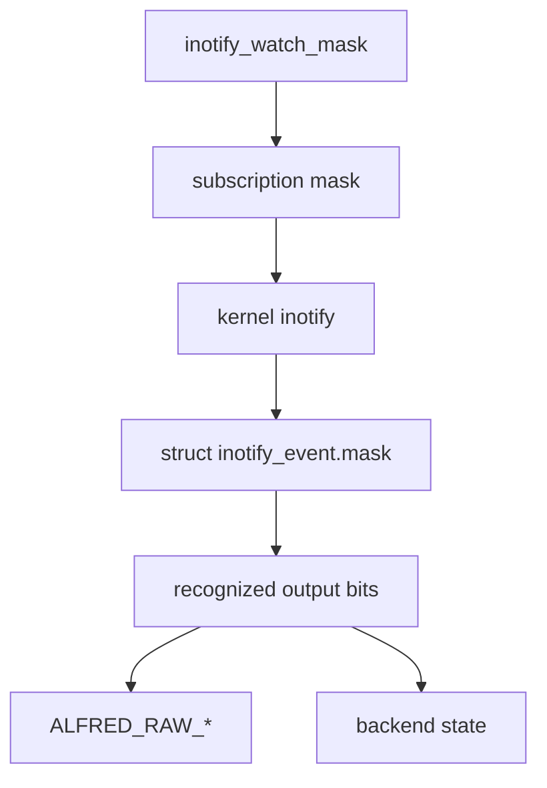

# Matrice eventi inotify

Questo capitolo raccoglie, in un unico punto, tutti gli eventi e i flag
principali esposti da `inotify(7)` e li confronta con i due livelli superiori
di Alfred:

- evento grezzo del backend inotify, cioe' quello che arriva dal kernel Linux
- evento raw Alfred, cioe' `ALFRED_RAW_*`
- evento semantico Alfred, cioe' `FILE_*`, `DIR_*`, `OVERFLOW`, ecc.

La fonte primaria per la lista e' la pagina manuale Linux
[`inotify(7)`](https://man7.org/linux/man-pages/man7/inotify.7.html). La
pagina distingue tre gruppi diversi:

- eventi che possono essere richiesti con `inotify_add_watch()` e poi ricevuti
  con `read()`
- bit che possono comparire solo nella `mask` restituita dal kernel
- flag che modificano il modo in cui viene aggiunto un watch

Questa distinzione e' importante. Non tutto cio' che inizia con `IN_` e' un
evento utente e non tutto deve diventare semantica del core.

## Legenda

Nelle tabelle sotto:

- `Si`: Alfred gestisce oggi quel livello
- `No`: Alfred non lo gestisce oggi
- `Parziale`: Alfred vede una parte del fenomeno, ma non ha ancora una
  semantica completa
- `Backend`: il fatto serve al modulo inotify, non al core semantico
- `Rimandato`: scelta intenzionalmente non ancora implementata

## Pipeline concettuale



Il backend deve fermarsi ai fatti tecnici: leggere `struct inotify_event`,
ricostruire il path, mantenere la tabella `wd -> path`, aggiornare i watch
ricorsivi e produrre `alfred_raw_event_t`. Il core decide invece se quel fatto
raw diventa un evento utente.

## Eventi richiedibili e ricevibili

Questi sono i bit che `inotify(7)` elenca come eventi che possono essere
specificati nella `mask` di `inotify_add_watch()` e possono essere restituiti
nella `mask` di `struct inotify_event`.

| Evento inotify | Quando nasce | Stato backend Alfred | Raw Alfred | Semantica core | Decisione |
| --- | --- | --- | --- | --- | --- |
| `IN_ACCESS` | File letto o eseguito | No | Nessuno | Nessuna | Non supportato per ora. E' molto rumoroso e non abbiamo ancora un caso utente chiaro. Se servira', andra' introdotto come raw dedicato, per esempio `ALFRED_RAW_ACCESS`, prima di discutere una semantica. |
| `IN_ATTRIB` | Metadati cambiati: permessi, timestamp, xattr, link count, owner, group | Si | `ALFRED_RAW_ATTRIB` | Nessuna | Supportato come osservabilita' raw/backend. La semantica `FILE_METADATA_CHANGED` / `DIR_METADATA_CHANGED` e' rimandata. |
| `IN_CLOSE_WRITE` | File aperto in scrittura e poi chiuso | Si | `ALFRED_RAW_CLOSE_WRITE` | `FILE_READY` | Supportato end-to-end. Non e' un duplicato di `FILE_MODIFIED`: indica che uno scrittore ha chiuso il file. |
| `IN_CLOSE_NOWRITE` | File o directory chiusi senza scrittura | No | Nessuno | Nessuna | Non supportato per ora. Utile forse per audit/debug, ma non per la semantica filesystem principale. |
| `IN_CREATE` | File, directory, link, symlink o socket creato dentro una directory osservata | Si | `ALFRED_RAW_CREATE` con eventuale `ALFRED_RAW_ISDIR` | `FILE_CREATED` o `DIR_CREATED` | Supportato end-to-end. In modalita' ricorsiva Alfred puo' emettere anche create sintetici per directory scoperte dopo l'aggiunta del watch. |
| `IN_DELETE` | File o directory cancellato da una directory osservata | Si | `ALFRED_RAW_DELETE` con eventuale `ALFRED_RAW_ISDIR` | `FILE_DELETED` o `DIR_DELETED` | Supportato end-to-end quando l'evento riguarda un figlio della directory osservata. |
| `IN_DELETE_SELF` | Il file o la directory osservata direttamente e' stata cancellata | Backend | Nessuno | Nessuna | Alfred lo logga nel raw backend, marca il watch `STALE`, scrive `WATCH_STALE` e lascia poi a `IN_IGNORED` il cleanup `WATCH_REMOVED`. Decisione proposta: valutare in futuro `ALFRED_RAW_DELETE` per il path osservato direttamente, non per i figli. |
| `IN_MODIFY` | Contenuto modificato, per esempio `write()` o `truncate()` | Si | `ALFRED_RAW_MODIFY` | `FILE_MODIFIED` | Supportato end-to-end con debounce nel core. |
| `IN_MOVE_SELF` | Il file o la directory osservata direttamente e' stata spostata | Backend | Nessuno | Nessuna | Gestito come perdita di affidabilita' del mapping `wd -> path`: Alfred lo logga nel raw backend, marca il watch `STALE` e scrive `WATCH_STALE`. Non produce rename/move/relocated perche' manca il nuovo path. |
| `IN_MOVED_FROM` | Vecchio nome di un rename/move dentro directory osservata | Si | `ALFRED_RAW_MOVED_FROM` | Nessuna immediata | Supportato come prima meta' di una correlazione. Il core lo conserva in tabella in attesa di `IN_MOVED_TO` con lo stesso cookie. |
| `IN_MOVED_TO` | Nuovo nome di un rename/move dentro directory osservata | Si | `ALFRED_RAW_MOVED_TO` | `FILE_RENAMED`, `FILE_MOVED`, `FILE_RELOCATED`, `DIR_RENAMED`, `DIR_MOVED`, `DIR_RELOCATED` oppure create fallback | Supportato. Se manca il `MOVED_FROM`, il core emette un create fallback perche' l'oggetto e' entrato nell'albero osservato. |
| `IN_OPEN` | File o directory aperto | No | Nessuno | Nessuna | Non supportato per ora. Puo' essere utile per audit, ma e' molto rumoroso e non descrive una modifica del filesystem. |

## Bit restituiti dal kernel

Questi bit possono comparire nella `mask` degli eventi letti dal file
descriptor inotify, ma non sono normali eventi da richiedere come comportamento
utente.

| Bit inotify | Quando nasce | Stato backend Alfred | Raw Alfred | Semantica core | Decisione |
| --- | --- | --- | --- | --- | --- |
| `IN_IGNORED` | Il watch e' stato rimosso esplicitamente o automaticamente | Backend | Nessuno | Nessuna | Gestito come stato backend: Alfred rimuove il watch dalla tabella. Deve restare diagnostica, non evento semantico. |
| `IN_ISDIR` | Il soggetto dell'evento e' una directory | Si | `ALFRED_RAW_ISDIR` | Modifica il tipo dell'evento semantico | Non e' un evento autonomo. Serve a scegliere tra `FILE_*` e `DIR_*`. |
| `IN_Q_OVERFLOW` | La coda inotify ha perso eventi | Si | `ALFRED_RAW_OVERFLOW` | `OVERFLOW` | Supportato come diagnostica semantica minima. L'evento e' globale e arriva con `wd=-1`, quindi il backend lo converte esplicitamente senza usare la watcher table. La recovery completa e' rimandata: servira' una policy di resync. |
| `IN_UNMOUNT` | Il filesystem contenente l'oggetto osservato e' stato smontato | Backend | Nessuno | Nessuna | Supportato come diagnostica backend minima: Alfred lo logga nel raw backend, marca il watch `STALE` con `reason=IN_UNMOUNT` e lascia a `IN_IGNORED` il cleanup `WATCH_REMOVED`. Non e' un delete semantico. La recovery completa post-mount e' rimandata. |

Nota tecnica importante: oggi il parser di `inotify_watch_mask` e la maschera
predefinita accettano anche alcuni bit restituiti dal kernel, come
`IN_IGNORED`, `IN_UNMOUNT` e `IN_Q_OVERFLOW`, perche' Alfred li sa nominare o
gestire quando arrivano negli eventi. Dal punto di vista didattico, pero',
conviene separare:

```text
subscription mask  = eventi che chiediamo al kernel
recognized output  = bit che sappiamo interpretare quando il kernel li emette
```

Un futuro refactor dovrebbe quindi distinguere meglio la lista dei token
configurabili nella watch mask dalla lista dei bit riconosciuti dal raw log e
dall'adapter.

Esempio concreto:

```text
IN_CREATE | IN_ISDIR
```

non significa che sono successi due eventi utente. Significa:

```text
evento principale = IN_CREATE
informazione aggiuntiva = il soggetto e' una directory
```

Il backend puo' quindi tradurlo in:

```text
ALFRED_RAW_CREATE | ALFRED_RAW_ISDIR
```

e il core sceglie `DIR_CREATED` invece di `FILE_CREATED`.

Altro esempio:

```text
IN_Q_OVERFLOW
```

significa che la coda dell'istanza inotify ha perso uno o piu' eventi. Il
kernel usa `wd=-1`, quindi non esiste un path osservato da ricostruire. Alfred
lo trasforma in `ALFRED_RAW_OVERFLOW` con path vuoto e il core emette
`OVERFLOW`. Questo non ripara lo stato: segnala solo che lo stream non e' piu'
completo e che una futura policy dovra' decidere se ricostruire tutte le root,
una subtree o l'intero backend.

Altro esempio:

```text
IN_IGNORED
```

non significa "file cancellato" o "directory cancellata" in senso semantico.
Significa che il kernel non manterra' piu' quel watch. Il backend deve usare
questa informazione per aggiornare la tabella `wd -> path`; il core, invece,
non deve ricevere automaticamente un evento utente solo perche' un watch e'
stato rimosso.

Altro esempio:

```text
IN_UNMOUNT
```

significa che il filesystem contenente l'oggetto osservato non e' piu'
disponibile nella mount namespace corrente. Il kernel genera poi anche
`IN_IGNORED` per il watch descriptor. Alfred deve quindi trattarlo come perdita
di affidabilita' dello scope, non come `DIR_DELETED`: il contenuto puo'
ricomparire se il filesystem viene montato di nuovo, e l'evento non contiene
una lista di figli cancellati.

La separazione futura serve quindi a rendere esplicite due responsabilita':

```text
watch mask parser
    accetta solo eventi che l'utente puo' scegliere di osservare

raw output recognizer
    riconosce anche bit tecnici che il kernel aggiunge agli eventi
```

Se non separiamo questi ruoli, il rischio didattico e architetturale e' far
pensare che ogni bit `IN_*` sia una richiesta configurabile e un possibile
evento semantico. Non e' cosi': alcuni bit sono solo metadati tecnici o segnali
di manutenzione del backend.



Nel diagramma, `subscription mask` e `recognized output bits` sono due passaggi
diversi anche se nel codice C sono entrambi rappresentati da bitmask numeriche.
La prima decide cosa chiediamo al kernel; la seconda decide cosa Alfred sa
leggere quando il kernel restituisce un evento.

## Macro di comodita'

`inotify(7)` definisce anche macro che non sono eventi indipendenti.

| Macro | Significato | Decisione Alfred |
| --- | --- | --- |
| `IN_ALL_EVENTS` | Tutti gli eventi principali richiedibili | Non supportata nel parser. Alfred preferisce una maschera esplicita e documentata. |
| `IN_MOVE` | `IN_MOVED_FROM | IN_MOVED_TO` | Non supportata come token. La documentazione usa i due eventi reali per rendere chiara la correlazione. |
| `IN_CLOSE` | `IN_CLOSE_WRITE | IN_CLOSE_NOWRITE` | Non supportata come token. Alfred supporta solo `IN_CLOSE_WRITE` perche' produce `FILE_READY`. |

### Decisione dettagliata sulle macro

Le macro di comodita' sono utili quando si scrive un piccolo programma inotify,
ma sono meno adatte a una configurazione didattica e a un motore che vuole
contratti stabili.

| Macro | Perche' non accettarla ora | Rischio se la accettiamo troppo presto | Eventuale futuro |
| --- | --- | --- | --- |
| `IN_ALL_EVENTS` | Nasconde quali eventi Alfred sta davvero chiedendo al kernel | Abiliterebbe anche eventi rumorosi come `IN_ACCESS`, `IN_OPEN` e `IN_CLOSE_NOWRITE` senza avere raw/core contract pronti | Possibile solo come scorciatoia debug, mai come default |
| `IN_MOVE` | E' solo un alias di `IN_MOVED_FROM | IN_MOVED_TO` | Gli studenti perderebbero la distinzione tra vecchio path, nuovo path e cookie di correlazione | Rimane inutile finche' il parser accetta gia' i due bit reali |
| `IN_CLOSE` | Include anche `IN_CLOSE_NOWRITE`, che Alfred non usa per `FILE_READY` | Potrebbe far credere che ogni close significhi file pronto dopo scrittura | Valutabile solo se introdurremo audit di apertura/chiusura file |

## Flag di configurazione del watch

Questi flag modificano il comportamento di `inotify_add_watch()`. Non sono
eventi filesystem e quindi non devono diventare `ALFRED_RAW_*`.

| Flag | Significato | Stato Alfred | Decisione |
| --- | --- | --- | --- |
| `IN_DONT_FOLLOW` | Non seguire symlink nel path del watch | No | Possibile opzione futura per hardening/configurazione. Non e' semantica core. |
| `IN_EXCL_UNLINK` | Evita eventi su figli gia' rimossi dalla directory | No | Potrebbe ridurre rumore in directory come `/tmp`. Da valutare come opzione backend. |
| `IN_MASK_ADD` | Aggiunge eventi a un watch esistente invece di sostituire la maschera | No | Riguarda la policy di gestione watch. Da valutare quando si rivede `watch_manager_add()`. |
| `IN_ONESHOT` | Rimuove il watch dopo un solo evento | No | Non adatto al monitoraggio continuo di Alfred. |
| `IN_ONLYDIR` | Aggiunge il watch solo se il path e' una directory | No | Potrebbe essere utile per rendere race-free i watch ricorsivi. Da valutare nel backend, non nel core. |
| `IN_MASK_CREATE` | Crea il watch solo se non esiste gia' | No | Potrebbe aiutare a evitare sostituzioni accidentali di watch su stesso inode. Da studiare insieme alla tabella watch. |

### Decisione dettagliata sui flag di watch

Questi flag non descrivono eventi avvenuti nel filesystem. Sono opzioni di
installazione del watch. Per questo non devono entrare in `ALFRED_RAW_*` e non
devono essere gestiti dal core. Se li useremo, dovranno vivere nella
configurazione del backend inotify, probabilmente in una chiave separata da
`inotify_watch_mask`, per esempio `inotify_watch_flags`.

| Flag | Priorita' | Decisione proposta | Motivazione tecnica | Test futuro |
| --- | --- | --- | --- | --- |
| `IN_ONLYDIR` | Alta | Valutare per i watch ricorsivi su directory | Rende atomico il controllo "questo path e' una directory" dentro `inotify_add_watch()`. Oggi Alfred fa `stat()` prima e dopo, ma `IN_ONLYDIR` aggiungerebbe una garanzia kernel specifica per directory | provare che un file passato come root o scoperto come child non venga accettato come directory watched |
| `IN_MASK_CREATE` | Alta, con fallback | Valutare per evitare sostituzioni accidentali di watch esistenti | Senza questo flag, una nuova `inotify_add_watch()` sullo stesso oggetto puo' modificare la maschera di un watch gia' presente. Alfred ha una watcher table propria, quindi deve evitare di clobberare policy esistenti senza accorgersene | test con due path che arrivano allo stesso inode quando l'ambiente lo permette; fallback se il kernel non supporta Linux >= 4.18 |
| `IN_DONT_FOLLOW` | Media | Possibile hardening configurabile | Evita di seguire symlink quando il path del watch e' un link simbolico. Utile per sicurezza e prevedibilita', ma cambia comportamento per utenti che vogliono osservare il target del link | test con symlink root: una modalita' segue il target, una modalita' rifiuta/non segue |
| `IN_EXCL_UNLINK` | Media | Possibile opzione prestazionale per directory rumorose | Riduce eventi su figli gia' rimossi dalla directory, caso tipico di `/tmp` e file temporanei unlinkati subito. Puo' diminuire rumore, ma rischia di nascondere fatti utili ad audit forense | stress test su file temporanei creati e unlinkati subito; confrontare volume raw log |
| `IN_MASK_ADD` | Bassa | Non necessario finche' Alfred possiede tutta la maschera del watch | Serve ad aggiungere bit a una maschera esistente. Alfred oggi preferisce calcolare una maschera completa e installarla in modo controllato | test unitario solo se introdurremo aggiornamento dinamico parziale delle mask |
| `IN_ONESHOT` | Esclusa per runtime | Non usare nel monitoraggio normale | Alfred e' un motore continuo. Un watch che si rimuove dopo un solo evento romperebbe la copertura ricorsiva e produrrebbe cleanup inatteso | eventualmente solo test diagnostico isolato, non runtime |

La priorita' piu' concreta e' `IN_ONLYDIR`, perche' si lega direttamente alla
robustezza dei watch ricorsivi. `IN_MASK_CREATE` e' promettente ma richiede una
decisione di compatibilita' kernel: non tutti gli ambienti vecchi supportano il
flag. `IN_EXCL_UNLINK` e `IN_DONT_FOLLOW` sono piu' legati a profili
configurabili: prestazioni/rumore nel primo caso, hardening/symlink policy nel
secondo.

## Stato per livello Alfred

Questa vista compatta risponde alla domanda pratica: cosa gestiamo davvero oggi?

| Livello | Gestito oggi | Rimandato |
| --- | --- | --- |
| Inotify raw log | `IN_CREATE`, `IN_DELETE`, `IN_MODIFY`, `IN_ATTRIB`, `IN_CLOSE_WRITE`, `IN_MOVED_FROM`, `IN_MOVED_TO`, `IN_ISDIR`, `IN_DELETE_SELF`, `IN_MOVE_SELF`, `IN_IGNORED`, `IN_UNMOUNT`, `IN_Q_OVERFLOW` | `IN_ACCESS`, `IN_CLOSE_NOWRITE`, `IN_OPEN` |
| Alfred raw | `ALFRED_RAW_CREATE`, `ALFRED_RAW_DELETE`, `ALFRED_RAW_MODIFY`, `ALFRED_RAW_ATTRIB`, `ALFRED_RAW_CLOSE_WRITE`, `ALFRED_RAW_MOVED_FROM`, `ALFRED_RAW_MOVED_TO`, `ALFRED_RAW_OVERFLOW`, `ALFRED_RAW_ISDIR` | Access/open/close-nowrite/move-self/unmount raw dedicati |
| Core semantico | create, delete, modify, ready, move/rename/relocated, overflow | metadata changed, access/open audit, close-nowrite, watched-object moved/deleted-self policy, unmount/resync |
| Backend state | recursive watch add, synthetic directory create, ignored-watch cleanup, `IN_MOVE_SELF -> WATCH_STALE`, `IN_DELETE_SELF -> WATCH_STALE -> WATCH_REMOVED`, `IN_UNMOUNT -> WATCH_STALE -> WATCH_REMOVED` | recovery completa dopo unmount/overflow |

## Decisioni operative

Per mantenere Alfred comprensibile, aggiungiamo nuovi eventi in tre passaggi:

1. raw log backend: il backend deve saper nominare l'evento Linux
2. raw Alfred: l'adapter deve introdurre un `ALFRED_RAW_*` se il fatto serve al
   core o ai backend futuri
3. semantica core: il core deve emettere un evento utente solo se esiste un
   significato stabile e backend-neutral

Questa regola evita l'errore di copiare automaticamente tutta la superficie di
inotify dentro l'API semantica. `IN_OPEN`, per esempio, e' reale e utile per
alcuni strumenti di audit, ma non significa che un file sia stato creato,
modificato, cancellato o pronto.

## Eventi rimandati per audit

`IN_ACCESS`, `IN_OPEN` e `IN_CLOSE_NOWRITE` sono eventi reali e importanti per
strumenti di audit. Non sono pero' eventi di mutazione del filesystem. La
decisione corrente e' quindi: non inserirli nella maschera predefinita, non
accettarli ancora nel parser `inotify_watch_mask` e non creare semantica core
finche' non nasce un requisito esplicito di audit/guardrail.

| Evento | Fatto kernel | Perche' e' rimandato | Possibile raw futuro | Possibile semantica futura | Impatto prestazionale | Test futuro |
| --- | --- | --- | --- | --- | --- | --- |
| `IN_ACCESS` | file letto o eseguito | E' molto rumoroso e non indica modifica. Per un agent runtime security puo' diventare utile, ma solo dentro un modello audit separato | `ALFRED_RAW_ACCESS` | `FILE_ACCESSED` o evento audit non semantico filesystem | Alto: letture, scansioni, editor e programmi possono generare molti eventi | `cat file`, esecuzione file, lettura ripetuta con confronto volume log |
| `IN_OPEN` | file o directory aperto | Da solo non dice se ci sara' lettura, scrittura o modifica. Rischia di moltiplicare eventi senza significato operativo immediato | `ALFRED_RAW_OPEN` | `FILE_OPENED` / `DIR_OPENED` solo in modalita' audit | Alto: quasi ogni operazione passa da open | `cat`, editor, listing directory; verificare che non diventi create/modify |
| `IN_CLOSE_NOWRITE` | file o directory chiuso senza scrittura | Non e' `FILE_READY`: `FILE_READY` oggi significa close dopo scrittura (`IN_CLOSE_WRITE`) | `ALFRED_RAW_CLOSE_NOWRITE` | `FILE_CLOSED_READ` o evento audit di sessione file | Medio-alto, soprattutto se abbinato a `IN_OPEN` | aprire e chiudere file read-only; assicurare nessun `FILE_READY` |

Per questi eventi servira' probabilmente una distinzione architetturale tra:

```text
filesystem mutation stream
    create/delete/modify/ready/move/overflow

audit stream
    access/open/close-nowrite, forse con pid/processo quando il backend lo sa
```

Con `inotify` non abbiamo pid/processo dell'attore, quindi il valore per un
guardrail agentico sarebbe limitato. Backend futuri come fanotify, audit o eBPF
potrebbero fornire piu' contesto. Per questo gli eventi audit non vanno
promossi nel core filesystem principale senza progettare prima il modello
multi-backend.

## Eventi sul watch stesso

`IN_DELETE_SELF` e `IN_MOVE_SELF` sono diversi da `IN_DELETE`,
`IN_MOVED_FROM` e `IN_MOVED_TO`.

Gli eventi senza suffisso `_SELF` descrivono figli dentro una directory
osservata. Esempio da shell:

```text
watch su /tmp/root
rm /tmp/root/file.txt
    -> IN_DELETE name=file.txt
```

Se il figlio e' una directory:

```bash
mkdir /tmp/root/child
rm -rf /tmp/root/child
```

il watch sul parent `/tmp/root` puo' ricevere:

```text
IN_DELETE | IN_ISDIR name=child
```

Questo e' un fatto semantico sul figlio: Alfred conosce il parent, conosce il
nome `child`, puo' costruire il path `/tmp/root/child` e puo' produrre
`DIR_DELETED`.

Gli eventi con suffisso `_SELF` descrivono invece il path osservato
direttamente:

```text
watch su /tmp/root
rm -rf /tmp/root
    -> IN_DELETE_SELF name=
    -> IN_IGNORED name=
```

Questa distinzione risponde anche al dubbio sui file contenuti nella directory
monitorata. Se si cancella la directory osservata direttamente, il kernel non e'
obbligato a produrre un `IN_DELETE` separato per ogni figlio in ogni possibile
caso, ma nella pratica osservata con `rm -rf` sulla root Alfred riceve anche
`IN_DELETE` per i figli mentre vengono rimossi. Quegli eventi sono reali e il
core puo' emettere `FILE_DELETED` / `DIR_DELETED` per essi.

La regola e': non inventare delete dei figli a partire da `IN_DELETE_SELF`;
inoltrare solo i delete dei figli che il kernel produce davvero. Il segnale
affidabile aggiuntivo di `IN_DELETE_SELF` e' che il path osservato direttamente
non e' piu' valido. Quindi la futura semantica di `IN_DELETE_SELF` deve
riguardare il path osservato.

Il caso nested mostra perche' questa regola evita duplicati:

```text
watch su /tmp/root
watch su /tmp/root/child

rm -rf /tmp/root/child
```

Il parent puo' vedere:

```text
IN_DELETE | IN_ISDIR name=child
```

e questo puo' diventare:

```text
DIR_DELETED path=/tmp/root/child
```

Il watch del child puo' vedere anche:

```text
IN_DELETE_SELF name=
IN_IGNORED name=
```

ma questi due fatti non devono generare un secondo `DIR_DELETED`. Alfred li usa
come diagnostica del watch:

```text
WATCH_STALE               path=/tmp/root/child reason=IN_DELETE_SELF
WATCH_STALE_EVENT_DROPPED path=/tmp/root/child mask=IN_IGNORED name=
WATCH_REMOVED             path=/tmp/root/child
```

La differenza e' il payload: il parent event ha un `name` e quindi descrive il
figlio cancellato; il self event non ha destinazione o nome figlio, descrive solo
che il watch corrente non e' piu' affidabile e poi verra' rimosso dal kernel.
L'ordine fra `DIR_DELETED` prodotto dal parent e `WATCH_STALE` prodotto dal child
non e' il contratto: il kernel puo' consegnare prima il self-event o prima il
parent event. Il contratto e' che il delete semantico compaia una sola volta e
che nasca dal fatto con `name=child`, non dal self-event.

Per `IN_MOVE_SELF` il discorso e' ancora piu' delicato:

```text
watch su /tmp/root
mv /tmp/root /tmp/root2
    -> IN_MOVE_SELF name=
    -> spesso IN_IGNORED name=
```

`IN_MOVE_SELF` dice che l'oggetto osservato e' stato spostato, ma non contiene
il nuovo path. Senza destinazione Alfred non puo' produrre correttamente
`DIR_RENAMED`, `DIR_MOVED` o `DIR_RELOCATED`. La scelta conservativa e' quindi:

- `IN_DELETE_SELF`: diagnostica backend implementata con `WATCH_STALE`; futuro
  candidato per `ALFRED_RAW_DELETE` sul path osservato
- `IN_MOVE_SELF`: diagnostica backend implementata con `WATCH_STALE`, senza
  semantica core immediata
- `IN_IGNORED`: manutenzione backend della tabella watch, non evento core

### Opzioni future per `IN_DELETE_SELF`

Per ora Alfred applica l'opzione A.

Opzione A, conservativa:

- `IN_DELETE_SELF` resta solo diagnostica backend
- il backend produce `WATCH_STALE ... reason=IN_DELETE_SELF`
- `IN_IGNORED` produce cleanup `WATCH_REMOVED`
- il core non riceve `ALFRED_RAW_DELETE` dal self-event
- il delete semantico nasce solo da un evento child reale, per esempio
  `IN_DELETE | IN_ISDIR name=child` visto dal parent

Questa opzione evita duplicati senza introdurre una deduplica fragile. Esempio:

```bash
alfred /tmp/root
mkdir /tmp/root/child
rm -rf /tmp/root/child
```

Il parent `/tmp/root` puo' produrre `DIR_DELETED path=/tmp/root/child`. Il watch
aggiunto su `/tmp/root/child` puo' produrre `IN_DELETE_SELF`, ma questo resta
diagnostica watch e non produce un secondo `DIR_DELETED`.

Opzione B, futura:

- `IN_DELETE_SELF` puo' diventare `ALFRED_RAW_DELETE`
- se il watch osservava una directory, il raw dovrebbe avere anche
  `ALFRED_RAW_ISDIR`
- il core potrebbe produrre `DIR_DELETED` per il path osservato direttamente
- serve una deduplica esplicita quando esiste anche un parent event per lo stesso
  path

Questa opzione sarebbe utile quando Alfred osserva solo il path cancellato e non
ha un parent watched che possa produrre il child delete:

```bash
alfred /tmp/root
rm -rf /tmp/root
```

In questo caso il fatto piu' diretto e' `IN_DELETE_SELF` sul root watch. Oggi lo
trattiamo come diagnostica; in futuro potremmo voler produrre `DIR_DELETED
path=/tmp/root`, ma solo dopo aver definito una deduplica robusta.

Tre casi da tenere distinti:

```text
1. Solo root osservata
   alfred /tmp/root
   rm -rf /tmp/root
   -> oggi: WATCH_STALE + WATCH_REMOVED, nessun DIR_DELETED sintetico dal self
   -> futuro possibile: DIR_DELETED da IN_DELETE_SELF

2. Parent osservato, child creato e watched ricorsivamente
   alfred /tmp/root
   mkdir /tmp/root/child
   rm -rf /tmp/root/child
   -> oggi: DIR_DELETED dal parent, WATCH_STALE/WATCH_REMOVED dal child
   -> futuro: evitare doppio DIR_DELETED

3. Parent e child passati come root esplicite
   alfred /tmp/root /tmp/root/child
   rm -rf /tmp/root/child
   -> possibile doppia sorgente ancora piu' evidente
   -> serve dedup prima di promuovere IN_DELETE_SELF a semantica
```

Il criterio di dedup non e' ancora scelto. Le possibilita' sono:

- dedup nel core su `(event_type, path, is_dir)` dentro una piccola finestra
  temporale
- dedup nel backend inotify usando wd/path e conoscenza del parent event
- nessuna semantica da `IN_DELETE_SELF` finche' non avremo un event id,
  timestamp o sequence number abbastanza stabile da spiegare e testare

La scelta corrente resta l'ultima: niente semantica core da `IN_DELETE_SELF`
finche' la deduplica non sara' progettata come regola generale, non come patch
specifica per un singolo evento.

Se dopo `IN_MOVE_SELF` il vecchio path torna raggiungibile, Alfred non deve
fidarsi del solo nome. Il path puo' essere stato riusato da una directory nuova.
Per questo il probe corrente confronta `(st_dev, st_ino)` con l'identita'
salvata quando il watch era stato installato:

```text
stessa identita'  -> il watch puo' tornare VALID
identita' diversa -> il watch resta STALE
```

Nel secondo caso Alfred non aggiunge immediatamente un watch alla directory
nuova. Quel path non rappresenta piu' l'oggetto osservato dal vecchio `wd`;
installare un watch li' sarebbe una nuova subscription e deve essere deciso da
una futura procedura di resync scanner-based su uno scope affidabile.

Il caso move ha anche un problema di correttezza dei path. Un watch inotify puo'
restare associato allo stesso inode anche dopo lo spostamento della directory
osservata. Se Alfred non gestisce `IN_MOVE_SELF`, la tabella `wd -> path` puo'
continuare a contenere il vecchio path. Gli eventi successivi dentro la
directory spostata rischiano quindi di essere ricostruiti con un path non piu'
vero. Questo rende `IN_MOVE_SELF` un tema di backend state/resync prima ancora
che un tema di semantica utente.

La roadmap dello scanner introduce per questo il modello concettuale di watch
`stale`: un watch ancora presente ma non piu' pienamente affidabile. Il punto
importante e' che `stale` non significa `removed`. Un watch rimosso non deve
piu' essere usato; un watch stale, invece, conserva informazione diagnostica ma
richiede una policy di recovery prima di ricostruire path e semantica con
sicurezza.

I test backend fissano per ora il comportamento osservativo:

- `test_self_events_root_watch.sh` controlla il raw log per gli eventi
  `_SELF`/`IN_IGNORED`, verifica che `IN_DELETE_SELF` e `IN_MOVE_SELF` producano
  `WATCH_STALE`, controlla il cleanup `WATCH_REMOVED` dopo `IN_DELETE_SELF` e
  conferma che Alfred non inventi delete dei figli o relocation semantiche
- `test_delete_self_nested_watch.sh` controlla il caso nested con parent e child
  entrambi watched: il parent `IN_DELETE | IN_ISDIR` produce un solo
  `DIR_DELETED`, mentre il child `IN_DELETE_SELF` produce solo diagnostica
  `WATCH_STALE` / `WATCH_REMOVED`

## Prossimi punti da discutere

1. Separare nel codice la lista degli eventi richiedibili nella watch mask dai
   bit riconosciuti in output.
2. Decidere la semantica di `ALFRED_RAW_ATTRIB`: nessun evento, evento unico
   `METADATA_CHANGED`, oppure distinzione file/directory.
3. Riprendere `IN_DELETE_SELF` semantico solo quando esistera' una deduplica
   generale per evitare doppi `DIR_DELETED` tra parent event e self-event.
4. Progettare il resync successivo a `IN_MOVE_SELF`: oggi il watch diventa
   `STALE`, ma non esiste ancora una procedura che lo riporti a `VALID`.
5. Rimandare `IN_UNMOUNT` e overflow completo alla progettazione della recovery
   da perdita di affidabilita'.
6. Lasciare `IN_ACCESS`, `IN_OPEN` e `IN_CLOSE_NOWRITE` fuori dal core finche'
   non nasce un requisito di audit esplicito.
