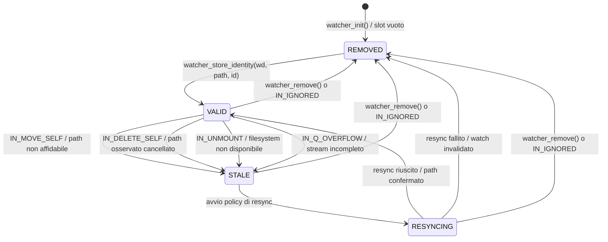
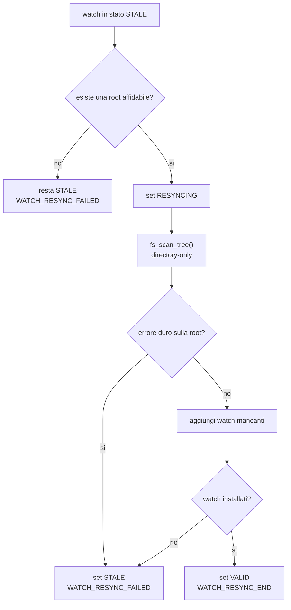

# Roadmap scanner e resync

Questo capitolo raccoglie la progettazione dello scanner filesystem e della
logica di resync in costruzione. Nasce dalla discussione sugli eventi
`IN_DELETE_SELF`, `IN_MOVE_SELF`, `IN_Q_OVERFLOW` e `IN_UNMOUNT`.

L'obiettivo e' evitare di aggiungere piccole patch scollegate al backend
inotify. Serve invece un componente di attraversamento dell'albero che possa
essere riusato in due contesti:

- recovery/resync del backend quando lo stato osservato non e' piu' affidabile
- indicizzazione esplicita di un albero, eventualmente esposta in futuro dalla
  riga di comando

## Punto di ripresa dopo uno stop lungo

Stato del codice al momento della ripresa:

- branch di lavoro: `feature/resync-scanner`
- lo scanner generico `fs_scan_tree()` esiste ed e' testato
- lo startup e la scoperta runtime delle directory usano gia' lo scanner
- la watcher table salva identita' filesystem `(st_dev, st_ino)`
- i watch possono passare tra `VALID`, `STALE`, `RESYNCING` e `REMOVED`
- `IN_MOVE_SELF` marca il watch come `STALE`
- il ramo `IN_MOVE_SELF` con identita' confermata esegue uno scan
  directory-only sul vecchio path tornato affidabile
- lo scan conta directory viste, directory gia' watched e directory missing
- se esiste almeno un missing path, Alfred reinstalla solo il primo watch
  mancante con `watch_manager_add()`
- se la prima reinstallazione riesce, il watch principale torna `VALID`
- se lo scan fallisce o la prima reinstallazione fallisce, il watch principale
  resta `STALE`

Il punto esatto in cui siamo fermi e':

```text
IN_MOVE_SELF con identita' confermata
-> fs_scan_tree(directory-only, emit_root=0)
-> conta dirs/watched/missing
-> reinstalla il primo missing path
-> torna VALID solo se questa prima riparazione riesce
```

Il prossimo passo non e' aggiungere nuova semantica core. Il prossimo passo e'
completare la policy backend di reinstallazione:

```text
da:  reinstalla solo il primo missing path
a:   reinstalla tutti i missing path dentro lo scope affidabile
```

Decisione tecnica consigliata per ripartire:

- se tutti i missing watch vengono reinstallati, il watch principale puo'
  tornare `VALID`
- se anche un solo missing watch fallisce, il watch principale deve restare
  `STALE`
- il ritorno a `VALID` deve significare copertura completa dello scope scelto,
  non copertura parziale
- i log backend devono rendere visibili sia i watch reinstallati sia il primo
  fallimento

Questa scelta e' conservativa. Evita di presentare al core una situazione come
affidabile quando il backend sa gia' che una parte della subtree non e'
osservata.

## Stato corrente sugli eventi critici

Questa sezione fotografa lo stato corrente degli eventi critici che hanno
motivato lo scanner e il modello `stale`. Nessuno di questi eventi produce oggi
una semantica core completa di delete/move del path osservato direttamente.

Stato attuale:

- `IN_DELETE_SELF` e' nella maschera predefinita del backend inotify
- `IN_DELETE_SELF` e' accettato dal parser `inotify_watch_mask`
- `IN_DELETE_SELF` viene scritto nel raw log backend
- `IN_DELETE_SELF` marca il watch come `STALE` e produce `WATCH_STALE`
- `IN_DELETE_SELF` non viene convertito in `ALFRED_RAW_DELETE`
- `IN_DELETE_SELF` non produce direttamente eventi core
- `IN_MOVE_SELF` e' nella maschera predefinita del backend inotify
- `IN_MOVE_SELF` e' accettato dal parser `inotify_watch_mask`
- `IN_MOVE_SELF` viene scritto nel raw log backend
- `IN_MOVE_SELF` marca il watch come `STALE` e produce `WATCH_STALE`
- `IN_MOVE_SELF` non produce raw Alfred e non produce semantica core

Il percorso storico:

```text
watch_manager_add_recursive_with_discovery()
```

non era uno scanner generale. Serviva a un problema piu' stretto: quando
arrivava `IN_CREATE | IN_ISDIR`, il backend attraversava subito la nuova
directory per aggiungere watch alle sottodirectory gia' presenti e generare
eventuali raw create sintetici. Questa funzione e' stata rimossa dopo
l'integrazione di `fs_scan_tree()` nel percorso startup e runtime.

## Decisioni sugli eventi SELF

`IN_DELETE_SELF` e `IN_MOVE_SELF` descrivono il path osservato direttamente,
non un figlio dentro la directory osservata.

Esempio figlio:

```text
watch su /tmp/root
rm /tmp/root/a.txt
    -> IN_DELETE name=a.txt
```

Esempio watch stesso:

```text
watch su /tmp/root
rm -rf /tmp/root
    -> IN_DELETE_SELF name=
    -> IN_IGNORED name=
```

Decisione per `IN_DELETE_SELF`:

- non inventare delete per tutti i figli partendo da `IN_DELETE_SELF`
- se il kernel produce davvero `IN_DELETE` per figli immediati, inoltrare quei
  fatti al core come oggi
- in futuro, valutare mapping di `IN_DELETE_SELF` a `ALFRED_RAW_DELETE` per il
  path osservato direttamente
- la semantica candidata sarebbe `DIR_DELETED` per root directory osservate

Decisione per `IN_MOVE_SELF`:

- non produrre `DIR_RENAMED`, `DIR_MOVED` o `DIR_RELOCATED` senza nuovo path
- trattarlo prima come problema di stato backend
- se una root osservata viene spostata, la tabella `wd -> path` puo' rimanere
  legata al vecchio path mentre il watch kernel segue ancora l'inode
- gli eventi successivi potrebbero quindi essere ricostruiti con path vecchi
- serve una policy di resync o invalidazione prima di decidere una semantica
  utente

`IN_IGNORED` resta manutenzione backend: indica che il kernel ha rimosso il
watch e quindi Alfred deve aggiornare la tabella `wd -> path`. Non e' un evento
semantico core.

## Perche' uno scanner separato

Lo scanner non dovrebbe essere un'estensione pesante del watch manager attuale.
Il watch manager deve restare responsabile di:

- `inotify_add_watch()`
- `inotify_rm_watch()`
- tabella `wd -> path`
- diagnostica `WATCH_ADDED` / `WATCH_REMOVED`
- discovery mirata per nuove directory osservate

Uno scanner generale deve invece poter:

- visitare directory e file
- scegliere se includere solo directory o anche file
- leggere metadati in modo controllato
- interrompersi su richiesta
- limitare profondita' o numero di entry
- gestire errori senza bloccare tutto lo scan
- funzionare senza dipendere da inotify
- produrre callback riusabili da backend, test e CLI future

Questa separazione mantiene chiari i livelli:

```text
watch_manager     -> stato dei watch inotify
scanner filesystem -> lettura efficiente dell'albero
backend inotify   -> decide quando usare watch manager o scanner
core              -> semantica sugli eventi raw
```

## Valutazione di nftw()

`nftw()` e' una funzione POSIX per attraversare ricorsivamente alberi di file.
Puo' essere utile per un prototipo o per spiegare il problema, ma non sembra la
base migliore per lo scanner finale di Alfred.

Vantaggi:

- e' gia' disponibile su sistemi POSIX
- riduce il codice iniziale
- supporta opzioni utili come `FTW_PHYS` per non seguire symlink

Limiti:

- la callback non riceve un `userdata` esplicito
- costringe a usare stato globale/statico o workaround per passare contesto
- offre poco controllo su batching, backpressure e cancellazione
- non e' ideale per integrare statistiche, limiti, policy di errore e resync
- non si adatta bene a un futuro uso come indicizzatore performante

Decisione proposta: non usare `nftw()` come base finale. Si puo' citare come
alternativa didattica o prototipo, ma lo scanner serio dovrebbe essere nostro.

## Direzione tecnica proposta

Implementare uno scanner custom basato su API directory controllabili:

```text
openat()
fdopendir()
readdir()
fstatat()
close()
```

Motivi:

- riduce alcune race rispetto a lavorare solo con path assoluti
- permette di attraversare usando file descriptor di directory
- permette di raccogliere metadati con `fstatat()` senza ricostruire ogni volta
  una ricerca assoluta dal root del filesystem
- rende naturale aggiungere limiti, cancellazione e statistiche
- prepara un futuro output da indicizzatore

## Perche' queste funzioni

Questa sezione spiega perche' il primo scanner usa queste primitive invece di
una funzione piu' alta come `nftw()` o di una ricorsione basata solo su
`opendir()` e path assoluti.

### `openat()`

`openat()` apre un figlio partendo dal file descriptor della directory padre.
In pratica, invece di dire al kernel:

```text
apri /tmp/root/one/two/three
```

lo scanner dice:

```text
sono gia' dentro /tmp/root/one/two, apri three
```

Questo ha tre vantaggi.

Il primo e' architetturale: la scansione resta legata alla directory che il
ciclo sta davvero leggendo. Quando `readdir()` restituisce un nome, `openat()`
apre quel nome rispetto allo stesso descriptor di directory. Il codice quindi
riflette meglio la relazione padre/figlio.

Il secondo e' pratico: in un albero profondo non costringiamo il kernel a
ripartire sempre da un path assoluto lungo. Alfred costruisce comunque il path
testuale per la callback, per i log e per i test, ma l'apertura operativa del
figlio puo' usare il descriptor del padre.

Il terzo riguarda le race. Nessuno scanner userspace puo' eliminare tutte le
race con un filesystem che cambia mentre viene letto, ma lavorare con descriptor
di directory riduce la finestra in cui il codice ragiona su un path assoluto
che potrebbe essere stato rinominato da un altro processo.

### `fdopendir()`

`fdopendir()` trasforma un file descriptor gia' aperto in uno stream `DIR *`
leggibile con `readdir()`.

Questa scelta e' coerente con `openat()`: lo scanner apre la directory con le
flag che gli servono, poi consegna quel descriptor a `fdopendir()` per
iterarne le entry.

Regola importante per chi legge il codice: dopo `fdopendir()`, lo stream
`DIR *` possiede il file descriptor. Per questo `scan_dir_fd()` deve chiudere
con `closedir()` e non con `close(fd)` nei percorsi normali. Il `close(fd)`
diretto resta corretto solo se `fdopendir()` fallisce, perche' in quel caso
lo stream non e' mai stato creato.

### `readdir()`

`readdir()` legge le entry di una directory una alla volta. E' una primitive
semplice, portabile e adatta a uno scanner streaming: non abbiamo bisogno di
caricare tutta la directory in memoria prima di iniziare a lavorare.

Questo e' importante per due motivi:

- un resync puo' avvenire su directory grandi
- un futuro comando di indicizzazione potrebbe dover attraversare alberi molto
  grandi senza usare memoria proporzionale al numero totale di file

Lo scanner ignora esplicitamente `"."` e `".."`, perche' non sono veri figli
da emettere al chiamante e porterebbero a cicli inutili.

### `fstatat()`

`fstatat()` legge i metadati di una entry partendo dal descriptor della
directory padre e dal nome restituito da `readdir()`.

Nel primo scanner usiamo `fstatat()` per classificare ogni entry in:

```text
directory
file regolare
symlink
altro
```

La scelta e' leggermente piu' costosa rispetto ad affidarsi sempre a
`struct dirent.d_type`, quando il filesystem lo fornisce, ma e' piu' robusta
come primo contratto:

- `d_type` puo' essere `DT_UNKNOWN` su alcuni filesystem
- `fstatat()` fornisce anche `struct stat`, gia' esposta alla callback
- la stessa funzione gestisce in modo chiaro la policy sui symlink
- il comportamento del test non dipende da dettagli del filesystem usato

Quando `follow_symlinks` e' disabilitato, lo scanner passa
`AT_SYMLINK_NOFOLLOW`. In questo modo un symlink viene classificato come
symlink e non come tipo del suo target. Questa e' la scelta conservativa per il
resync: Alfred non deve attraversare per sorpresa un altro albero solo perche'
dentro la root osservata esiste un link simbolico.

In futuro, se servira' ottimizzare alberi enormi, potremo aggiungere una policy
ibrida:

```text
usa d_type quando e' affidabile e non servono metadati completi
usa fstatat() quando d_type e' DT_UNKNOWN o quando servono struct stat/symlink
```

Per ora preferiamo una base piu' esplicita e testabile.

### `O_NOFOLLOW`, `O_CLOEXEC` e `O_DIRECTORY`

Quando apre una directory, lo scanner usa flag esplicite.

`O_DIRECTORY` dice al kernel che ci aspettiamo una directory. Se il path non e'
una directory, l'apertura fallisce subito invece di lasciare al codice il dubbio
su cosa sia stato aperto.

`O_NOFOLLOW` viene aggiunto quando `follow_symlinks` e' falso. Serve a evitare
che l'apertura di una directory attraversi un link simbolico. Questa scelta
mantiene il comportamento coerente con `AT_SYMLINK_NOFOLLOW`.

`O_CLOEXEC` chiude automaticamente il descriptor se il processo dovesse eseguire
un futuro `exec()`. Oggi Alfred non usa questa strada nello scanner, ma e' una
buona abitudine per evitare leak di descriptor in programmi che possono crescere
e integrare comandi esterni.

### `path_join()`

Lo scanner usa `path_join()` per costruire il path testuale da passare alla
callback.

Questo path non e' usato come unica base per continuare l'attraversamento,
perche' la discesa usa `openat()` rispetto al descriptor corrente. Serve pero'
al chiamante: il backend deve poter associare il fatto osservato a un path,
i test devono poter verificare cosa e' stato emesso, e una futura modalita'
di indicizzazione dovra' stampare o serializzare i path trovati.

### Prestazioni e compromesso iniziale

La scelta attuale privilegia controllo e correttezza didattica rispetto alla
micro-ottimizzazione.

Punti favorevoli per le prestazioni:

- attraversamento streaming con `readdir()`
- nessuna lista globale di entry caricata in memoria
- apertura dei figli relativa al descriptor del padre con `openat()`
- limiti gia' presenti per profondita' e numero di entry
- callback immediata, quindi il chiamante puo' fermare lo scan appena basta

Costo accettato nel primo step:

- ogni entry viene classificata con `fstatat()`
- il path testuale viene comunque costruito per ogni entry emessa o visitata

Questo costo e' accettabile adesso perche' stiamo fissando il contratto
corretto dello scanner. Dopo avere test su file, limiti, errori parziali e
resync reale, potremo misurare e decidere se usare `d_type` come fast path.

API concettuale:

```c
typedef enum {
    FS_SCAN_DIR,
    FS_SCAN_FILE,
    FS_SCAN_SYMLINK,
    FS_SCAN_OTHER
} fs_scan_type_t;

typedef struct {
    const char *path;
    fs_scan_type_t type;
    int depth;
    const struct stat *st;
} fs_scan_entry_t;

typedef int (*fs_scan_fn)(const fs_scan_entry_t *entry, void *userdata);
```

Opzioni utili:

```c
typedef struct {
    int include_files;
    int include_dirs;
    int follow_symlinks;
    int emit_root;
    int max_depth;
    size_t max_entries;
} fs_scan_options_t;
```

Questa API e' solo una proposta. Prima di scrivere codice bisogna decidere dove
mettere il componente e quali opzioni servono nel primo passo.

## Dove metterlo

Opzioni:

```text
app/src/fs_scanner.c
app/include/fs_scanner.h
```

oppure:

```text
modules/fs_scan/
```

Io eviterei di metterlo nel core: lo scan e' I/O filesystem, non semantica
degli eventi. Il core deve continuare a ricevere raw facts e produrre eventi
semantici, senza sapere come si attraversa un albero sul filesystem.

Scelta iniziale consigliata:

```text
app/include/fs_scanner.h
app/src/fs_scanner.c
```

Motivo: e' backend-neutral ma ancora parte del runtime applicativo. Se in futuro
diventa un modulo riusabile piu' grande, potremo spostarlo in `modules/fs_scan`
senza cambiare la semantica core.

## Uso per resync

Possibili trigger:

- `IN_MOVE_SELF`
- `IN_UNMOUNT`
- `ALFRED_RAW_OVERFLOW`
- richiesta manuale futura da CLI

Politiche possibili per `IN_MOVE_SELF`:

1. marcare il watch come stale e smettere di fidarsi dei path derivati da quel
   watch
2. rimuovere il watch e loggare una diagnostica backend
3. fare uno scan di una root ancora affidabile se esiste un antenato osservato
4. richiedere un resync esplicito all'utente o all'applicazione

Per ora la scelta piu' prudente e' non inventare un nuovo path. Senza una root
affidabile da cui ripartire, Alfred non puo' sapere dove sia stata spostata la
directory osservata.

## Uso per indicizzazione

Lo stesso scanner puo' diventare utile anche fuori dal resync.

Esempi futuri:

```bash
alfred --scan /path
alfred --scan --dirs-only /path
alfred --scan --json /path
```

Possibili output:

- plain text per uso didattico
- JSON lines per integrazione con altri tool
- solo directory per debug dei watch ricorsivi
- file + directory per indicizzazione iniziale

Questa funzione non va implementata subito se stiamo lavorando al backend, ma
conviene progettare lo scanner in modo che non la renda impossibile.

## Primo passo implementato

Il primo passo e' stato implementato in:

```text
app/include/fs_scanner.h
app/src/fs_scanner.c
tests/scanner/
```

Contratto iniziale:

- attraversamento directory-only di default
- callback con `userdata`
- root emessa di default
- symlink non seguiti di default
- limiti base: `max_depth` e `max_entries`
- attraversamento basato su `openat()`, `fdopendir()`, `readdir()` e
  `fstatat()`

Il target di test e':

```bash
make test-scanner
```

Il test iniziale crea un albero con directory annidate, un file e un symlink.
Verifica che lo scanner emetta solo root e directory reali e che non segua il
symlink.

## Come usare lo scanner dal codice

Lo scanner non e' un programma separato e non e' ancora esposto dalla CLI. Per
ora e' una piccola API C usata dai test e preparata per il futuro resync.

Un chiamante deve:

1. includere `fs_scanner.h`
2. inizializzare una `fs_scan_options_t`
3. scegliere quali entry ricevere
4. passare una callback a `fs_scan_tree()`

Esempio minimo:

```c
#include "fs_scanner.h"

static int on_scan_entry(const fs_scan_entry_t *entry, void *userdata)
{
    (void)userdata;

    /*
     * entry->path and entry->st are borrowed. Copy them here if they must live
     * after the callback returns.
     */
    printf("%d %s\n", entry->depth, entry->path);

    return 0;
}

void scan_example(const char *root)
{
    fs_scan_options_t opts;

    fs_scan_options_defaults(&opts);
    opts.include_files = 1;
    opts.max_depth = 3;

    (void)fs_scan_tree(root, &opts, on_scan_entry, NULL);
}
```

Il valore di ritorno della callback ha una semantica precisa:

- `0`: continua lo scan
- diverso da `0`: ferma lo scan senza errore

Questa scelta serve per casi come:

- trovare la prima directory che soddisfa una condizione
- limitare una futura indicizzazione
- interrompere un resync quando il chiamante ha gia' raccolto abbastanza dati

Le opzioni principali sono:

| Opzione | Default | Significato |
| --- | --- | --- |
| `include_dirs` | `1` | emette directory |
| `include_files` | `0` | emette file regolari |
| `include_symlinks` | `0` | emette link simbolici come entry proprie |
| `include_other` | `0` | emette fifo, socket, device e altri tipi |
| `follow_symlinks` | `0` | segue i symlink invece di classificarli come symlink |
| `emit_root` | `1` | emette anche il path root con profondita' `0` |
| `max_depth` | `-1` | profondita' massima; `-1` significa nessun limite |
| `max_entries` | `0` | numero massimo di callback; `0` significa nessun limite |

Esempi:

```c
/* Solo root. */
opts.max_depth = 0;

/* Root e figli diretti, ma non nipoti. */
opts.max_depth = 1;

/* Prime 100 entry emesse, poi stop pulito. */
opts.max_entries = 100;

/* Directory e file regolari. */
opts.include_files = 1;
```

La distinzione importante e':

```text
scan filesystem -> produce fatti osservati
backend/core    -> decidono se quei fatti diventano watch, raw o eventi
```

Quindi una callback dello scanner non dovrebbe inventare direttamente una
semantica core. Deve raccogliere fatti, aggiornare una struttura dati del
chiamante o chiedere al backend di applicare una policy esplicita.

## Funzioni e casi del prossimo passo

Il prossimo punto da decidere riguarda la policy sugli errori parziali. Per
capirlo bisogna distinguere le funzioni coinvolte e il tipo di errore che
possono produrre.

### `readdir()`

`readdir()` legge il prossimo nome dentro una directory gia' aperta.

Nel nostro scanner viene usata dentro `scan_dir_fd()`:

```text
DIR *dir = fdopendir(fd)
while ((ent = readdir(dir)) != NULL)
    ...
```

Se la directory contiene:

```text
a
b
c
```

`readdir()` restituisce un nome alla volta. Non garantisce che il filesystem
resti fermo mentre stiamo leggendo. Un altro processo potrebbe cancellare `b`
dopo che `readdir()` ha restituito il nome ma prima che Alfred legga i suoi
metadati.

Per questo il resync deve essere pensato come una fotografia imperfetta ma
utile, non come una transazione atomica sul filesystem.

### `fstatat()`

`fstatat()` prende:

- il file descriptor della directory padre
- il nome letto da `readdir()`
- una `struct stat *` da riempire
- flag come `AT_SYMLINK_NOFOLLOW`

Serve a rispondere a domande come:

```text
questa entry e' una directory?
e' un file regolare?
e' un symlink?
quali metadati ha?
```

Caso importante:

```text
1. readdir() legge "tmp"
2. un altro processo cancella "tmp"
3. fstatat() prova a leggere i metadati di "tmp"
4. fstatat() fallisce
```

Oggi lo scanner salta quell'entry e continua. Questa scelta e' ragionevole per
entry figlie transitorie, perche' durante un resync e' normale che il mondo
cambi sotto i nostri piedi.

### `openat()`

`openat()` apre una directory figlia partendo dal descriptor della directory
padre. Lo scanner lo usa solo quando una entry e' stata classificata come
directory e deve essere attraversata.

Caso:

```text
root/
    a/
        b/
```

Lo scanner legge `a`, capisce con `fstatat()` che e' una directory, poi usa
`openat()` per aprirla e scendere dentro.

Possibili fallimenti:

- la directory e' stata cancellata dopo `fstatat()`
- i permessi sono cambiati
- il filesystem ha restituito un errore I/O
- il path e' ancora visibile ma non e' piu' apribile

Qui dobbiamo scegliere la policy. Per un resync robusto, fallire tutto per una
singola directory figlia non leggibile potrebbe essere troppo aggressivo.
Tuttavia ignorare sempre l'errore senza registrarlo potrebbe nascondere problemi
reali.

Scelta implementata per il primo passo:

```text
root non apribile             -> ERR_IO
directory figlia sparita      -> skip + continua
directory figlia senza permessi -> skip + continua
entry trasformata in non-dir  -> skip + continua
errore I/O non classificato   -> ERR_IO
```

Nel codice questa decisione e' concentrata in
`child_open_error_is_recoverable()`. La funzione considera recuperabili
`ENOENT`, `ENOTDIR`, `EACCES` ed `EPERM` quando l'errore riguarda una directory
figlia aperta con `openat()`. La root resta gestita da `fs_scan_tree()` e quindi
continua a fallire con `ERR_IO` se non e' leggibile o non e' apribile.

### `fdopendir()`

`fdopendir()` trasforma un file descriptor aperto in uno stream `DIR *` usabile
con `readdir()`.

Se `fdopendir()` fallisce, la directory non e' realmente attraversabile con il
meccanismo scelto. Per la root e' quasi certamente un errore duro. Per una
directory figlia dobbiamo decidere se trattarlo come:

- errore duro dello scan
- errore parziale da saltare

La scelta dovrebbe essere coerente con `openat()`: se decidiamo che una
directory figlia non accessibile non deve fermare tutto il resync, allora anche
un fallimento di `fdopendir()` su una figlia dovrebbe diventare skip + continua.

### `path_join()`

`path_join()` costruisce il path testuale:

```text
parent = /tmp/root/a
name   = b
child  = /tmp/root/a/b
```

Questo path serve alla callback, ai test, ai log e alla futura indicizzazione.

Se `path_join()` fallisce, di solito significa che il path non entra in
`PATH_MAX`. Questo non e' un errore transitorio come una directory cancellata:
il chiamante non riceverebbe un path affidabile. Per ora e' corretto trattarlo
come `ERR_IO` o, in futuro, come errore specifico se aggiungeremo un codice piu'
preciso.

### `ERR_IO`

`ERR_IO` e' il codice generico usato quando lo scanner incontra un problema di
I/O o filesystem che non riesce a gestire localmente.

Il punto aperto non e' se `ERR_IO` serva: serve. Il punto e' decidere quando un
errore locale deve diventare errore dell'intero scan.

Principio proposto:

```text
errore sulla root       -> fallisce lo scan
errore su entry figlia  -> preferire skip + continua, se e' recuperabile
errore di path interno  -> fallisce lo scan
```

## Roadmap completa dello scanner

Questa roadmap divide lo scanner in passi piccoli. Alcuni sono necessari per il
resync, altri preparano usi futuri come indicizzazione e CLI.

### Fase 1 - Contratto base completato

Stato: implementato.

Risultato:

- API pubblica `fs_scan_tree()`
- opzioni `fs_scan_options_t`
- callback con `userdata`
- root emessa di default
- directory-only di default
- symlink non seguiti di default
- limiti `max_depth` e `max_entries`
- test `make test-scanner`
- documentazione tecnica e didattica iniziale

### Fase 2 - Errori parziali

Stato: primo passo implementato.

Obiettivo: decidere cosa succede quando una parte dell'albero non e' leggibile
o cambia durante lo scan.

Decisioni fissate:

- root non leggibile: hard failure
- entry sparita tra `readdir()` e `fstatat()`: skip
- directory figlia non apribile per `ENOENT`, `ENOTDIR`, `EACCES` o `EPERM`:
  skip
- path troppo lungo: hard failure

Il test scanner crea una directory `volatile`. La callback la rimuove dopo che
lo scanner l'ha osservata ma prima della discesa ricorsiva. Questo simula una
race reale: `fstatat()` vede una directory, poi `openat()` fallisce perche' la
directory non esiste piu'. Il contratto atteso e' che lo scan continui e ritorni
`ERR_OK`.

Decisioni ancora aperte:

- se aggiungere log diagnostici per directory figlie saltate
- se esporre statistiche di skip/errori al chiamante
- se distinguere errori I/O gravi da permessi o race transitorie con codici
  piu' specifici

Possibile implementazione futura:

```c
typedef struct {
    size_t emitted;
    size_t skipped;
    size_t io_errors;
    size_t permission_errors;
} fs_scan_stats_t;
```

Io non la introdurrei subito. Prima fissiamo la policy, poi aggiungiamo
statistiche solo se servono davvero al backend o alla CLI.

### Fase 3 - Symlink

Stato: in corso.

Obiettivo: distinguere due concetti diversi:

- `include_symlinks`: emetti il symlink come entry osservata
- `follow_symlinks`: attraversa il target del symlink

`include_symlinks` serve quando il chiamante vuole sapere che dentro l'albero
esiste un link simbolico, senza entrare nel suo target. Esempio:

```text
root/
    link_to_a -> a/
```

Con `include_symlinks = 1` e `follow_symlinks = 0`, lo scanner emette
`link_to_a` come `FS_SCAN_SYMLINK`. Non emette il contenuto del target come se
fosse una directory figlia.

Questa distinzione e' importante per due motivi:

- per il resync, sapere che un symlink esiste puo' essere utile come fatto
  osservato, ma seguirlo potrebbe far uscire Alfred dalla root osservata
- per una futura indicizzazione, un utente potrebbe voler vedere anche i
  symlink senza duplicare il contenuto raggiungibile tramite quei link

Decisione corrente:

- per resync: default conservativo, non seguire symlink
- `include_symlinks = 1` e' supportato e testato
- `follow_symlinks = 1` e' rimandato
- per indicizzazione: possibilita' futura di seguire symlink su richiesta, ma
  solo dopo avere una policy anti-cicli esplicita

Test aggiunto:

- symlink emesso come `FS_SCAN_SYMLINK` quando `include_symlinks = 1`
- symlink non seguito quando `follow_symlinks = 0`

Test rimandato:

- eventuale follow controllato quando `follow_symlinks = 1`

#### Policy anti-cicli per `follow_symlinks`

Seguire symlink e' delicato perche' un link puo' creare cicli o portare lo scan
fuori dall'albero scelto dall'utente.

Esempio di ciclo:

```text
root/
    a/
        back -> ../
```

Se lo scanner segue `back`, puo' tornare a `root`, poi rientrare in `a`, poi
seguire di nuovo `back`, e cosi' via.

Le policy comuni sono:

1. Non seguire symlink.

   E' la policy attuale e la piu' sicura per resync/watch. Il symlink puo'
   essere emesso come entry, ma il target non viene attraversato.

2. Tenere un set di directory gia' visitate usando `(st_dev, st_ino)`.

   `st_dev` identifica il device/filesystem, `st_ino` identifica l'inode. Se
   una directory target e' gia' stata visitata, lo scanner non rientra.

   ```text
   root visto
   a visto
   back punta a root, root gia' visto -> skip
   ```

3. Limitare la profondita' massima.

   `max_depth` e' una protezione utile, ma da sola non e' una vera policy
   anti-ciclo. Evita loop infiniti solo tagliando lo scan dopo una profondita'
   arbitraria.

4. Restare sotto la root iniziale.

   Prima di seguire un symlink, il target viene risolto e confrontato con la
   root reale dello scan. Se punta fuori root, viene saltato.

   ```text
   root/link -> /etc
   target fuori root -> skip
   ```

5. Non attraversare filesystem diversi.

   Lo scanner puo' salvare lo `st_dev` della root e saltare directory con
   device diverso. E' simile alla logica `find -xdev`.

6. Imporre un budget massimo di entry.

   `max_entries` limita il danno in caso di albero enorme o policy sbagliata,
   ma e' una rete di sicurezza, non una soluzione completa ai cicli.

Per Alfred, una futura implementazione di `follow_symlinks = 1` dovrebbe avere
almeno:

```text
visited set su (st_dev, st_ino)
max_depth come safety net
opzione per restare nello stesso device
opzione per restare sotto la root iniziale
```

Finche' queste policy non sono progettate e testate, `follow_symlinks = 1`
resta rimandato.

### Fase 4 - File e tipi speciali

Stato: implementato per il contratto iniziale.

`include_files = 1` e' gia' coperto dal test base. Ora e' coperto anche
`include_other = 1` usando una FIFO creata con `mkfifo`.

`include_other` serve a emettere entry che non sono:

- directory
- file regolari
- symlink

Esempi:

- FIFO / named pipe
- socket Unix
- device file
- altri tipi speciali del filesystem

Il test automatico usa una FIFO:

```bash
mkfifo "$TEST_ROOT/pipe.fifo"
```

Motivi:

- non richiede privilegi root
- e' stabile in un test locale
- viene classificata come `FS_SCAN_OTHER`
- non richiede di aprire o scrivere nella FIFO

Decisioni fissate:

- `include_other = 0` resta il default
- `include_other = 1` emette la FIFO come `FS_SCAN_OTHER`
- per il resync inotify, i tipi speciali non sono la parte piu' importante
- per una futura modalita' scan/index, sapere che esistono puo' essere utile

Restano da decidere:

- come trattare socket, fifo e device
- se questi tipi servono al resync o solo a una futura indicizzazione

Per ora non testiamo socket e device file. I socket richiedono piu' setup nel
test, mentre i device file possono richiedere privilegi o dipendere dalla
piattaforma. La FIFO basta per fissare il contratto pubblico:

```text
tipo non directory/file/symlink -> FS_SCAN_OTHER
```

Per il resync dei watch inotify, le directory restano la parte critica. File e
tipi speciali diventano importanti soprattutto se Alfred espone una modalita'
di scan/index.

### Fase 5 - Integrazione con watch manager

Stato: completata per i percorsi startup e runtime `IN_CREATE | IN_ISDIR`.

Obiettivo: usare lo scanner come unico componente di attraversamento
filesystem, lasciando al watch manager solo l'aggiunta/rimozione dei watch e al
backend la policy dei raw create sintetici.

#### Stato attuale del codice

Prima della migrazione, la discovery ricorsiva viveva in:

```text
modules/inotify/src/watch_manager.c
```

La funzione interna storica era:

```c
static int recursive_walk(inotify_backend_context_t *ctx,
                          const char *root,
                          watch_manager_discovered_dir_fn on_discovered,
                          void *userdata,
                          int notify_root);
```

Le funzioni pubbliche storiche erano:

```c
int watch_manager_add_recursive(inotify_backend_context_t *ctx,
                                const char *root);

int watch_manager_add_recursive_with_discovery(
    inotify_backend_context_t *ctx,
    const char *root,
    watch_manager_discovered_dir_fn on_discovered,
    void *userdata);
```

Il flusso startup storico era:

```text
inotify_backend_add_startup_watch()
    -> watch_manager_add_recursive()
        -> recursive_walk()
            -> opendir()
            -> watch_manager_add()
            -> readdir()
            -> path_join()
            -> recursive_walk(child)
```

Il flusso startup corrente e':

```text
inotify_backend_add_startup_watch()
    -> watch_manager_add_recursive()
        -> fs_scan_tree()
            -> watch_manager_add_scanned_dir()
                -> watch_manager_add()
```

Questo percorso non genera raw sintetici. Serve solo a installare i watch
iniziali sull'albero gia' esistente prima che inizi il polling degli eventi.

Il flusso runtime storico era:

```text
inotify_backend_poll()
    -> backend_handle_dir_create()
        -> watch_manager_add_recursive_with_discovery()
            -> recursive_walk()
                -> watch_manager_add()
                -> on_discovered()
                    -> backend_process_discovered_dir()
                        -> backend_emit_synthetic_dir_create()
                            -> core callback
```

Questo secondo percorso serve a mitigare il caso:

```bash
mkdir -p one/two/three
```

Il kernel puo' notificare la creazione di `one`, ma `two` e `three` possono
essere creati prima che Alfred abbia installato watch sui loro genitori. La
discovery ricorsiva aggiunge i watch mancanti e segnala al backend le directory
annidate scoperte, che il backend trasforma in raw create sintetici.

Il flusso runtime corrente e':

```text
inotify_backend_poll()
    -> backend_handle_dir_create()
        -> watch_manager_add(ctx, full)
        -> fs_scan_tree(full, emit_root = 0)
            -> backend_process_scanned_dir_create()
                -> watch_manager_add(ctx, entry->path)
                -> backend_emit_synthetic_dir_create(entry->path)
                    -> core callback
```

Questa forma mantiene la policy nel backend:

- il watch manager aggiunge solo watch
- lo scanner legge solo il filesystem
- il backend decide quali directory annidate diventano raw create sintetici
- il core riceve lo stesso contratto raw di prima

#### Responsabilita' attuali

Nel percorso storico, oggi rimosso, `recursive_walk()` mescolava tre
responsabilita':

1. attraversare il filesystem
2. aggiungere watch inotify
3. notificare directory scoperte al backend

Questa miscela ha funzionato per risolvere il problema `mkdir -p`, ma non e'
ideale per il resync piu' generale.

Limiti del vecchio approccio:

- usa `opendir()` su path assoluti invece dello scan basato su descriptor
- dipende da `dirent.d_type == DT_DIR`, che non e' affidabile su tutti i
  filesystem
- non ha un contratto generale per symlink, file, FIFO o tipi speciali
- non espone limiti come `max_depth` o `max_entries`
- non separa chiaramente "trovare directory" da "aggiungere watch"
- non e' riusabile per una futura CLI di indicizzazione

#### Responsabilita' target

La divisione target dovrebbe essere:

```text
fs_scanner      -> attraversa il filesystem e produce fatti osservati
watch_manager   -> aggiunge/rimuove watch e mantiene wd -> path
inotify_backend -> decide quando fare discovery e se emettere raw sintetici
core            -> dedup, correlazione e semantica utente
```

In altre parole:

- lo scanner non deve chiamare `inotify_add_watch()`
- lo scanner non deve emettere raw Alfred
- lo scanner non deve decidere `DIR_CREATED`, `DIR_DELETED` o `DIR_RELOCATED`
- il watch manager non possiede piu' una propria ricorsione filesystem
  completa
- il backend resta il punto che trasforma discovery in raw sintetici, quando la
  policy lo richiede

#### Direzione proposta

```text
startup:
    backend
        -> scanner dirs-only
        -> watch_manager_add() per ogni directory
        -> nessun raw sintetico

directory create runtime:
    backend riceve IN_CREATE | IN_ISDIR
        -> emette il raw reale per la directory root creata
        -> scanner dirs-only sulla nuova directory
        -> watch_manager_add() per ogni directory
        -> raw sintetico solo per directory annidate scoperte

resync futuro:
    backend marca stato stale o overflow
        -> scanner da una root affidabile
        -> watch_manager_add()/remove secondo policy
        -> diagnostica o raw sintetici solo se decisi esplicitamente
```

#### Attenzione sulla root

La vecchia `watch_manager_add_recursive_with_discovery()` non notificava la
root della scansione. La stessa regola resta valida nel nuovo percorso scanner.
Questo e' importante.

Quando arriva:

```text
IN_CREATE | IN_ISDIR name=one
```

il backend ha gia' un raw reale per `one`. Se la discovery notificasse anche
`one`, produrremmo un possibile doppio create:

```text
real raw create:      one
synthetic raw create: one
```

Il comportamento target deve conservare questa regola:

```text
emit_root = 0 per la discovery runtime post-create
emit_root = 1 oppure equivalente per startup, ma senza raw sintetici
```

#### Primo refactor implementato

Il primo passo runtime e' stato evitato apposta. Abbiamo sostituito solo il
percorso startup:

```c
int watch_manager_add_recursive(inotify_backend_context_t *ctx,
                                const char *root);
```

La funzione ora usa `fs_scan_tree()` in modalita' default, cioe':

- directory-only
- `emit_root = 1`
- symlink non seguiti
- nessun raw sintetico

La callback adapter e':

```c
static int watch_manager_add_scanned_dir(const fs_scan_entry_t *entry,
                                         void *userdata);
```

Questa callback traduce un fatto scanner `FS_SCAN_DIR` in una chiamata a:

```c
watch_manager_add(ctx, entry->path)
```

Se `watch_manager_add()` fallisce durante lo startup, la callback ferma lo scan
e `watch_manager_add_recursive()` ritorna `-1`. In questa fase e' corretto
fallire: se Alfred non riesce a installare i watch iniziali, l'albero osservato
non sarebbe affidabile fin dall'avvio.

#### Secondo refactor implementato

Anche il percorso runtime `IN_CREATE | IN_ISDIR` ora usa lo scanner:

```c
static void backend_handle_dir_create(...);
```

La funzione:

1. ricostruisce il path completo della directory appena creata
2. aggiunge un watch sulla root creata con `watch_manager_add()`
3. esegue `fs_scan_tree()` con `emit_root = 0`
4. per ogni directory annidata chiama `backend_process_scanned_dir_create()`
5. aggiunge il watch sulla directory annidata
6. emette un raw create sintetico per la directory annidata

La regola `emit_root = 0` e' essenziale: la root della scan ha gia' un raw reale
derivato da inotify. Solo le directory annidate scoperte dallo scanner ricevono
raw sintetici.

#### Cleanup implementato

Il cleanup finale della Fase 5 ha rimosso dal codice:

- `recursive_walk()`
- `watch_manager_add_recursive_with_discovery()`
- `watch_manager_discovered_dir_fn`

Il risultato e' un confine piu' leggibile:

- `fs_scan_tree()` attraversa il filesystem
- `watch_manager_add_recursive()` usa lo scanner solo per lo startup
- `backend_handle_dir_create()` usa lo scanner per la discovery runtime
- `watch_manager_add()` resta l'unica operazione che installa un watch
- i raw create sintetici restano nel backend, non nel watch manager

#### Domande ancora aperte

- In caso di fallimento di `watch_manager_add()` su una directory figlia durante
  la discovery runtime, in futuro vogliamo log diagnostici piu' dettagliati o
  statistiche?
- I raw sintetici devono restare identici a oggi oppure vogliamo aggiungere un
  marker diagnostico futuro per distinguere real/synthetic nel raw log?

Decisione implementata: l'adapter runtime vive nel backend, perche' solo il
backend conosce il motivo della scansione e decide se emettere raw sintetici. Lo
startup invece ha un helper nel watch manager perche' non genera raw e non
conosce semantica.

### Fase 6 - Resync dopo eventi critici

Stato: progettazione del modello `stale` avviata; nessun cambio runtime ancora
implementato.

Trigger possibili:

- `IN_MOVE_SELF`
- `IN_DELETE_SELF`
- `IN_UNMOUNT`
- `IN_Q_OVERFLOW`

Uso possibile:

- marcare una subtree come stale
- fare scan da una root ancora affidabile
- ricostruire watch mancanti
- produrre diagnostica quando il path osservato non e' piu' affidabile

Per `IN_MOVE_SELF` resta il problema principale: senza un nuovo path non
possiamo inventare una relocation semantica. Lo scanner puo' aiutare solo se
abbiamo una root affidabile da cui ripartire.

#### Perche' serve uno stato stale

La tabella dei watch non contiene solo dati tecnici. In pratica e' la memoria
con cui Alfred ricostruisce il path completo degli eventi:

```text
wd -> path osservato
evento inotify: wd + name
path ricostruito: path osservato + name
```

Se il path associato a un watch non e' piu' affidabile, Alfred rischia di
produrre eventi formalmente validi ma riferiti a un percorso sbagliato. Questo
puo' accadere soprattutto con `IN_MOVE_SELF`: il watch puo' restare associato
allo stesso oggetto del filesystem, ma il path memorizzato nella tabella puo'
essere quello vecchio.

Per questo la recovery non deve partire dalla domanda:

```text
quale evento semantico emetto?
```

ma dalla domanda:

```text
posso ancora fidarmi dello stato backend?
```

Lo stato `stale` rappresenta proprio questa situazione: Alfred sa che un watch
o una subtree potrebbero non descrivere piu' correttamente il filesystem, ma non
ha ancora abbastanza informazioni per trasformare il fatto in un evento utente
preciso.

#### Stati concettuali di un watch

Per progettare il resync conviene distinguere almeno questi stati logici:

| Stato | Significato | Uso previsto |
| --- | --- | --- |
| `valid` | Il mapping `wd -> path` e' considerato affidabile | Gli eventi figli possono essere ricostruiti normalmente |
| `removed` | Il watch non e' piu' attivo ed e' stato tolto dalla tabella | Nessun evento futuro deve usare quel `wd` |
| `stale` | Il watch o la subtree sono sospetti: il mapping potrebbe essere falso | Bloccare o marcare gli eventi successivi finche' una policy non decide cosa fare |
| `resyncing` | Alfred sta confrontando filesystem e stato interno | Stato temporaneo durante una futura procedura di recovery |

Questi stati ora hanno un primo supporto nella watcher table tramite
`watcher_state_t`. La scelta fatta e' l'opzione 1 discussa nella progettazione:
lo stato di affidabilita' vive accanto al mapping `wd -> path`, dentro
`watcher_entry_t`.

Motivo tecnico: ogni evento inotify arriva con un `wd`. Nel momento in cui il
backend legge la tabella per ricostruire il path, deve poter sapere anche se
quel path e' affidabile. Una tabella separata `wd -> state` avrebbe separato le
responsabilita' in modo piu' formale, ma avrebbe introdotto sincronizzazione
doppia su add, remove, expand e cleanup. Un flag globale nel backend sarebbe
stato troppo debole per piu' watch stale contemporanei.

La watcher table quindi non e' piu' solo una cache di stringhe. Resta una
struttura backend, ma ora rappresenta anche lo stato minimo necessario per
capire se Alfred puo' fidarsi del path ricostruito.

#### Diagramma di stato dei watch

Il diagramma seguente mostra il ciclo di vita previsto per un watch. Le
transizioni `store`, `remove`, `IN_MOVE_SELF -> STALE` e
`IN_DELETE_SELF -> STALE` sono gia' implementate; le transizioni legate a
`IN_UNMOUNT`, `IN_Q_OVERFLOW` e al resync completo sono policy future che
useranno lo stesso modello dati.



La lettura importante e' questa:

- `REMOVED -> VALID` nasce solo da un watch reale memorizzato con
  `watcher_store_identity()`
- `VALID -> STALE` non cancella il path: lo conserva per diagnostica e recovery
- `STALE -> RESYNCING` indica che Alfred sta provando a ricostruire fiducia
- `RESYNCING -> VALID` e' possibile solo se il resync conferma un path
  affidabile
- qualunque stato attivo puo' finire in `REMOVED` quando il watch viene
  rimosso o il kernel invia `IN_IGNORED`

#### Differenza tra removed e stale

`removed` significa: il watch non esiste piu' per Alfred.

Esempio:

```text
IN_IGNORED
    -> watcher_remove(wd)
    -> quel wd non deve piu' essere usato
```

`stale` significa: il watch potrebbe esistere ancora, ma il path che Alfred
associa a quel watch potrebbe essere sbagliato o incompleto.

Esempio:

```text
IN_MOVE_SELF sul path /tmp/root
    -> l'oggetto osservato e' stato spostato
    -> il kernel non dice dove
    -> wd puo' ancora rappresentare lo stesso inode
    -> /tmp/root non e' piu' un path affidabile
```

Questa distinzione e' importante per gli studenti: togliere un watch e marcare
un watch come non affidabile non sono la stessa operazione. La prima pulisce
stato. La seconda preserva informazione diagnostica per decidere una recovery.

#### Tabella iniziale dei trigger

| Trigger | Problema principale | Azione conservativa candidata |
| --- | --- | --- |
| `IN_DELETE_SELF` | Il path osservato direttamente e' stato cancellato | Implementato: marcare stale e loggare `WATCH_STALE`; attendere `IN_IGNORED` per cleanup; valutare in futuro `ALFRED_RAW_DELETE` sul path osservato |
| `IN_MOVE_SELF` | Il path osservato e' stato spostato senza destinazione | Implementato: marcare stale e loggare `WATCH_STALE`; non emettere move/rename/relocated |
| `IN_UNMOUNT` | Il filesystem osservato non e' piu' disponibile | Marcare la subtree non affidabile e produrre diagnostica backend |
| `IN_Q_OVERFLOW` | La coda ha perso eventi, quindi lo stream e' incompleto | Marcare lo stato globale o la subtree come stale e progettare una procedura di resync |

Questa tabella non decide ancora la semantica finale. Decide il primo livello:
quando il backend puo' continuare a fidarsi della propria tabella e quando deve
fermarsi, diagnosticare o ricostruire.

#### Ruolo dello scanner nel resync

Lo scanner puo' aiutare solo se esiste una root ancora affidabile da cui
ripartire. Per esempio:

```text
root affidabile: /tmp
watch stale:     /tmp/project
scanner da /tmp:
    ritrova directory e file visibili
    permette di confrontare stato reale e stato interno
```

Se invece la root stessa non e' piu' raggiungibile o e' stata spostata senza
nuovo path, lo scanner non puo' inventare l'informazione mancante. In quel caso
la risposta corretta puo' essere solo diagnostica, invalidazione dello stato o
richiesta di riconfigurazione da parte dell'utente/applicazione.

#### Prossimo micro-step di codice

Il primo cambio di codice e' stato implementato senza emettere nuovi eventi
semantici:

- `watcher_state_t` definisce `REMOVED`, `VALID`, `STALE` e `RESYNCING`
- `watcher_store()` inizializza un watch attivo come `VALID` senza identita',
  utile per test e usi interni che non hanno un path reale
- `watcher_store_identity()` inizializza un watch attivo come `VALID` e salva
  la coppia `(st_dev, st_ino)` usata dal runtime inotify
- `watcher_remove()` riporta lo slot a `REMOVED`
- `watcher_set_state()` permette solo stati attivi, quindi non usa
  `REMOVED` per uno slot ancora presente
- `watcher_get_state()` ritorna `REMOVED` per watch non esistenti
- `watcher_is_stale()` offre una query diretta per la futura policy

Il test `make test-watcher` fissa questo contratto senza coinvolgere il kernel:
e' un test della struttura dati, non un test end-to-end inotify.

Il secondo cambio di codice ha collegato `IN_MOVE_SELF` allo stato `STALE`:

- `watch_manager_default_mask()` include `IN_MOVE_SELF`
- il parser `inotify_watch_mask` accetta `IN_MOVE_SELF`
- il raw log backend nomina `IN_MOVE_SELF`
- `backend_handle_move_self()` marca il watch come `WATCHER_STATE_STALE`
- il backend logga `WATCH_STALE wd=... path=... reason=IN_MOVE_SELF`
- il core non riceve un nuovo raw dedicato e non emette relocation semantica

Il terzo cambio di codice ha collegato anche `IN_DELETE_SELF` allo stesso
modello diagnostico:

- `backend_handle_delete_self()` marca il watch come `WATCHER_STATE_STALE`
- il backend logga `WATCH_STALE wd=... path=... reason=IN_DELETE_SELF`
- `IN_IGNORED` continua poi a rimuovere il watch con `WATCH_REMOVED`
- il core non riceve un nuovo raw delete per il path osservato direttamente
- Alfred non inventa delete per i figli: restano validi solo i delete realmente
  consegnati dal kernel

Il prossimo passo prudente e':

1. iniziare a progettare la policy di resync vera e propria per gli stati
   `STALE` e `RESYNCING`
2. decidere come trattare `IN_UNMOUNT` e `IN_Q_OVERFLOW`, che possono rendere
   stale piu' di un singolo watch
3. decidere solo dopo se serve un raw Alfred dedicato, una diagnostica piu'
   strutturata o una futura API di resync

#### Policy resync v0

La prima policy di resync deve essere volutamente conservativa. Lo scanner e la
watcher table servono prima a ripristinare fiducia nello stato backend; non
devono ancora generare eventi utente sintetici.

Obiettivi della v0:

- non inventare create/delete/move semantici a partire da una fotografia
  successiva del filesystem
- usare lo scanner per capire se un path e' ancora raggiungibile
- reinstallare o confermare watch solo quando il path e' affidabile
- lasciare il watch `STALE` quando non abbiamo abbastanza informazioni
- usare `REMOVED` quando il watch non e' piu' utilizzabile o il kernel lo ha
  gia' rimosso

Non obiettivi della v0:

- generare `DIR_CREATED` o `FILE_DELETED` sintetici da una differenza di scan
- ricostruire automaticamente la destinazione di un `IN_MOVE_SELF`
- trasformare overflow in una lista completa di eventi mancanti
- seguire symlink durante la recovery

La ragione e' didattica e tecnica: uno scan e' una fotografia presa dopo il
problema. Se lo stato e' gia' stale, lo scanner puo' dire "cosa vedo ora", ma
non puo' sempre dire "quale sequenza di eventi e' successa prima". Generare
eventi core da questa fotografia sarebbe rischioso senza un contratto piu'
forte.

#### Scope del resync

La v0 dovrebbe distinguere tre livelli:

| Scope | Quando usarlo | Cosa puo' fare |
| --- | --- | --- |
| singolo watch | `IN_MOVE_SELF` o `IN_DELETE_SELF` su un `wd` preciso | verificare il path associato e decidere `VALID`, `STALE` o `REMOVED` |
| subtree | una directory osservata resta raggiungibile ma i watch figli possono essere incompleti | rieseguire scan directory-only e reinstallare watch mancanti |
| globale/backend | `IN_Q_OVERFLOW` o perdita di affidabilita' non localizzata | marcare piu' watch `STALE`, produrre diagnostica e chiedere una recovery piu' ampia |

Per ora il candidato piu' semplice e' il resync di subtree directory-only: se
una root affidabile e' ancora raggiungibile, lo scanner puo' attraversarla e
assicurare che le directory visibili abbiano un watch. Questo e' simile allo
startup recursive watch, ma avviene quando il backend e' gia' in esecuzione.

#### Cosa confrontare nella v0

La v0 dovrebbe confrontare solo quello che serve alla salute del backend
inotify:

- directory visibili
- watch presenti o mancanti
- raggiungibilita' del path root
- eventuali errori di scan

File, symlink e tipi speciali restano fuori dalla recovery v0. Sono importanti
per una futura CLI di indicizzazione, ma non servono subito per riparare la
struttura dei watch. Questo riduce il rischio di trasformare il resync in un
secondo motore semantico parallelo al core.

#### Output della v0

La v0 deve produrre solo diagnostica backend e mutazioni della watcher table.
Il primo pezzo implementato e' volutamente piccolo: dopo `IN_MOVE_SELF`, il
backend marca il watch `STALE` e chiama `backend_resync_watch()` come entry
point di recovery per il singolo `wd`.

`backend_resync_watch()` oggi e' volutamente un orchestratore minimo: delega
subito a `backend_probe_stale_watch_identity()`. Questa separazione serve a non
confondere due fasi diverse:

- fase 1, gia' implementata: probe identita' sul vecchio mapping `wd -> path`
- fase 2, futura: resync scanner-based directory-only su uno scope affidabile

Quando aggiungeremo lo scanner nel backend, il posto naturale sara'
`backend_resync_watch()`, non il probe identita'. Il probe deve restare piccolo:
legge il vecchio path, confronta identita' e decide solo `VALID` oppure
`STALE`. Lo scan della subtree, l'installazione di watch mancanti e le policy su
replacement directory appartengono alla fase successiva.

Il primo helper della fase 2 e' stato preparato come dry-run collegato solo al
ramo in cui il probe identita' ha gia' dimostrato che il vecchio path e' ancora
lo stesso oggetto:

```c
static error_t backend_resync_watch_subtree_dirs(inotify_backend_context_t *ctx,
                                                int wd,
                                                const char *path,
                                                const char *reason);
```

La funzione riceve il context backend, il `wd` stale, il path root dello scope
da scansionare e il motivo della recovery. Oggi viene chiamata dal ramo
`IN_MOVE_SELF` solo dopo che il vecchio path e' stato provato come affidabile
tramite identita' filesystem. La prima parte resta uno scan osservativo: conta
le directory figlie, distingue quante sono gia' coperte da un watch e quante
risultano mancanti. Subito dopo, pero', il backend esegue gia' una prima
mutazione reale: reinstalla il primo missing path con `watch_manager_add()`.

Le opzioni dello scanner sono intenzionalmente conservative:

```text
include_dirs      = 1
include_files     = 0
include_symlinks  = 0
include_other     = 0
follow_symlinks   = 0
emit_root         = 0
```

`emit_root = 0` e' la scelta importante. La root e' il watch che stiamo
cercando di recuperare o lo scope gia' scelto come affidabile da una fase
precedente. Lo scanner della fase 2 serve a vedere le directory figlie e a
preparare la futura installazione dei watch mancanti; non deve trattare la root
come una nuova directory scoperta.

#### Dry-run e prima watch reinstallation

`Dry-run` significa: eseguire lo scan per osservare cosa c'e' nel filesystem,
produrre diagnostica e misurare il caso reale. Questa parte resta separata dalla
mutazione del backend. Nella fase di scan Alfred:

- chiama `fs_scan_tree()` in modalita' directory-only
- conta le directory figlie viste
- usa `watcher_has_path()` per capire se ogni directory ha gia' un watch attivo
- logga `WATCH_RESYNC_SCAN_DONE` oppure `WATCH_RESYNC_SCAN_FAILED`
- non emette raw Alfred sintetici
- non produce eventi core

`Watch reinstallation` significa invece: usare il risultato dello scan per
cambiare davvero lo stato di osservazione. Il primo passo implementato e'
volutamente limitato: se esiste almeno una directory missing, Alfred prova a
reinstallare solo il primo missing path con `watch_manager_add()`.

Questa e' gia' una mutazione reale:

- `watch_manager_add()` chiama `inotify_add_watch()`
- la watcher table riceve una nuova entry `wd -> path`
- il nuovo watch salva anche identita' `(st_dev, st_ino)` tramite la stessa
  logica usata dai watch normali
- il backend logga `WATCH_RESYNC_REINSTALLED`

La fase completa non e' ancora implementata. In futuro Alfred dovra':

- confrontare le directory viste dallo scanner con i watch gia' presenti
- iterare su tutti i missing path, non solo sul primo
- gestire gli errori di `inotify_add_watch()`
- decidere se il resync puo' considerarsi riuscito o se il watch resta `STALE`
- loggare diagnostiche che descrivono la riparazione reale, non solo lo scan

La differenza e' sostanziale. La parte dry-run e' osservazione; la watch
reinstallation e' una mutazione del backend. Per questo la reinstallazione e'
stata collegata solo dopo identita' positiva: prima proviamo che lo scope e'
affidabile, poi aggiungiamo al massimo un watch mancante.

Tabella riassuntiva:

| Aspetto | Scan/dry-run | Prima reinstallation implementata |
| --- | --- | --- |
| Scopo | Capire cosa vede lo scanner dentro uno scope affidabile | Riparare davvero la copertura dei watch ricorsivi |
| Effetto su inotify | Nessuno | Chiama `inotify_add_watch()` tramite `watch_manager_add()` sul primo missing path |
| Effetto sulla watcher table | Nessuno durante il conteggio | Aggiunge una entry `wd -> path` per il primo missing path se l'add riesce |
| Effetto sul core | Nessuno | Nessuno diretto: resta diagnostica/backend state |
| Log | `WATCH_RESYNC_SCAN_DONE ... dirs=N watched=M missing=K` / `WATCH_RESYNC_SCAN_FAILED` | `WATCH_RESYNC_REINSTALLED` oppure `WATCH_RESYNC_REINSTALL_FAILED` |
| Rischio | Basso, perche' osserva soltanto | Piu' alto, perche' modifica stato kernel e stato Alfred |

Esempio concreto:

```text
/tmp/root              watch gia' noto, appena tornato affidabile
/tmp/root/a            directory figlia
/tmp/root/a/b          directory annidata
```

Con il dry-run Alfred fa solo:

```text
fs_scan_tree("/tmp/root", emit_root=0)
vede /tmp/root/a
vede /tmp/root/a/b
logga WATCH_RESYNC_SCAN_DONE ... dirs=2
```

Dopo questo log non possiamo ancora concludere che la copertura dei watch sia
stata riparata. Abbiamo dimostrato che lo scope affidabile e' scansionabile e
che contiene due directory figlie. Il dry-run ora misura anche la copertura
esistente:

```text
WATCH_RESYNC_SCAN_DONE ... dirs=2 watched=1 missing=1
```

Questo significa:

- `dirs=2`: lo scanner ha visto due directory figlie
- `watched=1`: una di quelle directory ha gia' un watch attivo nella watcher
  table
- `missing=1`: una directory e' visibile nello scan ma non ha ancora un watch
  attivo

Con `missing=1`, Alfred oggi prova a reinstallare solo il primo missing path. Il
valore resta comunque importante: quando `missing>1`, la policy completa dovra'
decidere come iterare sui missing successivi e cosa fare in caso di fallimento
parziale.

Il dry-run trasforma poi i contatori in una classificazione leggibile:

```text
WATCH_RESYNC_SCAN_CLASS ... result=needs-reinstall
```

La classificazione corrente e':

| Risultato | Quando viene prodotto | Significato |
| --- | --- | --- |
| `scan-empty` | `dirs=0` | lo scope affidabile non contiene directory figlie da valutare |
| `scan-covered` | `dirs>0` e `missing=0` | tutte le directory viste hanno gia' un watch attivo |
| `needs-reinstall` | `missing>0` | almeno una directory vista non ha un watch attivo |

La classificazione e' ancora read-only, ma ora guida il primo ramo mutante:
`needs-reinstall` porta al tentativo di reinstallare il primo missing path.

Quando esiste almeno una directory missing, Alfred logga anche il primo path
candidato:

```text
WATCH_RESYNC_SCAN_MISSING ... missing_path=/tmp/root/a/b
```

Per ora il log contiene solo il primo missing path. Questa scelta mantiene il
micro-step piccolo. Subito dopo, Alfred prova a usare proprio quel path per
installare un watch:

```text
WATCH_RESYNC_REINSTALLED ... installed_path=/tmp/root/a/b
```

Se `watch_manager_add()` fallisce, Alfred logga:

```text
WATCH_RESYNC_REINSTALL_FAILED ... missing_path=/tmp/root/a/b
WATCH_RESYNC_FAILED ... error=reinstall-failed
```

In quel caso il watch principale torna `STALE` e Alfred non logga
`WATCH_RESYNC_END ... result=valid`. Tornare `VALID` sarebbe fuorviante: lo
scan ha dimostrato un buco di copertura e la prima riparazione e' fallita.

Con la futura watch reinstallation completa Alfred dovra' fare un passo in piu':

```text
per ogni directory vista dallo scanner:
    controlla se esiste gia' un watch affidabile
    se manca, chiama watch_manager_add()
    se l'aggiunta fallisce, decide se lasciare il resync fallito o parziale
```

Solo questa fase completa potra' dire: "la subtree e' di nuovo osservata in
modo completo". Il passo attuale ripara al massimo il primo buco e lascia fuori
la policy sui casi `missing>1`.

Il callback attuale, `backend_count_resync_scanned_dir()`, conta le directory
viste e usa `watcher_has_path()` come query read-only sulla watcher table.
Quando passeremo alla watch reinstallation, dovremo sostituire o estendere
questa callback con una policy esplicita per:

- confrontare directory visibili e watch presenti
- aggiungere solo watch mancanti dentro uno scope affidabile
- decidere cosa fare sugli errori parziali
- distinguere diagnostica backend da semantica core

I log dell'helper (`WATCH_RESYNC_SCAN_DONE` e `WATCH_RESYNC_SCAN_FAILED`) sono
preparatori dal punto di vista della recovery completa, ma ora fanno parte del
contratto diagnostico backend del ramo `IN_MOVE_SELF` con identita' confermata.
Non sono eventi core e non producono raw Alfred sintetici: descrivono lo stato
interno del backend mentre misura e ripara la copertura watch.

Il probe usa gia' `fs_scan_tree()` nel ramo positivo, ma solo dopo il confronto
di identita'. Prima controlla se il vecchio path associato al watch esiste
ancora, e' una directory ispezionabile e ha la stessa identita' filesystem
salvata nella watcher table. Questa terza condizione e' essenziale: dopo
`IN_MOVE_SELF` un altro processo potrebbe ricreare una directory con lo stesso
vecchio path mentre il watch kernel continua a riferirsi all'oggetto spostato.
Per questo la raggiungibilita' del path non basta. Solo se la coppia
`(st_dev, st_ino)` coincide, il backend scansiona la subtree, misura la
copertura e prova a reinstallare il primo watch mancante. Il watch torna
`VALID` solo se anche questa prima riparazione riesce; altrimenti resta
`STALE` e scrive `WATCH_RESYNC_FAILED`.

Se il vecchio path esiste ma l'identita' e' diversa, il probe non deve
aggiungere subito un nuovo watch su quel path. Sarebbe una decisione troppo
forte: il `wd` stale riguarda l'oggetto originale, mentre il path ora puo'
indicare una directory nuova creata da un altro processo. Aggiungere un watch in
questo punto mischerebbe due fatti diversi:

- recupero del vecchio watch diventato non affidabile
- nuova subscription su un oggetto che ha riusato lo stesso nome

La subscription sulla directory nuova deve essere una decisione del resync
scanner-based, non del probe minimo. Il resync dovra' partire da una root o da
uno scope considerato affidabile, scansionare le directory visibili e solo dopo
decidere quali watch mancanti installare. In altre parole:

```text
path vecchio raggiungibile + identita' diversa
-> il vecchio watch resta STALE
-> il nuovo oggetto potra' ricevere un watch solo durante resync di scope
   affidabile
```

Questa scelta evita di trasformare una diagnosi locale in una riparazione
globale non dimostrata. E' particolarmente importante per `IN_MOVE_SELF`, dove
il kernel non fornisce la destinazione dello spostamento.

La watcher table salva questa identita' quando il watch viene installato:
`watch_manager_add()` chiama `stat()` prima di `inotify_add_watch()`, installa
il watch kernel, poi chiama una seconda `stat()` sullo stesso path. Se
`st_dev/st_ino` cambiano tra le due letture, Alfred rimuove subito il watch con
`inotify_rm_watch()` e considera fallita l'installazione. Se coincidono, salva
l'identita' con `watcher_store_identity()`. La sequenza non crea semantica
utente: serve solo a evitare di associare un `wd` kernel all'identita' di un
oggetto diverso quando il path cambia proprio durante l'installazione.

Internamente il probe classifica l'esito con
`backend_resync_probe_result_t`. Questa scelta evita di spargere stringhe di
errore dentro la logica di recovery e prepara i passi successivi, dove dovremo
distinguere casi molto diversi:

| Esito interno | Significato |
| --- | --- |
| `MISSING_WATCH` | il `wd` non ha piu' una entry nella watcher table |
| `NOT_STALE` | il probe e' stato invocato su un watch che non e' `STALE` |
| `SET_RESYNCING_FAILED` | la transizione temporanea a `RESYNCING` e' fallita |
| `PATH_UNREACHABLE` | il vecchio path non e' piu' raggiungibile con `stat()` |
| `NOT_DIRECTORY` | il vecchio path esiste ma non e' una directory |
| `SET_STALE_FAILED` | il ritorno conservativo a `STALE` e' fallito |
| `SET_VALID_FAILED` | la transizione a `VALID` dopo identita' confermata e' fallita |
| `MISSING_IDENTITY` | la watcher table non ha una coppia `st_dev/st_ino` salvata |
| `IDENTITY_MISMATCH` | il path e' raggiungibile, ma non e' lo stesso oggetto |

Tutti questi esiti producono ancora lo stesso tipo di diagnostica:
`WATCH_RESYNC_FAILED`. La differenza sta nel token `error=...`, che rende i log
leggibili senza trasformare il probe in una nuova API pubblica.

Questo comportamento e' importante per il caso normale di root spostata:
`IN_MOVE_SELF` dice che l'oggetto osservato e' stato mosso, ma non fornisce il
nuovo path. Se Alfred cercasse di "indovinare" la destinazione, rischierebbe di
produrre una relocation falsa. La v0 preferisce quindi una diagnostica chiara:
il vecchio mapping non e' piu' affidabile e la recovery completa resta un passo
successivo.

Log diagnostici previsti dalla v0:

```text
WATCH_RESYNC_BEGIN path=...
WATCH_RESYNC_REPAIRED path=...
WATCH_RESYNC_STALE path=...
WATCH_RESYNC_FAILED path=...
WATCH_RESYNC_END path=...
```

`WATCH_RESYNC_BEGIN`, `WATCH_RESYNC_FAILED` e `WATCH_RESYNC_END` sono ora usati
dal probe minimo. `WATCH_RESYNC_REPAIRED` e `WATCH_RESYNC_STALE` restano nomi
proposti per la fase scanner-based. La regola importante rimane: nessun raw
Alfred sintetico e nessun evento core fino a quando non decidiamo un contratto
esplicito per gli eventi ricostruiti.

Prima della diagnostica completa, la watcher table espone un piccolo building
block: `watcher_count_state()`. Questa funzione permette al backend di contare
quanti watch attivi sono `STALE` o `RESYNCING` senza scorrere direttamente
l'array interno. Sara' utile per messaggi come:

```text
WATCH_RESYNC_BEGIN stale=3 resyncing=0
```

Il conteggio riguarda solo watch attivi. `REMOVED` non viene contato perche' uno
slot rimosso non rappresenta piu' un watch vivo da riparare.

Il secondo building block e' `watcher_foreach_state()`. Dove
`watcher_count_state()` risponde alla domanda "quanti watch sono in questo
stato?", `watcher_foreach_state()` risponde alla domanda "quali watch sono in
questo stato?". La funzione visita solo slot attivi nello stato richiesto,
passa una entry read-only alla callback e permette alla callback di fermare
l'iterazione con un ritorno non-zero. Questo evita che il futuro codice di
resync attraversi direttamente `watcher_table_t.items`.

#### Tabella decisionale v0

| Condizione | Stato prima | Azione v0 | Stato dopo |
| --- | --- | --- | --- |
| path del watch esiste, e' directory e ha stessa identita' | `STALE` | probe minimo: confrontare `(st_dev, st_ino)` salvati con `stat()` corrente | `VALID` |
| path del watch esiste ma ha identita' diversa | `STALE` | probe minimo: log diagnostico `WATCH_RESYNC_FAILED`; non aggiungere watch sul nuovo oggetto | resta `STALE` |
| path del watch esiste ma manca identita' salvata | `STALE` | probe minimo: log diagnostico `WATCH_RESYNC_FAILED`; serve evidenza prima di tornare `VALID` | resta `STALE` |
| path del watch non esiste piu' | `STALE` | probe minimo: `WATCH_RESYNC_BEGIN`, verifica path, `WATCH_RESYNC_FAILED` | resta `STALE` |
| path esiste ma scan fallisce sulla root | `STALE` | log errore/recovery fallita | `STALE` |
| directory figlia sparisce durante scan | `RESYNCING` | saltare la figlia e continuare | resta `RESYNCING`, poi `VALID` se non ci sono errori duri |
| overflow globale | qualsiasi | marcare stato non affidabile e rimandare recovery ampia | `STALE` su scope scelto |
| unmount | qualsiasi | diagnostica di perdita subtree | `STALE` o `REMOVED`, da decidere |

#### Flusso v0



Nel codice corrente e' implementata la prima versione mutante del flusso:
`STALE -> RESYNCING -> VALID` quando il vecchio path e' ancora una directory,
la sua identita' `(st_dev, st_ino)` coincide con quella salvata e l'eventuale
primo watch mancante puo' essere reinstallato. Il ramo negativo resta
`STALE -> RESYNCING -> STALE` con `WATCH_RESYNC_FAILED` se il vecchio path non
e' piu' raggiungibile, non e' una directory, ha identita' diversa/mancante o se
la prima reinstallazione fallisce. La reinstallazione completa di tutti i
missing path resta nella roadmap.

I test backend fissano entrambi i rami della scelta.

`tests/backend/test_self_move_identity_match.sh` copre il ramo positivo:

```text
1. Alfred osserva /tmp/alfred_backend_test_identity_match
2. il processo Alfred viene sospeso per non consumare subito la coda inotify
3. la root osservata viene spostata
4. la stessa directory viene rimessa nello stesso vecchio path
5. Alfred riprende e processa IN_MOVE_SELF
6. il path esiste e l'identita' coincide
7. il backend esegue lo scan dry-run directory-only e logga
   WATCH_RESYNC_SCAN_DONE ... dirs=2 watched=1 missing=1
8. il backend logga WATCH_RESYNC_SCAN_MISSING ... missing_path=.../unwatched-child
9. il backend reinstalla il primo watch mancante e logga
   WATCH_RESYNC_REINSTALLED ... installed_path=.../unwatched-child
10. il backend logga WATCH_RESYNC_END ... result=valid
11. il test crea unwatched-child/proof.txt e verifica che Alfred emetta
    FILE_CREATED per dimostrare che il watch reinstallato e' operativo
```

`tests/backend/test_self_move_identity_mismatch.sh` copre il ramo negativo:

```text
1. Alfred osserva /tmp/alfred_backend_test_identity_mismatch
2. il processo Alfred viene sospeso per non consumare subito la coda inotify
3. la root osservata viene spostata
4. una nuova directory viene creata nello stesso vecchio path
5. Alfred riprende e processa IN_MOVE_SELF
6. il path esiste, ma l'identita' non coincide
7. il backend non esegue lo scan dry-run sul path riusato
8. il backend logga WATCH_RESYNC_FAILED ... error=identity-mismatch
```

Senza il confronto `(st_dev, st_ino)`, questo scenario sarebbe ambiguo: il
vecchio path e' raggiungibile, ma non identifica piu' l'oggetto osservato
inizialmente. Il test usa `SIGSTOP` / `SIGCONT` solo per rendere deterministico
l'ordine: il filesystem cambia prima che Alfred consumi l'evento dalla coda.
Con i due test insieme, il contratto del probe minimo diventa:

```text
path raggiungibile + identita' uguale   -> WATCH_RESYNC_END / VALID
path raggiungibile + identita' diversa -> WATCH_RESYNC_FAILED / STALE
```

#### Regola per tornare VALID

Un watch puo' tornare `VALID` solo se il backend ha una prova positiva:

- il path associato al watch e' ancora raggiungibile
- per il probe corrente su `IN_MOVE_SELF`, l'identita' corrente
  `(st_dev, st_ino)` coincide con quella salvata nella watcher table
- lo scan della root non fallisce con errore duro
- i watch necessari per la subtree scelta sono installati o confermati

Non basta "non ho visto altri errori". La transizione `RESYNCING -> VALID`
deve essere il risultato di una verifica esplicita. Oggi la verifica esplicita
implementata comprende il confronto di identita' sul singolo watch, lo scan
directory-only dello scope affidabile e la reinstallazione del primo missing
path. La reinstallazione di tutti i missing path resta il passo futuro.

#### Regola per restare STALE

Il watch resta `STALE` quando Alfred non ha abbastanza informazioni:

- `IN_MOVE_SELF` ha spostato il path e non conosciamo la nuova destinazione
- lo scan non puo' partire da una root affidabile
- la root esiste ma non e' accessibile
- lo scan fallisce con un errore duro sulla root affidabile
- il primo watch mancante non puo' essere reinstallato
- la recovery e' stata interrotta

In questi casi Alfred deve preferire diagnostica esplicita a eventi utente
potenzialmente falsi.

### Fase 7 - CLI di indicizzazione

Stato: futura.

Esempi possibili:

```bash
alfred --scan /path
alfred --scan --dirs-only /path
alfred --scan --json /path
```

Questa fase non serve subito allo switch/resync. La teniamo in mente per non
disegnare un'API che la renda difficile.

### Fase 8 - Performance

Stato: futura, dopo test e policy.

Ottimizzazioni possibili:

- usare `dirent.d_type` come fast path quando affidabile
- chiamare `fstatat()` solo se servono metadati completi
- aggiungere statistiche di scan
- valutare batching o callback piu' specializzate

Non conviene ottimizzare prima di avere:

- contratto stabile
- test su errori/symlink
- primo uso reale nel backend

## Prossimi passi consigliati

1. correggere `backend_resync_watch_subtree_dirs()` in modo che raccolga o
   reinstalli tutti i missing path, non solo il primo
2. mantenere la policy conservativa: se una reinstallazione fallisce, il watch
   principale resta `STALE`
3. aggiornare `test_self_move_identity_match.sh` o aggiungere un nuovo test
   backend con almeno due directory missing create mentre Alfred e' fermo
4. verificare nei log l'ordine:
   `WATCH_RESYNC_SCAN_DONE`, `WATCH_RESYNC_SCAN_CLASS`,
   uno o piu' `WATCH_RESYNC_REINSTALLED`, `WATCH_RESYNC_END`
5. documentare la nuova policy `missing>1` in `14-scenari-test.md`,
   `21-roadmap-scanner-resync.md`, `documentation-progress.md` e
   `commenting-progress.md`
6. solo dopo la reinstallazione completa, tornare a discutere `IN_DELETE_SELF`,
   `IN_UNMOUNT` e overflow
7. rimandare output CLI e JSON a un passo successivo

Questo approccio evita di mescolare subito tre problemi:

- implementare uno scanner robusto
- decidere la semantica di `IN_MOVE_SELF`
- aggiungere una feature utente di indicizzazione

Prima completiamo il resync backend su uno scope gia' affidabile. Poi decidiamo
come estendere lo stesso modello agli eventi che non hanno ancora una root
affidabile o che richiedono una recovery piu' ampia.
