# Event Model v0

Questo documento definisce la prima versione del modello eventi di Alfred.
L'obiettivo e' stabilire il contratto che guidera' JSONL, Backend API v0,
plugin, tracepoint, Alfred Lab e futuri guardrail per agenti AI. Il primo ponte
verso il codice C e' `core/include/alfred_record.h`, che definisce il tipo
comune `alfred_record_t`.

La decisione approvata e':

```text
Event Model v0 usa un record comune.
Il record e' identificato da layer + category + type.
layer e category sono enum controllate.
type e' un set controllato per ogni layer/category.
```

Questo significa che Alfred non considera "evento" solo cio' che oggi esce dal
core come `FILE_CREATED`. Anche un fatto kernel osservato, un raw event
normalizzato, una diagnostica backend o un futuro evento security possono essere
rappresentati come record Alfred. La differenza fra questi casi non e' nascosta
nel nome: e' esplicita nel campo `layer`.

## Perche' serve

Oggi Alfred ha gia' diversi livelli di fatto:

- eventi nativi inotify scritti nel raw log;
- `alfred_raw_event_t`, cioe' fatti normalizzati consegnati al core;
- `alfred_event_t`, cioe' eventi semantici emessi dal core;
- righe diagnostiche backend come `WATCH_STALE` o `WATCH_RESYNC_FAILED`;
- roadmap per JSONL, MessagePack, output binario, plugin backend e guardrail AI.

Senza un modello comune rischiamo di fare parsing di stringhe o di progettare
ogni output in modo diverso. Event Model v0 evita questo errore: prima
definiamo il record strutturato, poi i writer decideranno se serializzarlo come
testo, JSONL, MessagePack, protobuf o protocollo binario.

Rimandi principali:

- [Contratto dei log](22-contratto-log.md)
- [Matrice eventi inotify](20-matrice-eventi-inotify.md)
- [Stato funzionalita' supportate](26-stato-funzionalita.md)
- [Roadmap unificata dopo i dossier](25-roadmap-unificata-dossier.md)
- [Roadmap plugin backend](23-roadmap-plugin-backend.md)
- [Writer API v0](32-writer-api-v0.md)
- [Backend API v0](30-backend-api-v0.md)
- [Roadmap AI agent guardrail](24-roadmap-ai-agent-guardrail.md)

## Stato nel codice C

Il codice ora contiene una prima rappresentazione C minima del record comune:
`core/include/alfred_record.h`. Questo header definisce:

- `alfred_record_layer_t`
- `alfred_record_category_t`
- `alfred_record_type_t`
- `alfred_record_identity_t`
- `alfred_record_watch_t`
- `alfred_record_t`

Il tipo esiste come contratto dati, ma non cambia ancora il flusso runtime.
Quindi non sono ancora implementati:

- un writer JSONL;
- una policy security;
- modifiche a `alfred_raw_event_t`;
- modifiche a `alfred_event_t`;
- modifiche ai log testuali correnti.

Il codice corrente resta valido. Event Model v0 documenta la direzione:

```text
alfred_raw_event_t        -> adapter -> alfred_record_t
alfred_event_t            -> adapter -> alfred_record_t
backend diagnostic string -> builder -> alfred_record_t
alfred_record_t           -> sink -> writer API -> text / JSONL / binary
```

Il primo confine `sink` esiste nel codice:

- `core/include/alfred_record_sink.h` definisce `alfred_record_sink_t`, cioe'
  una callback comune `emit(record)`;
- `core/include/alfred_record_text_sink.h` definisce un text sink compatibile
  che formatta il record con `alfred_record_format_text()` e passa il payload a
  una callback di scrittura;
- `tests/backend/test_record_text_sink.c` verifica che il sink conservi il
  payload testuale corrente e propaghi errori di configurazione, truncation e
  fallimenti del writer.

Questo non cambia ancora il runtime inotify. E' il pezzo isolato che permette
al prossimo micro-step di sostituire ponti locali `record -> format -> logger`
con `record -> emit(record) -> text sink`.

## Layer

`layer` dice a quale livello del sistema appartiene il record.

| Layer | Significato | Implementato oggi |
| --- | --- | --- |
| `backend_observed` | fatto nativo osservato dal backend o dal sistema operativo | si', come raw log inotify |
| `normalized_raw` | fatto tradotto nel linguaggio raw di Alfred, prima della semantica core | si', come `alfred_raw_event_t` |
| `semantic` | evento interpretato e stabile per utente/client | si', come `alfred_event_t` |
| `diagnostic` | stato interno osservabile, utile per test, debug, watch e recovery | si', come righe `WATCH_*` |
| `trace` | punto interno stabile per Lab, profiling e spiegazione pipeline | previsto, non implementato |
| `security` | evento o decisione guardrail/policy | previsto, non implementato |

La regola piu' importante e': un record `diagnostic` non deve essere confuso con
un record `semantic`. Per esempio `WATCH_STALE` non significa `DIR_MOVED` e
`WATCH_ADDED` non significa `DIR_CREATED`.

## Category

`category` raggruppa il tipo di fatto dentro un layer. Le categorie iniziali
sono controllate.

| Category | Uso |
| --- | --- |
| `filesystem` | creazione, cancellazione, modifica, move, rename, relocate, overflow |
| `watch` | aggiunta, rimozione e affidabilita' dei watch |
| `recovery` | resync locale, lost-scope recovery, retry, rollback |
| `audit` | eventi osservativi rumorosi come open/access/close-nowrite |
| `backend` | lifecycle e stato backend non specifico di watch/recovery |
| `lifecycle` | startup, shutdown e configurazione runtime |
| `pipeline` | tracepoint interni del flusso Alfred |
| `policy` | decisioni guardrail/security future |
| `error` | errori strutturati non legati a una categoria piu' specifica |

Una coppia `layer/category` decide quali `type` sono ammessi. Questo evita di
trasformare `type` in una stringa libera.

## Type

`type` e' il nome specifico del record dentro una coppia `layer/category`.

Esempi:

```text
semantic + filesystem + FILE_CREATED
diagnostic + watch + WATCH_STALE
diagnostic + recovery + WATCH_LOST_RECOVERY_END
normalized_raw + filesystem + RAW_MOVED_FROM
backend_observed + filesystem + IN_CREATE
backend_observed + audit + IN_ACCESS
security + policy + POLICY_BLOCKED
trace + pipeline + RAW_EVENT_DISPATCHED
```

Il nome `type` non basta da solo. `RAW_CREATE` in `normalized_raw` non e' la
stessa cosa di `FILE_CREATED` in `semantic`, e `IN_CREATE` in
`backend_observed` resta un fatto del backend Linux.

## Campi comuni

Ogni record v0 dovrebbe poter avere questi campi comuni.

| Campo | Obbligatorio | Significato |
| --- | --- | --- |
| `schema_version` | si | versione dello schema; per v0 vale `0` |
| `event_id` | si in output strutturato | identificatore del record |
| `seq` | consigliato | numero progressivo dello stream locale |
| `ts_monotonic_ns` | si | timestamp monotono per ordinamento, timeout e debounce |
| `ts_wall_ns` | opzionale | timestamp wall-clock per lettura umana/export |
| `layer` | si | livello del record |
| `category` | si | categoria controllata |
| `type` | si | tipo controllato per layer/category |
| `source_backend` | quando noto | `inotify`, futuro `fanotify`, `audit`, `ebpf`, `windows`, `macos` |
| `source_backend_instance` | opzionale | istanza backend quando ne esistono piu' di una |
| `severity` | opzionale | `debug`, `info`, `warning`, `error`, `critical` |
| `flags` | opzionale | flag documentati, non contenitore generico |

`seq` non e' semantica filesystem. Serve per debug, confronto stream e output
verbose. Cambiare `seq` non cambia il significato di create, move o rename.

## Ownership dei campi

Nel codice C corrente molti campi del record sono `const char *`. Questa scelta
descrive un record leggero e facile da costruire dagli adapter esistenti: il
record punta a stringhe gia' possedute dal raw event, dall'evento semantico o
dal codice che costruisce una diagnostica.

Questo modello e' corretto solo finche' il record viene consumato subito nello
stesso stack di chiamate. Non e' sufficiente quando il record attraversa una
coda, un ring buffer, un dispatcher thread o un writer asincrono.

La regola contrattuale per Event Model v0 e':

```text
Un record accodato deve possedere tutta la memoria necessaria per essere letto
in seguito senza dipendere dallo stack del backend, da buffer temporanei o da
strutture riusate dal producer.
```

Per questo distinguiamo due concetti:

| Concetto | Uso | Ownership |
| --- | --- | --- |
| `alfred_record_t` borrowed | vista logica del record, usata da adapter e formatter sincroni | puo' contenere stringhe borrowed |
| `alfred_record_t` owned | copia sicura da mettere in coda o consegnare a thread diversi | possiede le stringhe e le rilascia esplicitamente |

Nel codice la prima API di ownership e':

```c
int alfred_record_clone_owned(const alfred_record_t *src,
                              alfred_record_t *dst);
void alfred_record_destroy_owned(alfred_record_t *record);
```

Questa API clona in modo profondo i campi stringa oggi presenti nel record:
`backend`, `path`, `old_path`, `new_path`, `os_error.name`,
`os_error.message`, `watch.state`, `watch.reason`, `watch.error` e
`recovery.detail_path`.

La destinazione `dst` di `alfred_record_clone_owned()` deve essere vuota
(`memset()` a zero) oppure non deve possedere stringhe. La funzione non e' una
operazione di replace: se il chiamante clona una seconda volta nello stesso
`dst` senza prima chiamare `alfred_record_destroy_owned(&dst)`, perde i
puntatori alle stringhe allocate dal primo clone e quindi crea un memory leak.

In questa frase "zeroed" significa che la struct e' stata azzerata e i suoi
puntatori sono `NULL`; "non-owned" significa che la struct non contiene memoria
dinamica che deve liberare; "owned" significa invece che contiene copie allocate
e deve chiudere il ciclo con `alfred_record_destroy_owned()`. La spiegazione
didattica completa e' in [08](08-guida-c-usato-nel-progetto.md#ownership).

Il pattern corretto di riuso e':

```c
alfred_record_t dst;

memset(&dst, 0, sizeof(dst));

alfred_record_clone_owned(&src1, &dst);
/* uso di dst */
alfred_record_destroy_owned(&dst);

alfred_record_clone_owned(&src2, &dst);
/* uso di dst */
alfred_record_destroy_owned(&dst);
```

Questa scelta e' intenzionale. Rendere `alfred_record_clone_owned()` una replace
API significherebbe liberare automaticamente il vecchio contenuto di `dst`, ma
in C non possiamo sapere se quei puntatori sono davvero owned oppure borrowed.
Fare `free()` su una stringa borrowed, ad esempio una string literal, puo'
portare a comportamento indefinito o crash. Per v0 il contratto piu' chiaro e'
quindi: il clone scrive dentro una destinazione vuota; chi vuole riusarla deve
prima distruggerla.

Il punto didattico importante e' che `alfred_record_t` resta lo stesso tipo
logico. La differenza non e' il nome del tipo, ma la responsabilita' sulla
memoria:

- un record borrowed non deve sopravvivere al produttore;
- un record owned puo' attraversare una coda, un dispatcher o un writer
  asincrono;
- chi crea il clone owned deve chiamare `alfred_record_destroy_owned()`.

Questa API non e' ancora collegata al runtime hot path. Serve a fissare il
contratto e a preparare il dispatcher senza introdurre allocazioni nel poll loop
del backend.

### Strategie possibili per l'ownership

Quando un record deve attraversare una coda, Alfred deve scegliere dove mettere
la memoria dei path e delle altre stringhe. Le alternative principali sono
quattro.

#### 1. Deep copy per record

Ogni record accodato duplica tutte le stringhe che usa. In C significa chiamare
funzioni equivalenti a `malloc()` + `memcpy()` per `path`, `old_path`,
`new_path`, `reason`, `error` e altri campi presenti.

Pro:

- e' la soluzione piu' facile da capire;
- rende chiaro chi possiede la memoria;
- evita dangling pointer dopo il ritorno dal backend;
- e' semplice da testare con assert sui puntatori;
- e' una buona base didattica per spiegare ownership in C.

Contro:

- puo' essere costosa se eseguita per ogni evento nel path caldo;
- introduce allocazioni e possibili fallimenti di memoria;
- aumenta frammentazione e pressione sull'allocator;
- copia path ripetuti anche quando condividono lunghi prefissi.

Quando ha senso:

- come API v0 preparatoria;
- nei test;
- per code a basso volume;
- per prototipi in cui chiarezza e sicurezza valgono piu' del throughput.

Quando non basta:

- in produzione ad alto volume senza benchmark;
- se il backend deve sostenere molti eventi al secondo;
- se i writer sono lenti e la coda cresce molto.

#### 2. Storage inline fisso nel record accodabile

Il record accodabile contiene buffer interni, per esempio `char path[PATH_MAX]`,
invece di puntatori a stringhe allocate separatamente.

Pro:

- niente `malloc()` per evento;
- lifetime semplice: il buffer vive dentro lo slot della coda;
- puo' essere molto prevedibile per un ring buffer;
- riduce il rischio di frammentazione.

Contro:

- ogni record diventa molto grande, anche quando non usa tutti i campi;
- copiare sempre buffer grandi puo' sprecare CPU e cache;
- `PATH_MAX` non e' una soluzione elegante per tutti gli ambienti;
- se in futuro aggiungiamo command line, workspace, policy id o agent context,
  il record inline puo' crescere troppo.

Quando ha senso:

- per un primo ring buffer performante;
- quando vogliamo evitare allocazioni nel path caldo;
- quando i campi massimi sono pochi e ben delimitati.

Quando non basta:

- se i record diventano molto eterogenei;
- se molti campi sono opzionali e raramente usati;
- se serve supportare payload lunghi o dinamici.

#### 3. Pool o arena per batch

Invece di allocare ogni stringa singolarmente, Alfred puo' usare un pool di
memoria o un'arena associata a un batch di record. Le stringhe vengono copiate
dentro quell'area e liberate insieme.

Pro:

- riduce il costo di molte allocazioni piccole;
- migliora localita' di memoria;
- permette cleanup veloce di un batch;
- puo' essere un buon compromesso fra sicurezza e prestazioni.

Contro:

- e' piu' complesso da implementare e spiegare;
- richiede regole chiare sul lifetime dell'arena;
- bisogna gestire cosa succede se un writer trattiene un record piu' a lungo
  del batch;
- rende piu' difficili alcuni test di ownership puntuale.

Quando ha senso:

- dopo benchmark reali;
- quando il costo della deep copy per record risulta troppo alto;
- se il dispatcher lavora per batch.

Quando non basta:

- se i record devono vivere tempi molto diversi;
- se ogni sink ha una coda indipendente con velocita' molto diverse;
- se serve rimuovere singoli record arbitrari dalla coda.

#### 4. String table, path table o interning

Alfred puo' mantenere una tabella di stringhe condivise. Path uguali o prefissi
ricorrenti vengono memorizzati una volta sola e i record puntano a una entry con
lifetime controllato.

Pro:

- evita copie ripetute di path e prefissi comuni;
- puo' ridurre molta memoria su alberi ricorsivi;
- puo' aiutare in futuro con workspace, root monitorate e path sensitivity;
- e' una direzione interessante per prestazioni elevate.

Contro:

- e' la soluzione piu' complessa;
- richiede reference counting o altra gestione lifetime;
- puo' introdurre lock o contesa se condivisa fra thread;
- gli errori di ownership diventano piu' difficili da debug;
- rischia di anticipare ottimizzazioni prima di conoscere i colli di bottiglia.

Quando ha senso:

- dopo benchmark;
- quando molti eventi condividono gli stessi path o prefissi;
- quando il dispatcher e le code hanno gia' un contratto stabile.

Quando non basta:

- come primo passo didattico;
- prima di avere metriche su eventi al secondo, memoria e latenza;
- se rischia di aggiungere lock nel path caldo.

### Scelta v0

Per Event Model v0 scegliamo la prima strategia come API preparatoria:

```text
alfred_record_t borrowed
-> alfred_record_clone_owned()
-> alfred_record_t owned
-> alfred_record_destroy_owned()
```

La scelta non significa che Alfred usera' per sempre una deep copy per evento
nel path caldo. Significa che fissiamo subito il contratto di lifetime:

- un record che resta sincrono puo' essere borrowed;
- un record che supera un confine asincrono deve essere owned o avere una
  strategia equivalente;
- la soluzione piu' veloce verra' scelta dopo benchmark, non a intuito.

Questa separazione evita due errori opposti:

- accodare puntatori borrowed e creare bug difficili da riprodurre;
- ottimizzare troppo presto con pool o interning prima di sapere dove Alfred
  spende davvero tempo.

### Record Queue v0

Dopo avere introdotto la copia owned, Alfred aggiunge anche una prima coda
bounded per record:

```text
alfred_record_t borrowed
-> alfred_record_queue_push()
-> alfred_record_clone_owned()
-> record owned dentro alfred_record_queue_t
-> alfred_record_queue_pop()
-> record owned consegnato al consumatore
-> alfred_record_destroy_owned()
```

Questa coda non e' ancora collegata al backend runtime. Serve a fissare un
contratto importante prima di introdurre thread, dispatcher o writer asincroni:

- chi produce il record puo' continuare a usare puntatori borrowed;
- la coda non conserva quei puntatori borrowed;
- la coda conserva una copia owned del record;
- quando il record viene estratto, la proprieta' passa al chiamante;
- il chiamante deve distruggere il record owned con
  `alfred_record_destroy_owned()`;
- la destinazione passata a `alfred_record_queue_pop()` deve essere zeroed o
  gia' distrutta: `pop()` trasferisce ownership in una destinazione vuota, non
  sostituisce automaticamente un record owned precedente;
- `alfred_record_queue_init()` richiede una queue zeroed oppure gia' ripulita
  da `alfred_record_queue_destroy()`: una variabile automatica locale lasciata
  davvero non inizializzata non e' valida, perche' `init()` legge `queue.items`
  prima di azzerare la struct;
- per cambiare capacity bisogna chiamare `alfred_record_queue_destroy()` e poi
  una nuova `init()`, non una seconda `init()` diretta;
- se la coda viene svuotata o distrutta mentre contiene record, libera lei gli
  owned record rimasti.

Il pattern corretto quando si riusa la stessa variabile locale e':

```c
alfred_record_t record;

memset(&record, 0, sizeof(record));

while (alfred_record_queue_pop(&queue, &record) == 0) {
    /* uso record */

    alfred_record_destroy_owned(&record);
}
```

Il pattern sbagliato e':

```c
alfred_record_queue_pop(&queue, &record);
alfred_record_queue_pop(&queue, &record); /* leak del primo record popped */
alfred_record_destroy_owned(&record);
```

Il secondo `pop()` sovrascrive i puntatori owned ricevuti dal primo `pop()`. Il
destroy finale libera solo il secondo record.

Anche la inizializzazione ha un contratto esplicito. Questo e' corretto:

```c
alfred_record_queue_t queue = {0};

alfred_record_queue_init(&queue, 4);
/* uso queue */
alfred_record_queue_destroy(&queue);
alfred_record_queue_init(&queue, 8);
```

Questo invece e' sbagliato:

```c
alfred_record_queue_t queue = {0};

alfred_record_queue_init(&queue, 4);
alfred_record_queue_push(&queue, &record);
alfred_record_queue_init(&queue, 8); /* seconda init senza destroy */
```

La seconda `init()` perderebbe il puntatore al vecchio buffer e ai record owned
ancora accodati. Per questo la implementazione difensiva rifiuta una
reinizializzazione quando `queue->items` e' gia' non `NULL`.

Riepilogo del contratto:

| Operazione | Regola di ownership |
| --- | --- |
| clone owned | `dst` deve essere zeroed/non-owned, poi il chiamante lo distrugge |
| push in queue | la queue crea e possiede una copia owned |
| pop da queue | la ownership passa dalla queue al chiamante |
| clear queue | la queue distrugge i record owned ancora accodati |
| destroy queue | la queue distrugge record rimasti e buffer |
| reinit queue | ammessa solo dopo `alfred_record_queue_destroy()` |

La spiegazione didattica piu' completa, con esempi su stack/static/heap e memory
leak, e' in [08](08-guida-c-usato-nel-progetto.md#ownership). La spiegazione
operativa delle API queue/writer e' in [32](32-writer-api-v0.md#record-queue-v0).

Il tipo introdotto e':

```c
typedef struct {
    alfred_record_t *items;
    size_t capacity;
    size_t head;
    size_t tail;
    size_t count;
} alfred_record_queue_t;
```

I campi hanno questo significato:

| Campo | Significato |
| --- | --- |
| `items` | buffer circolare di `alfred_record_t` owned |
| `capacity` | numero massimo di record accodabili |
| `head` | posizione del prossimo record da estrarre |
| `tail` | posizione dove verra' scritto il prossimo record |
| `count` | numero di record attualmente presenti |

La coda e' bounded: quando `count == capacity`, `push()` fallisce. Questa scelta
e' intenzionale. Una coda infinita nasconderebbe il problema della backpressure:
se i writer consumano piu' lentamente dei backend, Alfred deve decidere cosa
fare invece di consumare memoria senza limite.

In generale, in Alfred usiamo "bounded" per indicare un limite esplicito,
misurabile e testabile. Una struttura bounded non cresce senza controllo:
quando raggiunge la capacita' configurata, ritorna errore o applica una policy
documentata. Questo e' importante per un progetto orientato alle prestazioni
perche' evita che un picco di eventi o un writer lento diventino consumo di RAM
illimitato.

La versione v0 e' volutamente single-threaded. Non contiene mutex, condition
variable, worker thread o policy di drop. Il suo scopo e' piu' piccolo:

```text
dimostrare che il confine di lifetime e' corretto
```

Il test `tests/backend/test_record_queue.c` verifica:

- push di record borrowed;
- copia owned del path dentro la coda;
- pop FIFO;
- wraparound del buffer circolare;
- rifiuto dell'overflow;
- cleanup con `clear()` e `destroy()`.

Questa scelta non decide ancora la struttura definitiva del percorso caldo. In
futuro la coda potra' essere sostituita o affiancata da ring buffer piu'
performanti, code per sink, pool/arena o storage inline. Il punto che non deve
cambiare e':

```text
un record che supera un confine asincrono non puo' dipendere da memoria borrowed
del produttore.
```

### Record Dispatcher v0

Dopo la coda, Alfred introduce anche un primo dispatcher bounded:

```text
record owned estratto dalla queue
-> alfred_record_dispatcher_dispatch_one()
-> sink registrato 1
-> sink registrato 2
-> ...
```

Il dispatcher v0 e' ora usato dal primo percorso JSONL opt-in tramite
`alfred_record_output_pipeline_t`, ma resta volutamente piccolo e
single-threaded. Serve a fissare il contratto di fan-out:

- i sink vengono registrati in un array fornito dal chiamante;
- il numero massimo di sink e' `capacity`;
- se si prova ad aggiungere un sink oltre `capacity`, `add_sink()` fallisce;
- i sink vengono chiamati in ordine di registrazione;
- se un sink fallisce, il dispatcher si ferma e ritorna errore;
- il dispatcher non serializza, non scrive file, non apre socket e non interpreta
  il significato del record.

Anche qui "bounded" significa capacita' massima esplicita. Nel caso della coda
il limite riguarda quanti record possono stare in attesa. Nel caso del
dispatcher il limite riguarda quanti sink possono ricevere lo stesso record:

```text
coda bounded       -> massimo numero di record accodati
dispatcher bounded -> massimo numero di sink registrati
```

Il tipo principale e':

```c
typedef struct {
    alfred_record_dispatcher_sink_t *sinks;
    size_t capacity;
    size_t count;
} alfred_record_dispatcher_t;
```

Ogni sink registrato conserva:

| Campo | Significato |
| --- | --- |
| `name` | nome borrowed del sink, utile per diagnostica futura |
| `sink_class` | classe futura: critical, best-effort o debug |
| `sink` | callback `alfred_record_sink_t` da invocare |

La classe del sink non cambia ancora il comportamento. La registriamo gia'
perche' sara' necessaria quando Alfred dovra' decidere cosa fare se un sink e'
lento o fallisce:

| Classe | Idea futura |
| --- | --- |
| `critical` | ledger/audit: fallimento serio, possibile backpressure o stop |
| `best-effort` | integrazione utile: possibile drop controllato |
| `debug` | output umano/Lab: disabilitabile o campionabile |

Questa e' ancora una API sincrona di contratto. Non dimostra prestazioni finali
e non deve essere interpretata come fan-out sincrono nel backend. Il percorso
target resta:

```text
backend
-> record
-> enqueue rapido
-> dispatcher fuori dal path caldo
-> sink/writer
```

Il test `tests/backend/test_record_dispatcher.c` verifica:

- registrazione bounded dei sink;
- rifiuto di sink invalidi;
- rifiuto di overflow del numero sink;
- ordine di chiamata;
- propagazione del primo errore;
- riuso dello storage dopo `clear()`.

### Queue Drain v0

Il primo collegamento fra coda e dispatcher e':

```text
alfred_record_dispatcher_drain_queue()
```

Questa funzione consuma record dalla queue in modo bounded:

```text
queue pop
-> dispatcher dispatch_one
-> sink emit
-> destroy owned record
```

Il verbo "drain" indica il ciclo completo: estrarre, consegnare e liberare. Non
significa solo guardare gli elementi della coda. Ogni record estratto dalla queue
e' owned; dopo il dispatch deve essere distrutto con
`alfred_record_destroy_owned()` per chiudere correttamente la ownership.

`max_records` limita quanti record possono essere processati in una singola
chiamata. Questo evita drain non bounded e prepara il runtime futuro a lavorare
per batch:

```text
queue con 1000 record + max_records=64 -> processa al massimo 64 record
```

La policy v0 in caso di errore e' semplice: se un sink fallisce, il record gia'
estratto viene distrutto e la funzione ritorna errore. Retry, requeue,
dead-letter queue, drop diagnostico e shutdown controllato saranno decisioni di
backpressure future.

## Campi filesystem

I record legati al filesystem possono usare questi campi.

| Campo | Uso |
| --- | --- |
| `path` | path singolo: create, delete, modify, ready, attrib |
| `old_path` | sorgente di move, rename o relocate |
| `new_path` | destinazione di move, rename o relocate |
| `parent_path` | directory contenitore quando conviene separarla dal nome |
| `name` | basename dell'oggetto |
| `old_name` | vecchio basename |
| `new_name` | nuovo basename |
| `object_kind` | `file`, `dir`, `symlink`, `fifo`, `socket`, `device`, `unknown` |
| `is_dir` | scorciatoia o campo derivabile per compatibilita' con il modello corrente |
| `device_id` | `st_dev` quando disponibile |
| `inode_id` | `st_ino` quando disponibile |
| `cookie` | correlazione move, per esempio inotify `IN_MOVED_FROM`/`IN_MOVED_TO` |
| `pid` | processo se noto; inotify normalmente non lo fornisce |

`object_kind` e' il campo principale per il futuro. `is_dir` resta utile per
compatibilita' e per rendere semplice il mapping da `ALFRED_RAW_ISDIR`.

### Contratto delle raw mask

Nel ponte corrente `alfred_record_from_raw()` accetta una raw mask solo se
contiene una singola azione primaria:

- `ALFRED_RAW_CREATE`
- `ALFRED_RAW_DELETE`
- `ALFRED_RAW_MODIFY`
- `ALFRED_RAW_CLOSE_WRITE`
- `ALFRED_RAW_ATTRIB`
- `ALFRED_RAW_MOVED_FROM`
- `ALFRED_RAW_MOVED_TO`
- `ALFRED_RAW_OVERFLOW`

`ALFRED_RAW_ISDIR` non e' una seconda azione: e' un qualificatore. Per esempio
`ALFRED_RAW_CREATE | ALFRED_RAW_ISDIR` significa "create osservata su una
directory", non due eventi diversi. Il record resta `RAW_CREATE` e conserva il
bit `ALFRED_RAW_ISDIR` in `raw_mask`.

Maschere ambigue come `ALFRED_RAW_MOVED_FROM | ALFRED_RAW_CLOSE_WRITE` sono
rifiutate dall'adapter. Questa regola evita che il significato di un record
dipenda dall'ordine degli `if` nel formatter o nell'adapter. Se il backend
osserva piu' fatti distinti, deve produrre piu' record distinti.

`ALFRED_RAW_OVERFLOW` e' trattato come diagnostica di integrita' dello stream:
non rappresenta un file o una directory e non accetta il qualificatore
`ALFRED_RAW_ISDIR`.

## Campi watch e recovery

I record diagnostici di watch e recovery possono usare questi campi.

| Campo | Uso |
| --- | --- |
| `watch_id` | identificatore del watch, oggi inotify `wd` |
| `watch_state` | `valid`, `stale`, `resyncing`, `removed` |
| `reason` | causa, per esempio `IN_MOVE_SELF`, `IN_DELETE_SELF`, `IN_UNMOUNT` |
| `error` | errore normalizzato, per esempio `identity-mismatch` |
| `result` | risultato, per esempio `valid`, `not-found`, `retry-scheduled` |
| `retry_count` | tentativi gia' fatti |
| `retry_after_ns` | tempo minimo prima del prossimo tentativo |
| `scan_root` | root usata per una scansione delimitata |
| `old_scope` | path/scope precedente |
| `new_scope` | path/scope recuperato |
| `missing_path` | directory reale senza watch durante la coverage scan |
| `pending_count` | numero di recovery pendenti |

Questi campi rappresentano in forma strutturata righe oggi testuali come
`WATCH_STALE`, `WATCH_RESYNC_FAILED` e la famiglia `WATCH_LOST_*`. La tabella
dei record implementati sotto elenca i tipi concreti oggi modellati.

## Campi errore OS

`error` e' un token Alfred stabile. Deve spiegare il ramo logico della
pipeline, per esempio:

```text
path-unreachable
identity-mismatch
scan-failed
reinstall-failed
```

Questo non basta per descrivere un errore arrivato dal sistema operativo. Una
stessa categoria Alfred, per esempio `path-unreachable`, puo' dipendere da
cause diverse a livello OS: path assente, permesso negato, filesystem non
disponibile, errore I/O. Per questo Event Model v0 deve distinguere gli errori
logici Alfred dagli errori OS.

Campi previsti:

| Campo | Uso |
| --- | --- |
| `error` | token Alfred stabile, usato per policy, test e compatibilita' |
| `os_error_code` | codice numerico OS, per Linux il valore di `errno` |
| `os_error_name` | nome simbolico opzionale, per esempio `ENOENT` |
| `os_error_message` | messaggio leggibile opzionale, per esempio `No such file or directory` |

Regole:

- `error` non deve contenere direttamente `errno`;
- `os_error_code` deve restare numerico;
- `os_error_name` e `os_error_message` sono utili per debug e output umano, ma
  non devono diventare l'unico dato usato da test o policy;
- il writer testuale puo' continuare a mostrare la forma compatibile
  `errno=N (message)` anche se internamente il record usa campi separati;
- JSONL, MessagePack, protobuf e socket binaria dovranno esportare campi
  separati, non fare parsing del testo `errno=N (...)`.

Decisione operativa: prima documentiamo questa policy, poi estendiamo
`alfred_record_t`. I campi OS error ora esistono nel contratto C come
`record.os_error.code`, `record.os_error.name` e `record.os_error.message`.
Il builder diagnostico puo' gia' popolarli tramite
`alfred_record_build_watch_diagnostic_with_os_error()`. Il formatter testuale
`alfred_record_format_text()` puo' renderli nella forma compatibile `errno=N`
o `errno=N (message)`. Il runtime inotify usa gia' questo percorso per i
`WATCH_RESYNC_FAILED` che hanno `errno`: il record conserva `os_error.code` e
`os_error.message`, mentre `os_error.name` resta opzionale e puo' essere `NULL`
quando Alfred non dispone di un mapping simbolico affidabile.

## Campi agent/security futuri

Alfred ha come obiettivo piu' ampio la runtime security per agenti AI. Event
Model v0 non implementa ancora guardrail, ma riserva campi opzionali per non
nascere incompatibile con quel percorso.

Il modello futuro deve poter descrivere questa catena:

```text
human user -> agent session -> process tree -> system action -> policy decision
```

Il backend inotify non deve conoscere l'agente. Il backend osserva fatti del
sistema operativo. Un livello superiore potra' correlare quei fatti con una
sessione agente, un workspace, un albero di processi e una policy.

| Campo | Uso futuro |
| --- | --- |
| `human_user` | utente umano che ha avviato o autorizzato la sessione |
| `agent_session_id` | sessione agente osservata da Alfred |
| `agent_name` | runtime agente, per esempio `codex` o altro tool |
| `task_id` | identificatore del task dichiarato |
| `declared_intent` | sintesi dell'intento dichiarato dall'agente o dall'utente |
| `workspace` | directory o scope operativo autorizzato |
| `allowed_scope` | confine applicabile dalla policy |
| `actor` | soggetto che ha agito o a cui viene attribuita l'azione |
| `actor_type` | `process`, `user`, `agent`, `tool`, `service` |
| `session_id` | sessione runtime generica quando non e' ancora una agent session |
| `prompt_context_id` | contesto prompt collegato all'azione |
| `tool_call_id` | tool call o comando agente |
| `process_tree_root` | radice dell'albero processi attribuito alla sessione |
| `subject_pid` | processo che ha prodotto l'azione osservata |
| `subject_exe` | eseguibile del processo, quando noto |
| `object_resource` | risorsa toccata, per esempio path o endpoint rete |
| `policy_id` | policy che ha valutato il record |
| `policy_rule_id` | regola specifica che ha prodotto la decisione |
| `decision` | `observed`, `allowed`, `would_block`, `requires_approval`, `blocked` |
| `sensitivity` | `normal`, `secret`, `system`, `network`, `persistence` |
| `risk_score` | punteggio numerico o categorico |
| `explanation` | spiegazione sintetica della decisione |

Regole:

- questi campi sono opzionali e non bloccano il filesystem v0;
- il backend non deve produrli se non ha una fonte affidabile;
- il writer non deve interpretarli;
- un livello policy/security futuro potra' aggiungerli o arricchirli;
- l'intento dichiarato dall'agente e' contesto utile, ma l'evento osservato dal
  sistema operativo resta la fonte di verita'.

Esempio concettuale: un agente puo' dichiarare di voler correggere un bug nel
logger, ma Alfred deve poter registrare separatamente che un processo della
stessa sessione ha tentato di leggere `~/.ssh/config`. Il confronto fra intento
e azione reale appartiene al livello security/policy futuro, non al backend e
non al writer.

## Correlazione multi-backend futura

Il core filesystem corrente interpreta raw facts prodotti da inotify. La
direzione futura e' piu' ampia: Alfred dovra' correlare record provenienti da
backend diversi, per esempio inotify, fanotify, eBPF, audit, ETW o Endpoint
Security.

Esempio concettuale:

```text
inotify: RAW_MODIFY path=/repo/src/app.c
fanotify: FILE_OPEN_WRITE path=/repo/src/app.c pid=1234
eBPF: PROCESS_EXEC pid=1234 exe=/usr/bin/python3 parent=1200
agent context: agent_session_id=codex-001 workspace=/repo
```

Questi record parlano di aspetti diversi dello stesso comportamento. Un livello
centrale dovra' poterli raggruppare e arricchire:

```text
sessione Codex
-> processo python pid=1234
-> modifica /repo/src/app.c
-> dentro workspace
-> decisione allowed
```

Per evitare confusione, distinguiamo tre livelli futuri:

| Livello | Cosa fa | Cosa non deve fare |
| --- | --- | --- |
| core semantico di dominio | trasforma raw filesystem in eventi semantic filesystem | applicare policy Agent Guard |
| correlation/enrichment engine | collega filesystem, processo, rete, sessione agente e workspace | serializzare output o decidere formato |
| policy engine | produce `allowed`, `blocked`, `would_block`, `requires_approval` | osservare direttamente eventi OS |

Questa separazione serve a non sovraccaricare il backend e a non rendere il
writer un punto di logica. I backend osservano e normalizzano. Il core
semantico interpreta per dominio. Il correlation engine collega fonti diverse.
Il policy engine decide. I writer serializzano.

## Diagramma dei record implementati oggi

Questo diagramma mostra i record che Alfred sa rappresentare oggi. Il tipo C
`alfred_record_t` esiste in `core/include/alfred_record.h`, ma il runtime usa
ancora `alfred_raw_event_t`, `alfred_event_t` e log testuali. Ogni nodo usa la
forma:

```text
layer / category / type
```



```mermaid
flowchart TD
    subgraph BO[backend_observed]
        BO1["filesystem<br/>IN_CREATE"]
        BO2["filesystem<br/>IN_DELETE"]
        BO3["filesystem<br/>IN_MODIFY"]
        BO4["filesystem<br/>IN_ATTRIB"]
        BO5["filesystem<br/>IN_CLOSE_WRITE"]
        BO6["filesystem<br/>IN_MOVED_FROM"]
        BO7["filesystem<br/>IN_MOVED_TO"]
        BO8["filesystem<br/>IN_MOVE_SELF"]
        BO9["filesystem<br/>IN_DELETE_SELF"]
        BO10["filesystem<br/>IN_IGNORED"]
        BO11["filesystem<br/>IN_UNMOUNT"]
        BO12["filesystem<br/>IN_Q_OVERFLOW"]
        BO13["audit<br/>IN_OPEN"]
        BO14["audit<br/>IN_ACCESS"]
        BO15["audit<br/>IN_CLOSE_NOWRITE"]
    end

    subgraph NR[normalized_raw]
        NR1["filesystem<br/>RAW_CREATE"]
        NR2["filesystem<br/>RAW_DELETE"]
        NR3["filesystem<br/>RAW_MODIFY"]
        NR4["filesystem<br/>RAW_ATTRIB"]
        NR5["filesystem<br/>RAW_CLOSE_WRITE"]
        NR6["filesystem<br/>RAW_MOVED_FROM"]
        NR7["filesystem<br/>RAW_MOVED_TO"]
        NR8["filesystem<br/>RAW_OVERFLOW"]
    end

    subgraph SE[semantic]
        SE1["filesystem<br/>FILE_CREATED"]
        SE2["filesystem<br/>DIR_CREATED"]
        SE3["filesystem<br/>FILE_DELETED"]
        SE4["filesystem<br/>DIR_DELETED"]
        SE5["filesystem<br/>FILE_MODIFIED"]
        SE6["filesystem<br/>FILE_READY"]
        SE7["filesystem<br/>FILE_RENAMED"]
        SE8["filesystem<br/>DIR_RENAMED"]
        SE9["filesystem<br/>FILE_MOVED"]
        SE10["filesystem<br/>DIR_MOVED"]
        SE11["filesystem<br/>FILE_RELOCATED"]
        SE12["filesystem<br/>DIR_RELOCATED"]
        SE13["filesystem<br/>OVERFLOW"]
    end

    subgraph DG[diagnostic]
        DG1["watch<br/>WATCH_ADDED"]
        DG2["watch<br/>WATCH_REMOVED"]
        DG3["watch<br/>WATCH_STALE"]
        DG4["watch<br/>WATCH_STALE_EVENT_DROPPED"]
        DG5["recovery<br/>WATCH_RESYNC_BEGIN"]
        DG6["recovery<br/>WATCH_RESYNC_FAILED"]
        DG7["recovery<br/>WATCH_RESYNC_END"]
        DG8["recovery<br/>WATCH_RESYNC_SCAN_FAILED"]
        DG9["recovery<br/>WATCH_RESYNC_SCAN_DONE"]
        DG10["recovery<br/>WATCH_RESYNC_SCAN_CLASS"]
        DG11["recovery<br/>WATCH_RESYNC_SCAN_MISSING"]
        DG12["recovery<br/>WATCH_RESYNC_REINSTALLED"]
        DG13["recovery<br/>WATCH_RESYNC_REINSTALL_FAILED"]
        DG14["recovery<br/>WATCH_RESYNC_ROLLBACK"]
        DG15["recovery<br/>WATCH_LOST_QUEUED"]
        DG16["recovery<br/>WATCH_LOST_QUEUE_SKIPPED"]
        DG17["recovery<br/>WATCH_LOST_QUEUE_FAILED"]
        DG18["recovery<br/>WATCH_LOST_SCAN_BEGIN"]
        DG19["recovery<br/>WATCH_LOST_FOUND"]
        DG20["recovery<br/>WATCH_LOST_PREFIX_UPDATED"]
        DG21["recovery<br/>WATCH_LOST_COVERAGE_DONE"]
        DG22["recovery<br/>WATCH_LOST_COVERAGE_CLASS"]
        DG23["recovery<br/>WATCH_LOST_REINSTALLED"]
        DG24["recovery<br/>WATCH_LOST_RECOVERY_END"]
        DG25["recovery<br/>WATCH_LOST_RETRY_SCHEDULED"]
        DG26["recovery<br/>WATCH_LOST_RECOVERY_GAVE_UP"]
    end

    BO1 --> NR1 --> SE1
    NR1 --> SE2
    BO2 --> NR2 --> SE3
    NR2 --> SE4
    BO3 --> NR3 --> SE5
    BO5 --> NR5 --> SE6
    BO6 --> NR6
    BO7 --> NR7
    NR6 --> SE7
    NR7 --> SE7
    NR6 --> SE8
    NR7 --> SE8
    NR6 --> SE9
    NR7 --> SE9
    NR6 --> SE10
    NR7 --> SE10
    NR6 --> SE11
    NR7 --> SE11
    NR6 --> SE12
    NR7 --> SE12
    BO12 --> NR8 --> SE13

    BO4 --> NR4
    BO8 --> DG3
    BO9 --> DG3
    BO10 --> DG2
    BO11 --> DG3
    BO13 -. "raw log only" .-> BO13
    BO14 -. "raw log only" .-> BO14
    BO15 -. "raw log only" .-> BO15

    DG3 --> DG5
    DG5 --> DG8
    DG5 --> DG9
    DG9 --> DG10
    DG10 --> DG11
    DG11 --> DG12
    DG12 --> DG7
    DG12 --> DG13
    DG13 --> DG14
    DG5 --> DG6
    DG5 --> DG7
    DG6 --> DG15
    DG6 --> DG16
    DG6 --> DG17
    DG15 --> DG18
    DG18 --> DG19
    DG19 --> DG20
    DG20 --> DG21
    DG21 --> DG22
    DG22 --> DG23
    DG23 --> DG24
    DG15 --> DG25
    DG25 --> DG26
```

Note di lettura:

- `IN_ATTRIB` arriva fino a `normalized_raw + filesystem + RAW_ATTRIB`, ma oggi
  non produce semantica core.
- gli eventi audit `IN_OPEN`, `IN_ACCESS` e `IN_CLOSE_NOWRITE` restano raw log
  opt-in, non diventano `normalized_raw`.
- `IN_MOVE_SELF`, `IN_DELETE_SELF`, `IN_UNMOUNT` e `IN_IGNORED` sono eventi sul
  watch stesso: oggi producono diagnostica backend, non semantica filesystem.
- `WATCH_*` e `WATCH_LOST_*` sono record `diagnostic`, non eventi semantici.

## Tabella dei record implementati oggi

Questa tabella elenca i record che Alfred puo' rappresentare oggi secondo Event
Model v0. I record `normalized_raw` hanno tipi `RAW_*` per non confonderli con
gli eventi semantici `FILE_*` e `DIR_*`.

| Layer | Category | Type | Generato da | Significato | Rimandi |
| --- | --- | --- | --- | --- | --- |
| `backend_observed` | `filesystem` | `IN_CREATE` | kernel inotify | un figlio e' stato creato | [20](20-matrice-eventi-inotify.md), [26](26-stato-funzionalita.md) |
| `backend_observed` | `filesystem` | `IN_DELETE` | kernel inotify | un figlio e' stato cancellato | [20](20-matrice-eventi-inotify.md), [13](13-semantica-eventi.md) |
| `backend_observed` | `filesystem` | `IN_MODIFY` | kernel inotify | contenuto modificato | [20](20-matrice-eventi-inotify.md), [13](13-semantica-eventi.md) |
| `backend_observed` | `filesystem` | `IN_ATTRIB` | kernel inotify | metadati cambiati | [20](20-matrice-eventi-inotify.md), [13](13-semantica-eventi.md#attributi-e-metadati) |
| `backend_observed` | `filesystem` | `IN_CLOSE_WRITE` | kernel inotify | file chiuso dopo scrittura | [20](20-matrice-eventi-inotify.md), [13](13-semantica-eventi.md#scrittura-file-modify-e-file-ready) |
| `backend_observed` | `filesystem` | `IN_MOVED_FROM` | kernel inotify | sorgente di move/rename | [20](20-matrice-eventi-inotify.md), [13](13-semantica-eventi.md#rename-move-e-relocate) |
| `backend_observed` | `filesystem` | `IN_MOVED_TO` | kernel inotify | destinazione di move/rename | [20](20-matrice-eventi-inotify.md), [13](13-semantica-eventi.md#rename-move-e-relocate) |
| `backend_observed` | `filesystem` | `IN_Q_OVERFLOW` | kernel inotify | la coda ha perso eventi | [20](20-matrice-eventi-inotify.md), [26](26-stato-funzionalita.md) |
| `backend_observed` | `audit` | `IN_OPEN` | audit opt-in inotify | apertura osservata | [22](22-contratto-log.md#raw-log-audit-inotify), [20](20-matrice-eventi-inotify.md#eventi-audit-opt-in) |
| `backend_observed` | `audit` | `IN_ACCESS` | audit opt-in inotify | lettura/accesso osservato | [22](22-contratto-log.md#raw-log-audit-inotify), [20](20-matrice-eventi-inotify.md#eventi-audit-opt-in) |
| `backend_observed` | `audit` | `IN_CLOSE_NOWRITE` | audit opt-in inotify | close senza scrittura | [22](22-contratto-log.md#raw-log-audit-inotify), [20](20-matrice-eventi-inotify.md#eventi-audit-opt-in) |
| `normalized_raw` | `filesystem` | `RAW_CREATE` | `ALFRED_RAW_CREATE` | fatto raw normalizzato di creazione | [06](06-core-engine.md), [22](22-contratto-log.md#raw-alfred) |
| `normalized_raw` | `filesystem` | `RAW_DELETE` | `ALFRED_RAW_DELETE` | fatto raw normalizzato di cancellazione | [06](06-core-engine.md), [22](22-contratto-log.md#raw-alfred) |
| `normalized_raw` | `filesystem` | `RAW_MODIFY` | `ALFRED_RAW_MODIFY` | fatto raw normalizzato di modifica | [06](06-core-engine.md), [13](13-semantica-eventi.md) |
| `normalized_raw` | `filesystem` | `RAW_ATTRIB` | `ALFRED_RAW_ATTRIB` | metadati normalizzati, senza semantica core oggi | [13](13-semantica-eventi.md#attributi-e-metadati), [26](26-stato-funzionalita.md#attributi-e-metadati) |
| `normalized_raw` | `filesystem` | `RAW_CLOSE_WRITE` | `ALFRED_RAW_CLOSE_WRITE` | close dopo scrittura | [13](13-semantica-eventi.md#scrittura-file-modify-e-file-ready), [22](22-contratto-log.md) |
| `normalized_raw` | `filesystem` | `RAW_MOVED_FROM` | `ALFRED_RAW_MOVED_FROM` | sorgente raw da correlare con cookie | [13](13-semantica-eventi.md#rename-move-e-relocate), [16](16-mappa-codice-e-strutture.md) |
| `normalized_raw` | `filesystem` | `RAW_MOVED_TO` | `ALFRED_RAW_MOVED_TO` | destinazione raw da correlare con cookie | [13](13-semantica-eventi.md#rename-move-e-relocate), [16](16-mappa-codice-e-strutture.md) |
| `normalized_raw` | `filesystem` | `RAW_OVERFLOW` | `ALFRED_RAW_OVERFLOW` | stream non affidabile per overflow | [20](20-matrice-eventi-inotify.md), [26](26-stato-funzionalita.md) |
| `semantic` | `filesystem` | `FILE_CREATED` | core da raw create file | file creato | [13](13-semantica-eventi.md), [14](14-scenari-test.md) |
| `semantic` | `filesystem` | `DIR_CREATED` | core da raw create dir | directory creata | [13](13-semantica-eventi.md), [14](14-scenari-test.md) |
| `semantic` | `filesystem` | `FILE_DELETED` | core da raw delete file | file cancellato | [13](13-semantica-eventi.md), [14](14-scenari-test.md) |
| `semantic` | `filesystem` | `DIR_DELETED` | core da raw delete dir | directory cancellata | [13](13-semantica-eventi.md), [14](14-scenari-test.md) |
| `semantic` | `filesystem` | `FILE_MODIFIED` | core da raw modify | file modificato, con debounce core | [13](13-semantica-eventi.md), [14](14-scenari-test.md) |
| `semantic` | `filesystem` | `FILE_READY` | core da close-write | contenuto pronto dopo scrittura | [13](13-semantica-eventi.md#scrittura-file-modify-e-file-ready), [14](14-scenari-test.md) |
| `semantic` | `filesystem` | `FILE_RENAMED` | coppia moved con stesso parent e nome diverso | file rinominato | [13](13-semantica-eventi.md#rename-move-e-relocate), [14](14-scenari-test.md) |
| `semantic` | `filesystem` | `DIR_RENAMED` | coppia moved dir con stesso parent e nome diverso | directory rinominata | [13](13-semantica-eventi.md#rename-move-e-relocate), [14](14-scenari-test.md) |
| `semantic` | `filesystem` | `FILE_MOVED` | coppia moved con parent diverso e stesso nome | file spostato | [13](13-semantica-eventi.md#rename-move-e-relocate), [14](14-scenari-test.md) |
| `semantic` | `filesystem` | `DIR_MOVED` | coppia moved dir con parent diverso e stesso nome | directory spostata | [13](13-semantica-eventi.md#rename-move-e-relocate), [14](14-scenari-test.md) |
| `semantic` | `filesystem` | `FILE_RELOCATED` | coppia moved con parent e nome diversi | file spostato e rinominato | [13](13-semantica-eventi.md#rename-move-e-relocate), [14](14-scenari-test.md) |
| `semantic` | `filesystem` | `DIR_RELOCATED` | coppia moved dir con parent e nome diversi | directory spostata e rinominata | [13](13-semantica-eventi.md#rename-move-e-relocate), [14](14-scenari-test.md) |
| `semantic` | `filesystem` | `OVERFLOW` | core da raw overflow | perdita affidabilita' dello stream | [20](20-matrice-eventi-inotify.md), [26](26-stato-funzionalita.md) |
| `diagnostic` | `watch` | `WATCH_ADDED` | watch manager | Alfred osserva un nuovo path | [22](22-contratto-log.md#diagnostica-backend-dei-watch), [05](05-modulo-inotify.md) |
| `diagnostic` | `watch` | `WATCH_REMOVED` | watch manager / `IN_IGNORED` | Alfred ha smesso di osservare un path | [22](22-contratto-log.md#diagnostica-backend-dei-watch), [05](05-modulo-inotify.md) |
| `diagnostic` | `watch` | `WATCH_STALE` | `IN_MOVE_SELF`, `IN_DELETE_SELF`, `IN_UNMOUNT` | mapping watch non piu' pienamente affidabile | [21](21-roadmap-scanner-resync.md), [22](22-contratto-log.md) |
| `diagnostic` | `watch` | `WATCH_STALE_EVENT_DROPPED` | evento arrivato su watch stale | evento figlio scartato per evitare semantica falsa | [21](21-roadmap-scanner-resync.md), [22](22-contratto-log.md) |
| `diagnostic` | `recovery` | `WATCH_RESYNC_BEGIN` | resync locale | inizia verifica di uno scope stale | [21](21-roadmap-scanner-resync.md), [22](22-contratto-log.md#diagnostica-backend-del-resync) |
| `diagnostic` | `recovery` | `WATCH_RESYNC_SCAN_FAILED` | resync locale | scan di copertura non completato | [21](21-roadmap-scanner-resync.md), [22](22-contratto-log.md#diagnostica-backend-del-resync) |
| `diagnostic` | `recovery` | `WATCH_RESYNC_SCAN_DONE` | resync locale | scan di copertura completato | [21](21-roadmap-scanner-resync.md), [22](22-contratto-log.md#diagnostica-backend-del-resync) |
| `diagnostic` | `recovery` | `WATCH_RESYNC_SCAN_CLASS` | resync locale | classificazione dei contatori di scan | [21](21-roadmap-scanner-resync.md), [22](22-contratto-log.md#diagnostica-backend-del-resync) |
| `diagnostic` | `recovery` | `WATCH_RESYNC_SCAN_MISSING` | resync locale | directory reale senza watch | [21](21-roadmap-scanner-resync.md), [22](22-contratto-log.md#diagnostica-backend-del-resync) |
| `diagnostic` | `recovery` | `WATCH_RESYNC_REINSTALLED` | resync locale | watch reinstallato su directory mancante | [21](21-roadmap-scanner-resync.md), [22](22-contratto-log.md#diagnostica-backend-del-resync) |
| `diagnostic` | `recovery` | `WATCH_RESYNC_REINSTALL_FAILED` | resync locale | reinstallazione watch fallita | [21](21-roadmap-scanner-resync.md), [22](22-contratto-log.md#diagnostica-backend-del-resync) |
| `diagnostic` | `recovery` | `WATCH_RESYNC_ROLLBACK` | resync locale | rimozione di watch installato in tentativo fallito | [21](21-roadmap-scanner-resync.md), [22](22-contratto-log.md#diagnostica-backend-del-resync) |
| `diagnostic` | `recovery` | `WATCH_RESYNC_FAILED` | resync locale | recovery locale fallita | [21](21-roadmap-scanner-resync.md), [22](22-contratto-log.md#diagnostica-backend-del-resync) |
| `diagnostic` | `recovery` | `WATCH_RESYNC_END` | resync locale | watch tornato affidabile | [21](21-roadmap-scanner-resync.md), [22](22-contratto-log.md#diagnostica-backend-del-resync) |
| `diagnostic` | `recovery` | `WATCH_LOST_QUEUED` | lost-scope enqueue | scope perso accodato per recovery ampia | [21](21-roadmap-scanner-resync.md), [22](22-contratto-log.md#diagnostica-backend-del-resync) |
| `diagnostic` | `recovery` | `WATCH_LOST_QUEUE_SKIPPED` | lost-scope enqueue | accodamento saltato per dati mancanti | [21](21-roadmap-scanner-resync.md), [22](22-contratto-log.md#diagnostica-backend-del-resync) |
| `diagnostic` | `recovery` | `WATCH_LOST_QUEUE_FAILED` | lost-scope enqueue | accodamento fallito | [21](21-roadmap-scanner-resync.md), [22](22-contratto-log.md#diagnostica-backend-del-resync) |
| `diagnostic` | `recovery` | `WATCH_LOST_SCAN_BEGIN` | lost-scope scan | inizia scansione di una root candidata | [21](21-roadmap-scanner-resync.md), [22](22-contratto-log.md#diagnostica-backend-del-resync) |
| `diagnostic` | `recovery` | `WATCH_LOST_FOUND` | lost-scope scan | trovata identita' in una root monitorata | [21](21-roadmap-scanner-resync.md), [22](22-contratto-log.md#diagnostica-backend-del-resync) |
| `diagnostic` | `recovery` | `WATCH_LOST_PREFIX_UPDATED` | lost-scope recovery | prefisso del watch e dei figli riallineato | [21](21-roadmap-scanner-resync.md), [22](22-contratto-log.md#diagnostica-backend-del-resync) |
| `diagnostic` | `recovery` | `WATCH_LOST_COVERAGE_DONE` | lost-scope recovery | scan copertura subtree completato | [21](21-roadmap-scanner-resync.md), [22](22-contratto-log.md#diagnostica-backend-del-resync) |
| `diagnostic` | `recovery` | `WATCH_LOST_COVERAGE_MISSING` | lost-scope recovery | directory reale senza watch | [21](21-roadmap-scanner-resync.md), [22](22-contratto-log.md#diagnostica-backend-del-resync) |
| `diagnostic` | `recovery` | `WATCH_LOST_COVERAGE_CLASS` | lost-scope recovery | classificazione dei contatori di copertura | [21](21-roadmap-scanner-resync.md), [22](22-contratto-log.md#diagnostica-backend-del-resync) |
| `diagnostic` | `recovery` | `WATCH_LOST_REINSTALLED` | lost-scope recovery | watch reinstallato su directory mancante | [21](21-roadmap-scanner-resync.md), [22](22-contratto-log.md#diagnostica-backend-del-resync) |
| `diagnostic` | `recovery` | `WATCH_LOST_REINSTALL_FAILED` | lost-scope recovery | reinstallazione watch fallita | [21](21-roadmap-scanner-resync.md), [22](22-contratto-log.md#diagnostica-backend-del-resync) |
| `diagnostic` | `recovery` | `WATCH_LOST_ROLLBACK` | lost-scope recovery | rimozione di watch installato in tentativo fallito | [21](21-roadmap-scanner-resync.md), [22](22-contratto-log.md#diagnostica-backend-del-resync) |
| `diagnostic` | `recovery` | `WATCH_LOST_NOT_FOUND` | lost-scope scan | identita' non trovata in una root | [21](21-roadmap-scanner-resync.md), [22](22-contratto-log.md#diagnostica-backend-del-resync) |
| `diagnostic` | `recovery` | `WATCH_LOST_RECOVERY_FAILED` | lost-scope recovery | recovery ampia fallita | [21](21-roadmap-scanner-resync.md), [22](22-contratto-log.md#diagnostica-backend-del-resync) |
| `diagnostic` | `recovery` | `WATCH_LOST_RECOVERY_END` | lost-scope recovery | recovery ampia completata | [21](21-roadmap-scanner-resync.md), [22](22-contratto-log.md#diagnostica-backend-del-resync) |
| `diagnostic` | `recovery` | `WATCH_LOST_RETRY_SCHEDULED` | lost-scope retry | recovery non riuscita ma rischedulata | [21](21-roadmap-scanner-resync.md), [22](22-contratto-log.md#diagnostica-backend-del-resync) |
| `diagnostic` | `recovery` | `WATCH_LOST_RECOVERY_GAVE_UP` | lost-scope retry budget | budget tentativi esaurito | [21](21-roadmap-scanner-resync.md), [22](22-contratto-log.md#diagnostica-backend-del-resync) |

La tabella non pretende di elencare ogni singola variante diagnostica minore. Il
contratto completo delle righe `WATCH_*` resta in
[Contratto dei log](22-contratto-log.md), che deve essere aggiornato insieme a
questo documento quando vengono aggiunti nuovi record diagnostici.

## Esempi strutturati

### Creazione file

```text
backend_observed + filesystem + IN_CREATE
path=/tmp/root/a.txt
source_backend=inotify
```

```text
normalized_raw + filesystem + RAW_CREATE
path=/tmp/root/a.txt
object_kind=file
```

```text
semantic + filesystem + FILE_CREATED
path=/tmp/root/a.txt
object_kind=file
```

### Rename directory

```text
normalized_raw + filesystem + RAW_MOVED_FROM
path=/tmp/root/old
cookie=42
object_kind=dir
```

```text
normalized_raw + filesystem + RAW_MOVED_TO
path=/tmp/root/new
cookie=42
object_kind=dir
```

```text
semantic + filesystem + DIR_RENAMED
old_path=/tmp/root/old
new_path=/tmp/root/new
object_kind=dir
```

### Watch stale da `IN_MOVE_SELF`

```text
backend_observed + filesystem + IN_MOVE_SELF
path=/tmp/root/watched
watch_id=7
```

```text
diagnostic + watch + WATCH_STALE
path=/tmp/root/watched
watch_id=7
watch_state=stale
reason=IN_MOVE_SELF
```

Non viene prodotto `DIR_MOVED`, perche' `IN_MOVE_SELF` non contiene la
destinazione. Questa scelta e' spiegata in
[Roadmap scanner e resync](21-roadmap-scanner-resync.md).

### Recovery lost-scope riuscita

```text
diagnostic + recovery + WATCH_LOST_FOUND
watch_id=7
old_scope=/tmp/root/old
new_scope=/tmp/root/new
reason=IN_MOVE_SELF
```

```text
diagnostic + recovery + WATCH_LOST_RECOVERY_END
watch_id=7
new_scope=/tmp/root/new
result=valid
```

La recovery ripara l'affidabilita' del backend. Non inventa retroattivamente un
evento semantico `DIR_MOVED`.

## JSONL v0

JSONL e' una serializzazione di Event Model v0, non la sorgente del modello.
Il primo micro-step esiste nel codice:

- `alfred_record_format_jsonl()` formatta un `alfred_record_t` in un oggetto
  JSON compatto senza newline finale;
- `alfred_record_jsonl_sink_emit()` adatta il formatter al confine generico
  `alfred_record_sink_t`;
- non usa librerie JSON esterne: l'escaping e' implementato nel formatter;
- il formatter non apre file, non scrive socket, non fa flush e non aggiunge
  timestamp di log esterni;
- il runtime usa JSONL nel percorso opt-in `output_enabled=true` per i raw
  record normalizzati gia' migrati al record sink e per gli eventi semantici
  core, piu' la diagnostica watch semplice `WATCH_ADDED`, `WATCH_REMOVED` e
  `WATCH_STALE`; non e' ancora il formato unico di tutti gli eventi Alfred.

Esempio semantico:

```json
{"schema_version":0,"layer":"semantic","category":"filesystem","type":"FILE_CREATED","path":"/tmp/root/a.txt"}
```

Esempio diagnostico:

```json
{"schema_version":0,"layer":"diagnostic","category":"watch","type":"WATCH_STALE","backend":"inotify","path":"/tmp/root/watched","watch":{"watch_id":7,"state":"stale","reason":"IN_MOVE_SELF"}}
```

Il writer testuale corrente e il formatter JSONL ricevono lo stesso record
strutturato. Non convertiamo testo in JSON: il testo e il JSONL sono due
serializzazioni diverse dello stesso `alfred_record_t`.

Nota sui path Linux: JSONL v0 tratta i campi stringa come testo valido. Linux
permette nomi file composti da byte arbitrari, quindi un output forense
realmente lossless dovra' decidere se aggiungere una rappresentazione byte-safe
dedicata, per esempio base64 o escaping esplicito dei byte non UTF-8. Questo non
e' risolto in questo micro-step.

Nota su `identity`: `device_id` e `inode_id` sono una coppia. Il JSONL v0 emette
`identity` solo quando entrambi sono presenti. Una identita' parziale non basta
per correlare in modo affidabile un oggetto filesystem, quindi viene omessa
invece di essere serializzata in modo ambiguo.

Nel codice C questo passaggio e' iniziato con due helper:

- `alfred_record_from_raw()` converte `alfred_raw_event_t` in record
  `normalized_raw + filesystem + RAW_*`
- `alfred_record_from_event()` converte `alfred_event_t` in record
  `semantic + filesystem + FILE_*|DIR_*`
- `alfred_record_build_watch_diagnostic()` costruisce record
  `diagnostic + watch` o `diagnostic + recovery` per i principali `WATCH_*`
- `alfred_record_format_text()` formatta il payload testuale di un record,
  senza timestamp, livello log o newline
- `alfred_record_format_jsonl()` formatta un record come oggetto JSONL senza
  newline
- `alfred_record_sink_emit()` chiama un sink generico `emit(record)`
- `alfred_record_text_sink_emit()` formatta un record e consegna il payload a
  una callback di scrittura
- `alfred_record_jsonl_sink_emit()` fa la stessa cosa per JSONL
- `alfred_record_counter_sink_emit()` riceve un record e incrementa solo
  contatori numerici, senza serializzazione, I/O, allocazioni o ownership di
  stringhe

Il lato output semantico usa gia' il sink: `core_logger_on_event()` converte
`alfred_event_t` in `alfred_record_t`, chiama `alfred_record_sink_emit()`,
attraversa `alfred_record_text_sink_emit()` e solo alla fine scrive il payload
con `logger_event()`.

Anche il backend inotify usa gia' questo ponte per gli stream migrati in questa
fase: raw principali, `WATCH_ADDED`, `WATCH_REMOVED`, `WATCH_STALE`,
`WATCH_RESYNC_*` e `WATCH_LOST_*`. Non e' ancora la Backend API finale, perche'
il dispatcher asincrono, le code, i record owned e la Writer API completa sono
rimandati; pero' il confine `record -> emit(record) -> sink` e' gia' il percorso
di compatibilita' per questi stream runtime. Il sink testuale e' collegato al
runtime, il sink JSONL e' per ora coperto da test dedicati.

Il counter sink non e' una feature utente. E' un sink di misura e di contratto:
serve a controllare quanto costa consegnare record attraverso il confine
`record -> sink` quando il writer non fa nulla di costoso. Conta il totale dei
record ricevuti e alcune famiglie principali per `layer` e `category`. Questo
aiuta a distinguere, nei benchmark futuri, fra costo del cuore di Alfred e costo
di writer come text, JSONL, socket o formati binari.

Lo schema operativo dei passaggi C, con adapter, builder diagnostico e formatter
testuale, e' documentato in
[Backend API v0 - Pipeline C introdotta finora](30-backend-api-v0.md#pipeline-c-introdotta-finora).

## Regole di compatibilita'

1. `alfred_raw_event_t` resta il tipo C corrente per l'ingresso del core.
2. `alfred_event_t` resta il tipo C corrente per l'uscita semantica del core.
3. I log testuali restano il contratto pratico dei test correnti.
4. Event Model v0 diventa il contratto dati per i nuovi output.
5. `alfred_record_t` deve poter rappresentare almeno tutti i record della
   tabella sopra.
6. Backend API v0 dovra' produrre record o fatti convertibili in record.
7. Security e trace sono previsti ma non obbligatori nel filesystem v0.

## Decisioni rimandate

Restano da decidere:

- se `event_id` sara' numerico, UUID-like o composto da `source + seq`;
- se `ts_wall_ns` verra' generato sempre o solo dai writer;
- formato esatto di JSONL;
- codifica binaria eventuale;
- mapping completo dei futuri backend fanotify, audit, eBPF, Windows e macOS;
- policy per `FILE_METADATA_CHANGED` e `DIR_METADATA_CHANGED`;
- stream audit strutturato separato dallo stream filesystem;
- tracepoint minimi per Alfred Lab.

Il passo successivo e' usare [Backend API v0](30-backend-api-v0.md) come guida
per collegare gradualmente i ponti runtime esistenti al sink `emit(record)`
prima di progettare JSONL.
