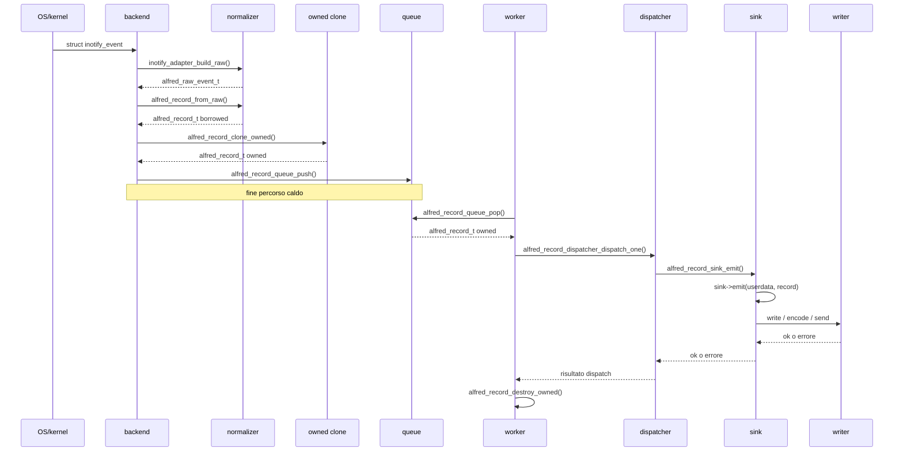

# Writer API v0

Questo documento definisce la proposta Writer API v0 di Alfred.

La decisione principale e':

```text
I writer sono consumer di alfred_record_t.
Non sono il modello dati primario.
Non devono vivere nel percorso caldo dell'evento.
```

Il documento definisce il contratto architetturale della Writer API. Il codice
corrente ha gia' sink, text sink, JSONL sink, JSONL buffered writer, counter
sink, queue e dispatcher preparatori, ma non ha ancora un runtime writer
asincrono completo con worker, backpressure, profili operativi e writer
configurabili.

Per l'ordine operativo dei prossimi micro-step leggere anche
[Roadmap Writer Runtime v0](33-writer-runtime-roadmap-v0.md).

## Perche' serve

Alfred non deve essere solo un logger sincrono. Il suo obiettivo e' osservare
eventi di sistema con overhead basso e trasformarli in record utili per log,
audit, policy, Agent Guard, Lab e integrazioni esterne.

Se il backend o il core chiamano direttamente funzioni come:

```c
fprintf(...);
fflush(...);
jsonl_writer_write(...);
protobuf_encode(...);
socket_send(...);
```

nel percorso caldo dell'evento, Alfred rischia di bloccarsi sul componente piu'
lento: filesystem, socket, dashboard, encoder, plugin o consumer esterno.

Writer API v0 serve a evitare questo errore progettuale.

## Percorso caldo

Il percorso caldo di Alfred deve essere il piu' corto possibile:

```text
evento OS
-> collector/backend
-> normalizzazione minima
-> alfred_record_t
-> enqueue su coda/ring buffer
```

Nel percorso caldo non devono vivere:

- writer testuale;
- JSONL;
- protobuf;
- MessagePack;
- socket TCP;
- Unix socket;
- `fprintf()`;
- `fflush()`;
- encode binari costosi;
- dashboard;
- Alfred Lab;
- report;
- policy pesante;
- plugin lenti;
- allocazioni non necessarie;
- `malloc()`/`free()` per evento;
- `strdup()` per evento;
- `snprintf()` per generare output;
- escaping JSON;
- regex;
- lookup pesanti non bounded;
- lock pesanti o non bounded.

Questa regola e' piu' importante della scelta del formato. Un writer JSONL
ottimo, ma chiamato sincronicamente dal backend per ogni evento, sarebbe comunque
nel posto sbagliato.

Il costo di una chiamata indiretta tramite function pointer e' normalmente molto
piccolo rispetto al costo di un writer reale. Il problema non e':

```text
plugin = lento
```

Il problema e':

```text
plugin o writer lento chiamato sincronicamente nel percorso caldo = lento
```

Quindi una interfaccia plugin-like statica puo' essere accettabile anche in un
progetto orientato alle prestazioni, se il lavoro costoso resta fuori hot path.

## Percorso fuori hot path

Fuori dal percorso caldo il flusso target diventa:

```text
coda/ring buffer
-> dispatcher/worker
-> writer API
-> writer text/jsonl/protobuf/messagepack/socket/lab
```

I writer possono fare lavoro costoso solo perche' sono fuori dal percorso caldo.
Possono serializzare, raggruppare, fare flush, spedire su socket o aggiornare UI,
ma non devono bloccare il collector.

## Vista architetturale completa

Il diagramma seguente mostra la forma target del percorso record/output. In
Mermaid resta una vista statica, ma separa chiaramente:

- il percorso caldo;
- il punto in cui avviene la copia owned;
- la coda;
- il dispatcher;
- i sink;
- i writer a valle.

```mermaid
flowchart LR
    subgraph Sources["Sorgenti eventi"]
        OS["OS events"]
        INO["inotify"]
        FAN["fanotify futuro"]
        EBPF["eBPF futuro"]
    end

    subgraph Hot["Percorso caldo"]
        B["backend poll"]
        N["adapter / builder"]
        RB["record borrowed"]
        CL["clone owned"]
        Q["record queue"]
    end

    subgraph Cold["Fuori hot path"]
        D["dispatcher"]
        S1["text sink"]
        S2["sink JSONL"]
        S3["sink binary"]
        S4["sink Lab"]
    end

    subgraph Writers["Writer / consumer"]
        W1["raw/events log"]
        W2["ledger JSONL"]
        W3["MessagePack<br/>protobuf"]
        W4["UI / report"]
    end

    OS --> INO
    OS -.-> FAN
    OS -.-> EBPF
    INO -->|"struct inotify_event"| B
    FAN -.->|"evento backend futuro"| B
    EBPF -.->|"evento backend futuro"| B
    B -->|"inotify_adapter_build_raw()"| N
    N -->|"alfred_raw_event_t / alfred_record_t"| RB
    RB -->|"alfred_record_clone_owned()"| CL
    CL -->|"alfred_record_queue_push()"| Q
    Q -->|"alfred_record_queue_pop()"| D
    D -->|"alfred_record_sink_emit()"| S1
    D -->|"alfred_record_sink_emit()"| S2
    D -->|"alfred_record_sink_emit()"| S3
    D -->|"alfred_record_sink_emit()"| S4
    S1 -->|"alfred_record_text_sink_emit()"| W1
    S2 -->|"jsonl_write() futuro"| W2
    S3 -->|"binary_encode() futuro"| W3
    S4 -->|"lab_update() futuro"| W4
```



Lettura del diagramma:

1. I backend osservano eventi OS, per esempio `struct inotify_event`.
2. Il backend chiama l'adapter o un builder per normalizzare.
3. La normalizzazione produce `alfred_raw_event_t` e poi `alfred_record_t`.
4. Prima del confine asincrono il record borrowed diventa owned con
   `alfred_record_clone_owned()`.
5. Il record owned entra nella queue con `alfred_record_queue_push()`.
6. Fuori dal path caldo il worker estrae con `alfred_record_queue_pop()`.
7. Il dispatcher chiama i sink con `alfred_record_sink_emit()`.
8. Ogni sink consegna il record al proprio writer o consumer.

La linea concettuale piu' importante e':

```text
backend -> record -> queue
```

Questa e' la fine del lavoro che deve restare veloce. Tutto cio' che viene dopo
puo' essere piu' ricco, configurabile e costoso, ma non deve bloccare il backend.

Tabella delle funzioni e dei dati che attraversano il diagramma:

| Passaggio | Funzione / responsabilita' | Dato principale |
| --- | --- | --- |
| kernel -> backend | `read()` dentro il backend | `struct inotify_event` |
| backend -> adapter | `inotify_adapter_build_raw()` | evento inotify + parent path |
| adapter -> raw | ritorno adapter | `alfred_raw_event_t` |
| raw -> record borrowed | `alfred_record_from_raw()` | `alfred_record_t` borrowed |
| borrowed -> owned | `alfred_record_clone_owned()` | `alfred_record_t` owned |
| enqueue | `alfred_record_queue_push()` | record owned copiato nella queue |
| dequeue | `alfred_record_queue_pop()` | record owned trasferito al worker |
| fan-out | `alfred_record_dispatcher_dispatch_one()` | stesso record verso i sink |
| generic sink | `alfred_record_sink_emit()` | `sink->emit(userdata, record)` |
| text sink | `alfred_record_text_sink_emit()` | payload testuale |
| writer | callback `write()` o writer futuro | file, JSONL, binario, socket, UI |

## Vista dinamica del record

Mermaid nei Markdown comuni non produce una GIF o una vera animazione temporale.
Per ora usiamo un sequence diagram, che e' la forma piu' leggibile per mostrare
"il record che passa di mano" nel tempo.



In una animazione vera, i frame sarebbero:

| Frame | Cosa evidenziare |
| --- | --- |
| 1 | evento OS arriva al backend |
| 2 | backend normalizza e crea record borrowed |
| 3 | clone owned prima della queue |
| 4 | record owned entra nella queue |
| 5 | worker fa pop dalla queue |
| 6 | dispatcher sceglie i sink |
| 7 | sink chiama il writer |
| 8 | worker distrugge il record owned |

Questa tabella e' gia' pronta per una futura animazione SVG/HTML o D2. Per ora
rimane una descrizione statica, ma stabilisce gli stage che l'animazione dovra'
mostrare.

Il fan-out sincrono dal backend e' vietato. Questo schema e' sbagliato:

```c
void backend_emit(record)
{
    text_write(record);
    jsonl_write(record);
    protobuf_write(record);
    socket_send(record);
}
```

Ogni evento pagherebbe il costo di tutti i writer abilitati. Lo schema target e':

```c
void backend_emit(record)
{
    ring_buffer_push(record);
}
```

Il dispatcher lavora dopo:

```c
void dispatcher_loop(void)
{
    while (ring_buffer_pop(&record)) {
        for each enabled sink:
            sink_write(record);
    }
}
```

Il primo passo implementato verso questo schema e' `alfred_record_queue_t`.
Questa coda non e' ancora il dispatcher definitivo e non e' ancora collegata al
runtime. Serve a validare il confine minimo:

```text
record borrowed in ingresso
-> record owned dentro la coda
-> record owned consegnato al consumatore
```

La coda e' bounded e single-threaded nella versione v0. Questo e' un vincolo
voluto, non una mancanza casuale:

- bounded significa che l'overflow viene visto subito e non nascosto da crescita
  illimitata della memoria;
- single-threaded significa che possiamo testare prima ownership, FIFO,
  wraparound e cleanup senza confondere il contratto con mutex e scheduling;
- non collegata al runtime significa che il path caldo non cambia finche' non
  abbiamo deciso dispatcher, backpressure e benchmark.

La stessa idea vale per il primo dispatcher v0. Anche il dispatcher e'
bounded, ma il limite non e' il numero di record: e' il numero massimo di sink
registrabili. Il chiamante fornisce un array di sink e una capacita'. Se la
capacita' e' esaurita, l'aggiunta di un altro sink fallisce. Questo rende
esplicito il fan-out massimo:

```text
queue bounded      = massimo numero di record in attesa
dispatcher bounded = massimo numero di sink destinatari
```

In una fase successiva conviene valutare una coda per sink:

```text
record queue
-> dispatcher
-> text queue
-> jsonl queue
-> msgpack queue
-> lab queue
```

In questo modello un writer JSONL lento non rallenta il writer MessagePack, il
writer testuale o il backend. Ogni coda puo' avere una policy diversa:
lossless, best-effort, debug, drop controllato o disabilitazione del sink.

## Responsabilita'

| Modulo | Puo' fare | Non deve fare |
| --- | --- | --- |
| Backend/collector | osservare eventi OS, normalizzare il minimo, produrre record | aspettare writer, fare I/O di output, serializzare JSONL/protobuf |
| Core | correlare e produrre record semantici | scrivere su file/socket o dipendere dal formato di output |
| Dispatcher | leggere dalla coda, scegliere consumer, gestire policy di delivery | cambiare il significato del record |
| Writer | serializzare o trasportare record | applicare semantica core, leggere stato backend, bloccare il backend |
| Policy pesante | analizzare record e produrre decisioni | stare nel path sincrono del backend senza budget |
| Lab/dashboard | visualizzare record e pipeline | diventare dipendenza del runtime hot path |

## Writer previsti

Writer API v0 deve permettere almeno questi writer:

| Writer | Uso principale | Note |
| --- | --- | --- |
| `text` | compatibilita' log attuali e didattica | primo writer compatibile, leggibile dagli studenti |
| `jsonl` | test golden, integrazioni semplici, debugging strutturato | primo formatter/sink v0 implementato, non ancora collegato al runtime |
| `noop/counter` | benchmark e misure baseline | sink implementato per contare record senza serializzazione o I/O |
| `protobuf` | integrazioni con schema forte | utile quando il record model e' piu' stabile |
| `messagepack` | binario compatto e flessibile | meno rigido di protobuf, utile per prototipi performanti |
| `unix_socket` | integrazione locale con daemon, Lab o agent runtime | ideale per processi locali e controllo permessi Unix |
| `tcp_socket` | integrazioni remote future | richiede modello sicurezza, autenticazione e cifratura |
| `binary_native` | prestazioni estreme | da rimandare finche' schema e benchmark non sono chiari |

Il writer testuale e' utile, ma puo' diventare il writer piu' pericoloso per le
prestazioni: usa formattazione, stringhe lunghe, newline, file I/O e spesso
flush frequenti. Per questo va distinto tra:

- `text debug`: leggibile, verboso, anche con flush frequente;
- `jsonl buffered`: output pubblico strutturato, ma con batching;
- `binary/messagepack/protobuf`: output futuri per performance e integrazioni;
- `noop/counter`: sink di benchmark per misurare il costo senza I/O.

In produzione il flush per evento deve essere evitato salvo configurazione
esplicita di debug o modalita' lossless molto costosa.

## Regola sul formato

JSONL, protobuf, MessagePack e formati binari sono serializzazioni di
`alfred_record_t`. Non devono diventare il contratto interno.

La direzione corretta e':

```text
alfred_record_t
-> writer text/jsonl/protobuf/messagepack/socket
```

La direzione sbagliata e':

```text
backend
-> stringa JSONL
-> parsing
-> core/policy/writer
```

Il testo puo' restare molto utile per debug e didattica, ma non deve essere
usato come sorgente di verita' strutturata.

## JSONL formatter e sink v0

Il primo supporto JSONL e' intenzionalmente piccolo:

```text
alfred_record_t
-> alfred_record_format_jsonl()
-> oggetto JSON senza newline
```

e, attraverso il sink generico:

```text
alfred_record_t
-> alfred_record_sink_emit()
-> alfred_record_jsonl_sink_emit()
-> callback write(payload)
```

Questa scelta replica il pattern del text sink. Il formatter non decide dove
scrivere: non apre file, non scrive socket, non aggiunge newline e non fa flush.
Il callback del writer riceve una stringa valida solo durante la chiamata e puo'
decidere se aggiungere `\n`, scrivere su file, spedire su socket o salvare il
payload in un test.

Il micro-step successivo introduce il primo writer JSONL buffered:

```text
alfred_record_t
-> alfred_record_jsonl_writer_emit()
-> alfred_record_format_jsonl()
-> buffer interno del writer
-> alfred_record_jsonl_writer_flush()
-> callback write(data, size)
```

Questo livello e' diverso dal formatter e dal sink sincrono:

| Livello | Funzione principale | Responsabilita' | Cosa non fa |
| --- | --- | --- | --- |
| formatter | `alfred_record_format_jsonl()` | trasforma un record in un oggetto JSON senza newline | non conserva stato, non scrive output |
| sink sincrono | `alfred_record_jsonl_sink_emit()` | adatta record -> formatter -> callback immediata | non fa buffering, non possiede policy di flush |
| writer buffered | `alfred_record_jsonl_writer_emit()` / `flush()` | accumula righe JSONL e scrive a blocchi | non apre file, non crea thread, non decide backpressure |

Il writer buffered usa due buffer forniti dal chiamante:

| Buffer | Ruolo |
| --- | --- |
| `format_buffer` | scratch buffer per formattare un singolo oggetto JSON |
| `buffer` | output buffer che accumula una o piu' righe JSONL complete |

Ogni record viene serializzato come oggetto JSON, poi il writer aggiunge `\n`.
La callback riceve quindi bytes gia' nel formato JSON Lines, potenzialmente piu'
righe in un solo blocco. Questo e' il primo passo concreto per evitare la regola
sbagliata "un evento = una write/flush".

Regola pratica:

```text
emit(record)  -> puo' solo appendere al buffer o flushare se manca spazio
flush()       -> consegna i bytes accumulati alla callback
```

Se il buffer contiene dati e la callback di flush fallisce, il writer mantiene i
bytes nel proprio buffer. In questo modo il chiamante puo' ispezionare lo stato
o tentare un nuovo flush. Questa non e' ancora una policy di retry completa:
serve solo a non perdere dati silenziosamente dentro il primo writer buffered.

Il JSONL v0 emette sempre:

| Campo | Significato |
| --- | --- |
| `schema_version` | versione dello schema del record |
| `layer` | layer architetturale: `normalized_raw`, `semantic`, `diagnostic`, ecc. |
| `category` | famiglia del record: `filesystem`, `watch`, `recovery`, ecc. |
| `type` | nome stabile del record, per esempio `FILE_CREATED` |

Gli altri campi sono opzionali e compaiono solo quando il record li valorizza:

| Campo | Quando compare |
| --- | --- |
| `seq`, `ts_ns` | se il produttore assegna sequenza o timestamp |
| `source`, `raw_mask`, `cookie`, `pid` | se il record porta dati raw/backend |
| `backend`, `path`, `old_path`, `new_path` | se sono disponibili percorsi o backend |
| `identity` | se device/inode sono entrambi presenti |
| `os_error` | se esiste un errore OS strutturato |
| `watch` | se il record porta stato diagnostico del watch |
| `recovery` | se il record porta contatori o dettagli di resync/recovery |

Esempio raw:

```json
{"schema_version":0,"layer":"normalized_raw","category":"filesystem","type":"RAW_MOVED_FROM","source":1,"raw_mask":64,"cookie":123,"path":"/tmp/root/a.txt"}
```

Esempio semantico:

```json
{"schema_version":0,"layer":"semantic","category":"filesystem","type":"FILE_RENAMED","old_path":"/tmp/root/old.txt","new_path":"/tmp/root/new.txt"}
```

Esempio diagnostico:

```json
{"schema_version":0,"layer":"diagnostic","category":"recovery","type":"WATCH_RESYNC_FAILED","backend":"inotify","path":"/tmp/root","os_error":{"code":2,"name":"ENOENT","message":"No such file or directory"},"watch":{"watch_id":7,"state":"stale","reason":"IN_MOVE_SELF","error":"path-unreachable","retry_count":3},"recovery":{"detail_path":"/tmp/root/missing","result_code":-1,"pending_count":4}}
```

Il formatter fa escaping JSON delle stringhe senza usare librerie esterne:
virgolette, backslash, newline, tab, carriage return e caratteri di controllo
vengono emessi nella forma JSON corretta. Se il buffer fornito dal chiamante e'
troppo piccolo, la funzione fallisce invece di produrre JSON troncato.

`identity` e' trattata come una coppia atomica. `device_id` e `inode_id`
identificano un oggetto filesystem solo insieme: un inode senza device puo'
collidere con inode uguali su altri filesystem, mentre un device senza inode non
identifica alcun oggetto specifico. Per questo JSONL v0 emette:

```json
"identity":{"device_id":8,"inode_id":123}
```

solo quando entrambi i valori sono non zero. Se uno dei due manca, l'intero
oggetto `identity` viene omesso. Non introduciamo identita' parziali implicite
perche' renderebbero ambigui i golden test e i consumer futuri.

Questa scelta mantiene il micro-step piccolo e privo di dipendenze. Ha pero' un
limite da conoscere: su Linux i path sono sequenze di byte, non necessariamente
testo UTF-8 valido. JSON, invece, lavora con stringhe Unicode. Il JSONL v0
assume che i campi stringa del record siano testo valido; la serializzazione
lossless di path con byte non UTF-8 dovra' essere progettata prima di dichiarare
il formato stabile per ambienti ostili o forensi.

### Limiti intenzionali v0

Il JSONL v0 non e' ancora un writer completo:

- non e' collegato al runtime degli eventi;
- non gestisce file descriptor, path di output o rotazione log;
- il formatter non aggiunge newline; il writer buffered invece aggiunge newline
  ma non apre file;
- il writer buffered accumula in memoria caller-owned, non fa ancora buffering
  su file o socket reali;
- non implementa backpressure;
- non assegna sequenze o timestamp da solo;
- non sostituisce `alfred_record_t` come contratto interno.

Questi limiti sono voluti. Prima fissiamo il mapping `alfred_record_t -> JSONL`,
poi fissiamo il contratto `record -> writer buffered`, e solo dopo colleghiamo
il writer a dispatcher, code, profili operativi e benchmark.

### Debito tecnico JSONL v0

Il JSONL v0 e' accettabile per questa fase perche' e' ancora un formatter
preparatorio: non e' il writer runtime definitivo e non e' ancora il formato dei
golden test ufficiali. Proprio per questo il debito tecnico deve restare
visibile. Non deve diventare una scelta implicita dimenticata nel codice.

| Debito | Stato attuale | Perche' e' accettabile ora | Quando va chiuso |
| --- | --- | --- | --- |
| Campi zero/`NULL` omessi | Il formatter non emette campi opzionali quando valgono `0` o `NULL` | Riduce il rumore del primo mapping e mantiene JSONL v0 compatto | Prima di dichiarare stabile lo schema JSONL o usarlo come contratto golden esterno |
| Assenza di `null` espliciti | I campi non disponibili non compaiono invece di comparire come `null` | Evita di decidere troppo presto quali campi sono strutturalmente presenti ma sconosciuti | Quando definiremo schema, compatibilita' fra versioni e consumer esterni |
| Path Linux non UTF-8 non lossless | Le stringhe sono trattate come testo valido, non come sequenze byte-safe | Basta per i test attuali e per il primo writer didattico | Prima di uso forense, produzione ostile, replay affidabile o auditing security-grade |
| Sink JSONL sincrono | `alfred_record_jsonl_sink_emit()` formatta e chiama subito la callback | Resta utile per dispatcher e test, ma non e' il writer runtime finale | Prima di collegare JSONL sincrono al path caldo |
| Writer JSONL buffered minimale | `alfred_record_jsonl_writer_emit()` accumula righe in buffer caller-owned e `flush()` chiama una callback bytes | Fissa il contratto di batching senza thread, file o socket | Prima di output runtime reale configurabile |
| Nessuna backpressure | Sink e writer non gestiscono code per sink, drop, retry o classi critical/best-effort/debug | Non esiste ancora un writer file/socket che possa saturarsi davvero | Prima di socket, Lab, ledger JSONL continuativo o writer thread |
| Nessun file/socket | Il writer buffered consegna bytes a una callback, ma non apre output device | Mantiene separati formato, framing, buffering e I/O reale | Quando introdurremo configurazione output e profili runtime |
| Nessuna validazione schema esterna | I test confrontano stringhe esatte, ma non esiste ancora uno schema JSON formale | Sufficiente per bloccare il mapping C iniziale | Prima di pubblicare JSONL come interfaccia stabile per tool terzi |

La regola pratica e': questo debito e' accettabile finche' JSONL resta un
formatter/sink testabile fuori dal runtime. Quando JSONL diventera' output
ufficiale, ledger, golden-test format o interfaccia per integrazioni esterne,
questi punti dovranno essere risolti o trasformati in decisioni esplicite di
schema v1.

## Configurazione output minima

Il primo contratto configurabile del Writer Runtime v0 e' volutamente piccolo:

```text
output_enabled=false
output_format=jsonl
output_buffer_size=65536
output_log=output.jsonl
```

Questa configurazione collega il primo writer runtime solo quando
`output_enabled=true` e `output_format=jsonl`. Il default resta spento per non
cambiare il comportamento storico. Quando e' acceso, il percorso JSONL e'
aggiuntivo: `raw.log`, `events.log` ed `errors.log` continuano a essere prodotti.

Campi:

| Chiave | Campo C | Default | Significato |
| --- | --- | --- | --- |
| `output_enabled` | `config.output.enabled` | `false` | abilita il percorso opt-in `record -> queue -> dispatcher -> writer` |
| `output_format` | `config.output.format` | `jsonl` | formato richiesto; `jsonl` e' il solo formato runtime abilitabile in v0 |
| `output_buffer_size` | `config.output.buffer_size` | `65536` | bytes del buffer per writer buffered, minimo `4096` |
| `output_log` | `config.output_log` | `output.jsonl` | file append-only usato dal primo writer JSONL runtime |

Quando `output_enabled=false`, il path runtime resta quello compatibile:

```text
backend/core
-> logger attuale
-> raw.log / events.log / errors.log
```

Quando `output_enabled=true`, la configurazione descrive il path target:

```text
record
-> queue
-> runtime drain sincrono
-> dispatcher
-> JSONL buffered writer
-> output_log
```

Nel codice corrente questo path e' collegato ad `app_run()` per i record raw
normalizzati gia' migrati al record sink, per gli eventi semantici emessi dal
core e per la diagnostica watch semplice `WATCH_ADDED`/`WATCH_REMOVED`. Il
collegamento e' volutamente sincrono: il callback applicativo, il core logger o
il watch manager costruiscono un `alfred_record_t`, scrivono il log compatibile
e, se la pipeline e' abilitata, accodano lo stesso record nella pipeline JSONL e
drenano subito il batch disponibile.

Il watch manager non conosce `app_t` e non conosce il writer JSONL. Riceve nel
`inotify_backend_context_t` un callback generico `emit_record`: il backend offre
un record diagnostico borrowed, l'applicazione lo clona/enqueue nella pipeline
se `output_enabled=true`, oppure lo ignora in modo riuscito se l'output
strutturato e' disabilitato. Questa e' la stessa regola di ownership usata per
gli eventi semantici del core.

La copertura completa e aggiornata di cosa puo' passare da un sink, cosa passa
gia' da un sink nel runtime e cosa entra davvero in JSONL e' nel
[Contratto dei log](22-contratto-log.md#copertura-record-sink-e-output-jsonl).
Quel capitolo distingue raw kernel, raw Alfred normalizzati, raw sintetici,
eventi semantici, diagnostica watch/resync/lost-scope, lifecycle, errori e
trace.

Perche' non aggiungiamo ancora `output_target` o `flush_interval_ms`:

- `output_target` apre il tema di file, stdout, socket, unix socket e Lab;
- `flush_interval_ms` richiede timer o worker thread reali.

Queste scelte appartengono ai prossimi passi. In questo micro-step il target e'
solo un file JSONL in append mode.

## Output pipeline sperimentale

Il passo successivo compone i blocchi gia' testati in una pipeline singola:

```text
alfred_record_t
-> alfred_record_output_pipeline_enqueue()
-> alfred_record_queue_push()
-> alfred_record_output_pipeline_drain_once()
-> alfred_record_runtime_drain_once()
-> alfred_record_dispatcher_dispatch_one()
-> alfred_record_jsonl_writer_emit()
-> alfred_record_output_pipeline_flush()
-> callback write(data, size)
```

Il tipo principale e':

```c
typedef struct {
    int enabled;
    alfred_record_output_pipeline_format_t format;
    size_t drain_batch_size;
    alfred_record_queue_t queue;
    alfred_record_dispatcher_t dispatcher;
    alfred_record_dispatcher_sink_t sink_storage[1];
    alfred_record_jsonl_writer_t writer;
} alfred_record_output_pipeline_t;
```

Significato:

| Campo | Ruolo |
| --- | --- |
| `enabled` | se falso, la pipeline e' un no-op |
| `format` | formato writer attivo; v0 supporta solo JSONL |
| `drain_batch_size` | massimo numero di record consumati da un drain |
| `queue` | coda bounded di record owned |
| `dispatcher` | fan-out bounded; v0 registra un solo sink |
| `sink_storage[1]` | storage embedded per il sink JSONL |
| `writer` | JSONL buffered writer |

Quando la pipeline e' disabilitata, `enqueue`, `drain_once` e `flush` tornano
successo senza produrre output. Questo rappresenta il comportamento di
`output_enabled=false`: il runtime compatibile continua a usare i log correnti e
la nuova pipeline non partecipa.

Quando la pipeline e' abilitata, il record viene clonato nella queue come owned,
poi il drain consegna un batch al dispatcher. Il dispatcher chiama il sink JSONL
e il sink scrive nel buffer del writer. La callback di output non viene chiamata
dal drain: viene chiamata solo da `alfred_record_output_pipeline_flush()`.

Questa scelta e' intenzionale:

- `enqueue()` misura il confine borrowed -> owned;
- `drain_once()` misura il confine queue -> dispatcher -> writer;
- `flush()` misura il confine writer buffered -> output device callback.

La pipeline non apre file, non crea thread, non implementa retry e non decide
policy di backpressure. Se la queue e' piena, `enqueue()` fallisce. Se il flush
fallisce, i bytes restano nel JSONL writer come gia' definito dal contratto del
writer buffered.

Questa e' ancora una pipeline v0 sincrona, non il percorso finale di `app_run()`.
Serve a verificare il contratto `record -> queue -> dispatcher -> writer` prima
di introdurre worker thread, code per sink e backpressure reale.

## Backpressure

Se un writer e' lento, Alfred deve avere una policy esplicita. Non deve
bloccare indefinitamente il backend.

Le policy da progettare sono:

- `lossless`: il sistema accetta backpressure e puo' rallentare o fermarsi;
- `drop_diagnostics`: scarta diagnostica meno importante prima degli eventi
  principali;
- `drop_oldest`: mantiene record recenti e dichiara perdita;
- `drop_newest`: conserva backlog esistente e dichiara perdita;
- `overflow_record`: emette un record strutturato che segnala perdita o coda
  satura;
- `metrics`: espone contatori di record accodati, scritti, scartati e falliti.

La scelta non va nascosta dentro un writer. Deve essere configurabile o almeno
documentata come default.

Una classificazione pratica dei sink puo' essere:

```c
typedef enum {
    ALFRED_SINK_CRITICAL,
    ALFRED_SINK_BEST_EFFORT,
    ALFRED_SINK_DEBUG
} alfred_sink_class_t;
```

Esempi:

| Classe | Esempio | Policy possibile |
| --- | --- | --- |
| `critical` | ledger JSONL audit | errore serio o modalita' lossless controllata |
| `best_effort` | Lab, UI, sink diagnostici | drop controllato con metriche |
| `debug` | text writer verboso | disabilitabile o flush configurabile |

Questa distinzione evita che un sink di debug lento rallenti Alfred in
produzione.

## Fase corrente

Il codice corrente usa ancora bridge sincroni:

```text
record
-> alfred_record_sink_emit()
-> alfred_record_text_sink_emit()
-> logger_raw/logger_event/logger_error
```

Questi bridge sono accettabili come migrazione incrementale per:

- togliere stringhe sparse dal codice;
- far passare i log compatibili da `alfred_record_t`;
- mantenere test esistenti e payload testuali;
- preparare JSONL e writer futuri.

Non sono pero' il modello finale ad alte prestazioni. Il modello finale deve
spostare serializzazione e I/O fuori dal percorso caldo con code e worker.

## Roadmap implementativa

1. Continuare a migrare i record correnti verso `alfred_record_t`.
2. Introdurre un dispatcher applicativo che riceve record.
3. Definire una coda/ring buffer tra produttori e writer.
4. Definire classi sink: critical, best-effort, debug.
5. Implementare un writer no-op/counter per benchmark senza I/O.
6. Implementare un writer text compatibile sopra Writer API v0.
7. Implementare un writer JSONL minimo buffered con test golden.
8. Aggiungere metriche di coda, drop e backpressure.
9. Solo dopo valutare protobuf, MessagePack e socket.
10. Solo dopo valutare writer plugin dinamici.

## Profili operativi

Alfred deve distinguere debug, produzione, benchmark e audit. Senza profili,
si rischia di misurare una configurazione di debug e scambiarla per prestazione
di produzione.

| Profilo | Writer | Flush | Obiettivo |
| --- | --- | --- | --- |
| `debug` | text verboso, JSONL opzionale | anche immediato | leggibilita' e didattica |
| `production` | JSONL buffered, text minimo o spento | batch/periodico | throughput e stabilita' |
| `benchmark` | no-op/counter, poi writer singoli | controllato | misurare overhead puro |
| `audit` | ledger JSONL critical, hash chain futura | controllato | integrita' e ricostruzione |

Il profilo `benchmark` e' essenziale: se il sink no-op e' veloce ma JSONL e'
lento, il collo di bottiglia e' il writer, non il backend o l'architettura
plugin-like.

## Plugin writer

I writer devono seguire lo stesso principio dei backend: prima API statica
semplice e testabile, poi eventuali plugin dinamici.

Fase iniziale:

```text
writer compilati staticamente con interfaccia plugin-like
-> noop/counter
-> text
-> jsonl
```

Fase successiva:

```text
writer dinamici opzionali
-> protobuf
-> messagepack
-> unix_socket
-> tcp_socket
-> binary_native
```

I plugin writer dinamici richiederanno un contratto ABI, versioning, ownership
della memoria, error model e limiti sul tempo di esecuzione. Non vanno
introdotti prima che il record model e la coda siano stabili.

Per i backend la cautela deve essere ancora maggiore. I backend sono vicini alla
sorgente eventi e quindi piu' sensibili a chiamate indirette, lock, allocazioni
e conversioni nel posto sbagliato. La strategia consigliata e':

- backend plugin-like compilati staticamente nella prima fase;
- writer plugin-like compilati staticamente nella prima fase;
- plugin `.so` rimandati;
- eventuali plugin out-of-process per sink non critici o non fidati.

I plugin out-of-process possono essere piu' lenti, ma sono piu' sicuri: se il
processo esterno crasha, Alfred non deve cadere insieme a lui.

## Benchmark da progettare

Le prestazioni devono essere misurate, non dedotte. I benchmark minimi per
Writer API v0 sono:

1. backend -> no-op sink;
2. backend -> text sink;
3. backend -> JSONL sink;
4. backend -> JSONL + text;
5. backend -> JSONL buffered;
6. backend -> JSONL con flush immediato;
7. backend -> MessagePack/protobuf futuri.

Metriche da raccogliere:

- eventi al secondo;
- CPU;
- memoria;
- latenza media;
- p95/p99 latency;
- profondita' code;
- record droppati;
- errori dei sink;
- tempo speso in serializzazione;
- tempo speso in I/O.

Il benchmark piu' importante e' il no-op sink: misura il costo del cuore di
Alfred senza I/O. Solo dopo ha senso confrontare text, JSONL e formati binari.

Il primo sink no-op/counter esiste nel codice come
`alfred_record_counter_sink_t`. Si collega al confine generico
`alfred_record_sink_t`, riceve record borrowed e incrementa solo contatori
numerici:

```text
alfred_record_t
-> alfred_record_sink_emit()
-> alfred_record_counter_sink_emit()
-> total/layer/category counters
```

Questo sink non formatta testo, non genera JSONL, non apre file, non invia
socket, non alloca memoria e non conserva puntatori borrowed come `path` o
`backend`. Per questo e' utile come baseline: se in futuro `counter` e' veloce
ma `jsonl` e' lento, il costo e' nella serializzazione o nel writer; se anche
`counter` e' lento, il problema e' piu' vicino a record, dispatcher, coda o
pipeline.

Il primo harness manuale per questa misura e':

```bash
make perf-record-sinks
```

Il comando compila `tests/perf/bench_record_sinks.c` ed emette CSV con righe
dirette, righe queue, righe dispatcher, righe queue-dispatcher e una riga
`output-pipeline-jsonl`. Le righe
`counter`, `text` e `jsonl` misurano l'emissione diretta verso un sink. La riga
`queue-counter` misura il primo confine `record borrowed -> clone owned ->
queue push -> queue pop -> counter sink -> destroy owned`, senza formattazione e
senza I/O. Le righe `dispatcher-*` misurano
`alfred_record_dispatcher_dispatch_one()` verso uno o piu' sink registrati,
senza coda e senza thread. Le righe `queue-dispatcher-*` misurano
`alfred_record_dispatcher_drain_queue()`, cioe' il percorso single-threaded piu'
vicino al runtime target prima di introdurre worker reali. La riga
`output-pipeline-jsonl` misura l'oggetto `alfred_record_output_pipeline_t`
assemblato: enqueue, runtime drain, dispatcher, JSONL buffered writer e flush
finale verso callback in memoria. Lo script accetta anche:

```bash
cd tests/perf
bash run_record_sinks.sh --records 1000000 --runs 5
```

Le run multiple producono `min_us`, `avg_us` e `max_us`, utili per non ragionare
su una sola misura rumorosa. Questo non e' ancora un benchmark end-to-end di
Alfred: non usa inotify, non legge eventi dal kernel, non scrive file e non
misura backpressure. Misura solo record sintetici consegnati a sink isolati.
La spiegazione campo per campo del CSV, con esempi pratici e interpretazioni,
e' nella guida test: [make perf-record-sinks](10-debugging-test-e-strumenti.md#9-make-perf-record-sinks).

## Ownership e record accodati

La Writer API v0 non puo' assumere che un `alfred_record_t` borrowed resti
valido dopo la chiamata che lo ha prodotto. Nel runtime corrente questo e'
accettabile perche' i bridge sono sincroni e immediati. Nel modello target,
invece, il record entra in una coda e viene letto piu' tardi da un dispatcher o
da un worker del writer.

Regola:

```text
Ogni record che supera il confine della coda deve essere owned oppure deve
puntare a memoria con lifetime esplicitamente garantito dal runtime.
```

Per v0 la soluzione piu' chiara e' una copia owned prima dell'enqueue. Anche se
ha un costo, elimina ambiguita' su stringhe borrowed come path, messaggi di
errore, nome backend, futuro `agent_session_id`, workspace, command line o
policy rule. Nel codice questa scelta preparatoria e' rappresentata da:

```c
int alfred_record_clone_owned(const alfred_record_t *src,
                              alfred_record_t *dst);
void alfred_record_destroy_owned(alfred_record_t *record);
```

Queste funzioni non sono ancora collegate al runtime hot path. Servono a
verificare il contratto di ownership prima di introdurre queue, dispatcher e
writer asincroni.

`alfred_record_clone_owned()` non e' una replace API. La destinazione deve
essere zeroed oppure non deve possedere stringhe. Se il chiamante vuole usare lo
stesso `alfred_record_t dst` per piu' clone, deve distruggere il contenuto owned
precedente prima del clone successivo:

In questo contesto "zeroed" significa che la struct e' stata azzerata e i suoi
puntatori sono `NULL`; "non-owned" significa che non contiene memoria dinamica
di cui e' responsabile; "owned" significa che contiene copie allocate da
liberare con `alfred_record_destroy_owned()`. La spiegazione C completa e' in
[08](08-guida-c-usato-nel-progetto.md#ownership).

```c
alfred_record_clone_owned(&src1, &dst);
alfred_record_destroy_owned(&dst);

alfred_record_clone_owned(&src2, &dst);
alfred_record_destroy_owned(&dst);
```

Questo vincolo evita una ambiguita' importante: una funzione di replace dovrebbe
liberare automaticamente il contenuto precedente di `dst`, ma quel contenuto
potrebbe essere borrowed e non allocato con `malloc()`. In quel caso una
`free()` automatica sarebbe pericolosa. Per questo v0 preferisce un contratto
piu' esplicito: il clone entra in una destinazione vuota, il destroy chiude il
ciclo di ownership.

### Confronto fra strategie di ownership

| Strategia | Idea | Pro | Contro | Stato |
| --- | --- | --- | --- | --- |
| Deep copy per record | duplicare tutte le stringhe usate dal record | semplice, sicura, testabile | `malloc()` e copie nel path caldo se usata prima dell'enqueue | implementata come API preparatoria |
| Storage inline fisso | buffer dentro lo slot della coda | niente allocazioni per evento, lifetime semplice | record grandi, copie potenzialmente pesanti, limiti fissi | candidata per ring buffer performante |
| Pool/arena per batch | molte stringhe dentro una regione liberata insieme | meno allocazioni, migliore localita' | lifetime piu' complesso, difficile se i sink hanno tempi diversi | futura, dopo benchmark |
| String/path table | condividere path e prefissi con lifetime controllato | riduce duplicati, utile su alberi ricorsivi | reference counting, lock, debugging piu' difficile | futura, non per v0 |

La regola pratica e':

```text
prima sicurezza del lifetime, poi ottimizzazione misurata
```

Se la deep copy viene messa direttamente nel backend poll loop, puo' rallentare
Alfred perche' porta nel path caldo `strlen()`, `malloc()`, `memcpy()` e
gestione degli errori. Per questo la API owned nasce ora, ma il collegamento al
dispatcher verra' deciso insieme ai benchmark no-op, text e JSONL.

## Code per sink

Il primo dispatcher potra' usare una coda comune, ma l'architettura deve
restare compatibile con una coda per sink:

```text
record queue
-> dispatcher
-> text queue
-> jsonl queue
-> msgpack queue
-> lab queue
```

Il motivo e' semplice: un writer lento non deve rallentare tutto Alfred. Un
writer JSONL con disco lento, un socket bloccato o una UI di debug non devono
fermare il backend che osserva eventi OS.

Le classi di sink previste sono:

| Classe | Uso | Policy possibile |
| --- | --- | --- |
| critical | ledger/audit che non deve perdere eventi senza segnalarlo | errore serio, backpressure o shutdown controllato |
| best-effort | integrazioni utili ma non essenziali | drop controllato con contatore/diagnostica |
| debug | output umano, Lab, trace verbose | disabilitabile o campionabile |

Questa classificazione non deve vivere nascosta dentro un writer. Deve essere
visibile nella configurazione o nel registry, cosi' i test e i benchmark
possono verificare cosa succede quando un sink e' lento.

## Record Queue v0

La prima API di coda e':

```c
int alfred_record_queue_init(alfred_record_queue_t *queue, size_t capacity);
void alfred_record_queue_destroy(alfred_record_queue_t *queue);
void alfred_record_queue_clear(alfred_record_queue_t *queue);
int alfred_record_queue_push(alfred_record_queue_t *queue,
                             const alfred_record_t *record);
int alfred_record_queue_pop(alfred_record_queue_t *queue,
                            alfred_record_t *record);
```

`push()` riceve un record borrowed e clona le stringhe con
`alfred_record_clone_owned()`. Questo permette al produttore di riusare il suo
buffer subito dopo la chiamata. `pop()` trasferisce al chiamante il record owned:
da quel momento il chiamante deve chiamare `alfred_record_destroy_owned()`.

`pop()` non e' una replace API. La destinazione deve essere zeroed oppure deve
essere gia' stata distrutta. Un ciclo corretto e':

```c
alfred_record_t record;

memset(&record, 0, sizeof(record));

while (alfred_record_queue_pop(&queue, &record) == 0) {
    /* uso record */

    alfred_record_destroy_owned(&record);
}
```

Se il chiamante fa due `pop()` consecutivi nella stessa variabile senza destroy,
il secondo `pop()` sovrascrive i puntatori owned del primo record e crea un
memory leak. Rendere `pop()` una replace automatica sarebbe rischioso per lo
stesso motivo della clone API: la destinazione potrebbe contenere puntatori
borrowed, e una `free()` automatica su memoria borrowed sarebbe sbagliata.

Anche `init()` ha una precondizione di ownership: la queue deve essere zeroed
oppure deve essere gia' stata ripulita da `alfred_record_queue_destroy()`.
Non basta dire "non inizializzata". In C una variabile automatica locale non
inizializzata contiene valori indeterminati; se `init()` legge `queue.items`
prima di azzerare la struct, leggere quel puntatore indeterminato e'
comportamento indefinito. Quindi il pattern sicuro e' sempre:

```c
alfred_record_queue_t queue = {0};

alfred_record_queue_init(&queue, capacity);
```

oppure, se la queue era gia' stata usata:

```c
alfred_record_queue_destroy(&queue);
alfred_record_queue_init(&queue, new_capacity);
```

Una seconda `alfred_record_queue_init()` su una queue attiva viene rifiutata,
perche' altrimenti il nuovo `memset()` perderebbe il vecchio `items` pointer e
quindi anche gli owned record eventualmente accodati.

### Contratto di ownership delle API v0

Questa tabella riassume come usare le API di ownership e queue introdotte finora.
E' la parte da leggere prima di scrivere codice che conserva un record oltre la
chiamata corrente.

| API | Cosa riceve | Cosa produce | Chi possiede la memoria dopo | Cleanup richiesto |
| --- | --- | --- | --- | --- |
| `alfred_record_clone_owned(src, dst)` | `src` borrowed, `dst` zeroed/non-owned | copia owned in `dst` | il chiamante possiede `dst` | `alfred_record_destroy_owned(&dst)` |
| `alfred_record_destroy_owned(record)` | record owned o gia' zeroed | record azzerato | nessuno, le stringhe sono liberate | nessun cleanup ulteriore |
| `alfred_record_queue_init(queue, capacity)` | queue zeroed/gia' distrutta | buffer bounded vuoto | la queue possiede `items` | `alfred_record_queue_destroy(&queue)` |
| `alfred_record_queue_push(queue, record)` | queue valida, record borrowed | clone owned dentro la queue | la queue possiede il clone | destroy/clear della queue oppure pop |
| `alfred_record_queue_pop(queue, record)` | queue valida, `record` zeroed/gia' distrutto | record owned trasferito al chiamante | il chiamante possiede `record` | `alfred_record_destroy_owned(&record)` |
| `alfred_record_queue_clear(queue)` | queue valida | stessa queue vuota | la queue conserva il buffer | `alfred_record_queue_destroy(&queue)` finale |
| `alfred_record_queue_destroy(queue)` | queue valida o zeroed | queue azzerata | nessuno | nessun cleanup ulteriore |

Gli errori tipici sono:

1. clonare due volte nello stesso `dst` senza destroy;
2. fare due `pop()` nella stessa variabile senza destroy;
3. chiamare `init()` su una queue gia' attiva senza destroy;
4. chiamare `alfred_record_destroy_owned()` su un record borrowed.

Esempio corretto completo:

```c
alfred_record_queue_t queue;
alfred_record_t borrowed;
alfred_record_t popped;

memset(&queue, 0, sizeof(queue));
memset(&borrowed, 0, sizeof(borrowed));
memset(&popped, 0, sizeof(popped));

borrowed.path = "/tmp/file"; /* borrowed/static string */

if (alfred_record_queue_init(&queue, 16) != 0) {
    return -1;
}

if (alfred_record_queue_push(&queue, &borrowed) != 0) {
    alfred_record_queue_destroy(&queue);
    return -1;
}

while (alfred_record_queue_pop(&queue, &popped) == 0) {
    /* il chiamante possiede popped fino al destroy */

    alfred_record_destroy_owned(&popped);
}

alfred_record_queue_destroy(&queue);
```

Notare due dettagli:

- `borrowed.path` non viene mai liberato dal chiamante, perche' non e' owned;
- `popped` viene distrutto dentro il ciclo prima di essere riusato.

Questo modello e' didatticamente importante perche' separa tre concetti che
spesso vengono confusi:

| Concetto | Significato |
| --- | --- |
| record borrowed | vista valida solo durante la chiamata sincrona |
| record owned | record che possiede le stringhe e puo' vivere piu' a lungo |
| queue boundary | punto in cui un record puo' sopravvivere al produttore |

In termini di prestazioni questa non e' ancora la soluzione finale. La coda v0
usa deep copy per rendere il contratto facile da verificare. Prima di usarla nel
path caldo bisognera' misurare:

- costo di `malloc()` e `free()` per evento;
- costo della copia dei path;
- latenza media e p95/p99;
- throughput con sink no-op, text e JSONL;
- comportamento quando la coda e' piena.

Solo dopo questi benchmark decideremo se mantenere deep copy, passare a storage
inline, introdurre pool/arena o usare tabelle path condivise.

## Record Dispatcher v0

### Che cosa sono dispatcher e sink

Il dispatcher e' il componente che riceve un `alfred_record_t` e lo consegna a
uno o piu' destinatari registrati. Non decide il significato del record, non lo
trasforma in JSONL, non scrive su file e non apre socket. Il suo compito e'
solo fare routing:

```text
alfred_record_t
-> dispatcher
-> sink 1
-> sink 2
-> sink 3
```

Un sink e' un consumatore di record. In pratica e' un piccolo oggetto che dice:
"quando ricevi un record, chiama questa funzione con questo contesto privato".
Nel codice il sink base e':

```c
typedef int (*alfred_record_sink_emit_fn)(void *userdata,
                                          const alfred_record_t *record);

typedef struct {
    alfred_record_sink_emit_fn emit;
    void *userdata;
} alfred_record_sink_t;
```

I due campi vanno letti cosi':

| Campo | Significato |
| --- | --- |
| `emit` | funzione che il dispatcher deve chiamare per consegnare il record |
| `userdata` | puntatore opaco al contesto privato del sink |

`userdata` permette di usare la stessa interfaccia per sink molto diversi. Per
esempio:

- un text sink puo' mettere in `userdata` il proprio buffer e la callback che
  scrive il payload testuale;
- un futuro JSONL sink potra' mettere in `userdata` il proprio writer JSONL;
- un sink di test puo' mettere in `userdata` una struttura che conta quante volte
  e' stato chiamato;
- un futuro socket sink potra' mettere in `userdata` il file descriptor o il
  contesto del protocollo.

Questa separazione e' importante perche' il dispatcher non deve conoscere il tipo
reale del sink. Il dispatcher vede solo:

```text
emit(record)
```

Il resto resta privato del sink.

### Come lavorano insieme

Il percorso concettuale completo e':

```text
producer/backend/core
-> alfred_record_t
-> queue
-> dispatcher
-> sink
-> writer/bridge
```

Ogni pezzo ha una responsabilita' diversa:

| Pezzo | Responsabilita' |
| --- | --- |
| producer/backend/core | produce un record strutturato |
| queue | conserva record owned in attesa |
| dispatcher | sceglie quali sink devono ricevere il record |
| sink | riceve il record attraverso `emit()` |
| writer/bridge | serializza, scrive, invia o adatta il record |

Una regola utile da ricordare e':

```text
la queue conserva, il dispatcher consegna, il sink consuma
```

Per esempio, con tre sink registrati:

```text
text sink
jsonl sink
lab sink
```

il dispatcher fara':

```text
record -> text sink
record -> jsonl sink
record -> lab sink
```

Il record passato ai sink e' una vista borrowed valida durante la chiamata. Se un
sink vuole conservarlo per dopo, deve copiarlo o usare un'altra strategia di
ownership sicura. Questo e' lo stesso principio usato per le code: appena un
record supera un confine asincrono, non puo' piu' dipendere da memoria borrowed
del produttore.

### Come il dispatcher contatta i sink

Il dispatcher contiene un array di sink registrati. Quando si chiama:

```c
alfred_record_dispatcher_dispatch_one(&dispatcher, &record);
```

il comportamento v0 e' equivalente a:

```c
for (i = 0; i < dispatcher->count; ++i) {
    alfred_record_sink_emit(&dispatcher->sinks[i].sink, record);
}
```

`alfred_record_sink_emit()` e' un wrapper difensivo: controlla che il sink esista,
che la funzione `emit` non sia `NULL` e poi chiama davvero:

```c
sink->emit(sink->userdata, record);
```

Quindi il dispatcher non chiama direttamente `jsonl_write()`, `fprintf()` o
`socket_send()`. Chiama sempre la stessa interfaccia astratta:

```text
alfred_record_sink_emit()
```

Sara' poi il sink concreto a decidere cosa fare.

### Ordine di chiamata

Nel dispatcher v0 i sink vengono chiamati in ordine di registrazione. Se il
codice registra i sink cosi':

```text
1. text
2. jsonl
3. lab
```

l'ordine di dispatch sara':

```text
record -> text
record -> jsonl
record -> lab
```

Questo ordine e' testato in `tests/backend/test_record_dispatcher.c`. Il test
usa sink finti che salvano l'ordine di chiamata e verifica che il dispatcher non
lo cambi.

### Cosa succede se un sink fallisce

La policy v0 e' semplice: se un sink fallisce, il dispatcher si ferma e ritorna
errore.

Esempio:

```text
text  -> ok
jsonl -> errore
lab   -> non chiamato
```

Questa non e' necessariamente la policy finale. In futuro useremo le classi sink
per decidere comportamenti diversi:

- un sink `critical` potrebbe richiedere backpressure, errore serio o shutdown
  controllato;
- un sink `best-effort` potrebbe perdere record in modo controllato e aumentare
  un contatore diagnostico;
- un sink `debug` potrebbe essere disabilitato, campionato o droppato quando e'
  lento.

Per v0 scegliamo la regola piu' semplice perche' vogliamo fissare il contratto
base prima di introdurre policy di backpressure piu' complesse.

### Perche' il dispatcher non e' un writer

Il dispatcher non e' un writer. Questa distinzione e' fondamentale.

Il dispatcher sa:

- quanti sink sono registrati;
- in quale ordine chiamarli;
- se un sink ha fallito;
- quale classe futura ha un sink.

Il dispatcher non deve sapere:

- come si formatta JSONL;
- come si formatta MessagePack;
- come si scrive su `raw.log`;
- come si fa `fflush()`;
- come si invia un record su socket;
- come si disegna Alfred Lab.

Questa separazione protegge il percorso caldo di Alfred. Il backend deve produrre
record e accodarli rapidamente; serializzazione, I/O, flush e integrazioni lente
devono stare dietro sink/writer fuori dal path caldo.

La prima API dispatcher e':

```c
int alfred_record_dispatcher_init(alfred_record_dispatcher_t *dispatcher,
                                  alfred_record_dispatcher_sink_t *sinks,
                                  size_t capacity);
void alfred_record_dispatcher_clear(alfred_record_dispatcher_t *dispatcher);
int alfred_record_dispatcher_add_sink(
    alfred_record_dispatcher_t *dispatcher,
    const char *name,
    alfred_record_dispatcher_sink_class_t sink_class,
    const alfred_record_sink_t *sink);
int alfred_record_dispatcher_dispatch_one(
    const alfred_record_dispatcher_t *dispatcher,
    const alfred_record_t *record);
```

Il dispatcher non possiede writer, file descriptor, socket o buffer di
serializzazione. Possiede solo la registrazione dei sink dentro lo storage
fornito dal chiamante. Questo e' intenzionale:

- mantiene il dispatcher piccolo;
- rende il limite di fan-out esplicito;
- evita allocazioni interne nella API v0;
- prepara test e benchmark senza introdurre thread;
- tiene writer e policy fuori dal contratto di routing.

`dispatch_one()` chiama i sink in ordine di registrazione usando
`alfred_record_sink_emit()`. Se un sink fallisce, la versione v0 si ferma subito
e ritorna errore. Non esistono ancora retry, drop controllato, isolamento per
sink o coda per sink: queste sono decisioni di backpressure da prendere dopo i
benchmark.

La differenza fra i tre concetti e':

| Pezzo | Responsabilita' |
| --- | --- |
| queue | conserva record owned in attesa |
| dispatcher | sceglie e chiama i sink registrati |
| sink | riceve un record e lo consegna a un writer/bridge |

Questa distinzione evita una confusione pericolosa: il dispatcher non e' il
writer. Un dispatcher non deve sapere come si formatta JSONL, come si scrive su
file o come si manda un messaggio su socket. Deve solo consegnare record.

### Che cosa significa drain della queue

"Drain della queue" significa svuotare una coda consumando i record che contiene.
Nel nostro caso la queue contiene record owned:

```text
queue:
[record 1][record 2][record 3]
```

Fare drain significa eseguire un ciclo completo:

```text
pop record 1
-> dispatch record 1 ai sink
-> destroy record 1

pop record 2
-> dispatch record 2 ai sink
-> destroy record 2

pop record 3
-> dispatch record 3 ai sink
-> destroy record 3
```

Alla fine la coda e' vuota:

```text
queue:
vuota
```

Quindi "drain" non significa solo leggere la coda. Significa:

```text
estrai
consegna
rilascia memoria
```

Nel codice il percorso e':

```text
alfred_record_queue_t
-> alfred_record_queue_pop()
-> alfred_record_dispatcher_dispatch_one()
-> sink emit()
-> alfred_record_destroy_owned()
```

Questa funzione serve per collegare i pezzi che abbiamo separato:

- la queue conserva record owned;
- il dispatcher consegna record ai sink;
- i sink ricevono record;
- il destroy chiude il ciclo di ownership.

Il parametro `max_records` rende il drain bounded anche nel tempo di lavoro. Se
la queue contiene 1000 record ma `max_records = 64`, una chiamata processa al
massimo 64 record e poi ritorna:

```text
queue iniziale: 1000 record
max_records: 64
drain corrente: 64 record processati
queue finale: 936 record ancora in attesa
```

Questo sara' utile nel runtime futuro per evitare che il dispatcher monopolizzi
troppo a lungo il programma. In altre parole, `max_records` aiuta batch,
latenza e fairness.

La policy v0 in caso di errore e' volutamente semplice. Se un sink fallisce dopo
il `pop`, il record gia' estratto viene distrutto e la funzione ritorna errore.
Nel runtime finale dovremo decidere una policy piu' completa:

- retry;
- requeue;
- dead-letter queue;
- drop diagnostico;
- shutdown controllato per sink critical.

Queste decisioni appartengono alla backpressure policy futura. Non le nascondiamo
dentro il primo helper di drain.

### Worker/drain simulato single-threaded

`alfred_record_dispatcher_drain_queue()` e'
un helper basso livello: prende una queue, fa pop, dispatch e destroy. Non
descrive ancora il livello runtime che, in futuro, sara' eseguito da un worker.

Per dare un nome a quel livello senza introdurre thread reali, Alfred aggiunge:

```c
int alfred_record_runtime_drain_once(
    const alfred_record_dispatcher_t *dispatcher,
    alfred_record_queue_t *queue,
    size_t max_records,
    alfred_record_runtime_drain_result_t *result);
```

Questo helper e' ancora single-threaded. Fa una sola cosa: eseguire un tentativo
bounded di drain e restituire un riepilogo:

```c
typedef struct {
    size_t max_records;
    size_t dispatched;
    size_t remaining;
    int status;
} alfred_record_runtime_drain_result_t;
```

Significato dei campi:

| Campo | Significato |
| --- | --- |
| `max_records` | limite batch richiesto dal chiamante |
| `dispatched` | record consegnati con successo a tutti i sink |
| `remaining` | record ancora presenti nella queue al ritorno |
| `status` | `0` se il drain e' riuscito, `-1` se input o sink falliscono |

La differenza concettuale e':

| Livello | Ruolo |
| --- | --- |
| `alfred_record_dispatcher_drain_queue()` | meccanica di pop, dispatch e destroy |
| `alfred_record_runtime_drain_once()` | passo runtime simulato che produce un risultato leggibile dal futuro worker |

In altre parole, `runtime_drain_once()` non rende Alfred asincrono. Serve a
stabilire l'interfaccia mentale del worker futuro:

```text
prendi un batch
-> prova a consegnarlo
-> registra quanti record sono passati
-> registra quanti record restano
-> segnala successo o errore
```

Questo confine evita di saltare direttamente a thread, lock, wakeup, shutdown e
backpressure. Prima fissiamo cosa significa "un giro di lavoro" in modo
deterministico e testabile.

## Regola contrattuale

La regola da non violare e':

```text
Il backend non aspetta il writer.
```

Il backend produce record e li consegna alla coda. Tutto il resto e' lavoro di
dispatcher, worker, writer o policy fuori hot path.

La frase guida e':

```text
Interoperabilita' al bordo, prestazioni nel cuore.
```
