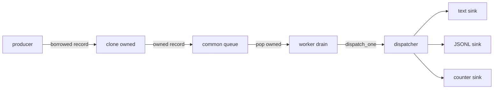
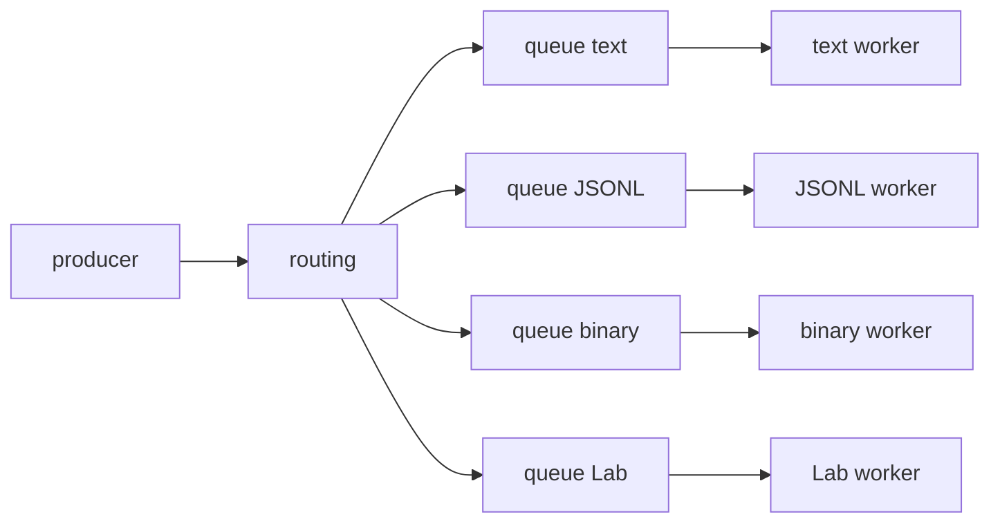

# Roadmap Writer Runtime v0

Questo documento descrive il percorso per passare dai sink sincroni attuali a
un runtime di output piu' adatto alle prestazioni di Alfred.

La Writer API v0 e' descritta in
[Writer API v0](32-writer-api-v0.md). Questo capitolo e' piu' operativo: spiega
quali passi fare, in quale ordine e quali decisioni non anticipare.

## Obiettivo

L'obiettivo del Writer Runtime v0 e' separare in modo netto:

- il percorso caldo dell'evento;
- il confine di ownership dei record;
- la coda o ring buffer;
- il dispatcher;
- i sink;
- i writer reali come text, JSONL, protobuf, MessagePack, socket o UI.

Il punto centrale e':

```text
il backend non deve aspettare il writer.
```

Se un evento OS arriva dal kernel, Alfred deve fare il minimo lavoro necessario
per trasformarlo in un record strutturato e accodarlo. Formattazione, I/O,
flush, encoding, socket, report e UI devono avvenire dopo.

## Stato corrente

Il codice corrente ha gia' alcuni mattoni importanti:

| Componente | Stato | Ruolo |
| --- | --- | --- |
| `alfred_record_t` | implementato | record comune Event Model v0 |
| `alfred_record_from_raw()` | implementato | adapter raw -> record |
| `alfred_record_format_text()` | implementato | formatter testuale compatibile |
| `alfred_record_format_jsonl()` | implementato | formatter JSONL v0 senza newline |
| `alfred_record_sink_t` | implementato | interfaccia generica `emit(userdata, record)` |
| `alfred_record_text_sink_t` | implementato | ponte record -> log testuale |
| `alfred_record_jsonl_sink_t` | implementato | ponte record -> payload JSONL |
| `alfred_record_counter_sink_t` | implementato | sink no-op/counter per benchmark |
| `alfred_record_queue_t` | implementato | coda bounded single-threaded di record owned |
| `alfred_record_dispatcher_t` | implementato | fan-out bounded verso sink registrati |
| `make perf-record-sinks` | implementato | benchmark counter/text/JSONL, queue-counter, dispatcher, queue-dispatcher e output pipeline JSONL in memoria |

Questi componenti non significano ancora che Alfred abbia un runtime writer
asincrono completo. Il runtime corrente usa ancora bridge sincroni in diversi
punti. La coda, il dispatcher e i sink servono a fissare il contratto prima di
collegare il percorso runtime reale.

La sequenzialita' attuale e' quindi una fase di validazione, non una regola di
prodotto. Oggi alcuni record passano ancora attraverso bridge chiamati in ordine
nello stesso callback applicativo; domani il record dovra' essere accodato una
sola volta nel percorso caldo e consumato da worker/sink indipendenti. Di
conseguenza, gia' nella v0, il successo di un writer non deve essere una
precondizione nascosta per consegnare il record a un altro writer. Un esempio
concreto e' il rapporto fra `events.log` e JSONL: il text writer compatibile puo'
fallire su una riga umana troppo lunga, ma il record strutturato deve comunque
essere offerto alla pipeline JSONL.

## Decisione di chiusura v0

Writer Runtime v0 viene chiuso come runtime single-threaded documentato.
Questa non e' la forma finale di Alfred, ma e' il confine corretto per questa
milestone: stabilizza record, ownership, coda bounded, drain, dispatcher, sink,
JSONL writer e counter sink senza introdurre ancora concorrenza reale.

Dentro questa v0 sono quindi inclusi:

- record strutturati `alfred_record_t`;
- adapter raw, semantici e diagnostici verso record;
- copia owned dei record al confine della coda;
- `alfred_record_queue_t` bounded e single-threaded;
- drain runtime esplicito dopo il polling backend;
- valvola di pressione v0 quando la coda si riempie durante una burst;
- dispatcher bounded verso sink registrati;
- sink JSONL buffered collegato al runtime opt-in;
- sink counter/no-op collegato al runtime opt-in per benchmark;
- contatori runtime per capire enqueue, drain, pressione e record consegnati;
- test backend, golden JSONL e benchmark di orientamento.

Restano fuori da Writer Runtime v0:

- worker thread dedicato;
- condition variable, mutex o primitive atomiche nella queue;
- code separate per sink;
- policy per sink `critical`, `best_effort` e `debug`;
- retry, requeue, drop controllato o dead-letter queue;
- socket writer, protobuf, MessagePack e writer binari;
- plugin writer dinamici;
- garanzie di latenza p95/p99 su workload reali;
- separazione completa fra loop backend e loop writer.

La scelta e' intenzionale. Inserire ora un worker thread renderebbe la PR piu'
grande e cambierebbe contemporaneamente troppi contratti: lifetime dei record,
shutdown, error propagation, backpressure, sincronizzazione, ordine dei record,
test e benchmark. La v0 deve invece dimostrare prima il confine:

```text
record borrowed
-> clone owned
-> enqueue bounded
-> drain esplicito
-> dispatcher
-> sink
```

Quando questo confine e' stabile, il lavoro successivo puo' sostituire il drain
sincrono con un worker senza cambiare il contratto pubblico dei record o la
responsabilita' dei writer.

La conseguenza pratica per il codice corrente e':

- `app_enqueue_output_record()` rappresenta il lato producer e il futuro fine
  del percorso caldo;
- `app_drain_output_pipeline()` rappresenta il lato consumer, oggi ancora nello
  stesso thread;
- la valvola di pressione resta una soluzione v0 per non fallire su burst
  legittime prima che esista un worker;
- i benchmark counter/jsonl servono a misurare il costo della pipeline senza
  confondere subito i risultati con scheduling e lock.

## Mappa della pipeline corrente

La pipeline corrente e' volutamente transitoria: introduce gli oggetti del
Writer Runtime v0, ma li usa ancora in modo sincrono. Questo significa che il
record puo' attraversare coda, dispatcher e writer nella stessa catena di
chiamate che ha ricevuto l'evento dal backend.

Il percorso completo, quando `output_enabled=true`, e':

```text
evento raw, semantico o diagnostico
-> alfred_record_t borrowed
-> app_emit_output_record()
-> alfred_record_output_pipeline_enqueue()
-> alfred_record_queue_push()
-> alfred_record_clone_owned()
-> alfred_record_output_pipeline_drain_once()
-> alfred_record_runtime_drain_once()
-> alfred_record_dispatcher_drain_queue()
-> alfred_record_queue_pop()
-> alfred_record_dispatcher_dispatch_one()
-> alfred_record_sink_emit()
-> alfred_record_jsonl_writer_sink_emit()
-> alfred_record_jsonl_writer_emit()
-> alfred_record_format_jsonl()
-> write_output_bytes()
```

Questa catena e' utile per validare contratto, ownership, formattazione JSONL e
fail-closed della pipeline strutturata. Non e' ancora il percorso finale di
produzione, perche' il backend puo' ancora arrivare fino al writer nello stesso
turno di esecuzione.

### Raw normalizzati

I raw principali arrivano dal backend come `alfred_raw_event_t`.
`handle_backend_event()` seleziona i raw gia' migrati al record sink con
`is_raw_record_sink_candidate()`, poi usa:

```text
alfred_raw_event_t
-> alfred_record_from_raw()
-> log_raw_record()
-> alfred_record_text_sink_emit()
-> raw.log compatibile
```

Se la pipeline JSONL e' abilitata, lo stesso record viene anche offerto a:

```text
app_emit_output_record()
-> queue
-> drain
-> dispatcher
-> JSONL writer
```

Dopo il ponte raw, `handle_backend_event()` passa comunque il raw originale a
`alfred_process()`. Il core continua quindi a ricevere il fatto raw originale e
a produrre la semantica filesystem.

### Eventi semantici

Il core emette `alfred_event_t` attraverso `core_logger_on_event()`. Il logger
semantico converte l'evento una sola volta:

```text
alfred_event_t
-> alfred_record_from_event()
-> app_emit_output_record()
-> queue / drain / dispatcher / JSONL writer
-> alfred_record_text_sink_emit()
-> events.log compatibile
```

L'ordine e' intenzionale: il record strutturato viene offerto alla pipeline
JSONL prima del formatter testuale compatibile. In questo modo un limite del
buffer testuale umano non decide se JSONL riceve un record semantico valido.

### Diagnostica backend

I record diagnostici `WATCH_*` vengono costruiti nel backend inotify o nel watch
manager con builder dedicati, per esempio:

```text
alfred_record_build_watch_diagnostic()
alfred_record_build_watch_diagnostic_with_os_error()
```

Il percorso compatibile e' ancora:

```text
WATCH_* record
-> alfred_record_text_sink_emit()
-> events.log o errors.log compatibile
```

Quando `emit_record` e' disponibile, lo stesso record diagnostico viene offerto
anche alla pipeline strutturata:

```text
WATCH_* record
-> app_emit_output_record()
-> queue / drain / dispatcher / JSONL writer
```

Anche qui il record e' borrowed fino alla coda. La chiamata a
`alfred_record_queue_push()` crea il clone owned, quindi il writer non dipende
dal lifetime di path, reason o messaggi costruiti vicino al backend.

### Cosa manca rispetto al runtime finale

La pipeline attuale non ha ancora:

- worker thread separato;
- wakeup/event loop dedicato al writer;
- code per sink;
- backpressure reale;
- retry, requeue o dead-letter policy;
- isolamento fra sink critici, best-effort e debug;
- garanzia che il backend termini sempre al solo enqueue.

Il prossimo obiettivo della milestone e' quindi spostare progressivamente il
punto di uscita del percorso caldo verso:

```text
record borrowed
-> clone owned
-> enqueue bounded
```

Tutto quello che avviene dopo il pop dalla coda deve diventare lavoro del lato
runtime/writer, non del backend.

## Regola del percorso caldo

Il percorso caldo target e':

```text
evento OS
-> collector/backend
-> normalizzazione minima
-> alfred_record_t
-> enqueue su coda/ring buffer
```

Il percorso caldo deve evitare:

- serializzazione testuale;
- serializzazione JSONL;
- protobuf, MessagePack o altri encoding binari;
- `fprintf()`;
- `fflush()`;
- `snprintf()` per generare output utente;
- escaping JSON;
- scrittura su file;
- invio su socket;
- update UI;
- report;
- policy pesante;
- lock non bounded;
- allocazioni non necessarie per evento;
- plugin lenti.

Questo non significa che Alfred non possa avere writer ricchi. Significa che i
writer devono stare a valle della coda.

## Normalizzazione minima

Nel percorso caldo la normalizzazione deve fare solo il lavoro necessario per
non perdere informazione e per produrre un record coerente.

Esempio con inotify:

```text
struct inotify_event
-> alfred_raw_event_t
-> alfred_record_t
```

Questa fase puo' copiare path, mask, cookie, tipo raw e qualificatori come
directory/file. Non deve invece produrre JSONL, fare report leggibili da umani o
decidere policy di sicurezza.

La semantica piu' ricca, la correlazione fra backend diversi e la policy futura
appartengono a livelli successivi del core.

## Borrowed record e owned record

Molti record creati vicino al backend contengono puntatori borrowed:

```text
record.filesystem.path -> memoria posseduta da qualcun altro
```

Un puntatore borrowed e' valido solo finche' il proprietario originale mantiene
viva quella memoria. Se il record attraversa una coda, un worker o un sink
asincrono, non puo' piu' dipendere da memoria borrowed.

Per questo il confine della coda richiede una copia owned:

```text
record borrowed
-> alfred_record_clone_owned()
-> record owned
-> alfred_record_queue_push()
```

Il worker che estrae il record dalla coda diventa proprietario temporaneo del
record owned e deve distruggerlo alla fine:

```text
alfred_record_queue_pop()
-> dispatch
-> alfred_record_destroy_owned()
```

Questa regola e' volutamente semplice. In futuro potremo valutare pool, arena,
string table o storage inline per ridurre le allocazioni, ma v0 privilegia un
contratto chiaro e testabile.

## Funzioni del percorso enqueue e drain

Il primo refactor di codice della milestone dovrebbe separare due responsabilita'
che oggi vivono insieme in `app_emit_output_record()`:

```text
app_enqueue_output_record()
app_drain_output_pipeline()
```

La prima fase ha mantenuto il comportamento esterno e ha reso visibili le due
funzioni. Il micro-step successivo sposta il drain fuori dal callback producer:

```text
app_emit_output_record()
-> app_enqueue_output_record()

app_run()
-> inotify_backend_poll()
-> app_drain_output_pipeline()
```

Esiste una sola eccezione intenzionale in questa v0: se una burst consegnata da
`inotify_backend_poll()` riempie la coda prima che il loop possa drenarla,
`app_enqueue_output_record()` esegue un drain di pressione e ritenta una sola
volta l'enqueue. Questo non e' il modello finale: serve a mantenere bounded la
memoria e a non fallire su burst legittime durante la fase single-threaded. Il
worker runtime futuro dovra' assorbire questa responsabilita' fuori dal producer.

Il valore della separazione e' architetturale: rende visibile dove Alfred prende
ownership del record e dove invece inizia il lavoro lento di dispatcher e
writer.

### `app_enqueue_output_record()`

Questa funzione rappresenta il lato producer del percorso strutturato. Il suo
compito e' prendere un `alfred_record_t` borrowed prodotto da backend, core o
diagnostica e accodarlo in forma owned.

Il percorso previsto e':

```text
app_enqueue_output_record()
-> alfred_record_output_pipeline_enqueue()
-> alfred_record_queue_push()
-> alfred_record_clone_owned()
```

Le sottofunzioni hanno questi ruoli:

| Funzione | Ruolo |
| --- | --- |
| `alfred_record_output_pipeline_enqueue()` | controlla se la pipeline e' abilitata; se `output_enabled=false`, ritorna successo senza fare lavoro |
| `app_drain_output_pipeline()` | viene chiamata da `app_enqueue_output_record()` solo quando la coda e' gia' piena, come valvola di backpressure v0 |
| `alfred_record_queue_push()` | verifica che la coda sia valida e non piena, poi inserisce un record owned nel buffer circolare |
| `alfred_record_clone_owned()` | copia il record e duplica le stringhe borrowed, cosi' la coda non dipende dal lifetime del producer |

Per osservare questo confine senza introdurre ancora una API pubblica di metriche,
`app_t` mantiene contatori locali in `output_stats` e li scrive a shutdown in
`events.log` come riga `output runtime stats ...`. I campi principali sono:

| Campo | Significato |
| --- | --- |
| `enqueue_attempts` | record offerti alla pipeline strutturata abilitata |
| `enqueue_success` | record accettati nella coda bounded |
| `enqueue_failures` | record non accettati dopo errore di enqueue o pressione |
| `pressure_drains` | volte in cui la coda era piena e il producer ha drenato |
| `pressure_drain_failures` | drain di pressione falliti |
| `drain_calls` | chiamate totali al drain runtime |
| `drain_failures` | drain falliti per dispatcher o writer |
| `drained_records` | record consegnati con successo ai sink |
| `max_pending` | massimo numero di record osservato nella coda |

Questi contatori sono strumenti di orientamento per test, benchmark e review
della milestone. Non vanno confusi con record diagnostici stabili: quando avremo
un worker reale, code per sink o metriche pubbliche, potremo decidere quali campi
promuovere in un canale strutturato.

Questa funzione e' la candidata naturale per diventare il limite finale del
percorso caldo:

```text
record borrowed
-> clone owned
-> enqueue bounded
```

Quando il runtime diventera' asincrono, il backend o il core non dovranno
aspettare JSONL, text writer, socket, flush o UI. Dovranno solo riuscire ad
accodare il record secondo la policy di backpressure scelta.

### `app_drain_output_pipeline()`

Questa funzione rappresenta il lato consumer del percorso strutturato. Il suo
compito e' consumare record gia' accodati e consegnarli ai sink registrati.

Il percorso previsto e':

```text
app_drain_output_pipeline()
-> alfred_record_output_pipeline_drain_once()
-> alfred_record_runtime_drain_once()
-> alfred_record_dispatcher_drain_queue()
-> alfred_record_queue_pop()
-> alfred_record_dispatcher_dispatch_one()
-> alfred_record_sink_emit()
-> alfred_record_jsonl_writer_sink_emit()
-> alfred_record_jsonl_writer_emit()
-> alfred_record_format_jsonl()
-> write_output_bytes()
-> alfred_record_destroy_owned()
```

Le sottofunzioni hanno questi ruoli:

| Funzione | Ruolo |
| --- | --- |
| `alfred_record_output_pipeline_drain_once()` | controlla se la pipeline e' abilitata e avvia un drain bounded con il batch size configurato |
| `alfred_record_runtime_drain_once()` | helper single-threaded che chiama il dispatcher drain e produce un risultato con `max_records`, `dispatched`, `remaining` e `status` |
| `alfred_record_dispatcher_drain_queue()` | ripete pop, dispatch e destroy fino a coda vuota, batch completo o primo errore |
| `alfred_record_queue_pop()` | estrae il prossimo record owned dalla coda e trasferisce ownership al chiamante |
| `alfred_record_dispatcher_dispatch_one()` | invia il record a tutti i sink registrati, in ordine, fermandosi al primo errore nella v0 |
| `alfred_record_sink_emit()` | chiama la callback concreta del sink tramite l'interfaccia comune |
| `alfred_record_jsonl_writer_sink_emit()` | adatta l'interfaccia sink generica al writer JSONL buffered |
| `alfred_record_jsonl_writer_emit()` | formatta il record, aggiunge newline e lo accumula nel buffer del writer |
| `alfred_record_format_jsonl()` | converte `alfred_record_t` in una riga JSON valida senza newline finale |
| `write_output_bytes()` | callback applicativa che scrive byte gia' formattati nel file `output_log` |
| `alfred_record_destroy_owned()` | libera le stringhe owned del record estratto dalla coda dopo il dispatch |

Nella v0 questo drain e' ancora sincrono: viene chiamato dal loop applicativo
dopo ogni `inotify_backend_poll()`. Il producer non chiama piu' direttamente il
writer, ma il drain resta nello stesso thread del runtime. Il runtime finale
dovra' spostare questa parte fuori dal percorso caldo, per esempio in un worker
o in un loop dedicato.

## Buffer circolare dei record

La coda corrente e' implementata dalla struttura `alfred_record_queue_t`,
definita in `core/include/alfred_record_queue.h`.

```c
typedef struct {
    alfred_record_t *items;
    size_t capacity;
    size_t head;
    size_t tail;
    size_t count;
} alfred_record_queue_t;
```

Questa struttura e' un buffer circolare bounded di record owned.

I campi hanno questo significato:

- `items`: array allocato dinamicamente di `alfred_record_t`;
- `capacity`: numero massimo di record che la coda puo' contenere;
- `head`: indice del prossimo record che verra' estratto da `pop()`;
- `tail`: indice dove verra' scritto il prossimo record inserito da `push()`;
- `count`: numero di record attualmente presenti nella coda.

Si chiama circolare perche' `head` e `tail` avanzano dentro l'array e, quando
arrivano alla fine, tornano a zero usando il modulo:

```c
queue->tail = (queue->tail + 1u) % queue->capacity;
queue->head = (queue->head + 1u) % queue->capacity;
```

Con `capacity = 4`, gli indici seguono quindi questa sequenza:

```text
0 -> 1 -> 2 -> 3 -> 0 -> 1 -> ...
```

Il campo `count` e' necessario per distinguere in modo semplice una coda vuota
da una coda piena. In entrambe le situazioni puo' capitare che `head == tail`;
senza `count` questa informazione sarebbe ambigua.

Esempio con `capacity = 3`:

```text
inizio:
items = [_, _, _]
head = 0, tail = 0, count = 0

push A:
items = [A, _, _]
head = 0, tail = 1, count = 1

push B:
items = [A, B, _]
head = 0, tail = 2, count = 2

pop -> A:
items = [_, B, _]
head = 1, tail = 2, count = 1

push C:
items = [_, B, C]
head = 1, tail = 0, count = 2

push D:
items = [D, B, C]
head = 1, tail = 1, count = 3
```

Nell'ultimo stato la coda e' piena anche se `head == tail`. Per questo
`alfred_record_queue_is_full()` controlla `count == capacity`, mentre
`alfred_record_queue_is_empty()` controlla `count == 0`.

Le funzioni che gestiscono questa struttura sono:

| Funzione | Ruolo |
| --- | --- |
| `alfred_record_queue_init()` | alloca il buffer `items` con capacita' fissa |
| `alfred_record_queue_push()` | clona un record borrowed in owned e lo inserisce in `items[tail]` |
| `alfred_record_queue_pop()` | estrae `items[head]` e trasferisce ownership al chiamante |
| `alfred_record_queue_clear()` | distrugge i record owned ancora accodati ma conserva il buffer |
| `alfred_record_queue_destroy()` | distrugge i record accodati, libera `items` e azzera la struttura |
| `alfred_record_queue_count()` | restituisce quanti record sono presenti |
| `alfred_record_queue_capacity()` | restituisce la capacita' massima |
| `alfred_record_queue_is_empty()` | verifica se `count == 0` |
| `alfred_record_queue_is_full()` | verifica se `count == capacity` |

La scelta di un buffer circolare bounded serve a rendere esplicito il limite di
memoria. Se la coda e' piena, `push()` fallisce invece di crescere senza limite.
Questa e' una proprieta' importante per Alfred: un writer lento non deve poter
trasformare il processo in una crescita incontrollata di memoria.

Nella v0 la coda e' ancora single-threaded. Non contiene mutex, condition
variable o primitive atomiche. Prima di renderla usabile da un worker thread,
dovremo decidere la policy di sincronizzazione, backpressure e shutdown.

## Fase 1: coda comune

La prima forma runtime da implementare dovrebbe usare una sola coda comune.



Vantaggi:

- modello semplice da capire;
- un solo punto di ownership;
- un solo punto di backpressure iniziale;
- piu' facile da testare;
- adatto a chiudere il contratto v0.

Svantaggi:

- un sink lento puo' rallentare il worker comune;
- la policy di drop e retry e' comune;
- non isola ancora bene text, JSONL, UI e socket.

Per v0 e' comunque la scelta piu' pragmatica, perche' ci permette di misurare
prima di complicare l'architettura.

## Fase 2: code per sink

Le code per sink restano una fase successiva.



Vantaggi:

- un writer lento non blocca gli altri;
- si possono avere policy diverse per ogni sink;
- text debug, JSONL ledger e UI possono avere priorita' diverse;
- prepara meglio socket, UI e plugin out-of-process futuri.

Svantaggi:

- piu' memoria;
- piu' ownership da gestire;
- piu' thread o loop;
- backpressure piu' complessa;
- error handling piu' difficile da spiegare e testare.

Per questo non e' il primo passo. Va progettata dopo benchmark e dopo una policy
esplicita su sink critici, best-effort e debug.

## Classi di sink

I sink futuri non avranno tutti lo stesso valore operativo.

| Classe | Esempio | Significato |
| --- | --- | --- |
| `critical` | ledger JSONL o audit persistente | perdere record e' grave |
| `best_effort` | UI, Lab, report live | puo' perdere dati diagnostici controllati |
| `debug` | text log verboso | utile in sviluppo, non deve frenare produzione |

La classe di un sink non e' solo una etichetta. Deve guidare cosa fare quando il
sink e' lento o fallisce.

Esempi:

- un sink `critical` pieno puo' richiedere errore serio, backpressure o stop
  controllato;
- un sink `best_effort` puo' droppare record con diagnostica esplicita;
- un sink `debug` puo' essere disabilitato in profilo production.

## Backpressure

Backpressure significa che la parte a valle non riesce a consumare alla stessa
velocita' della parte a monte.

Esempio:

```text
backend produce 100000 record/s
JSONL writer scrive 30000 record/s
```

Se la coda e' bounded, prima o poi si riempie. Alfred deve decidere cosa fare.
Le opzioni principali sono:

| Opzione | Pro | Contro |
| --- | --- | --- |
| bloccare il producer | non perde record | puo' rallentare o bloccare il backend |
| droppare record debug | protegge il percorso critico | serve diagnostica chiara |
| droppare record non critici | mantiene attivo il sistema | richiede classificazione affidabile |
| aumentare buffer | assorbe picchi brevi | consuma memoria e non risolve overload lungo |
| disabilitare sink lento | protegge gli altri sink | il sink perde copertura |
| fermare Alfred | evita stato ambiguo | scelta drastica |

Per v0 non dobbiamo inventare una policy definitiva, ma dobbiamo evitare il
caso peggiore: drop silenziosi o blocchi nascosti nel backend.

## JSONL buffered writer

Il sink JSONL attuale produce un payload JSON senza newline e lo consegna a una
callback. Non e' ancora un writer file/socket completo.

Un futuro JSONL buffered writer dovra':

- ricevere `alfred_record_t`;
- usare `alfred_record_format_jsonl()`;
- aggiungere newline;
- scrivere su file, stream o socket;
- evitare flush per evento in produzione;
- contare errori di write/flush;
- dichiarare se e' `critical`, `best_effort` o `debug`;
- documentare cosa accade se il buffer si riempie o se il file fallisce.

Questa distinzione e' importante:

```text
formatter JSONL != writer JSONL runtime
```

Il formatter trasforma un record in testo JSON. Il writer decide dove scriverlo,
quando flushare e come reagire agli errori.

## Benchmark prima del wiring runtime

Prima di collegare la coda al runtime reale conviene misurare micro-step
isolati. Se saltiamo subito al sistema completo, non sapremo dove nasce un
eventuale rallentamento.

Ordine consigliato:

1. `record -> counter sink`
   misura il costo minimo del confine sink.
2. `record -> text sink`
   misura il costo della formattazione testuale.
3. `record -> JSONL sink`
   misura il costo della serializzazione JSONL.
4. `record -> queue -> counter sink`
   misura clone owned, push, pop e destroy senza formattazione.
5. `record -> dispatcher -> counter/text/JSONL`
   misura fan-out e ordine dei sink senza coda runtime.
6. `record -> queue -> dispatcher -> sink`
   misura il percorso che assomiglia al runtime target.
7. worker simulato single-threaded
   prepara la logica di drain senza introdurre ancora concorrenza reale.

Solo dopo questi passaggi ha senso discutere thread, ring buffer piu'
performanti, code per sink e policy di backpressure piu' fine.

## Micro-step implementativi

Roadmap pratica:

1. documentare questa roadmap runtime;
2. aggiungere benchmark `record -> queue -> counter`;
3. aggiungere benchmark `record -> dispatcher -> counter/text/JSONL`;
4. aggiungere benchmark `record -> queue -> dispatcher -> counter`;
5. introdurre un worker/drain simulato, ancora single-threaded;
6. progettare JSONL buffered writer isolato dal backend;
7. aggiungere configurazione output minima e disabilitata di default;
8. collegare sperimentalmente il runtime record queue a un solo writer;
9. misurare;
10. solo dopo valutare thread, per-sink queue e profili production/debug.

Ogni micro-step deve aggiornare documentazione e test. Se cambia ownership,
queue, dispatcher o sink, bisogna aggiornare anche la documentazione C per gli
studenti.

I primi otto punti sono ora coperti: questa roadmap esiste,
`make perf-record-sinks` produce la riga `queue-counter` per misurare clone
owned, push nella coda, pop, emit al counter e destroy del record owned,
produce righe `dispatcher-*` per misurare routing verso counter, text, JSONL e
fan-out sincrono combinato, e produce righe `queue-dispatcher-*` per misurare
il percorso `record -> queue -> dispatcher -> sink` in forma single-threaded.
`alfred_record_runtime_drain_once()` ora nomina il worker/drain simulato senza
introdurre thread reali. `alfred_record_jsonl_writer_t` introduce un writer
JSONL buffered isolato dal backend: formatta record, aggiunge newline, accumula
bytes e li consegna solo al flush o quando deve liberare spazio.
`config_t.output` introduce la configurazione minima, disabilitata di default:
`output_enabled=false`, `output_format=jsonl`, `output_buffer_size=65536` e
`output_log=output.jsonl`. `alfred_record_output_pipeline_t` collega queue,
dispatcher, runtime drain e sink configurato. JSONL resta il writer reale v0;
`counter` e' un formato benchmark/no-op che attraversa lo stesso confine senza
serializzazione e senza I/O. `make perf-record-sinks` misura anche
`output-pipeline-jsonl`, cioe' la pipeline composta con flush finale verso
callback in memoria. Il runtime applicativo ora puo' inizializzare questa
pipeline dietro `output_enabled=true` e scrivere JSONL aggiuntivo per i record
raw normalizzati gia' migrati al record sink, oppure usare
`output_format=counter` per misurare solo queue, drain e dispatcher. `make
perf-runtime-output` aggiunge il primo benchmark manuale del runtime reale:
avvia Alfred, crea file reali sotto inotify e confronta `compat-only`,
`counter-output` e `jsonl-output`. Il prossimo passo resta usare queste misure
per valutare il percorso end-to-end, non introdurre subito thread o backpressure
reale.

## Cose da non fare ora

Per non allargare troppo la milestone inotify, non implementiamo ora:

- plugin writer dinamici `.so`;
- code per sink complete;
- thread writer reali;
- socket writer runtime;
- protobuf o MessagePack runtime;
- policy engine;
- Agent Guard completo;
- ring buffer lock-free;
- drop policy definitiva;
- UI Lab collegata al runtime.

Questi temi sono importanti, ma vanno affrontati quando il percorso
`record -> queue -> dispatcher -> sink` sara' misurato e stabile.

## Criterio di completamento

Il Writer Runtime v0 potra' dirsi pronto quando:

- il backend produce record senza chiamare writer lenti;
- il record diventa owned prima di attraversare la coda;
- una coda bounded protegge il confine caldo/freddo;
- un dispatcher consegna record a sink registrati;
- almeno un writer testuale compatibile e un writer JSONL funzionano fuori dal
  percorso caldo;
- i benchmark distinguono costo queue, dispatcher, text e JSONL;
- la documentazione spiega chiaramente cosa e' runtime corrente e cosa e'
  roadmap futura;
- non esistono drop silenziosi non documentati.

La frase guida e':

```text
Interoperabilita' al bordo, prestazioni nel cuore.
```
