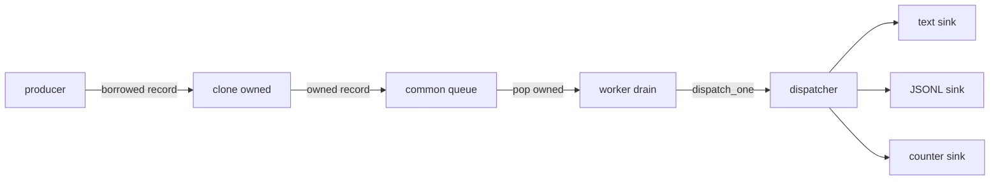
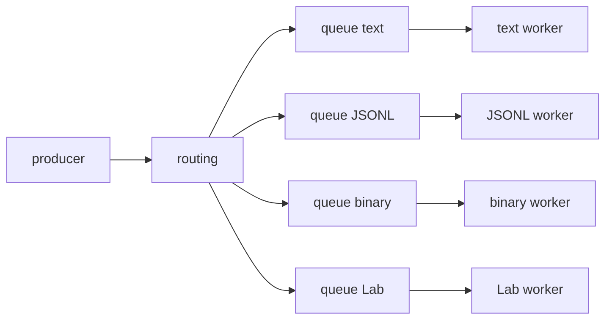

# Roadmap Writer Runtime v0

Questo documento descrive il percorso per passare dai sink sincroni attuali a
un runtime di output piu' adatto alle prestazioni di Alfred.

La Writer API v0 e' descritta in
[Writer API v0](32-writer-api-v0.md). Questo capitolo e' piu' operativo: spiega
quali passi fare, in quale ordine e quali decisioni non anticipare.

## Obiettivo

L'obiettivo del Writer Runtime v0 e' separare in modo netto:

- il percorso caldo dell'evento;
- il confine di ownership dei record;
- la coda o ring buffer;
- il dispatcher;
- i sink;
- i writer reali come text, JSONL, protobuf, MessagePack, socket o UI.

Il punto centrale e':

```text
il backend non deve aspettare il writer.
```

Se un evento OS arriva dal kernel, Alfred deve fare il minimo lavoro necessario
per trasformarlo in un record strutturato e accodarlo. Formattazione, I/O,
flush, encoding, socket, report e UI devono avvenire dopo.

## Stato corrente

Il codice corrente ha gia' alcuni mattoni importanti:

| Componente | Stato | Ruolo |
| --- | --- | --- |
| `alfred_record_t` | implementato | record comune Event Model v0 |
| `alfred_record_from_raw()` | implementato | adapter raw -> record |
| `alfred_record_format_text()` | implementato | formatter testuale compatibile |
| `alfred_record_format_jsonl()` | implementato | formatter JSONL v0 senza newline |
| `alfred_record_sink_t` | implementato | interfaccia generica `emit(userdata, record)` |
| `alfred_record_text_sink_t` | implementato | ponte record -> log testuale |
| `alfred_record_jsonl_sink_t` | implementato | ponte record -> payload JSONL |
| `alfred_record_counter_sink_t` | implementato | sink no-op/counter per benchmark |
| `alfred_record_queue_t` | implementato | coda bounded single-threaded di record owned |
| `alfred_record_dispatcher_t` | implementato | fan-out bounded verso sink registrati |
| `make perf-record-sinks` | implementato | benchmark counter/text/JSONL, queue-counter, dispatcher, queue-dispatcher e output pipeline JSONL in memoria |

Questi componenti non significano ancora che Alfred abbia un runtime writer
asincrono completo. Il runtime corrente usa ancora bridge sincroni in diversi
punti. La coda, il dispatcher e i sink servono a fissare il contratto prima di
collegare il percorso runtime reale.

La sequenzialita' attuale e' quindi una fase di validazione, non una regola di
prodotto. Oggi alcuni record passano ancora attraverso bridge chiamati in ordine
nello stesso callback applicativo; domani il record dovra' essere accodato una
sola volta nel percorso caldo e consumato da worker/sink indipendenti. Di
conseguenza, gia' nella v0, il successo di un writer non deve essere una
precondizione nascosta per consegnare il record a un altro writer. Un esempio
concreto e' il rapporto fra `events.log` e JSONL: il text writer compatibile puo'
fallire su una riga umana troppo lunga, ma il record strutturato deve comunque
essere offerto alla pipeline JSONL.

## Regola del percorso caldo

Il percorso caldo target e':

```text
evento OS
-> collector/backend
-> normalizzazione minima
-> alfred_record_t
-> enqueue su coda/ring buffer
```

Il percorso caldo deve evitare:

- serializzazione testuale;
- serializzazione JSONL;
- protobuf, MessagePack o altri encoding binari;
- `fprintf()`;
- `fflush()`;
- `snprintf()` per generare output utente;
- escaping JSON;
- scrittura su file;
- invio su socket;
- update UI;
- report;
- policy pesante;
- lock non bounded;
- allocazioni non necessarie per evento;
- plugin lenti.

Questo non significa che Alfred non possa avere writer ricchi. Significa che i
writer devono stare a valle della coda.

## Normalizzazione minima

Nel percorso caldo la normalizzazione deve fare solo il lavoro necessario per
non perdere informazione e per produrre un record coerente.

Esempio con inotify:

```text
struct inotify_event
-> alfred_raw_event_t
-> alfred_record_t
```

Questa fase puo' copiare path, mask, cookie, tipo raw e qualificatori come
directory/file. Non deve invece produrre JSONL, fare report leggibili da umani o
decidere policy di sicurezza.

La semantica piu' ricca, la correlazione fra backend diversi e la policy futura
appartengono a livelli successivi del core.

## Borrowed record e owned record

Molti record creati vicino al backend contengono puntatori borrowed:

```text
record.filesystem.path -> memoria posseduta da qualcun altro
```

Un puntatore borrowed e' valido solo finche' il proprietario originale mantiene
viva quella memoria. Se il record attraversa una coda, un worker o un sink
asincrono, non puo' piu' dipendere da memoria borrowed.

Per questo il confine della coda richiede una copia owned:

```text
record borrowed
-> alfred_record_clone_owned()
-> record owned
-> alfred_record_queue_push()
```

Il worker che estrae il record dalla coda diventa proprietario temporaneo del
record owned e deve distruggerlo alla fine:

```text
alfred_record_queue_pop()
-> dispatch
-> alfred_record_destroy_owned()
```

Questa regola e' volutamente semplice. In futuro potremo valutare pool, arena,
string table o storage inline per ridurre le allocazioni, ma v0 privilegia un
contratto chiaro e testabile.

## Fase 1: coda comune

La prima forma runtime da implementare dovrebbe usare una sola coda comune.



Vantaggi:

- modello semplice da capire;
- un solo punto di ownership;
- un solo punto di backpressure iniziale;
- piu' facile da testare;
- adatto a chiudere il contratto v0.

Svantaggi:

- un sink lento puo' rallentare il worker comune;
- la policy di drop e retry e' comune;
- non isola ancora bene text, JSONL, UI e socket.

Per v0 e' comunque la scelta piu' pragmatica, perche' ci permette di misurare
prima di complicare l'architettura.

## Fase 2: code per sink

Le code per sink restano una fase successiva.



Vantaggi:

- un writer lento non blocca gli altri;
- si possono avere policy diverse per ogni sink;
- text debug, JSONL ledger e UI possono avere priorita' diverse;
- prepara meglio socket, UI e plugin out-of-process futuri.

Svantaggi:

- piu' memoria;
- piu' ownership da gestire;
- piu' thread o loop;
- backpressure piu' complessa;
- error handling piu' difficile da spiegare e testare.

Per questo non e' il primo passo. Va progettata dopo benchmark e dopo una policy
esplicita su sink critici, best-effort e debug.

## Classi di sink

I sink futuri non avranno tutti lo stesso valore operativo.

| Classe | Esempio | Significato |
| --- | --- | --- |
| `critical` | ledger JSONL o audit persistente | perdere record e' grave |
| `best_effort` | UI, Lab, report live | puo' perdere dati diagnostici controllati |
| `debug` | text log verboso | utile in sviluppo, non deve frenare produzione |

La classe di un sink non e' solo una etichetta. Deve guidare cosa fare quando il
sink e' lento o fallisce.

Esempi:

- un sink `critical` pieno puo' richiedere errore serio, backpressure o stop
  controllato;
- un sink `best_effort` puo' droppare record con diagnostica esplicita;
- un sink `debug` puo' essere disabilitato in profilo production.

## Backpressure

Backpressure significa che la parte a valle non riesce a consumare alla stessa
velocita' della parte a monte.

Esempio:

```text
backend produce 100000 record/s
JSONL writer scrive 30000 record/s
```

Se la coda e' bounded, prima o poi si riempie. Alfred deve decidere cosa fare.
Le opzioni principali sono:

| Opzione | Pro | Contro |
| --- | --- | --- |
| bloccare il producer | non perde record | puo' rallentare o bloccare il backend |
| droppare record debug | protegge il percorso critico | serve diagnostica chiara |
| droppare record non critici | mantiene attivo il sistema | richiede classificazione affidabile |
| aumentare buffer | assorbe picchi brevi | consuma memoria e non risolve overload lungo |
| disabilitare sink lento | protegge gli altri sink | il sink perde copertura |
| fermare Alfred | evita stato ambiguo | scelta drastica |

Per v0 non dobbiamo inventare una policy definitiva, ma dobbiamo evitare il
caso peggiore: drop silenziosi o blocchi nascosti nel backend.

## JSONL buffered writer

Il sink JSONL attuale produce un payload JSON senza newline e lo consegna a una
callback. Non e' ancora un writer file/socket completo.

Un futuro JSONL buffered writer dovra':

- ricevere `alfred_record_t`;
- usare `alfred_record_format_jsonl()`;
- aggiungere newline;
- scrivere su file, stream o socket;
- evitare flush per evento in produzione;
- contare errori di write/flush;
- dichiarare se e' `critical`, `best_effort` o `debug`;
- documentare cosa accade se il buffer si riempie o se il file fallisce.

Questa distinzione e' importante:

```text
formatter JSONL != writer JSONL runtime
```

Il formatter trasforma un record in testo JSON. Il writer decide dove scriverlo,
quando flushare e come reagire agli errori.

## Benchmark prima del wiring runtime

Prima di collegare la coda al runtime reale conviene misurare micro-step
isolati. Se saltiamo subito al sistema completo, non sapremo dove nasce un
eventuale rallentamento.

Ordine consigliato:

1. `record -> counter sink`
   misura il costo minimo del confine sink.
2. `record -> text sink`
   misura il costo della formattazione testuale.
3. `record -> JSONL sink`
   misura il costo della serializzazione JSONL.
4. `record -> queue -> counter sink`
   misura clone owned, push, pop e destroy senza formattazione.
5. `record -> dispatcher -> counter/text/JSONL`
   misura fan-out e ordine dei sink senza coda runtime.
6. `record -> queue -> dispatcher -> sink`
   misura il percorso che assomiglia al runtime target.
7. worker simulato single-threaded
   prepara la logica di drain senza introdurre ancora concorrenza reale.

Solo dopo questi passaggi ha senso discutere thread, ring buffer piu'
performanti, code per sink e policy di backpressure piu' fine.

## Micro-step implementativi

Roadmap pratica:

1. documentare questa roadmap runtime;
2. aggiungere benchmark `record -> queue -> counter`;
3. aggiungere benchmark `record -> dispatcher -> counter/text/JSONL`;
4. aggiungere benchmark `record -> queue -> dispatcher -> counter`;
5. introdurre un worker/drain simulato, ancora single-threaded;
6. progettare JSONL buffered writer isolato dal backend;
7. aggiungere configurazione output minima e disabilitata di default;
8. collegare sperimentalmente il runtime record queue a un solo writer;
9. misurare;
10. solo dopo valutare thread, per-sink queue e profili production/debug.

Ogni micro-step deve aggiornare documentazione e test. Se cambia ownership,
queue, dispatcher o sink, bisogna aggiornare anche la documentazione C per gli
studenti.

I primi otto punti sono ora coperti: questa roadmap esiste,
`make perf-record-sinks` produce la riga `queue-counter` per misurare clone
owned, push nella coda, pop, emit al counter e destroy del record owned,
produce righe `dispatcher-*` per misurare routing verso counter, text, JSONL e
fan-out sincrono combinato, e produce righe `queue-dispatcher-*` per misurare
il percorso `record -> queue -> dispatcher -> sink` in forma single-threaded.
`alfred_record_runtime_drain_once()` ora nomina il worker/drain simulato senza
introdurre thread reali. `alfred_record_jsonl_writer_t` introduce un writer
JSONL buffered isolato dal backend: formatta record, aggiunge newline, accumula
bytes e li consegna solo al flush o quando deve liberare spazio.
`config_t.output` introduce la configurazione minima, disabilitata di default:
`output_enabled=false`, `output_format=jsonl`, `output_buffer_size=65536` e
`output_log=output.jsonl`. `alfred_record_output_pipeline_t` collega queue,
dispatcher, runtime drain e JSONL writer. `make perf-record-sinks` misura anche
`output-pipeline-jsonl`, cioe' la pipeline composta con flush finale verso
callback in memoria. Il runtime applicativo ora puo' inizializzare questa
pipeline dietro `output_enabled=true` e scrivere JSONL aggiuntivo per i record
raw normalizzati gia' migrati al record sink. Il prossimo passo resta rendere il
percorso piu' completo e misurarlo end-to-end, non introdurre subito thread o
backpressure reale.

## Cose da non fare ora

Per non allargare troppo la milestone inotify, non implementiamo ora:

- plugin writer dinamici `.so`;
- code per sink complete;
- thread writer reali;
- socket writer runtime;
- protobuf o MessagePack runtime;
- policy engine;
- Agent Guard completo;
- ring buffer lock-free;
- drop policy definitiva;
- UI Lab collegata al runtime.

Questi temi sono importanti, ma vanno affrontati quando il percorso
`record -> queue -> dispatcher -> sink` sara' misurato e stabile.

## Criterio di completamento

Il Writer Runtime v0 potra' dirsi pronto quando:

- il backend produce record senza chiamare writer lenti;
- il record diventa owned prima di attraversare la coda;
- una coda bounded protegge il confine caldo/freddo;
- un dispatcher consegna record a sink registrati;
- almeno un writer testuale compatibile e un writer JSONL funzionano fuori dal
  percorso caldo;
- i benchmark distinguono costo queue, dispatcher, text e JSONL;
- la documentazione spiega chiaramente cosa e' runtime corrente e cosa e'
  roadmap futura;
- non esistono drop silenziosi non documentati.

La frase guida e':

```text
Interoperabilita' al bordo, prestazioni nel cuore.
```
