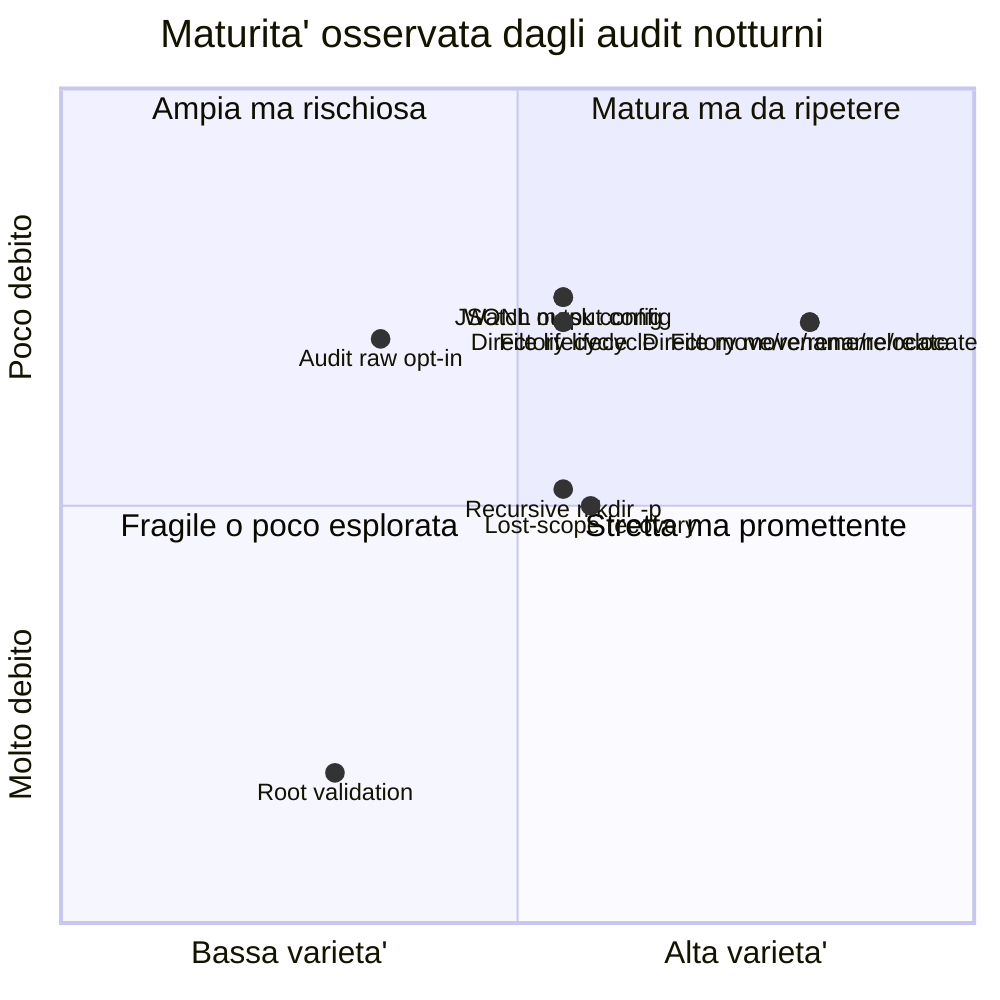

# Matrice di maturita' da audit esplorativi

Questo documento descrive come stimare quanto una funzionalita' di Alfred puo'
essere considerata matura a partire dagli audit esplorativi notturni. Non misura
la copertura della suite ufficiale, ma il livello di fiducia ottenuto usando
Alfred in scenari realistici.

## Audit esplorativi, non fuzzy test

Gli audit notturni attuali non sono fuzzy test in senso tecnico.

Un fuzzy test genera automaticamente molti input casuali o semi-casuali per
cercare crash, comportamenti indefiniti o violazioni di invarianti. Un fuzzing
reale di Alfred potrebbe, per esempio, generare migliaia di sequenze casuali di:

- create, delete, rename e move;
- alberi di directory profondi;
- nomi path strani;
- configurazioni valide e invalide;
- interruzioni del processo;
- eventi ravvicinati con timing variabile.

Poi controllerebbe proprieta' generali, non solo output specifici. Esempi:

- Alfred non deve crashare;
- `output.jsonl` deve restare JSONL valido;
- un record non deve avere campi incompatibili tra loro;
- una directory osservata non deve produrre path impossibili;
- un evento semantico non deve riferirsi a un path stale dopo recovery.

I test notturni attuali sono diversi: sono scenari scelti da un umano, scritti
come comandi shell riproducibili e pensati per simulare comportamenti reali
dell'utente. Per questo li chiamiamo:

```text
audit esplorativi / scenario-based tests
```

Sono meno ampi di un fuzzing automatico, ma molto piu' leggibili. Servono a
capire se Alfred si comporta bene in casi concreti e se i log raccontano una
storia coerente.

## Cosa misura la maturita'

La maturita' non coincide con "il test passa". Una funzionalita' puo' passare
uno scenario singolo ed essere ancora fragile. Per questo usiamo piu'
dimensioni.

| Area | Domanda | Scala iniziale |
| --- | --- | --- |
| Functional Maturity | La funzionalita' funziona in scenari reali? | iniziale/intermedia/alta |
| Performance Profile | E' veloce, leggera e misurata? | non misurata/bassa/media/alta |
| Architecture Health | Il design resta piccolo, separato e mantenibile? | bassa/media/alta |
| Operability | E' usabile e diagnosticabile quando qualcosa non torna? | bassa/media/alta |
| Security Posture | Non introduce rischi, bypass o leak di dati sensibili? | high-risk/medium/low-risk |
| Behavioral Consistency | Si comporta in modo uniforme e spiegabile tra feature e livelli? | incoerente/parziale/coerente |
| Documentation Fitness | Utenti, contributori e studenti possono capirla e verificarla? | mancante/parziale/usabile/buona |
| Maturita' stimata | Sintesi qualitativa, non metrica assoluta. | iniziale/intermedia/alta |

Queste aree non vanno fuse in una percentuale unica. Una funzionalita' puo'
essere corretta ma lenta, veloce ma poco documentata, documentata ma
incoerente, oppure funzionalmente utile ma fragile dal punto di vista sicurezza.

Le regole guida sono:

```text
Security gates maturity.
Incoherence blocks clarity.
Undocumented behavior is not mature.
Performance is separate from correctness.
Architecture debt reduces long-term velocity.
```

Per una spiegazione didattica di questi concetti, leggere anche
[Qualita' del prodotto software](../35-qualita-prodotto-software.md).

## Come leggere le dimensioni

### Functional Maturity

Misura il comportamento osservato negli scenari reali. Include copertura
scenari, varieta', stabilita' osservata, robustezza, contratto log/output e
debito residuo.

Sotto-dimensioni:

| Dimensione | Domanda | Scala iniziale |
| --- | --- | --- |
| Copertura scenari | Quanti scenari reali hanno esercitato la funzionalita'? | 0-5 |
| Varieta' scenari | Gli scenari sono davvero diversi o ripetono lo stesso caso? | bassa/media/alta |
| Stabilita' osservata | Gli scenari sono passati in run ripetuti o solo una volta? | bassa/media/alta |
| Robustezza | Sono stati provati edge case, configurazioni invalide o timing difficili? | bassa/media/alta |
| Contratto log/output | Raw log, events log e JSONL sono coerenti e documentati? | bassa/media/alta |
| Debito residuo | Ci sono bug aperti, known failure o TODO bloccanti? | basso/medio/alto |

#### Copertura scenari

Conta gli scenari reali che hanno toccato la funzionalita'. Non basta il numero
grezzo: cinque scenari quasi identici valgono meno di tre scenari davvero
diversi.

Esempio:

```text
file lifecycle:
- create file
- append/modify file
- chmod/attrib
- close-write/file-ready
- delete file
```

Questa copertura e' migliore di cinque varianti di solo `touch file.txt`.

#### Varieta' scenari

Misura se la funzionalita' e' stata vista da angoli diversi.

Per `move/rename`, una buona varieta' include:

- rename nello stesso parent;
- move tra directory diverse;
- relocate con nome e parent diversi;
- caso file;
- caso directory.

#### Stabilita' osservata

Misura se il comportamento e' stato ripetuto nel tempo. Un singolo `PASS` e'
utile, ma non dimostra ancora che lo scenario sia stabile su run diversi,
macchine diverse o dopo refactor.

#### Robustezza

Misura quanto la funzionalita' e' stata stressata con casi limite. Esempi:

- configurazione invalida;
- output disabilitato;
- maschere inotify modificate;
- directory create troppo rapidamente;
- path root non valido;
- perdita temporanea dello scope osservato.

#### Contratto log/output

Misura se i tre livelli principali raccontano la stessa storia:

- `raw.log`: cosa ha osservato o normalizzato il backend;
- `events.log`: diagnostica e semantica leggibile;
- `output.jsonl`: record strutturato pubblico.

Una funzionalita' e' piu' matura quando gli audit controllano almeno il log
testuale e il JSONL, non solo l'uscita umana.

#### Debito residuo

Misura il peso dei problemi ancora aperti. Un bug confermato abbassa la
maturita' anche se altri scenari passano.

Esempio: la validazione della root ha un audit dedicato, ma oggi resta poco
matura perche' esiste la issue `#30`.

### Performance Profile

Misura se una funzionalita' e' veloce e leggera. Non deve essere confusa con la
correttezza: una feature puo' essere semanticamente corretta ma troppo costosa
per l'obiettivo di Alfred.

Metriche future:

- eventi al secondo;
- latenza media;
- p95/p99 latency;
- CPU durante carico;
- CPU a riposo;
- RSS/memoria residente;
- allocazioni per evento;
- file descriptor aperti;
- numero di watch;
- queue depth;
- drop o backpressure.

Per ora molte righe avranno `non misurata`. Questo e' accettabile: significa che
la dimensione e' prevista, non che dobbiamo inventare un giudizio senza dati.

### Architecture Health

Misura se la funzionalita' rispetta l'architettura target:

- backend, core, record, dispatcher e writer restano separati;
- il percorso caldo resta corto;
- non vengono introdotti I/O, flush, allocazioni o lock pesanti nel path caldo;
- ownership e lifetime dei record sono chiari;
- le API restano piccole e comprensibili;
- i dettagli inotify non contaminano il modello comune;
- il codice non cresce in modo difficile da leggere.

Questa dimensione serve a proteggere Alfred da una crescita caotica. Un
comportamento puo' funzionare oggi, ma diventare costoso da mantenere se rompe
le responsabilita' dei moduli.

### Operability

Misura quanto una funzionalita' e' facile da usare, debuggare e diagnosticare:

- errori chiari;
- `errno`, reason e contesto quando servono;
- artifact completi;
- log leggibili;
- comandi riproducibili;
- failure mode comprensibili;
- issue facili da scrivere per un bug.

Operability riguarda l'esperienza pratica: quando qualcosa va storto, un utente
o contributore deve capire cosa e' successo.

### Security Posture

Per Alfred la sicurezza e' una dimensione primaria. Non basta che il codice non
crashi: Alfred dovra' osservare e limitare agenti intelligenti, quindi non puo'
essere fragile o facilmente aggirabile.

Domande minime:

| Sotto-dimensione | Domanda |
| --- | --- |
| Input safety | Alfred gestisce input ostili senza crash o corruzione? |
| Path safety | Path strani, symlink, traversal e rename non lo ingannano? |
| Secret handling | Alfred evita di loggare segreti o contenuto sensibile? |
| Policy correctness futura | Una futura decisione `allow/block` sara' spiegabile e conservativa? |
| Bypass resistance | Un agente puo' aggirare monitoraggio o recovery con rename, temp file, symlink, mount? |
| Privilege boundary | Alfred non richiede privilegi eccessivi senza motivo? |
| Plugin trust | Backend, writer o plugin futuri non diventano codice arbitrario pericoloso? |
| Log integrity | I log non sono facilmente falsificabili o ambigui? |
| Failure safety | In caso di errore Alfred fallisce in modo conservativo? |
| Supply chain | Script, dipendenze e CI non introducono rischi inutili? |

Regola:

```text
Security gates maturity.
```

Se una funzionalita' e' `high-risk` in sicurezza, non puo' essere considerata
ad alta maturita', anche se passa gli scenari funzionali.

### Behavioral Consistency

La coerenza misura se Alfred si comporta in modo uniforme e spiegabile. E'
diversa dalla correttezza: una feature puo' funzionare in isolamento ma essere
incoerente con il resto del sistema.

Checklist:

```text
[ ] raw.log, events.log e output.jsonl raccontano la stessa azione.
[ ] File e directory seguono regole parallele dove possibile.
[ ] Opzioni simili hanno nomi, default e failure mode simili.
[ ] Errori simili producono messaggi e codici simili.
[ ] Path vecchi, nuovi, stale e recovered seguono la stessa logica.
[ ] Codice, test e documentazione raccontano lo stesso comportamento.
[ ] Le eccezioni sono spiegate quando la coerenza non e' possibile.
```

Regola:

```text
Incoherence blocks clarity.
```

Una funzionalita' incoerente puo' essere tecnicamente utile, ma non puo'
essere considerata chiara.

### Documentation Fitness

La documentazione e' una dimensione propria. Per Alfred non basta che il codice
funzioni: deve essere comprensibile per utenti, contributori e studenti.

Checklist:

```text
[ ] README o guida utente aggiornati.
[ ] Configurazione documentata.
[ ] Test o scenario documentato.
[ ] Contratto log/JSONL aggiornato.
[ ] Mappa architetturale aggiornata.
[ ] Commenti codice adeguati per strutture e funzioni critiche.
[ ] Sezione studenti/contributori aggiornata.
[ ] Decisione motivata o linkata.
```

Regola:

```text
Undocumented behavior is not mature.
```

Una funzionalita' non documentata puo' essere presente nel codice, ma non deve
essere considerata pronta per utenti, contributori o studenti.

## Matrice iniziale dopo audit 2026-06-25

Questa matrice e' qualitativa. Serve a orientare le prossime notti di audit, non
a produrre un numero commerciale.

| Funzionalita' | Functional | Perf | Arch | Operability | Security | Consistency | Docs | Maturita' |
| --- | --- | --- | --- | --- | --- | --- | --- | --- |
| File lifecycle | intermedia | non misurata | media | alta | medium | mostly-consistent | buona | intermedia |
| Directory lifecycle | intermedia | non misurata | media | alta | medium | mostly-consistent | buona | intermedia |
| Move/rename/relocate file | intermedia | non misurata | media | alta | medium | mostly-consistent | buona | intermedia |
| Move/rename/relocate directory | intermedia | non misurata | media | alta | medium | mostly-consistent | buona | intermedia |
| Lost-scope recovery | intermedia | non misurata | media | media | medium | parziale | usabile | intermedia |
| Audit raw opt-in | iniziale/intermedia | non misurata | media | media | medium | parziale | usabile | iniziale/intermedia |
| Config output JSONL | intermedia | non misurata | media | alta | medium | mostly-consistent | buona | intermedia |
| Config inotify watch mask | intermedia | non misurata | media | media | medium | mostly-consistent | usabile | intermedia |
| Recursive fast `mkdir -p` | intermedia | non misurata | media | alta | medium | parziale | usabile | intermedia |
| Root validation | iniziale | non misurata | media | bassa | high-risk | incoerente | parziale | iniziale |

Legenda sintetica:

- `iniziale`: esiste almeno uno scenario, ma la fiducia e' ancora bassa;
- `intermedia`: lo scenario e' realistico, documentato e riproducibile, ma non
  e' ancora stato ripetuto in molte notti o sotto varianti ampie;
- `alta`: richiede piu' audit ripetuti, edge case, contratto JSONL stabile e
  assenza di issue aperte rilevanti.

Nessuna funzionalita' viene marcata `alta` dopo un solo audit notturno.

Questa tabella contiene anche dimensioni che oggi sono solo previste. Per
esempio `Perf = non misurata` non e' un giudizio negativo: indica che servono
benchmark dedicati prima di assegnare un valore.

## Vista grafica iniziale



Il grafico usa due assi semplici:

- asse X: quanto sono vari gli scenari provati;
- asse Y: quanto e' basso il debito residuo.

Non rappresenta la performance e non rappresenta la copertura della suite
ufficiale.

## Dati da raccogliere nei prossimi audit

Per rendere la matrice meno manuale, ogni report notturno dovrebbe indicare per
ogni scenario:

| Campo | Esempio |
| --- | --- |
| Scenario | `moves-jsonl` |
| Feature | `file-move`, `dir-move`, `jsonl-output` |
| Tipo | `user-scenario`, `edge-case`, `config-negative` |
| Esito | `PASS`, `FAIL`, `KNOWN FAILURE` |
| Log controllati | `raw.log`, `events.log`, `output.jsonl` |
| Issue collegate | `#30` |
| Artifact | link Drive o path locale |
| Note | timing, ambiente, cosa e' stato osservato |

In futuro gli script in `tests/exploratory/nightly` potranno dichiarare
metadata leggibili automaticamente, per esempio:

```sh
# ALFRED_AUDIT_FEATURES: file-lifecycle,jsonl-output,raw-log,event-log
# ALFRED_AUDIT_KIND: user-scenario
# ALFRED_AUDIT_EXPECTED: pass
# ALFRED_AUDIT_RISK: medium
```

Questi metadata permetteranno di generare CSV, tabelle Markdown e grafici senza
dover ricostruire tutto a mano.

Un primo template CSV e' disponibile in:

```text
docs/it/audit/maturity-data-template.csv
```

Per ora e' un esempio manuale. Dopo alcuni audit potra' diventare il formato
letto da uno script che produce automaticamente la tabella e il grafico.

## Relazione con i benchmark

Performance, latenza e throughput non vanno confuse con la maturita'
funzionale. Vanno collegate, ma restano un asse diverso.

Esempio:

```text
Feature: output JSONL
Maturita' funzionale: intermedia
Performance: misurata in benchmark record sinks
Rischio residuo: verificare comportamento con writer lento e backpressure
```

Questa separazione evita di dichiarare "matura" una funzionalita' solo perche'
e' veloce, o di dichiararla "immatura" solo perche' non e' stata ancora
benchmarkata.
