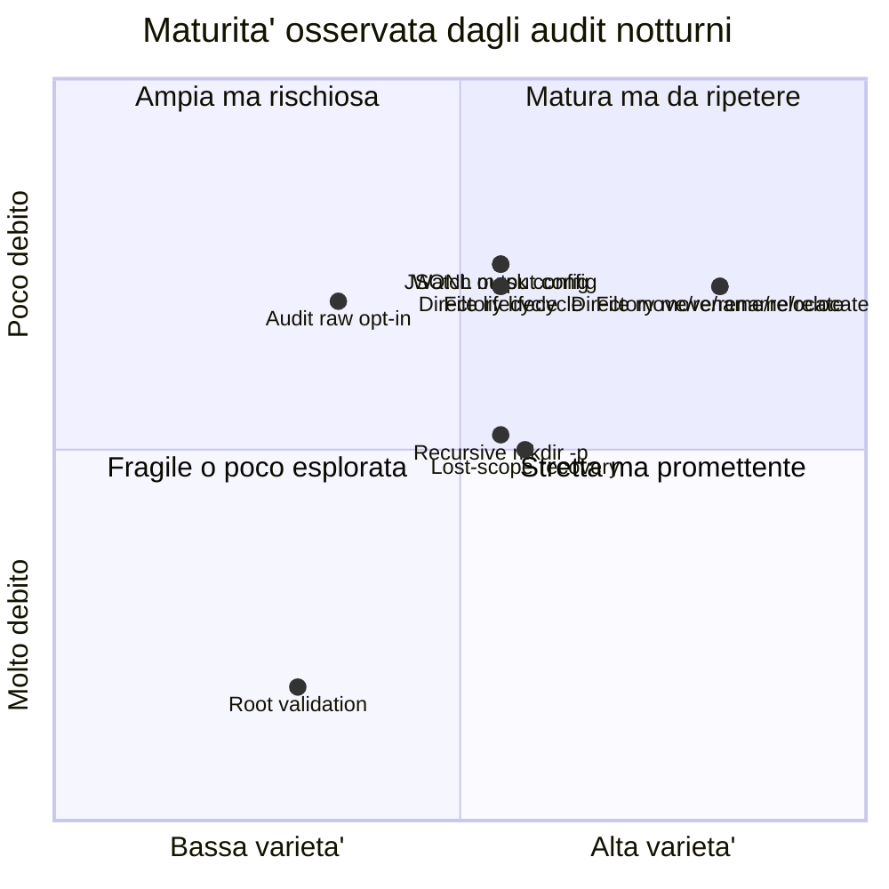

# Matrice di maturita' da audit esplorativi

Questo documento descrive come stimare quanto una funzionalita' di Alfred puo'
essere considerata matura a partire dagli audit esplorativi notturni. Non misura
la copertura della suite ufficiale, ma il livello di fiducia ottenuto usando
Alfred in scenari realistici.

## Audit esplorativi, non fuzzy test

Gli audit notturni attuali non sono fuzzy test in senso tecnico.

Un fuzzy test genera automaticamente molti input casuali o semi-casuali per
cercare crash, comportamenti indefiniti o violazioni di invarianti. Un fuzzing
reale di Alfred potrebbe, per esempio, generare migliaia di sequenze casuali di:

- create, delete, rename e move;
- alberi di directory profondi;
- nomi path strani;
- configurazioni valide e invalide;
- interruzioni del processo;
- eventi ravvicinati con timing variabile.

Poi controllerebbe proprieta' generali, non solo output specifici. Esempi:

- Alfred non deve crashare;
- `output.jsonl` deve restare JSONL valido;
- un record non deve avere campi incompatibili tra loro;
- una directory osservata non deve produrre path impossibili;
- un evento semantico non deve riferirsi a un path stale dopo recovery.

I test notturni attuali sono diversi: sono scenari scelti da un umano, scritti
come comandi shell riproducibili e pensati per simulare comportamenti reali
dell'utente. Per questo li chiamiamo:

```text
audit esplorativi / scenario-based tests
```

Sono meno ampi di un fuzzing automatico, ma molto piu' leggibili. Servono a
capire se Alfred si comporta bene in casi concreti e se i log raccontano una
storia coerente.

## Cosa misura la maturita'

La maturita' non coincide con "il test passa". Una funzionalita' puo' passare
uno scenario singolo ed essere ancora fragile. Per questo usiamo piu'
dimensioni.

| Dimensione | Domanda | Scala iniziale |
| --- | --- | --- |
| Copertura scenari | Quanti scenari reali hanno esercitato la funzionalita'? | 0-5 |
| Varieta' scenari | Gli scenari sono davvero diversi o ripetono lo stesso caso? | bassa/media/alta |
| Stabilita' osservata | Gli scenari sono passati in run ripetuti o solo una volta? | bassa/media/alta |
| Robustezza | Sono stati provati edge case, configurazioni invalide o timing difficili? | bassa/media/alta |
| Contratto log/output | Raw log, events log e JSONL sono coerenti e documentati? | bassa/media/alta |
| Debito residuo | Ci sono bug aperti, known failure o TODO bloccanti? | basso/medio/alto |
| Maturita' stimata | Sintesi qualitativa, non metrica assoluta. | iniziale/intermedia/alta |

Per ora non includiamo la performance nello stesso indice. Le prestazioni sono
una dimensione separata: una funzionalita' puo' essere corretta e ben compresa,
ma non ancora misurata sotto carico. I benchmark vanno tenuti in un report
distinto e poi collegati alla matrice come nota.

## Come leggere le dimensioni

### Copertura scenari

Conta gli scenari reali che hanno toccato la funzionalita'. Non basta il numero
grezzo: cinque scenari quasi identici valgono meno di tre scenari davvero
diversi.

Esempio:

```text
file lifecycle:
- create file
- append/modify file
- chmod/attrib
- close-write/file-ready
- delete file
```

Questa copertura e' migliore di cinque varianti di solo `touch file.txt`.

### Varieta' scenari

Misura se la funzionalita' e' stata vista da angoli diversi.

Per `move/rename`, una buona varieta' include:

- rename nello stesso parent;
- move tra directory diverse;
- relocate con nome e parent diversi;
- caso file;
- caso directory.

### Stabilita' osservata

Misura se il comportamento e' stato ripetuto nel tempo. Un singolo `PASS` e'
utile, ma non dimostra ancora che lo scenario sia stabile su run diversi,
macchine diverse o dopo refactor.

### Robustezza

Misura quanto la funzionalita' e' stata stressata con casi limite. Esempi:

- configurazione invalida;
- output disabilitato;
- maschere inotify modificate;
- directory create troppo rapidamente;
- path root non valido;
- perdita temporanea dello scope osservato.

### Contratto log/output

Misura se i tre livelli principali raccontano la stessa storia:

- `raw.log`: cosa ha osservato o normalizzato il backend;
- `events.log`: diagnostica e semantica leggibile;
- `output.jsonl`: record strutturato pubblico.

Una funzionalita' e' piu' matura quando gli audit controllano almeno il log
testuale e il JSONL, non solo l'uscita umana.

### Debito residuo

Misura il peso dei problemi ancora aperti. Un bug confermato abbassa la
maturita' anche se altri scenari passano.

Esempio: la validazione della root ha un audit dedicato, ma oggi resta poco
matura perche' esiste la issue `#30`.

## Matrice iniziale dopo audit 2026-06-25

Questa matrice e' qualitativa. Serve a orientare le prossime notti di audit, non
a produrre un numero commerciale.

| Funzionalita' | Scenari osservati | Varieta' | Stabilita' | Robustezza | Contratto log/output | Debito | Maturita' |
| --- | ---: | --- | --- | --- | --- | --- | --- |
| File lifecycle | 1 | media | iniziale | media | alta | basso | intermedia |
| Directory lifecycle | 1 | media | iniziale | media | alta | basso | intermedia |
| Move/rename/relocate file | 1 | alta | iniziale | media | alta | basso | intermedia |
| Move/rename/relocate directory | 1 | alta | iniziale | media | alta | basso | intermedia |
| Lost-scope recovery | 1 | media | iniziale | media | alta | medio | intermedia |
| Audit raw opt-in | 1 | bassa | iniziale | media | media | basso | iniziale/intermedia |
| Config output JSONL | 2 | media | iniziale | alta | alta | basso | intermedia |
| Config inotify watch mask | 2 | media | iniziale | alta | media | basso | intermedia |
| Recursive fast `mkdir -p` | 1 | media | iniziale | alta | alta | medio | intermedia |
| Root validation | 1 | bassa | fallita | alta | media | alto | iniziale |

Legenda sintetica:

- `iniziale`: esiste almeno uno scenario, ma la fiducia e' ancora bassa;
- `intermedia`: lo scenario e' realistico, documentato e riproducibile, ma non
  e' ancora stato ripetuto in molte notti o sotto varianti ampie;
- `alta`: richiede piu' audit ripetuti, edge case, contratto JSONL stabile e
  assenza di issue aperte rilevanti.

Nessuna funzionalita' viene marcata `alta` dopo un solo audit notturno.

## Vista grafica iniziale



Il grafico usa due assi semplici:

- asse X: quanto sono vari gli scenari provati;
- asse Y: quanto e' basso il debito residuo.

Non rappresenta la performance e non rappresenta la copertura della suite
ufficiale.

## Dati da raccogliere nei prossimi audit

Per rendere la matrice meno manuale, ogni report notturno dovrebbe indicare per
ogni scenario:

| Campo | Esempio |
| --- | --- |
| Scenario | `moves-jsonl` |
| Feature | `file-move`, `dir-move`, `jsonl-output` |
| Tipo | `user-scenario`, `edge-case`, `config-negative` |
| Esito | `PASS`, `FAIL`, `KNOWN FAILURE` |
| Log controllati | `raw.log`, `events.log`, `output.jsonl` |
| Issue collegate | `#30` |
| Artifact | link Drive o path locale |
| Note | timing, ambiente, cosa e' stato osservato |

In futuro gli script in `tests/exploratory/nightly` potranno dichiarare
metadata leggibili automaticamente, per esempio:

```sh
# ALFRED_AUDIT_FEATURES: file-lifecycle,jsonl-output,raw-log,event-log
# ALFRED_AUDIT_KIND: user-scenario
# ALFRED_AUDIT_EXPECTED: pass
# ALFRED_AUDIT_RISK: medium
```

Questi metadata permetteranno di generare CSV, tabelle Markdown e grafici senza
dover ricostruire tutto a mano.

Un primo template CSV e' disponibile in:

```text
docs/it/audit/maturity-data-template.csv
```

Per ora e' un esempio manuale. Dopo alcuni audit potra' diventare il formato
letto da uno script che produce automaticamente la tabella e il grafico.

## Relazione con i benchmark

Performance, latenza e throughput non vanno confuse con la maturita'
funzionale. Vanno collegate, ma restano un asse diverso.

Esempio:

```text
Feature: output JSONL
Maturita' funzionale: intermedia
Performance: misurata in benchmark record sinks
Rischio residuo: verificare comportamento con writer lento e backpressure
```

Questa separazione evita di dichiarare "matura" una funzionalita' solo perche'
e' veloce, o di dichiararla "immatura" solo perche' non e' stata ancora
benchmarkata.
